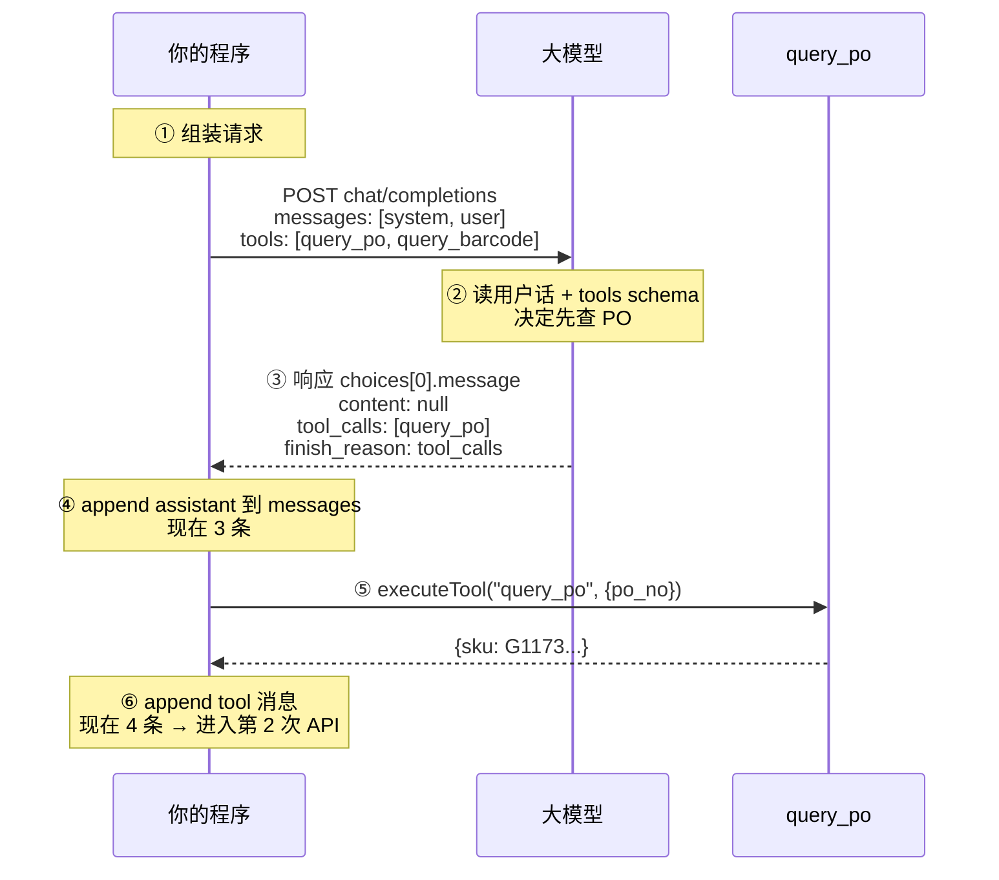
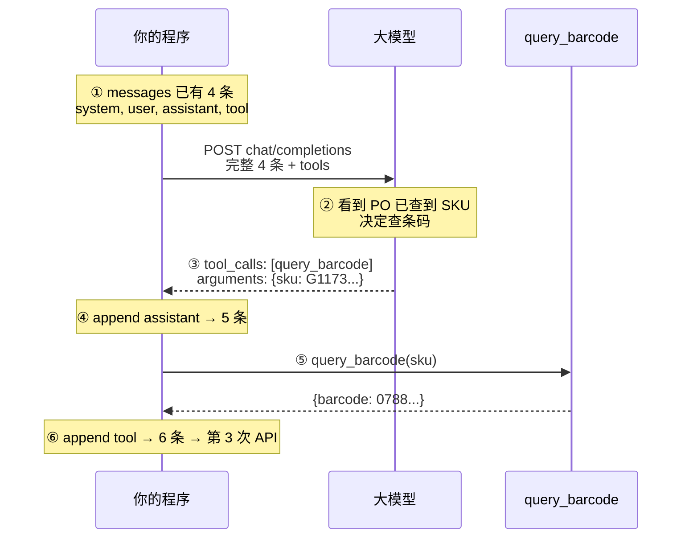
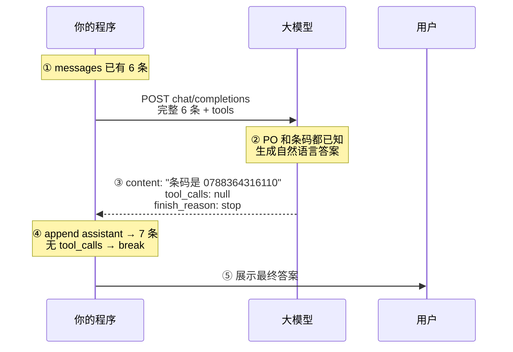
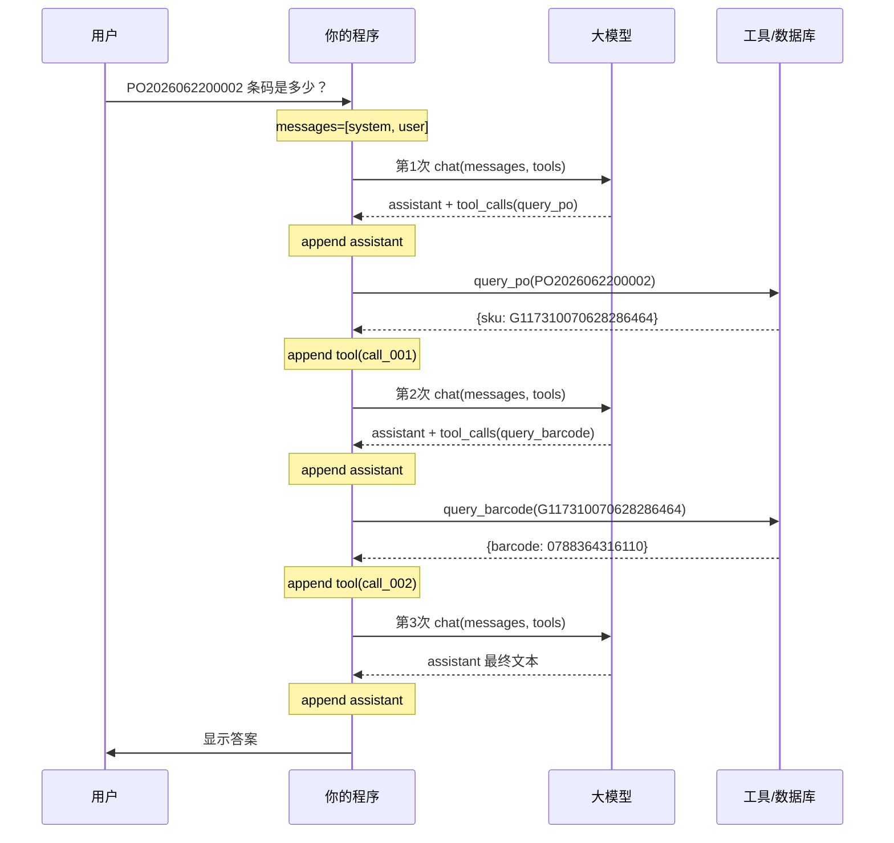
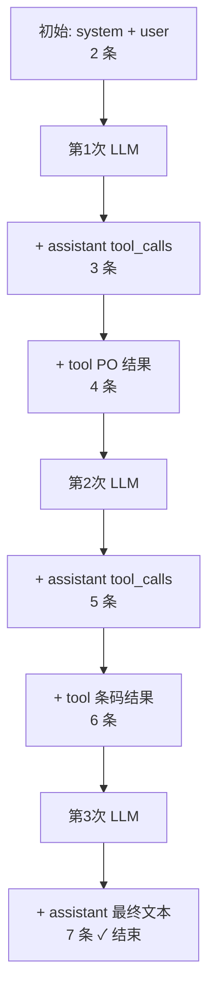
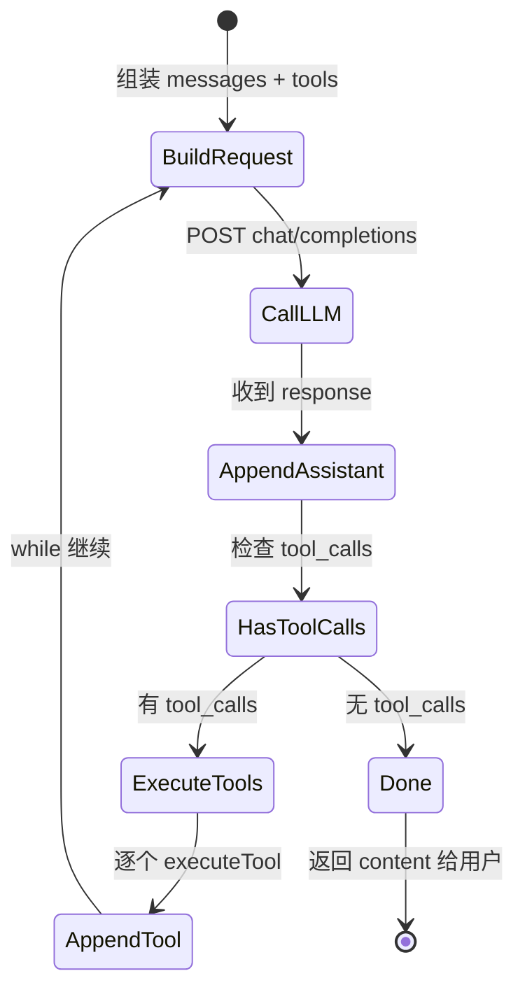

---
aliases:
  - LLM调用
  - Agent多轮对话
  - messages与ToolCalling
---

# LLM 调用与 Agent 多轮对话

> 更新时间：2026-07-09（v2：请求/响应字段详解 + 多次请求分步图）。
> 整合：怎么调 LLM、**请求参数逐字段**、**响应结构逐字段**、messages、Agent 多轮与 tool calling、分步时序图。

---

## 1. LLM 怎么调用

### 1.1 本质

向模型服务发送 **`messages`（对话列表）** + 可选 **`tools`（工具清单）**，取回 **`assistant` 的回复**（纯文本或 `tool_calls`）。

一次 HTTP 请求 = 模型读当前上下文 → 生成下一条 assistant 消息。Agent 多轮 = **同一个接口反复调用**，每次把新产生的 assistant / tool 消息 append 进 `messages`。

### 1.2 通用接口（OpenAI 兼容）

```http
POST /v1/chat/completions
Authorization: Bearer YOUR_API_KEY
Content-Type: application/json
```

```json
{
  "model": "deepseek-chat",
  "messages": [
    {"role": "system", "content": "你是助手"},
    {"role": "user", "content": "你好"}
  ],
  "temperature": 0.7,
  "max_tokens": 1024
}
```

### 1.3 三种常见来源

| 方式 | base_url | 适合 |
|---|---|---|
| 官方 API | `https://api.deepseek.com` | 免运维、按量计费 |
| Ollama | `http://localhost:11434/v1` | 本地小模型调试 |
| vLLM | `http://localhost:8000/v1` | 内网 GPU 部署 |

### 1.4 Python 最小示例

```python
from openai import OpenAI

client = OpenAI(api_key="KEY", base_url="https://api.deepseek.com")
r = client.chat.completions.create(
    model="deepseek-chat",
    messages=[{"role": "user", "content": "1+1=?"}],
)
print(r.choices[0].message.content)
```

### 1.5 与 Anthropic 的差异（速记）

| 概念 | OpenAI 兼容 | Anthropic Claude |
|---|---|---|
| 接口 | `chat.completions.create` | `messages.create` |
| 工具参数 | `tools` + JSON Schema `parameters` | `tools` + `input_schema` |
| 模型想调工具 | `message.tool_calls[]` | `content[]` 里 `type: "tool_use"` |
| 工具结果回灌 | `role: "tool"` + `tool_call_id` | `role: "user"` + `content: [{type:"tool_result", ...}]` |
| 系统提示 | `role: "system"` 在 messages 里 | 常用顶层 `system` 字段 |

下文以 **OpenAI 兼容格式** 为主（DeepSeek / OpenAI / 多数国产 API 通用），Anthropic 差异在相关处标注。

---

## 2. 请求参数详解（逐字段）

> 下面按「必知 → 生成控制 → Agent → 高级」分组。带 ★ 的是日常最常用字段。

### 2.1 请求体总览

```json
{
  "model": "deepseek-chat",
  "messages": [ ... ],
  "temperature": 0.7,
  "top_p": 1,
  "max_tokens": 4096,
  "stream": false,
  "stop": null,
  "presence_penalty": 0,
  "frequency_penalty": 0,
  "n": 1,
  "seed": null,
  "response_format": { "type": "text" },
  "tools": [ ... ],
  "tool_choice": "auto",
  "parallel_tool_calls": true,
  "user": "user-123"
}
```

### 2.2 核心参数 ★

#### `model`（string，必填）

| 项 | 说明 |
|---|---|
| 含义 | 要调用的模型标识 |
| 示例 | `deepseek-chat`、`gpt-4o`、`claude-sonnet-4-20250514` |
| 注意 | 不同厂商命名不同；同一 `base_url` 下可用模型列表见文档或 `/v1/models` |

#### `messages`（array，必填）★

| 项 | 说明 |
|---|---|
| 含义 | **完整对话上下文**，按时间顺序排列 |
| 元素 | 每条是一个 `{ role, content, ... }` 对象 |
| 关键 | 多轮 Agent **不是**只传最新一句；每次请求都要带**从开头到当前**的全部 messages |
| 长度 | 受模型 context window 限制；超长需截断、摘要或 RAG |

详见 [[#4 messages 与各 role 字段]]。

#### `temperature`（number，0~2，默认 1）★

| 项 | 说明 |
|---|---|
| 含义 | 采样随机性：越高越「发散」，越低越「保守」 |
| 推荐 | 事实问答 / 工具填参：**0~0.3**；通用对话：**0.5~0.7**；创意写作：**0.8+** |
| 与 top_p | 一般**只调一个**；Agent 填参建议低温，减少乱调工具 |

#### `max_tokens`（integer）★

| 项 | 说明 |
|---|---|
| 含义 | 本次回复**最多生成**多少 token（输出上限） |
| 作用 | 防截断、控成本、防模型啰嗦 |
| 注意 | 不含输入 token；若 `finish_reason: "length"` 说明被此限制截断 |
| 新 API | 部分厂商改用 `max_completion_tokens`，语义相同 |

### 2.3 生成控制参数

#### `top_p`（number，0~1，默认 1）

核采样：只从累积概率前 `top_p` 的 token 里抽。与 `temperature` 二选一调即可。

#### `stop`（string | string[]）

遇到指定字符串即停止生成。例如 `["\n\n", "用户:"]`。Agent 场景较少手动设。

#### `presence_penalty` / `frequency_penalty`（number，-2~2，默认 0）

| 参数 | 惩罚什么 | 效果 |
|---|---|---|
| `presence_penalty` | 已出现过的 token 再次出现 | 鼓励谈新话题 |
| `frequency_penalty` | 同一 token 重复次数 | 减少复读 |

#### `n`（integer，默认 1）

一次请求返回几个候选 completion。通常保持 1；`n>1` 时 `choices` 数组有多条。

#### `seed`（integer，可选）

固定随机种子，便于调试复现。不保证所有平台 100% 可复现。

#### `logit_bias`（object，可选）

对特定 token ID 加减 logit，微调输出倾向。高级用法，日常少用。

### 2.4 流式与格式

#### `stream`（boolean，默认 false）★

| 值 | 行为 |
|---|---|
| `false` | 等模型生成完，一次返回完整 JSON |
| `true` | SSE 流式推送，`delta` 逐块到达，适合聊天 UI |

流式时读 `choices[0].delta` 而非 `choices[0].message`；`tool_calls` 也可能分块到达，需拼接。

#### `response_format`（object，可选）

```json
{ "type": "json_object" }
```

强制输出合法 JSON 字符串（仍需在 prompt 里说明 schema）。Structured Output 是更强的 schema 约束版本。

### 2.5 Agent / Tool Calling 参数 ★

#### `tools`（array，可选）

**工具说明书**，不是可执行代码。告诉模型「有哪些函数、每个函数干什么、参数长什么样」。

```json
"tools": [
  {
    "type": "function",
    "function": {
      "name": "query_po",
      "description": "根据采购单号查询 SKU",
      "parameters": {
        "type": "object",
        "properties": {
          "po_no": { "type": "string", "description": "采购单号" }
        },
        "required": ["po_no"]
      }
    }
  }
]
```

| 字段 | 谁写 | 作用 |
|---|---|---|
| `name` | 你 | 工具唯一标识，对应 `executeTool(name, ...)` |
| `description` | 你 | **Prompt 的一部分**，模型靠它决定何时调用 |
| `parameters` | 你 | JSON Schema，约束 `arguments` 结构 |

**Anthropic 等价写法**：顶层 `name` / `description` / `input_schema`（无 `type: "function"` 包装）。

#### `tool_choice`（string | object，默认 `"auto"`）

| 值 | 行为 |
|---|---|
| `"auto"` | 模型自己决定调不调、调哪个 |
| `"none"` | 禁止调工具，只文本回复 |
| `"required"` | 必须调至少一个工具 |
| `{"type":"function","function":{"name":"query_po"}}` | 强制调指定工具 |

#### `parallel_tool_calls`（boolean，默认 true）

是否允许模型**一次返回多个** `tool_calls`（并行查多个 PO 等）。设为 `false` 则每轮最多一个工具。

### 2.6 其他请求字段

#### `user`（string，可选）

终端用户标识，用于滥用追踪与限流，**不影响**模型推理内容。

#### `service_tier`（string，可选）

部分厂商（如 OpenAI）区分优先级队列，影响延迟与计费档位。

### 2.7 参数速查表

| 参数 | 必填 | 典型值 | 主要用途 |
|---|---|---|---|
| `model` | ✓ | `deepseek-chat` | 选模型 |
| `messages` | ✓ | `[system, user, ...]` | 上下文 |
| `temperature` | | `0~0.7` | 随机性 |
| `max_tokens` | | `1024~4096` | 输出上限 |
| `stream` | | `false` | 流式 UI |
| `tools` | | tool schema 数组 | Agent |
| `tool_choice` | | `"auto"` | 控制是否调工具 |
| `response_format` | | `json_object` | 结构化输出 |

---

## 3. LLM 返回结构详解（逐字段）

### 3.1 完整响应骨架（非流式）

```json
{
  "id": "chatcmpl-abc123",
  "object": "chat.completion",
  "created": 1710000000,
  "model": "deepseek-chat",
  "choices": [
    {
      "index": 0,
      "message": {
        "role": "assistant",
        "content": "条码是 0788364316110",
        "tool_calls": null
      },
      "finish_reason": "stop",
      "logprobs": null
    }
  ],
  "usage": {
    "prompt_tokens": 256,
    "completion_tokens": 42,
    "total_tokens": 298
  },
  "system_fingerprint": "fp_xxx"
}
```

### 3.2 顶层字段

| 字段 | 类型 | 含义 |
|---|---|---|
| `id` | string | 本次 completion 唯一 ID，日志/对账用 |
| `object` | string | 固定 `"chat.completion"`（流式为 `"chat.completion.chunk"`） |
| `created` | integer | Unix 时间戳 |
| `model` | string | 实际使用的模型（可能与请求略有后缀差异） |
| `choices` | array | **核心**：候选回复，通常只读 `[0]` |
| `usage` | object | token 用量，计费与监控 |
| `system_fingerprint` | string | 后端配置指纹，复现调试用 |

### 3.3 `choices[]` 每条候选

| 字段 | 含义 |
|---|---|
| `index` | 候选序号（`n>1` 时有多个） |
| `message` | **非流式**：完整 assistant 消息对象 |
| `delta` | **流式**：增量片段，最后一 chunk 才有完整信息 |
| `finish_reason` | 为何停止生成（见下表） |
| `logprobs` | 各 token 对数概率，评测/调试可选 |

#### `finish_reason` 枚举 ★

| 值 | 含义 | 程序应做什么 |
|---|---|---|
| `stop` | 模型自然结束或命中 stop | 正常展示 `content` |
| `length` | 达到 `max_tokens` 被截断 | 提示用户不完整，或增大 max_tokens 重试 |
| `tool_calls` | 模型选择调用工具 | 解析 `tool_calls`，执行后**再发一次请求** |
| `content_filter` | 被内容安全策略拦截 | 降级处理或换 prompt |
| `null` | 流式中间 chunk | 继续读下一个 chunk |

> 不同厂商枚举略有差异；Agent 循环里最关键的判断是：**有没有 `tool_calls`**。

### 3.4 `message` 对象（assistant 回复）★

| 字段 | 类型 | 何时出现 | 含义 |
|---|---|---|---|
| `role` | string | 总有 | 固定 `"assistant"` |
| `content` | string \| null | 常有 | 给用户看的文本；调工具时可能为 `null` 或空 |
| `tool_calls` | array \| null | 调工具时 | 模型想执行的函数列表 |
| `refusal` | string | 拒答时 | 模型拒绝回答的原因（部分 API） |

**读代码时的入口**：

```python
msg = response.choices[0].message
text = msg.content                    # 最终答案
calls = msg.tool_calls                # None 或 [...]
reason = response.choices[0].finish_reason
```

### 3.5 `tool_calls[]` 每条工具调用 ★

```json
{
  "id": "call_001",
  "type": "function",
  "function": {
    "name": "query_po",
    "arguments": "{\"po_no\":\"PO2026062200002\"}"
  }
}
```

| 字段 | 含义 | 注意 |
|---|---|---|
| `id` | 本次调用的唯一 ID | 写 `tool` 消息时必须用**同一个** `tool_call_id` |
| `type` | 固定 `"function"` | |
| `function.name` | 要调的工具名 | 映射到你的 `REGISTRY[name]` |
| `function.arguments` | **JSON 字符串** | 需 `json.loads()`，不是对象 |

流式场景下 `arguments` 可能分多个 chunk 到达，要拼接后再 parse。

### 3.6 `usage` 用量 ★

| 字段 | 含义 |
|---|---|
| `prompt_tokens` | 输入 token（含全部 messages + tools schema） |
| `completion_tokens` | 输出 token |
| `total_tokens` | 两者之和 |

Agent 多轮时：**每一轮 API 都会单独计费**；messages 越长，`prompt_tokens` 越高。

### 3.7 流式响应差异

`stream: true` 时每个 chunk 形如：

```json
{
  "choices": [{
    "index": 0,
    "delta": { "role": "assistant", "content": "条" },
    "finish_reason": null
  }]
}
```

| 阶段 | `delta` 里有什么 |
|---|---|
| 首 chunk | 可能有 `role: "assistant"` |
| 中间 | `content` 文本片段，或 `tool_calls[].function.arguments` 片段 |
| 末 chunk | `finish_reason: "stop"` 或 `"tool_calls"`，`delta` 可能为空 |

### 3.8 Anthropic 返回对照

Claude 的 `response.content` 是**块数组**：

```json
{
  "content": [
    { "type": "text", "text": "我先查一下 PO" },
    {
      "type": "tool_use",
      "id": "toolu_01",
      "name": "query_po",
      "input": { "po_no": "PO2026062200002" }
    }
  ],
  "stop_reason": "tool_use"
}
```

| OpenAI | Anthropic |
|---|---|
| `message.tool_calls` | `content.filter(b => b.type === "tool_use")` |
| `function.arguments`（字符串） | `tool_use.input`（已是对象） |
| `finish_reason: "tool_calls"` | `stop_reason: "tool_use"` |
| 回灌 `role: "tool"` | 回灌 `role: "user"` + `tool_result` 块 |

---

## 4. messages 与各 role 字段

### 4.1 四种 role

| role | 谁写 | 作用 |
|---|---|---|
| `system` | 开发者 | 规则、人设、输出格式 |
| `user` | 用户 / 程序 | 问题、附件、（Claude 下）tool_result |
| `assistant` | 模型 / 你 replay | 历史回复；含 `tool_calls` 时必须原样保留 |
| `tool` | 你的程序 | 某次 `tool_calls` 的执行结果（OpenAI 格式） |

### 4.2 assistant + tool_calls（写回 messages 用）

```json
{
  "role": "assistant",
  "content": null,
  "tool_calls": [{
    "id": "call_001",
    "type": "function",
    "function": {
      "name": "query_po",
      "arguments": "{\"po_no\":\"PO2026062200002\"}"
    }
  }]
}
```

### 4.3 tool 消息（OpenAI 格式）

```json
{
  "role": "tool",
  "tool_call_id": "call_001",
  "content": "{\"sku\":\"G117310070628286464\"}"
}
```

合法顺序：`user → assistant(tool_calls) → tool → assistant(文本或再次 tool_calls) → …`

---

## 5. Agent 多轮：三次 API 分步详解

### 5.1 场景

用户：「PO2026062200002 对应 SKU 的条码是多少？」  
工具：`query_po(po_no)` → `query_barcode(sku)`

### 5.2 三次 API 总览

| 次序 | 请求前 messages 条数 | 模型返回 | 程序动作 |
|---|---|---|---|
| 第 1 次 | 2 | `tool_calls`: query_po | 执行 PO，append tool |
| 第 2 次 | 4 | `tool_calls`: query_barcode | 执行条码，append tool |
| 第 3 次 | 6 | 纯文本答案 | 结束 |

### 5.3 总链路

```text
system → user → assistant(query_po) → tool(PO) → assistant(query_barcode) → tool(条码) → assistant(最终回答)
```

---

### 5.4 第 1 次 API 分步图



**第 1 次请求 messages 快照（2 条）**：

```json
[
  { "role": "system", "content": "必须通过工具查询，不要编造。" },
  { "role": "user", "content": "PO2026062200002 对应 SKU 的条码是多少？" }
]
```

**第 1 次响应关键字段**：

```json
{
  "choices": [{
    "message": {
      "role": "assistant",
      "content": null,
      "tool_calls": [{
        "id": "call_001",
        "function": { "name": "query_po", "arguments": "{\"po_no\":\"PO2026062200002\"}" }
      }]
    },
    "finish_reason": "tool_calls"
  }]
}
```

---

### 5.5 第 2 次 API 分步图



**第 2 次比第 1 次多了哪两条？**

1. `assistant`（含 `call_001` 的 query_po）
2. `tool`（PO 查询结果，`tool_call_id: call_001`）

**第 2 次请求 messages 快照（4 条）**：

```json
[
  { "role": "system", "content": "..." },
  { "role": "user", "content": "PO2026062200002 对应 SKU 的条码是多少？" },
  {
    "role": "assistant",
    "content": null,
    "tool_calls": [{ "id": "call_001", "function": { "name": "query_po", "arguments": "..." } }]
  },
  {
    "role": "tool",
    "tool_call_id": "call_001",
    "content": "{\"sku\":\"G117310070628286464\"}"
  }
]
```

---

### 5.6 第 3 次 API 分步图



**第 3 次响应关键字段**：

```json
{
  "choices": [{
    "message": {
      "role": "assistant",
      "content": "PO2026062200002 对应 SKU G117310070628286464，条码是 0788364316110。",
      "tool_calls": null
    },
    "finish_reason": "stop"
  }]
}
```

---

### 5.7 全流程时序图（用户视角）



### 5.8 messages 增长流程图



### 5.9 单次循环状态机



---

## 6. 用户话如何变成 tool arguments

**不是正则替换**，是 LLM 读 `user` + `tools` schema 后填参：

```text
user: "PO2026062200002 对应 SKU 的条码是多少？"
         ↓ LLM 选 query_po，抽 PO 号
arguments: {"po_no":"PO2026062200002"}
```

| 环节 | 负责 |
|---|---|
| 定义 `tools` schema | 你 |
| 理解意图、填 `arguments` | LLM |
| 执行函数 | 你的代码 |
| `tool.content` 写回 | 你的代码 |

- 第 1 次 `po_no`：从**用户话**抽  
- 第 2 次 `sku`：从**上次 tool 返回**取  

---

## 7. 第 2、3 次 API 怎么实现

### 7.1 核心 loop

```text
while True:
    resp = chat(messages, tools)       # 每次都带完整 messages + tools
    append assistant                   # 原样写入，含 tool_calls
    if 无 tool_calls: break            # finish_reason 多为 stop
    执行工具 → append tool → 再 chat   # 进入下一轮
```

### 7.2 Python 示例（OpenAI 兼容）

```python
import json
from openai import OpenAI

client = OpenAI(api_key="KEY", base_url="https://api.deepseek.com")

def query_po(po_no: str) -> dict:
    return {"po_no": po_no, "sku": "G117310070628286464"}

def query_barcode(sku: str) -> dict:
    return {"sku": sku, "barcode": "0788364316110"}

REGISTRY = {"query_po": query_po, "query_barcode": query_barcode}

messages = [
    {"role": "system", "content": "必须通过工具查询，不要编造。"},
    {"role": "user", "content": "PO2026062200002 对应 SKU 的条码是多少？"},
]

for _ in range(10):
    resp = client.chat.completions.create(
        model="deepseek-chat",
        messages=messages,
        tools=tools_schema,
        tool_choice="auto",
    )
    msg = resp.choices[0].message
    messages.append(msg.model_dump(exclude_none=True))

    if not msg.tool_calls:
        print(msg.content)  # 第 3 次会走这里
        break

    for call in msg.tool_calls:
        args = json.loads(call.function.arguments)
        result = json.dumps(REGISTRY[call.function.name](**args))
        messages.append({
            "role": "tool",
            "tool_call_id": call.id,
            "content": result,
        })
```

### 7.3 JavaScript 示例（Anthropic）

```javascript
async function chat(messages, userMessage) {
  messages.push({ role: "user", content: userMessage });

  while (true) {
    const response = await client.messages.create({
      model: "claude-sonnet-4-20250514",
      max_tokens: 4096,
      messages,
      tools: toolDefinitions,  // 工具 schema，每轮都要传
    });
    messages.push({ role: "assistant", content: response.content });

    const toolUses = response.content.filter(b => b.type === "tool_use");
    if (toolUses.length === 0) break;

    const toolResults = [];
    for (const toolUse of toolUses) {
      const result = await executeTool(toolUse.name, toolUse.input);
      toolResults.push({
        type: "tool_result",
        tool_use_id: toolUse.id,
        content: result,
      });
    }
    messages.push({ role: "user", content: toolResults });
  }
}
```

### 7.4 LangGraph 封装

```python
from langgraph.prebuilt import create_react_agent

agent = create_react_agent(llm, [query_po, query_barcode])
result = agent.invoke(
    {"messages": [("user", "PO2026062200002 对应 SKU 的条码是多少？")]},
    config={"recursion_limit": 10},
)
```

见 [[AI/00-AI学习体系/02-概念库/03-Agent系统/11-AI工作流-Graph与Loop|AI工作流-Graph与Loop]] §13。

---

## 8. 速查与生产清单

### 8.1 请求 → 响应 → 循环 总图

```text
请求: model + messages + tools + temperature + max_tokens + ...
  ↓
响应: choices[0].message (content / tool_calls) + finish_reason + usage
  ↓
append assistant → 有 tool_calls? → 执行 → append tool → 再请求
  ↓
无 tool_calls → 返回 content 给用户
```

### 8.2 生产检查

- [ ] 每轮带**全量** messages  
- [ ] 每轮带 **tools**（模型不会记住上一轮的 tools）  
- [ ] assistant 含 tool_calls 时**原样** append  
- [ ] `tool_call_id` 与 `tool` 消息严格配对  
- [ ] `arguments` 先 `json.loads` 再校验  
- [ ] max 轮数 / recursion_limit 防死循环  
- [ ] 监控 `usage.total_tokens` 与延迟  
- [ ] 日志脱敏  

### 8.3 五句话心智模型

1. 调 LLM = `chat/completions` + `messages` + 可选 `tools`  
2. **请求**管怎么生成；**响应**里 `message` + `finish_reason` 决定下一步  
3. messages = 带 role 的剧本；多轮要累积，不能只传最新一句  
4. 第 2、3 次 = 同一接口，messages 更长，while 直到无 `tool_calls`  
5. `tools` 是说明书，`tool_calls` 是模型填好的订单，你负责执行并回传 `tool`  

---

## 与之相关

- [[AI/00-AI学习体系/02-概念库/00-基础与LLM概论/01-什么是LLM|什么是LLM]]
- [[AI/00-AI学习体系/02-概念库/00-基础与LLM概论/05-Tokenizer与分词|Tokenizer与分词]]
- [[AI/00-AI学习体系/02-概念库/03-Agent系统/03-Tool Use与Function Calling|Tool Use与Function Calling]]
- [[AI/00-AI学习体系/02-概念库/03-Agent系统/02-ReAct与Agent范式|ReAct与Agent范式]]
- [[AI/00-AI学习体系/02-概念库/03-Agent系统/11-AI工作流-Graph与Loop|AI工作流-Graph与Loop]]
- [[AI/00-AI学习体系/02-概念库/08-前沿动态/04-DeepSeek开源部署指南|DeepSeek开源部署指南]]

## 自测

1. `max_tokens` 和 `prompt_tokens` 分别统计什么？
2. 第 2 次 API 比第 1 次 request body 里多了哪两条 messages？
3. `finish_reason: "tool_calls"` 时，`content` 通常是什么？程序下一步做什么？
4. 为什么 Anthropic 把 tool 结果放在 `role: "user"` 里而不是 `role: "tool"`？
5. 对照 §5.4–5.6 分步图，说出三次 API 各自的 `finish_reason`。
