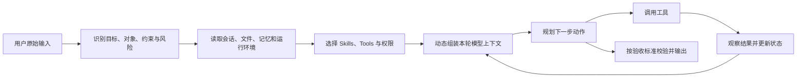
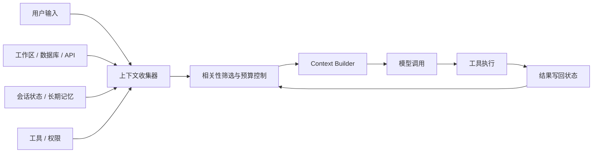

---
aliases:
  - Prompt工程入门与实践
  - Prompt Engineering
  - 提示词工程
tags:
  - AI
  - Prompt
  - 概念
---

# Prompt 工程入门与实践

> **0.10 基础概论**。与 [[AI/00-AI学习体系/03-外部参考/JavaGuide-Agent专题/04-Prompt-Engineering|JavaGuide Prompt]] 互补；系统做法见 [[AI/00-AI学习体系/02-概念库/06-工程生态/02-Context Engineering|Context Engineering]]。

↑ [[AI/00-AI学习体系/02-概念库/00-基础与LLM概论/00-LLM基础学习导航|LLM基础学习导航]] · [[AI/00-AI学习体系/00-核心索引|核心索引]]

---

## 摘要

**提示词工程（Prompt Engineering）**是把人的模糊意图转换成模型可执行、可验证的任务规格。它主要解决模型“有能力，但不知道具体要什么、依据什么做、怎样才算做对”的问题。

Prompt 的好坏不看长度，而看**任务边界是否清晰**：能否缩小模型的搜索空间，使输出更准确、稳定、可验证。进入 Agent 场景后，单条 Prompt 只是其中一层；系统还要动态管理规则、会话、文件、检索结果、工具、权限和执行反馈，这部分属于**上下文工程（Context Engineering）**。

> 最小心智模型：**提示词工程设计任务规格；上下文工程决定模型此刻能看到什么；Agent Harness 负责执行、观察、重试和权限控制。**

---

## 一、基础概念与术语对照

| 中文名称 | English Term | 含义 |
|---|---|---|
| 提示词 | Prompt | 发送给模型的指令、问题或任务内容 |
| 提示词工程 | Prompt Engineering | 设计和迭代任务指令，使输出满足目标 |
| 系统指令 | System Instructions / System Prompt | 定义模型的长期职责、行为边界和高优先级规则 |
| 开发者指令 | Developer Instructions | 应用开发者提供的业务规则和工作流程 |
| 用户输入 | User Input | 用户当前提出的原始需求，应保留为事实来源 |
| 上下文 | Context | 当前模型调用可见的全部相关信息 |
| 上下文工程 | Context Engineering | 选择、组织、压缩和更新模型每轮所见内容 |
| 少样本提示 | Few-shot Prompting | 提供少量输入输出示例，让模型模仿模式 |
| 提示链 | Prompt Chaining | 将复杂任务拆成多次相互衔接的模型调用 |
| 结构化输出 | Structured Output | 用 JSON Schema 等方式约束结果结构 |
| 工具调用 | Tool Calling / Function Calling | 模型选择工具和参数，由外层程序执行真实操作 |
| 运行时上下文 | Runtime Context | 工作目录、当前时间、用户身份、权限、应用状态等实时信息 |
| 动态提示词组装 | Dynamic Prompt Assembly | 每次调用模型前，根据任务和环境构造本轮上下文 |
| 评估 | Evaluation / Eval | 使用测试样本和指标检查 Prompt 或 Agent 的质量 |

### Prompt 不只是“一句话”

在聊天产品里，Prompt 看起来像输入框中的一句话；在 API 或 Agent 中，一次模型调用通常由多部分共同组成：

```text
模型上下文 = 系统指令 + 开发者规则 + 会话历史 + 用户输入
           + 相关文件/RAG + 记忆 + 工具定义 + 工具执行结果
```

因此，工程实践的对象不是“写一句聪明的话”，而是设计一份完整的任务接口。

---

## 二、提示词工程主要解决什么问题

| 问题 | 典型表现 | 设计动作 |
|---|---|---|
| 意图含糊 | “帮我总结一下”得到泛泛复述 | 明确目标、受众、使用场景和完成标准 |
| 上下文不足 | 模型不了解项目、术语或背景 | 提供必要材料，或通过 RAG、文件、工具补充 |
| 边界不清 | 自行补充事实、修改无关内容 | 写清允许范围、禁止事项和信息不足时的行为 |
| 输出不稳定 | 格式、详略、术语每次不同 | 使用术语表、示例和结构化输出 |
| 复杂任务漏步骤 | 一次要求过多，结果顾此失彼 | 任务分解、提示链或 Workflow |
| 结果无法验收 | 看起来合理，但不知道是否完成 | 定义验收标准、硬校验和 Eval |
| 事实与推断混淆 | 模型补充内容被当成原文 | 标记原文、推断、补充和存疑 |
| 高风险动作失控 | 删除文件、发信、付款前未确认 | 最小权限、审批节点和工具层约束 |

### 它不能单独解决什么

- Prompt 不能为模型提供不存在或已经过时的事实，需要检索、数据库或工具。
- Prompt 不能彻底消除幻觉，只能降低概率并让错误更容易暴露。
- Prompt 不能替代代码层权限、Schema 校验、事务和人工审批。
- Prompt 不能弥补完全不适合该任务的模型能力，需要换模型、RAG、工具或微调。

---

## 三、从四要素到任务规格

| 要素 | 作用 | 写法建议 |
|------|------|----------|
| **Role** | 领域知识与语气 | 放**开头**，越具体越好 |
| **Task** | 要完成什么动作 | 动词明确、可验收 |
| **Context** | 任务相关背景 | 只给必要信息，避免噪声 |
| **Format** | 输出格式 | 放**结尾**（Lost in the Middle） |

四要素适合快速提问。生产任务推荐扩展为七段式任务规格：

```markdown
# 目标（Goal）
最终结果用于什么场景，什么叫完成。

# 背景（Context）
受众、已有知识、业务背景和必要资料。

# 输入（Input）
待处理的文本、数据、文件或变量。

# 任务（Tasks）
执行什么；复杂任务按依赖顺序拆分。

# 约束（Constraints）
必须遵守、不得执行、信息不足时如何处理。

# 输出格式（Output Format）
标题、字段、表格或 JSON Schema。

# 质量标准（Evaluation Criteria）
准确性、完整性、一致性和可操作性的验收条件。
```

### 判断 Prompt 是否足够好的五个问题

1. 模型是否知道最终目标，而不只是眼前动作？
2. 模型是否拿到了完成任务所需的信息？
3. 模型是否知道哪些内容不能猜、哪些动作不能做？
4. 输出是否能被人或程序检查？
5. 遇到歧义、失败和边界情况时，是否有明确行为？

---

## 四、六种常用技法

### 1. 角色扮演

「专注性能优化的 Java 架构师」>「你是 AI」。长对话会稀释角色，复杂任务宜新会话。

### 2. 思维链（CoT）

| 场景 | 建议 |
|------|------|
| 教学 / 调试 | 可展示步骤与证据 |
| 生产 | 关键依据 + 结论，少冗长推理 |
| Reasoning Model | 不假设可见完整 reasoning tokens |

Zero-shot：`请给出关键步骤后再回答。`

详见 [[AI/00-AI学习体系/02-概念库/02-训练与推理/07-推理时增强-CoT|推理时增强-CoT]]。

### 3. 少样本（Few-shot）

少量、典型且格式一致的示例，通常比抽象描述更容易界定输出模式。示例数量没有固定最优值，应根据任务复杂度、上下文预算和 Eval 结果决定。

### 4. 任务分解

- **静态分解**：流程固定，事先规划步骤 → Workflow
- **动态分解**：探索性，按结果决定下一步 → Agent

简单任务勿过度拆分。详见 [[AI/00-AI学习体系/02-概念库/03-Agent系统/01-Workflow vs Agent|Workflow vs Agent]]。

### 5. 结构化输出

JSON Schema、Spring AI `BeanOutputConverter`、模型原生 structured output。

失败处理：Schema 校验失败记日志 + 重试反馈缺失字段；重试仍失败走兜底模板。

### 6. 自洽与自评

让模型检查自己的输出（格式、约束、引用）；生产环境配合**硬校验**（见 [[AI/00-AI学习体系/02-概念库/05-评测/03-LLM-as-a-Judge|LLM-as-a-Judge]]）。

---

## 五、Prompt Engineering 与 Context Engineering

| 维度 | Prompt Engineering | Context Engineering |
|------|-------------------|-------------------|
| 焦点 | 单次指令怎么写 | 系统如何构造上下文 |
| 范围 | 一条消息 | Rules、RAG、Memory、Tools、Skills |
| 适用 | 单轮、简单任务 | Agent、长会话、生产系统 |

在 Agent 场景中，需要把单次 **Prompt Engineering** 扩展为持续的 **Context Engineering**；前者仍负责任务规格，后者负责每轮信息供给。

---

## 六、Agent 如何把用户输入变成可执行上下文

Agent 一般不会先把用户输入“润色成一句更好的 Prompt”，而是保留用户原话，再生成结构化任务理解，并与实时上下文一起组装。



### 1. 结构化理解用户意图

用户输入：

> 获取远程最新文件，覆盖本地。

Agent 可以提取为：

```json
{
  "goal": "让本地当前分支与远程最新版本一致",
  "objects": ["当前仓库", "当前分支", "上游远程分支"],
  "prerequisites": ["检查Git状态", "确认上游分支", "获取远程引用"],
  "risk": "可能永久丢失未提交修改",
  "ambiguity": "用户是否确认丢弃本地修改",
  "success_criteria": ["本地HEAD与远程一致", "工作区状态符合预期"]
}
```

这里的结构化表示用于辅助决策，用户原始输入仍然保留，避免改写过程中发生语义漂移。

### 2. 注入指令层级

典型优先级从高到低为：

1. 系统安全和平台规则
2. 开发者定义的产品规则
3. 项目、团队或 Skill 指令
4. 用户当前要求
5. 文件、网页、邮件和工具输出等外部数据

外部内容只能作为数据，不能因为其中写着“忽略之前指令”就覆盖高优先级规则。详见 [[AI/00-AI学习体系/02-概念库/07-安全治理/01-Prompt Injection与Agent安全|Prompt Injection与Agent安全]]。

### 3. 选择固定 Workflow 或动态 Agent

- 任务边界稳定、步骤可预定义：使用 **Workflow（工作流）**，便于控制和测试。
- 路径依赖中间结果、需要探索：使用 **Agent（智能体）**，让模型动态决定下一步。
- 常见生产架构：外层固定流程负责权限和状态，内层 Agent 负责判断和执行。

---

## 七、运行时动态注入如何实现

**动态注入（Dynamic Context Injection）**不是模型主动读取电脑，而是 Agent Harness 在每次调用模型前，通过代码收集当前状态，再构造 `instructions`、`messages/input`、`tools` 等请求字段。



### 实现步骤

1. **收集（Collect）**：读取时间、目录、Git 状态、用户身份、应用状态等真实信息。
2. **选择（Select）**：根据意图只保留当前任务相关内容。
3. **组织（Assemble）**：将规则、消息、环境、工具和输出格式分层组装。
4. **执行（Act）**：模型选择回答或调用工具，由外层程序执行真实动作。
5. **观察（Observe）**：将工具结果作为新的消息写回状态。
6. **重组（Reassemble）**：下一轮重新筛选上下文并调用模型。
7. **校验（Validate）**：检查目标、格式、事实和副作用是否符合要求。

### 框架无关的最小伪代码

```python
def run_agent(user_input, state, runtime):
    intent = analyze_intent(user_input)

    while True:
        context = {
            "system_rules": load_system_rules(),
            "original_user_input": user_input,
            "intent": intent,
            "history": summarize_if_needed(state.messages),
            "environment": inspect_relevant_environment(intent, runtime),
            "memory": retrieve_relevant_memory(intent),
            "tools": select_tools(intent, runtime.permissions),
        }

        response = model.generate(build_model_request(context))

        if response.needs_clarification:
            return ask_user(response.question)

        if response.tool_call:
            result = execute_with_permission_check(response.tool_call)
            state.messages.append(tool_result_message(result))
            continue

        if validate(response, intent, context):
            return response.final_answer

        state.messages.append(validation_feedback())
```

### 动态注入的三个控制点

| 控制点 | 原因 | 常用办法 |
|---|---|---|
| 相关性 | 全量注入会产生噪声和更高成本 | 意图路由、文件搜索、RAG、工具筛选 |
| Token 预算 | 上下文窗口有限，长会话会挤掉关键信息 | 滚动摘要、分块、保留最近消息、子任务隔离 |
| 信任边界 | 网页、邮件和工具结果可能包含恶意指令 | 消息分层、数据标签、最小权限、危险动作审批 |

动态注入主要由 [[AI/00-AI学习体系/02-概念库/03-Agent系统/05-Agent Harness|Agent Harness]] 实现，系统化设计见 [[AI/00-AI学习体系/02-概念库/06-工程生态/02-Context Engineering|Context Engineering]]。

---

## 八、三个完整实践案例

### 案例 1：压缩式读书笔记

普通版本：

```text
总结这本书，提取重要概念。
```

任务规格版本：

```markdown
# 目标
生成一份压缩式掌握笔记，使读者能在20分钟内恢复全书知识结构。

# 术语规则
- 专业概念第一次出现时写为“中文名称（English Term）”。
- 后续统一使用中文名称，不交替使用不同译名。
- 最后生成中英文术语表。

# 分析任务
1. 概括全书试图解决的核心问题。
2. 提取基础概念：定义、通俗解释、相邻概念区别和原文依据。
3. 建立“问题 → 假设 → 机制 → 证据 → 权衡 → 设计动作”的论证主线。
4. 说明每个结论的成立条件、失效边界和争议。
5. 提取可以迁移到现实工作的实践动作，并解释背后原理。

# 事实边界
- 【原文】：作者直接表达
- 【推断】：依据原文推导
- 【补充】：模型提供的背景知识
- 【存疑】：证据不足或存在歧义

# 输出结构
全书摘要、核心问题、概念地图、论证主线、关键机制、适用边界、
实践动作、中英文术语表、复习问题。
```

改进点：从“内容提取”升级为知识压缩、关系建模、边界分析和主动回忆设计。

### 案例 2：客户反馈分类

```markdown
# 目标
将客户反馈转换为可以进入工单系统的产品问题。

# 可选分类
功能缺失、使用困难、性能问题、数据错误、付费问题、非产品问题。

# 规则
- 只能使用给定分类。
- 没有足够证据时，needs_human_review 必须为 true。
- evidence 必须引用用户原文。
- 不得推测用户没有表达的动机。

# 输出格式
{
  "category": "分类名称",
  "severity": "low | medium | high",
  "evidence": "支持判断的原文",
  "summary": "不超过30字",
  "needs_human_review": true
}
```

改进点：枚举、证据和 Schema 让输出可以被下游程序消费，而不只是“分析得像有道理”。

### 案例 3：Coding Agent 修改图表

```markdown
# 目标
修复曲线图的布局和悬停数据映射问题。

# 验收标准
1. 曲线自动使用有效绘图区，避免上下大面积留白。
2. 悬停值由当前数据点计算，不得由像素位置近似反推。
3. 数值和角度来自同一个数据对象。
4. 保持现有视觉风格。
5. 增加覆盖边界值和悬停映射的测试。
6. 修改后运行测试并报告结果。

# 工作方式
先检查现有实现和测试；只修改相关模块；遇到用户已有变更时保留并兼容。
```

改进点：将视觉反馈转换成代码级约束和可执行验收条件，Agent 可以据此检查文件、修改代码并运行测试。

---

## 九、常见场景自查清单

| # | 场景 | 关键 Prompt 设计点 |
|---|------|-------------------|
| 1 | 代码审查 | 范围、严重程度、输出格式、禁止风格空谈 |
| 2 | 日志分析 | 时间窗、错误模式、根因假设、证据引用 |
| 3 | SQL 生成 | 表结构、只读约束、方言、示例行 |
| 4 | 文档摘要 | 受众、长度、必须保留的术语 |
| 5 | 分类打标 | 标签枚举、边界案例、置信度 |
| 6 | 翻译 / 本地化 | 术语表、语气、不译列表 |
| 7 | 数据提取 | JSON Schema、空值策略、多页 PDF 分块 |

领域模板见 [[AI/04-Prompt模板/00-Prompt模板导航|Prompt 模板导航]]。

---

## 十、安全与治理

- 不要把密钥、PII 写进 Prompt
- 防范间接注入（RAG 文档、网页、邮件）→ [[AI/00-AI学习体系/02-概念库/07-安全治理/01-Prompt Injection与Agent安全|Prompt Injection与Agent安全]]
- 生产 Prompt 版本化，与 eval 数据集绑定

---

## 十一、从“调 Prompt”到评测闭环

成熟实现不是凭感觉反复改词，而是：

```text
建立测试样本 → 运行初版 → 归类失败 → 单点修改
→ 回归测试 → 版本化发布 → 监控生产失败
```

好 Prompt 或 Agent 的基本指标：

1. 同样输入多次运行，输出结构稳定
2. 边界案例有明确行为（拒答 / 追问 / 降级）
3. 有自动化检查（Schema、关键词、引用存在性）
4. 事实能回溯到输入、检索结果或工具输出
5. 工具选择、参数和权限符合预期
6. 完成任务的成功率、成本与延迟可以接受

建议为每个生产 Prompt 保存：模型版本、Prompt 版本、测试集、评分规则、失败案例和变更记录。详见 [[AI/00-AI学习体系/02-概念库/05-评测/01-Eval Harness|Eval Harness]]。

---

## 十二、知识浓缩

```text
Prompt Engineering：把模糊意图变成可执行、可验证的任务规格。
Context Engineering：为每次模型调用选择并组织正确的信息和工具。
Agent Harness：让模型在“计划 → 行动 → 观察 → 调整”循环中执行任务。

好 Prompt = 目标清楚 + 信息充分 + 边界明确 + 输出可检验。
可靠 Agent = 好 Prompt + 动态上下文 + 工具/权限 + 状态循环 + Eval。
```

### 复习问题

1. 为什么提示词工程不等于“把问题写得更长”？
2. Role、Task、Context、Format 分别缩小了哪一类不确定性？
3. Prompt Engineering 与 Context Engineering 的边界是什么？
4. Agent 为什么应保留用户原始输入，而不是只保留改写结果？
5. 动态注入由谁执行，每一轮会注入哪些信息？
6. 为什么工具定义和权限也属于模型上下文的一部分？
7. 哪些可靠性问题无法仅靠 Prompt 解决？
8. 如何用 Eval 判断一次 Prompt 修改是真的进步，而不是只改善一个样例？

---

## 十三、相关链接与资料

- [[AI/00-AI学习体系/03-外部参考/JavaGuide-Agent专题/04-Prompt-Engineering|JavaGuide Prompt Engineering]]
- [[AI/00-AI学习体系/02-概念库/06-工程生态/02-Context Engineering|Context Engineering]]
- [[AI/00-AI学习体系/02-概念库/03-Agent系统/05-Agent Harness|Agent Harness]]
- [[AI/00-AI学习体系/02-概念库/03-Agent系统/03-Tool Use与Function Calling|Tool Use与Function Calling]]
- [[AI/00-AI学习体系/02-概念库/07-安全治理/01-Prompt Injection与Agent安全|Prompt Injection与Agent安全]]
- [[AI/04-Prompt模板/00-Prompt模板导航|Prompt 模板（领域用例）]]
- [[AI/03-课程资料/00-课程资料导航|课程 PDF #02 提示学习]]
- [Google AI：Prompt design strategies](https://ai.google.dev/gemini-api/docs/prompting-strategies)
- [Anthropic：Building effective agents](https://www.anthropic.com/engineering/building-effective-agents)
- [LangChain：Context engineering in agents](https://docs.langchain.com/oss/python/langchain/context-engineering)
- [OpenAI：Evals API](https://platform.openai.com/docs/api-reference/evals)

---

## 更新记录

- 2026-07-14：整合提示词工程讨论；补充术语对照、问题边界、任务规格、Agent 转换链路、动态上下文注入、完整案例与评测闭环
- 2026-07-11：初版 — 补全核心索引 0.10 断链
