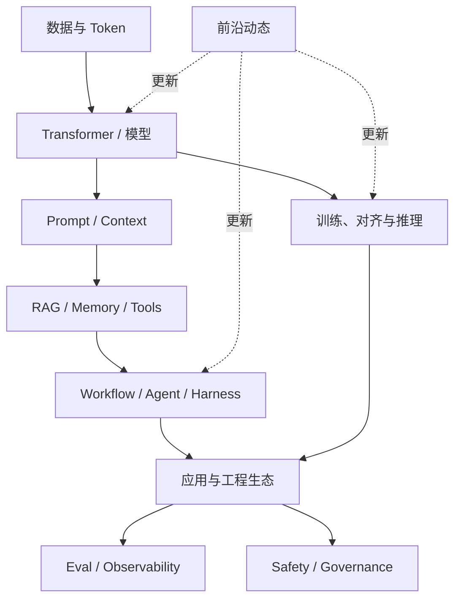

---
aliases:
  - AI概念库导航
  - 概念库导航
tags:
  - AI
  - MOC
  - 导航
---

# AI 概念库导航

> 这里是 `02-概念库` 的主题入口。完整清单见 [[AI/00-AI学习体系/00-核心索引|核心索引]]，按周学习见 [[AI/00-AI学习体系/01-学习路线/00-AI学习路线图|AI学习路线图]]。

## 怎么使用这套概念库

每个主题分为三层：

1. **导航层**：先建立问题地图和阅读顺序。
2. **核心概念层**：理解定义、机制、边界和相邻概念。
3. **专题层**：需要实现、选型或深入研究时再读。

不要从头到尾平均用力。先选一条目标路线，遇到不理解的前置概念再回查。

## 九个主题

| 编号 | 主题 | 核心问题 | 入口 |
|---|---|---|---|
| 0 | 基础与 LLM 概论 | LLM 如何表示、训练和生成文本？ | [[AI/00-AI学习体系/02-概念库/00-基础与LLM概论/00-LLM基础学习导航|LLM基础学习导航]] |
| 1 | 模型层 | Transformer、MoE、多模态和推理模型如何工作？ | [[AI/00-AI学习体系/02-概念库/01-模型层/00-模型层导航|模型层导航]] |
| 2 | 训练与推理 | 模型如何训练、对齐、微调和高效部署？ | [[AI/00-AI学习体系/02-概念库/02-训练与推理/00-训练与推理导航|训练与推理导航]] |
| 3 | Agent 系统 | 模型如何使用工具、循环行动和完成复杂任务？ | [[AI/00-AI学习体系/02-概念库/03-Agent系统/00-Agent系统导航|Agent系统导航]] |
| 4 | RAG 进阶 | 如何让模型使用外部、私有和最新知识？ | [[AI/00-AI学习体系/02-概念库/04-RAG进阶/00-RAG进阶导航|RAG进阶导航]] |
| 5 | 评测 | 如何证明模型或 Agent 真的做对了？ | [[AI/00-AI学习体系/02-概念库/05-评测/00-评测导航|评测导航]] |
| 6 | 工程与生态 | 如何把模型能力组织成可维护的应用？ | [[AI/00-AI学习体系/02-概念库/06-工程生态/00-工程生态导航|工程生态导航]] |
| 7 | 安全与治理 | 如何控制注入、越权和高风险动作？ | [[AI/00-AI学习体系/02-概念库/07-安全治理/00-安全治理导航|安全治理导航]] |
| 8 | 前沿动态 | 当前模型、趋势与工程选型发生了什么变化？ | [[AI/00-AI学习体系/02-概念库/08-前沿动态/00-2026最新AI态势导航|2026最新AI态势导航]] |

## 三条推荐路线

### AI 应用工程路线

```text
什么是 LLM → LLM 调用 → Prompt Engineering → Context Engineering
→ RAG → Workflow vs Agent → Tool Use → Eval → 安全
```

适合目标：做问答、知识库、业务自动化和生产级 LLM 应用。

### Agent 工程路线

```text
LLM 调用 → Tool Use → Workflow vs Agent → ReAct
→ Graph / Loop → Harness → Memory → Skills / MCP
→ Coding / Browser Agent → Eval 与安全
```

适合目标：理解 Codex、Cursor、Claude Code 等 Agent 产品及其工程实现。

### 模型与推理路线

```text
Tokenizer → 表示学习 → Attention → Transformer → MoE
→ 训练与对齐 → 推理模型 → Test-time Compute
→ 推理加速与 Serving → 微调和本地部署
```

适合目标：阅读模型报告、做模型选型、微调或推理部署。

## 概念关系总图



## 阅读一篇概念笔记时抓什么

用统一的五问压缩内容：

1. **问题（Problem）**：它试图解决什么？
2. **定义（Definition）**：它是什么，不是什么？
3. **机制（Mechanism）**：输入如何经过过程变成输出？
4. **权衡（Trade-offs）**：质量、成本、延迟和风险如何变化？
5. **设计动作（Design Actions）**：工程上应该怎么做？

更新频繁的模型名称、价格和产品能力放在“前沿动态”；稳定机制保留在 0–7 章，避免基础笔记被时效信息污染。

