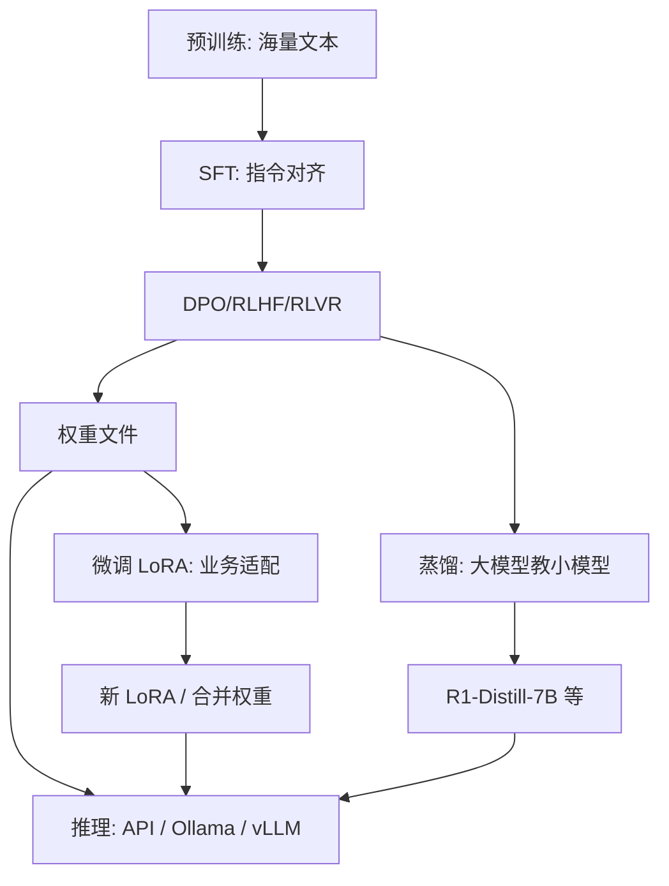

---
aliases:
  - 训练与蒸馏
  - 微调实战
  - 怎么训练大模型
---

# 训练、蒸馏与微调实战

> 更新时间：2026-07-08。
> 把「训练是什么意思」「蒸馏是什么意思」「怎么训练」串成一条可执行路径。

## 训练（Training）是什么

**训练 = 用数据反复调整模型参数（权重），让模型从「不会」变成「会」。**

```text
输入问题 → 模型乱猜 → 对比正确答案 → 反向传播更新权重 → 重复百万/亿次
```

| 阶段 | 做什么 | 数据 | 成本 |
|---|---|---|---|
| **预训练（Pretraining）** | 学语言、知识、逻辑 | 互联网级文本 | 极高 |
| **SFT** | 学听指令、对话格式 | 指令-回答对 | 中等 |
| **偏好对齐（DPO/RLHF）** | 学哪种回答更好 | 人类/AI 偏好 | 较高 |
| **任务 RL（如 RLVR）** | 强化推理、代码等 | 可验证奖励 | 较高 |

训练结果 → 保存为**权重文件**。详见 [[AI/00-AI学习体系/02-概念库/02-训练与推理/01-训练阶段与对齐方法|训练阶段与对齐方法]]。

### 类比

| 训练阶段 | 类比 |
|---|---|
| 预训练 | 读万卷书 |
| SFT | 学答题格式和礼貌 |
| RL / DPO | 学哪种写法更得分 |
| 推理（Inference） | 上考场答题（不再改参数） |

## 蒸馏（Distillation）是什么

**蒸馏 = 用大模型（老师）教小模型（学生），让小模型用更少资源逼近老师能力。**

```text
DeepSeek-R1 671B（老师）
    ↓ 生成高质量答案 / 推理过程（CoT）
Qwen-7B（学生）
    ↓ 用老师输出当训练数据
DeepSeek-R1-Distill-Qwen-7B
```

| | 普通微调 | 蒸馏 |
|---|---|---|
| 训练数据 | 人类写的文本、业务问答 | **大模型生成的输出** |
| 目标 | 适配任务 / 领域 | **模仿大模型行为** |
| 典型产物 | 业务 LoRA | R1-Distill-7B / 32B 等小模型 |

蒸馏不是用户日常做的，而是**厂商把大模型能力压缩到小模型**；个人/公司更常做的是**微调**。

## 权重能否再训练

**能。** 主流做法是加载开源权重 → 准备数据 → LoRA/QLoRA 微调 → 得到新权重或 LoRA 增量。

| 方式 | 说明 | 显存参考 |
|---|---|---|
| **LoRA** | 只训低秩增量，原权重冻结 | 7B 单卡 24GB 常见 |
| **QLoRA** | 4bit 量化 + LoRA | 8～12GB 可试 7B |
| **全量微调** | 更新全部参数 | 多卡 |

工具：[[AI/00-AI学习体系/02-概念库/02-训练与推理/05-高效微调|高效微调]] 中的 LLaMA-Factory、Axolotl、Unsloth。

## 微调实战流程（个人/小团队）

```text
1. 选基座（Qwen2.5-7B / DeepSeek-R1-Distill-Qwen-7B）
2. 准备 JSON/JSONL 指令数据（几百～几千条高质量样本）
3. LoRA 微调（LLaMA-Factory WebUI 或 CLI）
4. 导出 LoRA 或合并权重
5. 评测 → 迭代数据
```

### 数据格式示例

```json
{
  "messages": [
    {"role": "user", "content": "什么是退货仓？"},
    {"role": "assistant", "content": "退货仓是用于接收门店退回商品的仓库..."}
  ]
}
```

### LLaMA-Factory 命令行示例

```bash
llamafactory-cli train \
  --stage sft \
  --model_name_or_path Qwen/Qwen2.5-7B-Instruct \
  --dataset my_train_data \
  --template qwen \
  --finetuning_type lora \
  --output_dir ./output/qwen7b-lora \
  --per_device_train_batch_size 2 \
  --gradient_accumulation_steps 8 \
  --learning_rate 1e-4 \
  --num_train_epochs 3 \
  --bf16
```

### 关键超参

| 参数 | 常见值 | 说明 |
|---|---|---|
| `learning_rate` | 1e-4 ~ 5e-5 | 比预训练大 |
| `num_train_epochs` | 2~5 | 太多易过拟合 |
| `lora_rank` | 8~64 | 多数任务够用 |

### 常见坑

1. **数据质量差** 比数据少更致命。
2. **epoch 过多** → 只会背训练集。
3. **Chat template 不一致** → 必须匹配基座（Qwen 用 qwen 模板）。
4. **显存不够** → QLoRA、减小 batch、缩短 max_length。
5. **以为在重训 DeepSeek** → 实际只是微调已有权重。

## 推荐入门路径

```text
1. [[AI/02-环境与实操/Tools/ollama/Ollama|Ollama]] 跑通 deepseek-r1:7b（理解模型能干什么）
2. 准备 200～1000 条业务问答 JSON
3. 租 24GB GPU 或用本地卡
4. LLaMA-Factory + LoRA 微调 Qwen2.5-7B
5. 测试 → 迭代数据
```

## 一张总图



## 与之相关

- 权重概念：[[AI/00-AI学习体系/02-概念库/00-基础与LLM概论/08-开源权重与模型文件|开源权重与模型文件]]
- RLVR / R1：[[AI/00-AI学习体系/02-概念库/02-训练与推理/02-RLVR|RLVR]]
- 高效微调：[[AI/00-AI学习体系/02-概念库/02-训练与推理/05-高效微调|高效微调]]
- 合成数据：[[AI/00-AI学习体系/02-概念库/02-训练与推理/04-合成数据与Self-Play|合成数据与Self-Play]]
- DeepSeek 部署：[[AI/00-AI学习体系/02-概念库/08-前沿动态/04-DeepSeek开源部署指南|DeepSeek开源部署指南]]
