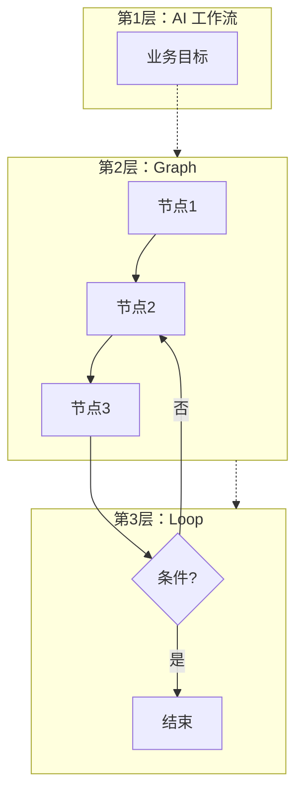

---
aliases:
  - AI工作流
  - Graph与Loop
  - LangGraph编排
---

# AI 工作流、Graph 与 Loop

> 更新时间：2026-07-09。
> 把 **AI 工作流（业务层）**、**Graph（结构层）**、**Loop（控制层）** 三层概念拆开，并给出逐步执行示例与 toB 场景对照。
>
> **定位**：实现级专题，重点是 Graph、Loop、状态传递和手写/LangGraph 代码。第一次了解 AI 工作流先读 [[AI/00-AI学习体系/02-概念库/03-Agent系统/12-AI工作流入门与实践|AI工作流入门与实践]]。
>
> 前置：[[AI/00-AI学习体系/02-概念库/03-Agent系统/01-Workflow vs Agent|Workflow vs Agent]] · 导航：[[AI/00-AI学习体系/02-概念库/03-Agent系统/00-Agent系统导航|Agent系统导航]]

## 三层关系（先记住这张）

```text
第 1 层：AI 工作流  →  「要完成什么业务」
第 2 层：Graph       →  「步骤怎么连、状态怎么传」
第 3 层：Loop        →  「某几步要不要反复转圈」
```

```text
AI 工作流 = 业务设计
Graph     = 实现工作流的一种结构（节点 + 边 + 状态）
Loop      = Graph 里是否存在「走回前面节点」的路径
```

**不是三个并列产品**，而是嵌套关系：

```text
每一个 Graph 编排都可以叫一种「AI 工作流实现」
但不是每个 AI 工作流都必须用 Graph（也可纯脚本 / n8n）

每一个 Loop 都发生在某个 Graph（或等价逻辑）里
但不是每个 Graph 都有 Loop

Agent ≈ Graph + Loop + LLM 决定走哪条边
```

---

## 一、从普通程序理解（无 AI 也行）

### 1. 最线性：无 Graph 概念也成立

```python
def handle_order(order_id):
    order = query_db(order_id)
    msg = llm_summarize(order)
    send_email(msg)
```

```text
query_db → llm_summarize → send_email → 结束
```

### 2. 有分支：DAG（有向无环图）

```python
intent = llm_classify(text)
if intent == "退货":
    return refund_flow(text)
else:
    return faq_flow(text)
```

```text
           ┌→ refund_flow → 结束
classify ──┤
           └→ faq_flow    → 结束
```

有分叉，但**不会回到以前的步骤** → 仍是 Workflow，Graph 上**无 Loop**。

### 3. 有 Loop：`while` 或回边

```python
draft = llm_write(topic)
while score(draft) < 80 and retry < 3:
    draft = llm_improve(draft)
```

```text
写初稿 → 评分 → 不够80分 ──┐
              ↑            │
              └────────────┘
              够80分 → 结束
```

---

## 二、Graph 是什么（编排里的 Graph）

> **不是**知识图谱的 Graph，而是 **流程图 / 状态机**。

| 概念 | 含义 | 例子 |
|---|---|---|
| **节点 Node** | 做一件事的一步 | 查库、调 LLM、发邮件 |
| **边 Edge** | 这一步完成后去哪 | 查库成功 → 调 LLM |
| **状态 State** | 各步共享的数据包 | `{ order, draft, score }` |

```text
Graph = 步骤盒子 + 箭头 + 共享文件夹（State）
```

### Graph vs 写 if/else

| 写代码 | Graph 编排 |
|---|---|
| 逻辑散在函数里 | 流程可视化 |
| 改分支要改代码 | 改边 / 加节点 |
| 小脚本够用 | 步骤多、要观测、要断点续跑时更清晰 |

典型框架：**LangGraph**、Dify 高级流、部分 n8n + LLM 节点。

Anthropic 的 Workflow 模式（见 [[AI/00-AI学习体系/02-概念库/03-Agent系统/01-Workflow vs Agent|Workflow vs Agent]]）都可画成 Graph：

| Workflow 模式 | Graph 形态 |
|---|---|
| Prompt Chaining | A → B → C |
| Routing | Start → Router → 分支 |
| Parallelization | Start → B1,B2,B3 → Merge |
| Evaluator–Optimizer | Generate ⇄ Evaluate（**有环**） |

---

## 三、Loop 是什么

**Loop = Graph 中存在「回到前面节点」的路径**，或代码里的 `while` / 固定 retry。

```text
无 Loop:  A → B → C → 结束
有 Loop:  A → B → C ──┐
               ↑      │
               └──────┘
```

### 两种 Loop（极易混淆）

#### 类型 A：规则 Loop → 仍是 **Workflow**

**谁决定再转一圈？** 你写的规则 / 固定边 / `if retry < 3`。

```text
[generate] → [score]
                ├─ score≥80 → [end]
                └─ score<80 且 retry<3 → 回到 [generate]
```

LLM 只干节点里的活；**循环条件是人定的**。

#### 类型 B：Agent Loop → **Agent**

**谁决定下一步？** LLM 每圈自己选工具、决定停不停。

```text
        ┌─────────────────┐
        ↓                 │
[agent_think] → [run_tool] → [observe]
        ↑                            │
        └────────────────────────────┘
```

见 [[AI/00-AI学习体系/02-概念库/03-Agent系统/02-ReAct与Agent范式|ReAct与Agent范式]]。

### 对照表

| | 无 Loop | Loop（规则） | Loop（Agent） |
|---|---|---|---|
| 结构 | A→B→C | A→B→C→B… | think→tool→think… |
| 谁控制循环 | — | if / 边条件 | LLM |
| 路径 | 固定 | 半固定 | 不固定 |
| 典型 | 链式 Workflow | 重试 / 质检 | ReAct Agent |
| toB 风险 | 低 | 中（设上限） | 高（权限 + max_steps） |

---

## 四、AI 工作流 与 Graph、Loop

**AI 工作流**：把 LLM、RAG、API、规则嵌进业务流程的**整体设计**（见 [[AI/00-AI学习体系/02-概念库/06-工程生态/03-应用层框架|应用层框架]]）。

- **Workflow**：步骤 mostly 人事先定；LLM 是节点里的算子。
- **Agent**：Graph 骨架固定，**Loop 里 LLM 选边**。



---

## 五、三个例子：逐步执行

### 例子 1：纯 Workflow，无 Loop

**业务**：Excel 导入 → 校验 → 写库

```text
[parse_excel] → [validate] → [save_db] → END

State:
  {} → {rows} → {rows, errors:[]} → {success:128}
```

每节点只进一次 → **不是 Agent**。

### 例子 2：Workflow + 规则 Loop

**业务**：LLM 生成 SELECT → 行数>1万则改写，最多 3 次

```text
[gen_sql] → [run_select] → [check_count]
                              ├─ ≤10000 → [export] → END
                              └─ >10000 且 retry<3 → 回到 [gen_sql]
```

第 1 轮 count=20255 → 回到 gen_sql；第 2 轮加条件后通过 → 导出。

👉 有 Loop，仍是 **Workflow**（retry 规则是你定的）。

### 例子 3：Agent + Graph + Loop

**业务**：排查「PO 条码为什么不对」

```text
第1圈: tool=查PO     → 条码 A
第2圈: tool=查SKU   → 条码 B
第3圈: tool=查订正记录 → 未执行
第4圈: LLM 输出结论，finish
```

Graph 骨架（agent ⇄ tools）固定；**每圈走哪条边由 LLM 定** → Agent。

---

## 六、LangGraph：同一套 Graph 描述两种东西

```text
Workflow 版:
  边固定:  A → B → C
  或条件边: B → C1 / C2（规则选）

Agent 版:
  agent → tool_A / tool_B / END（LLM 选）
  tool 执行完 → 回到 agent（Loop）
```

**LangGraph 不是只能做 Agent**；纯线性 RAG 也是 Graph。

---

## 七、快递分拣中心类比

| 概念 | 类比 |
|---|---|
| AI 工作流 | 分拣中心运作方案 |
| Graph 节点 | 扫码台、称重台、异常台 |
| Graph 边 | 传送带走向 |
| 无 Loop | 包裹只过一遍 |
| 规则 Loop | 超重自动退回称重，最多 3 次 |
| Agent Loop | 异常员自己决定先查面单还是先查仓库 |

---

## 八、三个判断问题

1. **步骤是事先画好，还是运行时 LLM 自己选？** → 前者偏 Workflow，后者偏 Agent。
2. **会不会回到之前的步骤？** → 不会 = 无 Loop；会 = 有 Loop。
3. **回到上一步谁决定？** → 规则 = Workflow Loop；LLM = Agent Loop。

---

## 九、常见误解

| 误解 | 正解 |
|---|---|
| Graph = Agent | 固定边的 Graph 是 Workflow |
| 有 Loop = Agent | 固定 retry 也是 Loop |
| Workflow 不能有环 | 审批驳回、质检循环都可以有环 |
| Agent 不需要 Graph | 实现上几乎总是 Graph + Loop |

---

## 十、toB / 零售场景对照

| 场景 | Graph | Loop | 类型 |
|---|---|---|---|
| 版权 UPDATE 先 SELECT 再导出 Excel | 线性 4 步 | 无 | Workflow |
| DMS 分页拉取（2000 行/页） | 线性 + 回边 | 有 | Workflow Loop |
| SQL 生成不对重写 3 次 | 三角回路 | 有 | Workflow Loop |
| 排查 SRO 未推 WMS | agent⇄tools | 有 | Agent Loop |
| Cursor Debug | 假设→跑命令→看证据 | 有 | Agent Loop（证据驱动） |

---

## 十一、选型口诀

```text
步骤清楚、要审计、要上线     → Workflow（Graph 可选）
步骤多、要可视化调试          → Graph 编排
某步要反复试直到达标          → 加规则 Loop（仍 Workflow）
路径不确定、工具多            → Agent（Graph + Loop + LLM 路由）
```

90% toB AI 应用：**Workflow + 可选规则 Loop** 即可；见 [[AI/00-AI学习体系/02-概念库/03-Agent系统/01-Workflow vs Agent|Workflow vs Agent]]。

---

## 十二、LLM 工作流专题：为什么需要 Graph 与 Loop

> 本节聚焦 **使用 LLM 的工作流**。与普通 API 编排不同，核心矛盾是：**LLM 非确定、会错、会漏、会多话**，而业务要求 **可控、可重试、可排障**。

### 12.1 什么叫「使用 LLM 的工作流」

不是单次 `prompt → 回答`，而是：

```text
输入 →（可能 RAG）→ LLM → 校验/工具 → 再 LLM → … → 输出
```

只要 LLM 出现在**多个步骤**，或与**检索 / 工具 / 规则**组合，就是 LLM 工作流。

### 12.2 为什么 LLM 工作流需要 Graph

#### ① LLM 只是其中一个算子

```text
用户问题 → 意图分类（LLM）→ 查向量库 → 拼 context → 生成（LLM）→ JSON 校验 → 写回 API
```

全塞进一个 `chat()` 时：不知道哪步 LLM 错了、无法跳过 LLM、无法单独换分类模型。

**Graph 明确：哪步调 LLM、哪步不调。**

#### ② 成本与延迟：需要路由

```text
           ┌→ 规则/小模型 FAQ → 结束（便宜）
用户问题 ──┤
           └→ RAG + 大模型   → 结束（贵）
```

没有 Graph，容易每件事都走全套 RAG + 大模型。Routing 节点见 [[AI/00-AI学习体系/02-概念库/01-模型层/08-Model Routing|Model Routing]]。

#### ③ Context 必须在步骤间传递（State）

| 节点 | 典型 context |
|---|---|
| 分类 | 仅用户问题 |
| RAG 生成 | 问题 + 检索片段 + 引用约束 |
| 格式化 | 上一步草稿 + JSON schema |

Graph 的 **State** 避免 context 在函数参数里乱传，防止**把错误文档喂给下一步 LLM**。见 [[AI/00-AI学习体系/02-概念库/06-工程生态/02-Context Engineering|Context Engineering]]。

#### ④ LLM 输出不可靠 → 必须接非 LLM 门禁

```text
LLM 生成 → schema 校验 → 不合格则 …
LLM 分类 → 置信度低 → 转人工
```

Graph 把 **LLM 节点** 与 **校验节点** 分开，便于 trace：哪次 LLM 调用、输入输出是什么。

#### ⑤ toB 需要可观测、可暂停

- 引用了哪几条检索？
- 卡在生成还是校验？
- 审批前能否 interrupt？

节点级 trace 依赖 Graph 结构。

**一句话**：Graph 解决 **路由省成本、context 拼接、RAG/工具/校验分工、多次 LLM 调用管理、线上排障**。

### 12.3 为什么 LLM 工作流需要 Loop

#### ① 一次生成，生产不可接受

- JSON 缺字段
- SQL 语法错
- 幻觉编造政策
- RAG 漏检答偏题

**Loop = 有上限地「再试一轮」，不是一次失败就整单挂。**

#### ② 两种 Loop 对应两种 LLM 失败

**A. 规则 Loop（Workflow 里最常见，约 90%）**

LLM 产内容；**要不要重来由规则定**。

```text
[LLM 生成 SQL] → [执行/校验] ──失败且 retry<3──┐
                      ↓ 成功                    │
                 [导出结果]                      │
                      ↑─────────────────────────┘
                  （把 error 塞进 prompt 重写）
```

典型：Self-correction、Evaluator–Optimizer、RAG topK 不够再检索、DMS 分页。

**B. Agent Loop**

LLM 决定下一步查什么 tool、何时结束。见 [[AI/00-AI学习体系/02-概念库/03-Agent系统/03-Tool Use与Function Calling|Tool Use与Function Calling]]。

#### ③ 长 prompt 不能替代 Loop

| 单次长 prompt | Loop |
|---|---|
| 不能真正执行 SQL 再验证 | 拿**真实执行结果**再喂 LLM |
| 检索不够无法动态加文档 | 「再检索一轮」 |
| 出错无法结构化重试 | 精确回传 **error message** |
| token 一次堆满 | 分轮拼 context |

Loop 本质是 **生成 → 用外部世界验证 → 再生成**，不是让模型空想。

#### ④ Loop 必须设上限

```text
max_retries = 3
max_llm_calls = 10
超时 / max_tokens
```

防止 LLM 空转、重复错 SQL、工具死循环。

**一句话**：Loop 解决 **LLM 一次不可信，需结合校验/工具/检索多轮迭代直到达标或超限**。

### 12.4 Graph + Loop 在 LLM 工作流里如何配合

```text
Graph：有哪些 LLM 节点、哪些非 LLM 节点、怎么连
Loop ：某些节点失败后，是否回到前面的 LLM / 检索节点
```

**带 RAG 的客服示例**：

```text
Graph:
  classify → retrieve → generate → cite_check → END
                              ↑         │
                              └─ fail ──┘   （引用 hallucination 则重写）

State: { query, docs, answer, cite_errors }
```

- Graph：保证先检索再生成、最后校验引用
- Loop：引用不对时只重做 `generate`（也可配置回到 `retrieve`）

### 12.5 何时可以不要 Graph / Loop

| 场景 | Graph | Loop |
|---|---|---|
| 单次问答、无 RAG、无工具 | 可不要 | 可不要 |
| 固定 RAG→生成、从不重试 | 可简化 | 可不要 |
| 生产 toB、要排障 | **要** | 多半**要** |
| Tool use / 多步推理 | **要** | **要** |

### 12.6 vs 普通 API 工作流

| | 普通 API 工作流 | LLM 工作流 |
|---|---|---|
| 节点失败 | 异常通常明确 | LLM **看起来成功但内容错** |
| Loop 需求 | 偶尔 retry | **高频**（格式、幻觉、检索） |
| Graph 需求 | 步骤多时要 | **更早需要**（路由、RAG、门禁） |
| State | 结构化数据 | 还要管 prompt、messages、检索片段 |

**Graph 和 Loop 在 LLM 场景里是补偿 LLM 弱点的工程手段，而不只是「架构炫技」。**

### 12.7 LLM 专题总结

```text
Graph = LLM 工作流的「电路图」（路由、context、门禁、观测）
Loop  = LLM 工作流的「重试与多轮推理」（验证驱动，有上限）

没有 Graph → LLM 调用变成 prompt 意大利面
没有 Loop  → 一次犯错就失败，幻觉与格式错误难纠正
```

---

## 十三、Graph 与 Loop 怎么实现（手写 → LangGraph）

> 按 **怎么实现 Graph** 和 **怎么实现 Loop** 分开；含可直接改的最小示例。
> 依赖：`pip install langgraph langchain-openai`（LLM 节点需自行替换为实际调用）。

### 13.0 实现前先定类型

| 类型 | Graph | Loop | 典型实现 |
|---|---|---|---|
| 线性 LLM 链 | 简单 | 无 | 函数串联 / LangChain LCEL |
| Workflow + 分支 | 要 | 可选 | LangGraph / 状态机 |
| Workflow + 重试 | 要 | 规则 Loop | LangGraph `conditional_edges` |
| Agent | 要 | Agent Loop | LangGraph `create_react_agent` |

90% LLM 工作流：LangGraph 或 Dify 高级编排；Agent 几乎默认 LangGraph。

---

### 13.1 Graph 怎么实现

#### 层次 1：手写（理解原理）

Graph = **节点函数** + **路由函数** + **共享 State（dict）**

```python
from typing import TypedDict

class State(TypedDict):
    query: str
    intent: str
    answer: str

def classify(state: State) -> State:
    intent = llm_classify(state["query"])
    return {**state, "intent": intent}

def refund_flow(state: State) -> State:
    return {**state, "answer": llm_refund(state["query"])}

def faq_flow(state: State) -> State:
    return {**state, "answer": llm_faq(state["query"])}

def route(state: State) -> str:
    return "refund" if state["intent"] == "退货" else "faq"

def run_graph(state: State) -> State:
    state = classify(state)
    if route(state) == "refund":
        return refund_flow(state)
    return faq_flow(state)
```

边在代码里是 `if route(...)`，State 在步骤间传递。

#### 层次 2：LangGraph（推荐）

```python
from typing import TypedDict, Literal
from langgraph.graph import StateGraph, END

class State(TypedDict):
    query: str
    intent: str
    answer: str

def classify(state: State) -> State:
    return {**state, "intent": llm_classify(state["query"])}

def refund_flow(state: State) -> State:
    return {**state, "answer": llm_refund(state["query"])}

def faq_flow(state: State) -> State:
    return {**state, "answer": llm_faq(state["query"])}

def route(state: State) -> Literal["refund", "faq"]:
    return "refund" if state["intent"] == "退货" else "faq"

graph = StateGraph(State)
graph.add_node("classify", classify)
graph.add_node("refund", refund_flow)
graph.add_node("faq", faq_flow)

graph.set_entry_point("classify")
graph.add_conditional_edges("classify", route, {
    "refund": "refund",
    "faq": "faq",
})
graph.add_edge("refund", END)
graph.add_edge("faq", END)

app = graph.compile()
result = app.invoke({"query": "我要退货", "intent": "", "answer": ""})
```

**Graph API 对照**：

| 要素 | LangGraph |
|---|---|
| 节点 | `add_node(name, fn)` |
| 固定边 | `add_edge("A", "B")` |
| 条件边 | `add_conditional_edges("A", router_fn, mapping)` |
| 状态 | `TypedDict`；节点返回 partial update |
| 入口 / 结束 | `set_entry_point` / `END` |
| 运行 | `app = graph.compile()` → `app.invoke(state)` |

#### 层次 3：低代码（Dify / n8n）

拖节点连线 = Graph；循环节点 / 条件分支 = Loop。适合业务配置；复杂 Agent 常落回 LangGraph。

---

### 13.2 Loop 怎么实现

#### 类型 A：规则 Loop（Workflow 重试）

**核心**：`conditional_edges` 指回前节点 + State 里 `retry` + **max 上限**。

```python
from typing import TypedDict, Literal
from langgraph.graph import StateGraph, END

class State(TypedDict):
    topic: str
    draft: str
    score: int
    retry: int

def generate(state: State) -> State:
    draft = llm_write(state["topic"], feedback=state.get("draft"))
    return {**state, "draft": draft}

def score_node(state: State) -> State:
    return {**state, "score": llm_score(state["draft"])}

def should_retry(state: State) -> Literal["retry", "end"]:
    if state["score"] >= 80 or state["retry"] >= 3:
        return "end"
    return "retry"

def bump_retry(state: State) -> State:
    return {**state, "retry": state["retry"] + 1}

graph = StateGraph(State)
graph.add_node("generate", generate)
graph.add_node("score", score_node)
graph.add_node("bump", bump_retry)

graph.set_entry_point("generate")
graph.add_edge("generate", "score")
graph.add_conditional_edges("score", should_retry, {
    "retry": "bump",
    "end": END,
})
graph.add_edge("bump", "generate")

app = graph.compile()
result = app.invoke({"topic": "x", "draft": "", "score": 0, "retry": 0})
```

```text
Loop = 边 score → bump → generate（条件满足时）
     + State.retry 控制退出
     + max_retry 防止死循环
```

#### 类型 B：Agent Loop（ReAct）

**预置**：`create_react_agent` 一键建好 agent ⇄ tools 的 Graph + Loop。

```python
from langgraph.prebuilt import create_react_agent
from langchain_openai import ChatOpenAI
from langchain_core.tools import tool

@tool
def query_po(po_no: str) -> str:
    """根据 PO 单号查询采购单"""
    return db.query_po(po_no)

llm = ChatOpenAI(model="gpt-4o")
agent = create_react_agent(llm, [query_po])

result = agent.invoke({
    "messages": [("user", "PO 条码为什么不对？")]
}, config={"recursion_limit": 15})
```

等价 Graph：

```text
agent ──有 tool_call──→ tools ──结果──→ agent ──…──→ END
  ↑___________________________________|
```

| 项 | 做法 |
|---|---|
| 工具 | `@tool` 或 StructuredTool |
| 循环 | 框架内置，LLM 每圈选 tool 或 finish |
| 上限 | `config={"recursion_limit": 15}` |
| 要求 | LLM 须支持 **Tool Calling** |

深度定制 Agent Graph 时改用手写 `StateGraph`，见 [[AI/00-AI学习体系/02-概念库/03-Agent系统/02-ReAct与Agent范式|ReAct与Agent范式]]。

#### 不用 LangGraph：手写 while

```python
def run_with_retry(topic, max_retry=3):
    draft, retry = "", 0
    while retry < max_retry:
        draft = llm_write(topic, draft)
        if llm_score(draft) >= 80:
            return draft
        retry += 1
    raise RuntimeError("max retry exceeded")
```

**分页 Loop**（如 DMS 2000 行/页）：

```python
def fetch_all(sql, page_size=2000):
    rows, offset = [], 0
    while True:
        batch = dms_query(f"{sql} LIMIT {page_size} OFFSET {offset}")
        if not batch or len(batch) < page_size:
            rows.extend(batch)
            break
        rows.extend(batch)
        offset += page_size
    return rows
```

---

### 13.3 完整示例：RAG + 引用校验 Loop

```python
from typing import TypedDict, Literal
from langgraph.graph import StateGraph, END

class State(TypedDict):
    query: str
    docs: list[str]
    answer: str
    cite_ok: bool
    retry: int

def retrieve(state: State) -> State: ...
def generate(state: State) -> State: ...
def cite_check(state: State) -> State:
    ok = check_citations(state["answer"], state["docs"])
    return {**state, "cite_ok": ok}

def after_check(state: State) -> Literal["generate", "end"]:
    if state["cite_ok"] or state["retry"] >= 2:
        return "end"
    return "generate"

graph = StateGraph(State)
graph.add_node("retrieve", retrieve)
graph.add_node("generate", generate)
graph.add_node("cite_check", cite_check)

graph.set_entry_point("retrieve")
graph.add_edge("retrieve", "generate")
graph.add_edge("generate", "cite_check")
graph.add_conditional_edges("cite_check", after_check, {
    "generate": "generate",
    "end": END,
})
```

- **Graph**：retrieve → generate → cite_check
- **Loop**：引用不对 → 回到 generate（**规则 Loop**，非 Agent）

---

### 13.4 生产还要加什么

| 能力 | 实现 |
|---|---|
| 持久化 / 断点续跑 | `checkpointer`（SQLite / Postgres） |
| 人工审批 | `interrupt_before=["approve"]` |
| 可观测 | LangSmith / LangFuse |
| 超时 / 步数上限 | `recursion_limit`、节点 timeout |
| 部署 | `app.invoke` 包 FastAPI；或 LangGraph Platform |

```python
from langgraph.checkpoint.sqlite import SqliteSaver

memory = SqliteSaver.from_conn_string(":memory:")
app = graph.compile(checkpointer=memory)
config = {"configurable": {"thread_id": "job-123"}}
app.invoke(initial_state, config=config)
```

---

### 13.5 与 Java / toB 后端结合

```text
方案 1：Python LangGraph 微服务
  Java → HTTP /workflow/run → LangGraph app

方案 2：Java 自研轻量 Graph
  流程引擎（Camunda 等）管 Graph + Loop
  LLM 节点调 OpenAI / DeepSeek API
```

Graph / Loop **思想通用**；LangGraph 是 Python 侧最省事实现。

---

### 13.6 选型与最小落地步骤

**选型**：

```text
2～3 步、无分支     → 手写函数 or LCEL
有分支、RAG/校验    → LangGraph Workflow
要重试 Loop         → conditional_edges
Agent + 工具        → create_react_agent
业务人员配置        → Dify
```

**落地六步**：

1. `TypedDict` 定义 State
2. 每步一个节点函数（LLM / API / 规则分离）
3. `StateGraph` + `add_node` + `add_edge`
4. Loop 处用 `add_conditional_edges` 指回前节点
5. `compile` + `invoke`，设 `recursion_limit` / retry 上限
6. 加 checkpointer + trace 再上线

**实现对照**：

| 概念 | 怎么实现 |
|---|---|
| Graph | 节点 + 边 + State；LangGraph `StateGraph` |
| 规则 Loop | 条件边回指 + `retry` + max |
| Agent Loop | `create_react_agent` 或手写 agent⇄tools |

---

## 与之相关

- [[AI/00-AI学习体系/02-概念库/03-Agent系统/12-AI工作流入门与实践|AI工作流入门与实践]]
- [[AI/00-AI学习体系/02-概念库/05-评测/03-LLM-as-a-Judge|LLM-as-a-Judge]]
- [[AI/00-AI学习体系/02-概念库/03-Agent系统/01-Workflow vs Agent|Workflow vs Agent]]
- [[AI/00-AI学习体系/02-概念库/03-Agent系统/02-ReAct与Agent范式|ReAct与Agent范式]]
- [[AI/00-AI学习体系/02-概念库/03-Agent系统/04-Multi-Agent编排|Multi-Agent编排]]
- [[AI/00-AI学习体系/02-概念库/03-Agent系统/05-Agent Harness|Agent Harness]]
- [[AI/00-AI学习体系/02-概念库/06-工程生态/03-应用层框架|应用层框架]]
- [[AI/00-AI学习体系/02-概念库/06-工程生态/02-Context Engineering|Context Engineering]]
- [[AI/00-AI学习体系/03-外部参考/JavaGuide-Agent专题/03-AI工作流-Workflow-Graph-Loop|JavaGuide · Workflow/Graph/Loop]]（Spring AI Alibaba 示例）

- [[AI/00-AI学习体系/02-概念库/04-RAG进阶/01-RAG基础|RAG基础]]
- [[AI/00-AI学习体系/02-概念库/03-Agent系统/03-Tool Use与Function Calling|Tool Use与Function Calling]]
- [[AI/00-AI学习体系/02-概念库/01-模型层/08-Model Routing|Model Routing]]

## 自测

1. 分页拉取 DMS 数据算不算 Loop？算 Workflow 还是 Agent？
2. Evaluator–Optimizer 为什么有 Loop 但不一定是 Agent？
3. LangGraph 里 `conditional_edge` 和 Agent 的 `tool_choice` 差别在哪？
4. **（LLM 专题）** 为什么「把自检写进一个长 prompt」不能替代 Loop？
5. **（LLM 专题）** RAG 客服里，引用校验失败应回到 `generate` 还是 `retrieve`？取决于什么？
6. **（实现）** `add_conditional_edges` 和 `add_edge` 分别用在什么场景？
7. **（实现）** `create_react_agent` 和手写 `agent⇄tools` Graph 何时选哪个？
