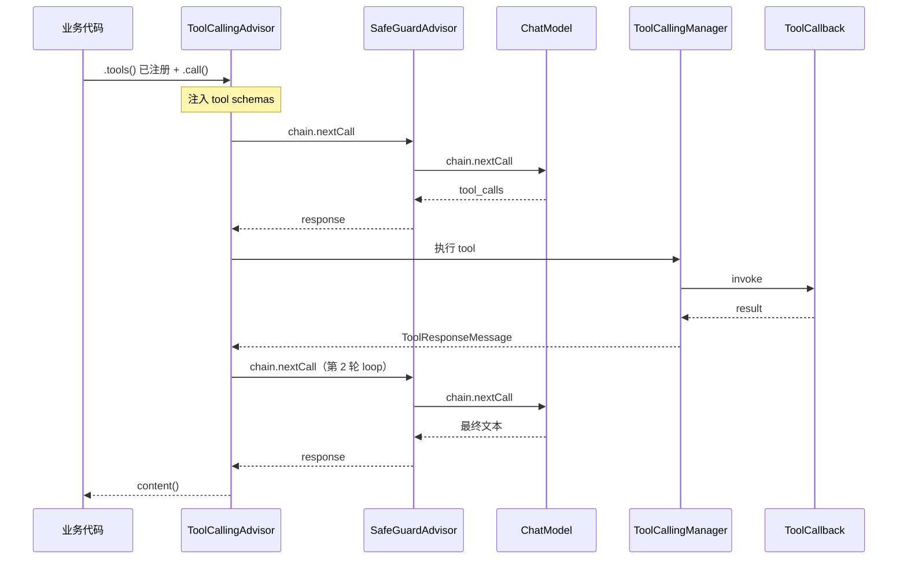

---
aliases:
  - Spring AI Advisor
  - Spring AI Tools
  - ToolCallingAdvisor
tags:
  - AI
  - Java
  - Spring
  - Advisor
  - ToolCalling
  - Agent
---

# Spring AI Advisor 与 Tools

> **6.6 工程与生态 · 本文定位**：**Tools + Advisor 链 + ToolCalling** 的概念与配合；不含 RAG Advisor 深度（见 [[AI/00-AI学习体系/02-概念库/06-工程生态/08-Spring-AI-RAG处理与基础设施|08]]）和三大 Advisor 源码（见 [[AI/00-AI学习体系/02-概念库/06-工程生态/07-Spring-AI-三大Advisor实现与协作流程|07]]）。
>
> 前置：[[AI/00-AI学习体系/02-概念库/06-工程生态/04-Spring-AI入门与API|Spring-AI入门与API]] · [[AI/00-AI学习体系/02-概念库/06-工程生态/05-Spring-AI提示词角色与对话拼接|Spring-AI提示词角色与对话拼接]]
>
> 更新时间：2026-07-21 · 基于 Spring AI 2.0（Advisor 链 + ToolCallingAdvisor）

↑ [[AI/00-AI学习体系/02-概念库/06-工程生态/00-工程生态导航|工程生态导航]] · [[AI/00-AI学习体系/00-核心索引|核心索引]]

官方：[Advisors API](https://docs.spring.io/spring-ai/reference/2.0/api/advisors.html) · [Tool Calling](https://docs.spring.io/spring-ai/reference/2.0/api/tools.html)

---

## 摘要

| 概念 | 一句话 |
|------|--------|
| **`.tools()`** | 给模型「菜单」—— 声明有哪些工具、参数 schema |
| **`.advisors()`** | 给请求「流程编排」—— 拦截、增强、loop、安全 |
| **`ToolCallingAdvisor`** | 执行 tool loop 的递归 Advisor（ReAct 的 Action↔Observation 在 Spring AI 中的实现） |
| **Advisor 链** | 栈模型：order 小的先处理 request、后处理 response |

> **Tools 定义能力，Advisor 编排流程；两者配合才是完整 tool calling。**

---

## 一、Advisor 是什么

**Advisor = ChatClient 请求/响应链上的拦截器**（类似 Servlet Filter / Spring AOP）。

调用 `.call()` / `.stream()` 时，Spring AI 不直接把 Prompt 交给 `ChatModel`，而是先走 **Advisor Chain**：

```text
业务代码 → ChatClient.prompt().user(...).call()
              ↓
         Advisor 1 → Advisor 2 → … → ChatModel
              ↓
         响应沿链返回（顺序相反）
```

### 核心接口

| 接口 | 作用 |
|------|------|
| `Advisor` | 基接口：`getName()` + `getOrder()` |
| `CallAdvisor` | 同步：`adviseCall(request, chain)` |
| `StreamAdvisor` | 流式：`adviseStream(request, chain)` |
| `CallAdvisorChain` | `chain.nextCall(request)` 继续下游 |
| `ChatClientRequest` | Prompt + **adviseContext**（链内共享状态） |

每个 Advisor 必须显式调用 `chain.nextCall()` / `chain.nextStream()` 才会继续；不调 = **短路**，自己填 response。

### 常见内置 Advisor

| Advisor | 职责 |
|---------|------|
| `MessageChatMemoryAdvisor` | 读写对话记忆 |
| `QuestionAnswerAdvisor` | Naive RAG（详见 [[AI/00-AI学习体系/02-概念库/06-工程生态/08-Spring-AI-RAG处理与基础设施|08]]） |
| `RetrievalAugmentationAdvisor` | Modular RAG（详见 [[AI/00-AI学习体系/02-概念库/06-工程生态/08-Spring-AI-RAG处理与基础设施|08]]） |
| `ToolCallingAdvisor` | **tool calling loop** |
| `SafeGuardAdvisor` | 内容安全 / 敏感词 |
| `SimpleLoggerAdvisor` | 请求响应日志 |

---

## 二、链式执行：栈模型

Advisor 链不是简单 `for` 循环，而是 **洋葱 / 栈模型**：

```text
        request ↓                    response ↑

  ┌─ Advisor A (order 小，外层) ─────────────────┐
  │    ┌─ Advisor B (order 中) ─────────────┐     │
  │    │    ┌─ Advisor C → ChatModel ─┐   │     │
  │    │    └─────────────────────────┘   │     │
  │    └──────────────────────────────────┘     │
  └─────────────────────────────────────────────┘

执行顺序：
  request:  A → B → C → LLM
  response: A ← B ← C ← LLM
```

### Order 语义

| order 值 | request 阶段 | response 阶段 |
|----------|--------------|---------------|
| **越小** | 越先执行（越靠外层） | 越后执行 |
| **越大** | 越后执行（越靠近 LLM） | 越先执行 |

Spring AI 2.0 常见参考值：

| Advisor | 典型 order |
|---------|------------|
| `MessageChatMemoryAdvisor` | `HIGHEST_PRECEDENCE + 200` |
| `ToolCallingAdvisor` | `HIGHEST_PRECEDENCE + 300` |
| 自定义（loop 内） | `> 300` |
| `SafeGuardAdvisor`（贴近 LLM） | 较大正值，如 `100` |

**口诀**：order 小 → request 先走 → response 后走（栈底变栈顶）。

---

## 三、Tools 是什么

**Tools = 模型可调用的外部能力**，在 Spring AI 里统一抽象为 `ToolCallback`。

### 定义方式

| 方式 | 底层 | 适用 |
|------|------|------|
| `@Tool` 方法 | `MethodToolCallback` | 多参数业务方法（推荐） |
| `Function` + `FunctionToolCallback` | 函数式 | 简单 POJO 入参 |
| 自定义 `ToolCallback` | 如 `SkillsTool` | 复杂封装 |

```java
@Component
class DateTimeTools {
  @Tool(description = "获取当前时间")
  String now() { return LocalDateTime.now().toString(); }
}

ToolCallback weather = FunctionToolCallback
    .builder("currentWeather", new WeatherService())
    .description("查询天气")
    .inputType(WeatherRequest.class)
    .build();
```

### 注册到 ChatClient

```java
// 构建时：所有请求生效
ChatClient.builder(chatModel)
    .defaultTools(new DateTimeTools())
    .build();

// 单次请求：覆盖 default
chatClient.prompt()
    .tools(weatherTool)
    .user("北京天气")
    .call();
```

**`.tools()` 只做两件事**：

1. 生成 tool definition（name / description / JSON schema）
2. 随 Prompt 发给 LLM

**本身不执行 tool，也不驱动 loop。**

### Function Calling vs Tools（术语）

| 层级 | Function | Tool |
|------|----------|------|
| LLM 厂商 API | 旧称 Function Calling | 新统称 Tools API |
| Spring AI 2.0 | 一种定义方式（`FunctionToolCallback`） | 统一抽象（`ToolCallback` / `@Tool` / `.tools()`） |

> Spring AI **没有**名为 `ReAct` 的 API；ReAct 的 Action↔Observation loop 由 **`ToolCallingAdvisor`** 实现。

---

## 四、`.tools()` vs `.advisors()` 的区别

| | `.tools()` / `defaultTools()` | `.advisors()` / `defaultAdvisors()` |
|--|-------------------------------|-------------------------------------|
| **是什么** | 注册工具能力（模型能调什么） | 注册拦截器（请求/响应怎么处理） |
| **类比** | 给模型的「工具菜单」 | 给请求的「middleware 链」 |
| **不负责** | 不执行 tool loop | 不定义 tool schema |

### default vs 运行时

| 构建时 | 单次请求（**覆盖** default，非追加） |
|--------|--------------------------------------|
| `defaultTools(...)` | `.tools(...)` |
| `defaultAdvisors(...)` | `.advisors(...)` |

### 缺一环会怎样

| 配置 | 结果 |
|------|------|
| 只有 `.tools()`，无 `ToolCallingAdvisor` | 模型可能返回 `tool_calls`，**无人执行** |
| 只有 `ToolCallingAdvisor`，无 `.tools()` | loop 能跑，**没有可调 tool** |
| 两者都有 | 完整 tool calling |

---

## 五、ToolCallingAdvisor 详解

**`ToolCallingAdvisor` = Spring AI 2.0 的 tool calling 引擎**，是 **递归 Advisor**（可在链内 re-enter，形成 loop）。

### 职责

1. 把 `.tools()` 的 schema 注入 Prompt
2. 调 LLM（`chain.nextCall`）
3. 检测 response 中的 `tool_calls`
4. 委托 `ToolCallingManager` 执行 `ToolCallback`
5. 把结果作为 `ToolResponseMessage` 塞回 history
6. 重复 2–5，直到无 `tool_calls`

### 与 ReAct 的对应

```text
ReAct:  Thought → Action → Observation → Thought → …
Spring AI:  LLM → tool_calls → 执行 Tool → 结果回传 → LLM → …
```

### 关键配置

```java
ToolCallingAdvisor.builder()
    .toolCallingManager(toolCallingManager)
    .conversationHistoryEnabled(true)   // loop 内是否维护 tool 中间消息
    .build();
```

- `conversationHistoryEnabled=true`：Advisor 内部维护 loop 内 history
- 若 Memory Advisor 放在 loop **内**（order > 300），应关闭内部 history，避免重复

### 关闭 / 手动控制

```java
chatClient.prompt()
    .advisors(AdvisorParams.toolCallingAdvisorAutoRegister(false))
    .user("...")
    .call();
// 需自行读 tool_calls，用 ToolCallingManager 执行
```

---

## 六、Tools 与 Advisor 如何配合

### 完整协作流程



### 推荐写法

```java
@Bean
ChatClient chatClient(ChatModel model, ToolCallingManager manager, MyTools tools) {
    return ChatClient.builder(model)
        .defaultTools(tools)                              // ① 工具定义
        .defaultAdvisors(
            ToolCallingAdvisor.builder()
                .toolCallingManager(manager)
                .build(),                                 // ② 执行 loop
            SafeGuardAdvisor.builder().build()            // ③ 可选：安全
        )
        .build();
}

// 业务层只管 prompt
chatClient.prompt().user("搜一下 Spring Boot").call().content();
```

---

## 七、三大 Advisor 分工（速览）

| Advisor | 职责 | 改 Prompt | 改 Response | 会 loop |
|---------|------|-----------|-------------|---------|
| **MessageChatMemoryAdvisor** | 读写对话记忆 | ✅ | ✅ 保存本轮 | ❌ |
| **ToolCallingAdvisor** | tool calling loop | ✅ tool schema | ✅ 聚合结果 | ✅ |
| **SafeGuardAdvisor** | 内容安全 | ✅ 扫 user 输入 | ❌ 透传 output | ❌ |

Memory 与 ToolCalling 的 **order 陷阱**、三者同开时序、**定制与扩展** → 详见 [[AI/00-AI学习体系/02-概念库/06-工程生态/07-Spring-AI-三大Advisor实现与协作流程|07 · 三大Advisor实现与协作流程]]。

---

## 八、与固定 RAG Pipeline 的边界

**固定 RAG**（如：rewrite → 检索 → 生成）≠ **Agent loop**：

| 类型 | 有没有 |
|------|--------|
| SSE token 流 loop | ✅ 逐 chunk 推送 |
| 多轮 history 注入 | ✅ 手动或 Memory Advisor |
| Query rewrite 额外 LLM | ✅ 可选 1 次 |
| 检索 query fallback | ✅ 改写 query / 原 query |
| RAG Agent loop（检索↔生成反复） | ❌ 业务未设计 |
| ToolCallingAdvisor loop | ⚠️ 基础设施层可能被动触发 |

即：业务是单向 pipeline，但若 `ChatClient` 挂了 `defaultTools` + `ToolCallingAdvisor`，底层仍可能因 SkillsTool 等触发 tool loop。

**结构化 JSON 场景**应使用 **无 tools + 无 ToolCallingAdvisor** 的 Plain ChatClient。

RAG 检索编排（`QuestionAnswerAdvisor`、Modular RAG、手写 Service）→ [[AI/00-AI学习体系/02-概念库/06-工程生态/08-Spring-AI-RAG处理与基础设施|08 · RAG处理与基础设施]]；项目全链路 → [[AI/00-AI学习体系/02-概念库/06-工程生态/09-RAG实战-interview-guide全链路|09 · RAG实战]]。

---

## 九、Spring AI Advisor 全景（按模块）

### `spring-ai-client-chat`（核心）

| Advisor | 职责 |
|---------|------|
| MessageChatMemoryAdvisor | 记忆读写 |
| ToolCallingAdvisor | tool loop（递归） |
| SafeGuardAdvisor | 输入敏感词短路 |
| SimpleLoggerAdvisor | 请求/响应日志 |
| StructuredOutputValidationAdvisor | JSON schema 校验 + retry loop |
| ChatModelCallAdvisor / ChatModelStreamAdvisor | 框架内置，调 ChatModel |
| ~~ToolCallAdvisor~~ | 2.0 废弃，等同 ToolCallingAdvisor |

### 可选模块

| Advisor | 依赖 | 职责 |
|---------|------|------|
| QuestionAnswerAdvisor | `spring-ai-vector-store-advisor` | Naive RAG |
| VectorStoreChatMemoryAdvisor | 同上 | 向量检索记忆 → system text |
| RetrievalAugmentationAdvisor | `spring-ai-rag` | Modular RAG |
| ToolSearchToolCallingAdvisor | `spring-ai-tool-search-advisor` | 按需暴露 tool（继承 ToolCalling） |

### 社区 / 示例

| 名称 | 说明 |
|------|------|
| AutoMemoryToolsAdvisor | `spring-ai-agent-utils`，tool 驱动记忆 |
| ReReadingAdvisor（RE2） | 官方文档示例，需自实现 |

---

## 十、工程实践清单（interview-guide 项目）

| ChatClient | Tools | Advisors | 用途 |
|------------|-------|----------|------|
| `getDefaultChatClient()` | SkillsTool | ToolCalling + SafeGuard | RAG、通用 |
| `getVoiceChatClient()` | SkillsTool | ToolCalling(history=true) + SafeGuard | 语音 + tool |
| `getPlainChatClient()` | 无 | 仅 SafeGuard | 结构化 JSON |

配置参考：

```yaml
app.ai.advisors:
  tool-call-enabled: true
  tool-call-conversation-history-enabled: false
  message-chat-memory-enabled: false   # 手动管 history，避免串会话
  safeguard-enabled: true
```

---

## 十一、读完应该能回答

- Advisor 链为什么是「栈模型」？order 小的大还是靠前？
- `.tools()` 和 `ToolCallingAdvisor` 各自负责什么？缺一个会怎样？
- Spring AI 还有哪些内置 Advisor？RAG 类 Advisor 去哪篇查？
- 固定 RAG pipeline 与 ToolCalling loop 如何区分？

定制与扩展 → [[AI/00-AI学习体系/02-概念库/06-工程生态/07-Spring-AI-三大Advisor实现与协作流程#十三、三大 Advisor 的定制与扩展|07 · 定制与扩展]]。RAG Advisor → [[AI/00-AI学习体系/02-概念库/06-工程生态/08-Spring-AI-RAG处理与基础设施|08 · RAG基础设施]]。

---

## 与之相关

- [[AI/00-AI学习体系/02-概念库/06-工程生态/04-Spring-AI入门与API|Spring-AI入门与API]] — ChatClient、RAG、@Tool 入门
- [[AI/00-AI学习体系/02-概念库/06-工程生态/05-Spring-AI提示词角色与对话拼接|Spring-AI提示词角色与对话拼接]] — Message 角色、Memory Advisor、RAG Advisor 顺序
- [[AI/00-AI学习体系/02-概念库/06-工程生态/07-Spring-AI-三大Advisor实现与协作流程|Spring-AI-三大Advisor实现与协作流程]] — 源码原理、协作时序、**定制与扩展**
- [[AI/00-AI学习体系/02-概念库/06-工程生态/08-Spring-AI-RAG处理与基础设施|Spring-AI-RAG处理与基础设施]] — EmbeddingModel、VectorStore、Advisor 编排
- [[AI/00-AI学习体系/02-概念库/06-工程生态/09-RAG实战-interview-guide全链路|RAG实战-interview-guide全链路]] — 项目全链路
- [[AI/00-AI学习体系/02-概念库/06-工程生态/10-Spring-AI与MCP|Spring-AI与MCP]] — @McpTool vs @Tool、MCP Client↔ChatClient
- [[AI/00-AI学习体系/02-概念库/03-Agent系统/03-Tool Use与Function Calling|Tool Use与Function Calling]]
- [[AI/00-AI学习体系/02-概念库/03-Agent系统/01-Agent基础|Agent基础]] — ReAct、Plan-and-Execute
- [[AI/00-AI学习体系/02-概念库/06-工程生态/02-Context Engineering|Context Engineering]]

## 延伸阅读

- [Spring AI Advisors API](https://docs.spring.io/spring-ai/reference/2.0/api/advisors.html)
- [Spring AI Tool Calling](https://docs.spring.io/spring-ai/reference/2.0/api/tools.html)
- [Tool Calling in Spring AI 2.0（Spring 博客）](https://spring.io/blog/2026/06/15/spring-ai-composable-tool-calling)
