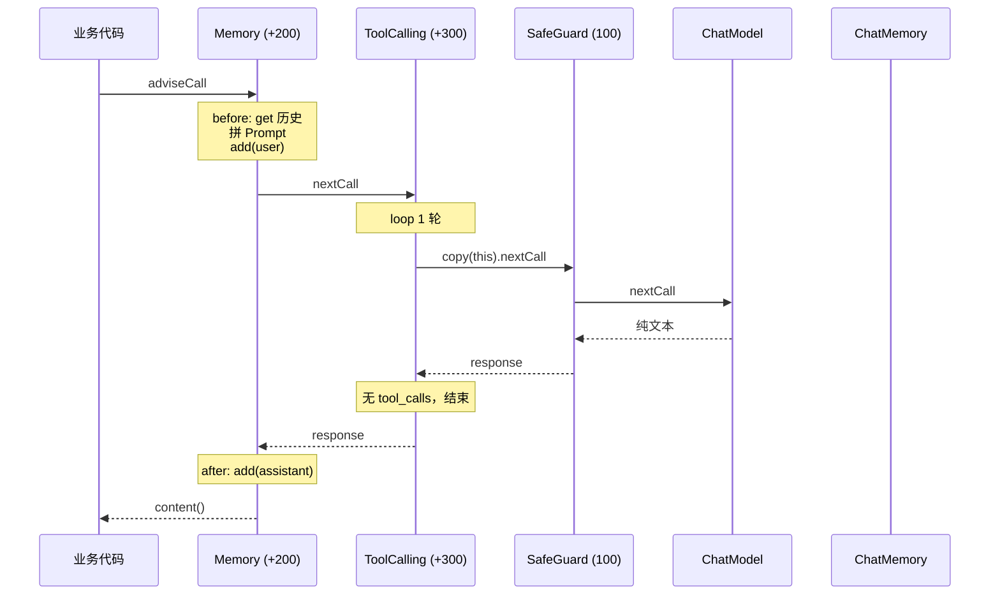
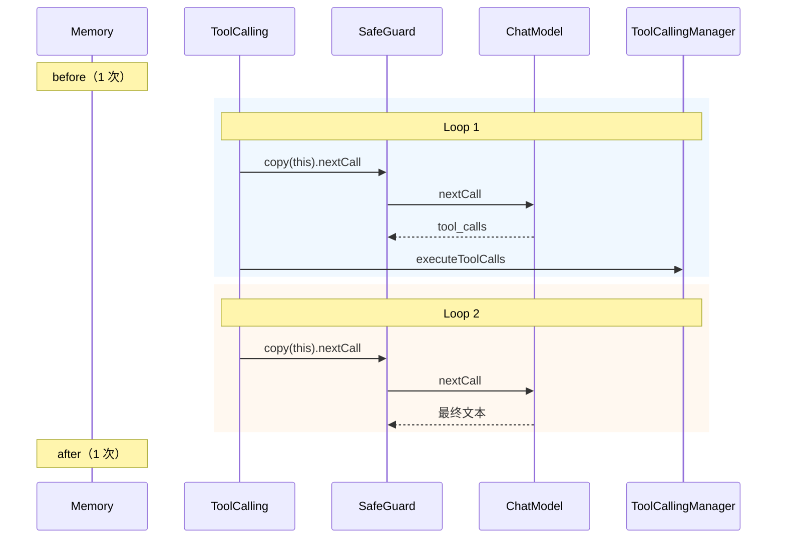

---
aliases:
  - MessageChatMemoryAdvisor
  - ToolCallingAdvisor实现
  - SafeGuardAdvisor
  - 三大Advisor协作
  - Advisor定制扩展
tags:
  - AI
  - Java
  - Spring
  - Advisor
  - ToolCalling
  - ChatMemory
---

# Spring AI 三大 Advisor 实现与协作流程

> **6.7 工程与生态 · 本文定位**：**Memory / ToolCalling / SafeGuard** 的源码、协作时序与定制；Tools 概念见 [[AI/00-AI学习体系/02-概念库/06-工程生态/06-Spring-AI-Advisor与Tools|06]]，RAG 见 [[AI/00-AI学习体系/02-概念库/06-工程生态/08-Spring-AI-RAG处理与基础设施|08]]。
>
> 前置：[[AI/00-AI学习体系/02-概念库/06-工程生态/06-Spring-AI-Advisor与Tools|Spring-AI-Advisor与Tools]] · [[AI/00-AI学习体系/02-概念库/06-工程生态/05-Spring-AI提示词角色与对话拼接|Spring-AI提示词角色与对话拼接]]
>
> 更新时间：2026-07-21 · 基于 Spring AI 2.0.0 源码（`spring-ai-client-chat`）

↑ [[AI/00-AI学习体系/02-概念库/06-工程生态/00-工程生态导航|工程生态导航]] · [[AI/00-AI学习体系/00-核心索引|核心索引]]

---

## 摘要

| Advisor | 实现模式 | 核心职责 |
|---------|----------|----------|
| **MessageChatMemoryAdvisor** | `BaseAdvisor` before/after | 读写 `ChatMemory`，注入历史 Message |
| **ToolCallingAdvisor** | 递归 `do-while` loop | 检测 tool_calls → 执行 → 再调 LLM |
| **SafeGuardAdvisor** | 门卫短路 | **仅 request 侧**扫 prompt，命中则不调 LLM |

三者同开时（默认 order）：

```text
request:  Memory (+200) → ToolCalling (+300) → SafeGuard (100) → LLM
response: Memory ← ToolCalling ← SafeGuard ← LLM
```

> **Memory 在 tool loop 外（整次请求 bookend）；SafeGuard 在 loop 内（每轮迭代都扫 prompt）。**

---

## 一、共同基础

三者均实现 `CallAdvisor` + `StreamAdvisor`，挂在 `ChatClient` 链上。

| Advisor | 基类/模式 |
|---------|-----------|
| `MessageChatMemoryAdvisor` | `BaseAdvisor`（before / after 模板） |
| `ToolCallingAdvisor` | 直接实现 + **递归 loop** |
| `SafeGuardAdvisor` | 直接实现（无 after） |

`BaseAdvisor` 默认模板：

```java
before(request) → chain.nextCall/nextStream → after(response)
```

---

## 二、MessageChatMemoryAdvisor 实现原理

### `before()` — 请求前

```java
// 1. 从 adviseContext 取 conversationId
String conversationId = getConversationId(context);

// 2. 从 ChatMemory 读历史
List<Message> memoryMessages = chatMemory.get(conversationId);

// 3. 拼进 Prompt（防重复注入）
if (!isMemoryAlreadyInPrompt(promptMessages, memoryMessages)) {
    processedMessages = memoryMessages + promptMessages;
}
// SystemMessage 强制排到第一位

// 4. 本轮 user 消息先写入 memory（不等 LLM 返回）
chatMemory.add(conversationId, userMessage);

return mutatedRequest;
```

### `after()` — 响应后

```java
// 从 ChatResponse 取 AssistantMessage，写入 memory
chatMemory.add(conversationId, assistantMessages);
return response;  // 不改内容
```

### 流式

`before` → `nextStream` → `ChatClientMessageAggregator` 聚齐完整 response → `after`。

### 默认 order

`HIGHEST_PRECEDENCE + 200`（`DEFAULT_CHAT_MEMORY_PRECEDENCE_ORDER`），比 ToolCalling (+300) **小** → 在 **tool loop 外**。

### 运行时传 conversationId

```java
chatClient.prompt()
    .advisors(a -> a.param(ChatMemory.CONVERSATION_ID, sessionId))
    .user("...")
    .call();
```

---

## 三、ToolCallingAdvisor 实现原理

Spring AI 2.0 最复杂的 Advisor：**递归 tool loop**。

### 前置条件

```java
if (!(options instanceof ToolCallingChatOptions)) {
    return chain.nextCall(request);  // 无 tool 配置则透传
}
```

### 同步 `adviseCall` — `do-while` loop

```java
do {
    processedRequest = doBeforeCall(...);

    // 关键：copy(this) 排除自身，避免无限递归
    response = callAdvisorChain.copy(this).nextCall(processedRequest);

    response = doAfterCall(...);

    if (hasToolCalls(response)) {
        result = toolCallingManager.executeToolCalls(prompt, response);
        if (result.returnDirect()) break;
        instructions = doGetNextInstructionsForToolCall(...);
    }
} while (hasToolCalls);

return doFinalizeLoop(response);
```

**`chain.copy(this)`**：loop 内重走下游链（SafeGuard → ChatModel），**跳过 ToolCalling 自身**。

### `conversationHistoryEnabled`

```java
if (!conversationHistoryEnabled) {
    // 下一轮只带 system + 最后一条 tool 消息（精简 context）
    return List.of(systemMessage, history.get(last));
}
return toolExecutionResult.conversationHistory();  // 完整 history
```

### 流式

聚齐 stream chunk → 检测 tool_calls → `boundedElastic` 执行 tool → **递归** `internalStream` → filter 中间 tool response，只透传最终文本。

### 扩展 Hook

| Hook | 时机 |
|------|------|
| `doInitializeLoop` | loop 开始前 |
| `doBeforeCall` / `doAfterCall` | 每轮 LLM 前后 |
| `doGetNextInstructionsForToolCall` | 下一轮 messages |
| `doFinalizeLoop` | loop 结束 |

### 默认 order

`HIGHEST_PRECEDENCE + 300`。

---

## 四、SafeGuardAdvisor 实现原理

### 源码逻辑（2.0.0）

```java
public ChatClientResponse adviseCall(request, chain) {
    if (prompt.getContents().contains(任一 sensitiveWord)) {
        return createFailureResponse(request);  // 不调 chain.nextCall
    }
    return chain.nextCall(request);           // response 原样透传
}
```

### 三个重要细节

1. **只检查 request**：扫 `prompt.getContents()` 全文（含 system / user / 历史拼接文本）
2. **可短路**：命中 → 构造 `AssistantMessage(failureResponse)`，**LLM 不被调用**
3. **不检查 model 输出**：无 `after` 逻辑，response 不做过滤

> 文档易误解为「双向内容安全」；**当前实现是 request 侧关键词拦截**，主要防 prompt injection。输出侧过滤需自写 Advisor 或接 Moderation API。

### 流式

命中 → `Flux.just(failureResponse)`；未命中 → `nextStream` 透传。

### order

默认 `0`；interview-guide 项目显式设为 `100` → 比 ToolCalling (+300) **大** → **更靠近 LLM**。

---

## 五、三者同开：链顺序

按 `getOrder()` **从小到大**（与 `advisors.add` 注册顺序无关）：

| Advisor | order | 链位置 |
|---------|-------|--------|
| MessageChatMemoryAdvisor | `MIN + 200` | 最外层 |
| ToolCallingAdvisor | `MIN + 300` | 中间 |
| SafeGuardAdvisor | `100` | 最内层（贴 LLM） |

```text
request ↓                              response ↑

┌─ Memory (+200) ─────────────────────────────────────┐
│  ┌─ ToolCalling (+300) ──────────────────────────┐  │
│  │  ┌─ SafeGuard (100) → ChatModel ─┐           │  │
│  │  └───────────────────────────────┘           │  │
│  └──────────────────────────────────────────────┘  │
└────────────────────────────────────────────────────┘
```

### 各组件在 loop 内跑几次

| 组件 | tool loop 内 | 说明 |
|------|-------------|------|
| Memory `before` | **1 次** | 开头注入历史、存 user |
| Memory `after` | **1 次** | 结尾存**最终** assistant |
| ToolCalling | **N 轮** | 每轮 `copy(this).nextCall` |
| SafeGuard | **每轮 1 次** | 扫当前完整 prompt |
| LLM | **每轮 1 次** | 可能多次调用 |

---

## 六、场景 A：普通问答（无 tool call）

用户："解释 G1 Mixed GC"



| 步骤 | 动作 |
|------|------|
| 1 | Memory 读历史、拼 Prompt、存 user |
| 2 | ToolCalling 进入 loop（1 轮） |
| 3 | SafeGuard 扫 prompt → 通过 → 调 LLM |
| 4 | ToolCalling 无 tool_calls，结束 |
| 5 | Memory 存 assistant |

---

## 七、场景 B：模型调 tool（2 轮 loop）

用户："加载 ai-agent-dev 技能"



- Memory **不**参与 loop 中间过程，只 bookend
- SafeGuard **每轮**扫 prompt（含 tool 结果拼入后的全文）
- 中间 tool 消息默认 **不进 ChatMemory**（除非 Memory order > 300 放在 loop 内）

---

## 八、场景 C：SafeGuard 短路

用户输入含 `"ignore previous instructions"`：

```text
Memory.before   → 拼历史 + 存 user
ToolCalling loop 1:
  SafeGuard     → prompt 命中敏感词
  → 返回 failureResponse，❌ 不调 LLM
ToolCalling     → 无 tool_calls，结束
Memory.after    → 把 failureResponse 写入 Store
```

---

## 九、栈模型时序（1 轮、无 tool）

```text
【request，从上到下】
  ① Memory.before
  ② ToolCalling（准备 loop）
  ③ SafeGuard（检查 prompt）
  ④ ChatModel

【response，从下到上】
  ④ LLM 返回
  ③ SafeGuard（透传，不处理 output）
  ② ToolCalling（确认无 tool，结束 loop）
  ① Memory.after
```

---

## 十、流式 `.stream()` 差异

| Advisor | 流式行为 |
|---------|----------|
| Memory | before → stream → aggregator 聚齐 → after |
| ToolCalling | 聚齐 chunk → tool? → 递归 stream → filter 中间响应 |
| SafeGuard | 命中 → `Flux.just(failure)` |

---

## 十一、实现模式对比

| | Memory | ToolCalling | SafeGuard |
|--|--------|-------------|-----------|
| 设计模式 | BaseAdvisor 模板 | 递归 loop + hook | 门卫短路 |
| 改 request | ✅ 注入历史 | ✅ 更新 instructions | ❌（仅检查） |
| 改 response | ❌ | ✅ returnDirect | ❌ |
| 依赖 | `ChatMemory` | `ToolCallingManager` | 敏感词列表 |
| 可短路 | ❌ | ✅ returnDirect | ✅ 输入命中 |
| 递归 | ❌ | ✅ | ❌ |

### 源码级伪代码

```java
// MessageChatMemoryAdvisor
before:  memory.get → 拼 messages → memory.add(user)
after:   memory.add(assistant)

// ToolCallingAdvisor
do {
  resp = chain.copy(this).nextCall(instructions);
  if (hasToolCalls) {
    result = toolCallingManager.execute(...);
    instructions = nextInstructions(result);
  }
} while (hasToolCalls);

// SafeGuardAdvisor
if (promptContainsSensitiveWord) return fakeFailure;
else return chain.nextCall(request);
```

---

## 十二、工程实践（interview-guide）

三者全开时的推荐配置：

```yaml
app.ai.advisors:
  message-chat-memory-enabled: true   # 需配合 CONVERSATION_ID
  tool-call-enabled: true
  tool-call-conversation-history-enabled: false
  safeguard-enabled: true
```

```java
MessageChatMemoryAdvisor.builder(chatMemory).build()     // order +200
ToolCallingAdvisor.builder()
    .conversationHistoryEnabled(false).build()            // order +300
SafeGuardAdvisor.builder().order(100).build()             // 贴 LLM
```

| ChatClient | Memory | ToolCalling | SafeGuard |
|------------|--------|-------------|-----------|
| default（全开） | 可选 | 开, history=false | 开, order=100 |
| voice | 关（手动 history） | 开, history=true | 开 |
| plain | 关 | **无** | 开 |

### 注意事项

1. Memory 需运行时传 `ChatMemory.CONVERSATION_ID`，否则 `before` 抛异常
2. SafeGuard 扫 **整段 prompt**（含历史），历史里含敏感词也会拦截
3. 输出侧安全不能单靠 SafeGuard，需额外 Advisor 或 Moderation API
4. Memory 在 loop 外时，ChatMemory 里**没有** tool 中间消息，只有最终问答

---

## 十三、三大 Advisor 的定制与扩展

可以扩展，但**可定制程度不同**：有的靠 Builder 配置，有的能继承，有的只能包一层或写新 Advisor。

### 13.1 三种扩展方式

| 方式 | 适用 | 说明 |
|------|------|------|
| **Builder 配置** | 三个都适用 | 改参数，不改逻辑 |
| **继承 / Hook** | 主要 `ToolCallingAdvisor` | 覆写 protected 方法 |
| **自定义 Advisor** | 三个都适用 | 包一层、链上叠加、或替换底层组件 |

```text
推荐优先级：能配置 → 先配置；能 Hook → 再继承；都不行 → 写新 Advisor
```

### 13.2 MessageChatMemoryAdvisor

**类为 `final`，不能继承。**

#### Builder 可配

```java
MessageChatMemoryAdvisor.builder(
    MessageWindowChatMemory.builder()
        .maxMessages(50)
        .chatMemoryRepository(myRepo)   // Redis / JDBC / 自定义
        .build()
)
.order(HIGHEST_PRECEDENCE + 200)
.scheduler(Schedulers.boundedElastic())
.build();
```

#### 扩展路径

| 需求 | 做法 |
|------|------|
| 换存储、窗口、摘要 | 实现 `ChatMemoryRepository` / 自定义 `ChatMemory` |
| 多租户隔离 | 包一层 Advisor，改 `CONVERSATION_ID`（如 `tenantId:sessionId`） |
| 完全自定义记忆策略 | 自写 `BaseChatMemoryAdvisor`（参考源码 before/after） |
| Tool 驱动记忆 | 社区 `AutoMemoryToolsAdvisor`（`spring-ai-agent-utils`） |

```java
// 多租户示例：改 context 后再委托
public class TenantMemoryAdvisor implements BaseChatMemoryAdvisor {
  @Override
  public ChatClientRequest before(ChatClientRequest req, AdvisorChain chain) {
    String id = tenantId + ":" + getConversationId(req.context());
    return memoryAdvisor.before(
        req.mutate().context(Map.of(CONVERSATION_ID, id)).build(), chain);
  }
}
```

### 13.3 ToolCallingAdvisor

**可定制性最好**：类非 final，提供 protected hook。

#### Builder 可配

```java
ToolCallingAdvisor.builder()
    .toolCallingManager(customManager)
    .toolExecutionEligibilityChecker(r -> r != null && r.hasToolCalls())
    .conversationHistoryEnabled(false)
    .advisorOrder(HIGHEST_PRECEDENCE + 300)
    .build();
```

#### 可覆写 Hook

| Hook | 时机 |
|------|------|
| `doInitializeLoop` | loop 开始前 |
| `doBeforeCall` / `doAfterCall` | 每轮 LLM 前后 |
| `doGetNextInstructionsForToolCall` | 下一轮 messages |
| `doFinalizeLoop` | loop 结束 |
| `doBeforeStream` / `doAfterStream` / … | 流式对应 |

#### 继承示例：tool 审计

```java
public class AuditingToolCallingAdvisor extends ToolCallingAdvisor {
  @Override
  protected ChatClientResponse doAfterCall(ChatClientResponse resp, CallAdvisorChain chain) {
    if (resp.chatResponse() != null && resp.chatResponse().hasToolCalls()) {
      auditLog.info("tool_calls={}", resp.chatResponse().getToolCalls());
    }
    return resp;
  }
}
```

#### 官方子类：`ToolSearchToolCallingAdvisor`

继承 `ToolCallingAdvisor`，`doInitializeLoop` 建 tool 索引，`doBeforeCall` 只注入搜索到的 tools——tool 多时用（`spring-ai-tool-search-advisor`）。

#### 替换默认 Advisor

```java
@Bean
ToolCallingAdvisor.Builder<?> toolCallingAdvisorBuilder(ToolCallingManager manager) {
    return MyCustomToolCallingAdvisor.builder().toolCallingManager(manager);
}
```

也可自定义 `ToolCallingManager` 扩展 tool 执行逻辑，而不改 Advisor。

### 13.4 SafeGuardAdvisor

**Builder 可配**：`sensitiveWords`、`failureResponse`、`order`。

**无 hook**；且 **仅检查 request**（`prompt.getContents()`），**不检查 model 输出**。

#### 扩展路径

| 需求 | 做法 |
|------|------|
| 更多输入规则 | 继承并覆写 `adviseCall`，或自写 `BaseAdvisor` |
| **输出侧**过滤 | 新增 `OutputSafeGuardAdvisor`（在 `after` 里扫 assistant 文本） |
| Moderation API | 自写 Advisor，before/after 调 OpenAI Moderation 等 |
| 链上叠加 | 保留 SafeGuard + 再加 `OutputModerationAdvisor` |

```java
// 输出侧示例
public class OutputSafeGuardAdvisor implements BaseAdvisor {
  @Override
  public ChatClientResponse after(ChatClientResponse resp, AdvisorChain chain) {
    String text = resp.chatResponse().getResult().getOutput().getText();
    if (containsSensitive(text)) { /* 替换为 failureResponse */ }
    return resp;
  }
}
```

### 13.5 链上组合（通用模式）

不必改内置类，**新增 Advisor** 往往更清晰：

```java
ChatClient.builder(chatModel)
    .defaultTools(skillsTool)
    .defaultAdvisors(
        tenantMemoryAdvisor,           // 自定义
        MessageChatMemoryAdvisor.builder(chatMemory).build(),
        ragAdvisor,                    // 自定义 RAG
        ToolCallingAdvisor.builder()...build(),
        SafeGuardAdvisor.builder().order(100).build(),
        outputModerationAdvisor,       // 输出审核
        metricsAdvisor
    )
    .build();
```

### 13.6 定制能力对照表

| 需求 | Memory | ToolCalling | SafeGuard |
|------|--------|-------------|-----------|
| 改存储/窗口 | ✅ 换 `ChatMemory` | — | — |
| 改 tool loop | — | ✅ 继承 + hook | — |
| 改 tool 执行 | — | ✅ 换 `ToolCallingManager` | — |
| 输入安全 | — | — | ✅ 词表 / 自写 |
| 输出安全 | — | — | ❌ 需新 Advisor |
| 审计/Metrics | 包一层 | ✅ hook | 包一层 |
| 多租户 | ✅ 改 conversationId | — | — |

### 13.7 interview-guide 建议

| 现状 | 扩展建议 |
|------|----------|
| Memory 关、手动 history | 要自动 memory → 自定义 `ChatMemoryRepository` + Memory Advisor |
| ToolCalling 已开 | tool 审计 → 继承 `doAfterCall`；tool 多 → `ToolSearchToolCallingAdvisor` |
| SafeGuard 仅输入 | 输出过滤 → 链上加 `OutputSafeGuardAdvisor` |
| RAG 在 Service 层 | 不必塞进 Memory/Tool；可独立 `RagAdvisor` 或继续 Service → [[AI/00-AI学习体系/02-概念库/06-工程生态/09-RAG实战-interview-guide全链路|RAG实战全链路]] · [[AI/00-AI学习体系/02-概念库/06-工程生态/08-Spring-AI-RAG处理与基础设施|RAG基础设施]] |

---

## 十四、读完应该能回答

- 三个 Advisor 各自的 before/after/loop 逻辑是什么？
- 为何 Memory 在 loop 外、SafeGuard 在 loop 内？
- `chain.copy(this)` 解决什么问题？
- SafeGuard 是否检查 model 输出？
- 三者全开时，一次带 tool 的请求 LLM 被调几次、Memory 读写几次？
- `conversationHistoryEnabled=false` 时 loop 第 2 轮 LLM 看到什么？
- 三个 Advisor 分别能否继承？扩展能力的首选路径是什么？
- 输出侧内容安全为什么 SafeGuard 不够，该怎么做？

---

## 与之相关

- [[AI/00-AI学习体系/02-概念库/06-工程生态/06-Spring-AI-Advisor与Tools|Spring-AI-Advisor与Tools]] — Tools vs Advisor、栈模型概览
- [[AI/00-AI学习体系/02-概念库/06-工程生态/05-Spring-AI提示词角色与对话拼接|Spring-AI提示词角色与对话拼接]] — Message 角色、Memory 用法
- [[AI/00-AI学习体系/02-概念库/06-工程生态/08-Spring-AI-RAG处理与基础设施|Spring-AI-RAG处理与基础设施]] — RAG 与 ChatClient Advisor 边界
- [[AI/00-AI学习体系/02-概念库/06-工程生态/09-RAG实战-interview-guide全链路|RAG实战-interview-guide全链路]] — 项目实际挂载配置
- [[AI/00-AI学习体系/02-概念库/03-Agent系统/08-Agent Memory|Agent Memory]]
- [[AI/00-AI学习体系/02-概念库/03-Agent系统/03-Tool Use与Function Calling|Tool Use与Function Calling]]

## 延伸阅读

- [Spring AI Advisors API](https://docs.spring.io/spring-ai/reference/2.0/api/advisors.html)
- [Spring AI Tool Calling](https://docs.spring.io/spring-ai/reference/2.0/api/tools.html)
- Spring AI 2.0.0 源码：`spring-ai-client-chat` 包下三个 Advisor 类
