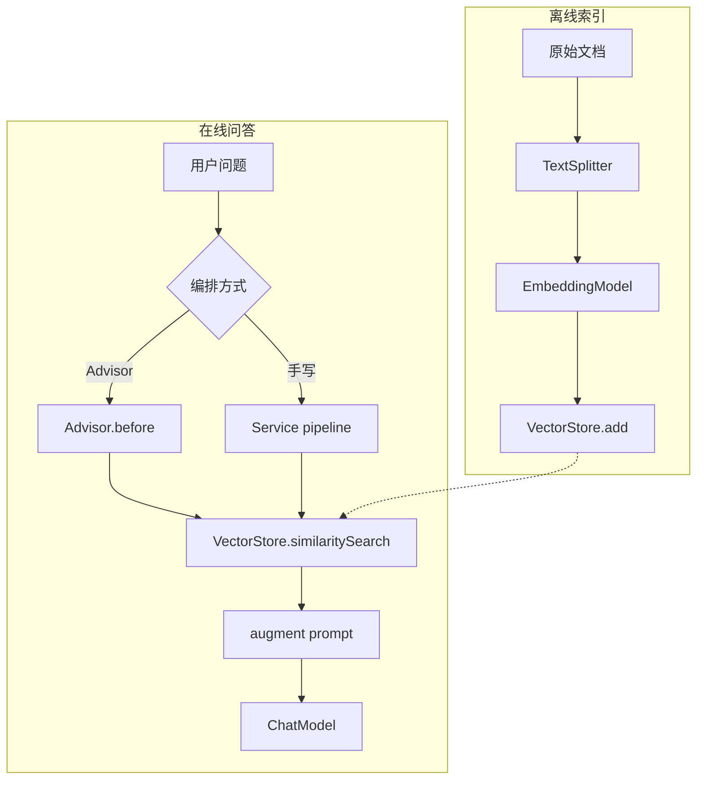

---
aliases:
  - Spring AI RAG
  - EmbeddingModel
  - VectorStore RAG
  - QuestionAnswerAdvisor
  - RetrievalAugmentationAdvisor
tags:
  - AI
  - Java
  - Spring
  - RAG
  - VectorStore
  - Embedding
---

# Spring AI RAG 处理与基础设施

> **6.8 工程与生态 · 本文定位**：Spring AI RAG 的 **权威篇**——EmbeddingModel、VectorStore、RAG Advisor 编排与选型。概念入门见 [[AI/00-AI学习体系/02-概念库/06-工程生态/04-Spring-AI入门与API#六、Embedding / VectorStore / RAG（概览）|04 §六]]；项目落地见 [[AI/00-AI学习体系/02-概念库/06-工程生态/09-RAG实战-interview-guide全链路|09]]。
>
> 前置：[[AI/00-AI学习体系/02-概念库/04-RAG进阶/01-RAG基础|RAG基础]] · [[AI/00-AI学习体系/02-概念库/06-工程生态/04-Spring-AI入门与API|Spring-AI入门与API]] · [[AI/00-AI学习体系/02-概念库/06-工程生态/06-Spring-AI-Advisor与Tools|Spring-AI-Advisor与Tools]]
>
> 项目实战：[[AI/00-AI学习体系/02-概念库/06-工程生态/09-RAG实战-interview-guide全链路|RAG实战-interview-guide全链路]]
>
> 更新时间：2026-07-21 · Spring AI 2.0

↑ [[AI/00-AI学习体系/02-概念库/06-工程生态/00-工程生态导航|工程生态导航]] · [[AI/00-AI学习体系/00-核心索引|核心索引]]

官方：[Retrieval Augmented Generation](https://docs.spring.io/spring-ai/reference/2.0/api/retrieval-augmented-generation.html)

---

## 摘要

Spring AI 的 RAG 拆成三块：

| 组件 | 一句话 |
|------|--------|
| **EmbeddingModel** | 文本 ↔ 向量（翻译官） |
| **VectorStore** | 存向量、按语义检索（图书馆） |
| **Advisor 编排** | 检索 + 拼 Prompt + 调 LLM 的流程（图书管理员，**可选**） |

> **EmbeddingModel + VectorStore 是基础设施；Advisor 是可选编排。没有 Advisor 也能 RAG，在 Service 里手写 pipeline。**

---

## 一、Spring AI RAG 总架构

Inspired by **Modular RAG** 论文，Spring AI 2.0 提供：

```text
【离线索引 Indexing】
  文档 → 解析 → 分块 → Embedding → VectorStore.add()

【在线问答 Retrieval + Generation】
  用户问题
    → Pre-Retrieval（query 变换/扩展）
    → Retrieval（向量检索）
    → Post-Retrieval（重排/压缩）
    → Generation（augment prompt → LLM）
```

三种用法：

| 方式 | 说明 |
|------|------|
| **Advisor 开箱** | `QuestionAnswerAdvisor` / `RetrievalAugmentationAdvisor` |
| **模块化 API** | `org.springframework.ai.rag` 各组件自由组合 |
| **手写 Service** | `VectorStore` + `ChatClient`（interview-guide） |

---

## 二、EmbeddingModel — 文本 → 向量

### 作用

把文本编码为 **固定维度浮点数组**；语义相近的文本，向量距离更近。

```java
@Autowired EmbeddingModel embeddingModel;

float[] vector = embeddingModel.embed("Redis RDB 是快照持久化");

EmbeddingResponse resp = embeddingModel.embedForResponse(List.of("文本1", "文本2"));
```

### 在 RAG 中的位置

| 阶段 | 用途 |
|------|------|
| **索引** | 每个 chunk embed 后写入 VectorStore |
| **检索** | 用户问题 embed 后与库内向量比相似度 |

### 要点

- **只负责向量化**，不管存储、检索、生成
- 索引与查询 **必须用同一 Embedding 模型**
- 维度、距离度量（COSINE / L2）需与 VectorStore 配置一致

### interview-guide

- `LlmProviderRegistry.getDefaultEmbeddingModel()`
- pgvector 维度 1024，COSINE

---

## 三、VectorStore — 存向量、搜相似

### 作用

向量库抽象：**add**（索引）、**similaritySearch**（检索）、**delete**（删文档）。

```java
// 索引（内部通常自动调用 EmbeddingModel）
List<Document> chunks = new TokenTextSplitter().apply(List.of(new Document(text)));
vectorStore.add(chunks);

// 检索（内部 embed query，再算相似度）
List<Document> hits = vectorStore.similaritySearch(
    SearchRequest.builder()
        .query("Redis 怎么持久化")
        .topK(5)
        .similarityThreshold(0.28)
        .filterExpression("kb_id == '1'")   // metadata 过滤
        .build());
```

### Document + metadata

```java
new Document("chunk 文本", Map.of("kb_id", "123", "source", "wiki.md"));
```

metadata 用于 **过滤**（多知识库、租户），不参与 embedding。

### 常见实现

| 实现 | Starter |
|------|---------|
| **PgVectorStore** | `spring-ai-pgvector-store` |
| Redis / Milvus | 各自 starter |
| SimpleVectorStore | 内存，demo 用 |

### 要点

- **不调 LLM**，只返回 `List<Document>`
- `similaritySearch` 的 query 会自动 embed

### interview-guide

- `KnowledgeBaseVectorService`：`TokenTextSplitter` + `vectorStore.add`
- 检索后在应用层按 `kb_id` metadata 过滤多知识库

---

## 四、Advisor 编排 — 可选的流程封装

### 作用

把 **检索 → 拼 context → 调 LLM** 挂进 `ChatClient` Advisor 链，在 `before()` 里完成检索并改 Prompt。

**不用 Advisor 也可以**，在 Service 里写同样逻辑。

### 路径 A：QuestionAnswerAdvisor（Naive RAG）

依赖：`spring-ai-vector-store-advisor`

```java
chatClient.prompt()
    .user("RDB 和 AOF 区别？")
    .advisors(QuestionAnswerAdvisor.builder(vectorStore)
        .searchRequest(SearchRequest.builder().topK(6).similarityThreshold(0.8).build())
        .build())
    .call().content();
```

**`before()` 逻辑：**

```text
1. vectorStore.similaritySearch(userQuestion)
2. Document 文本 → question_answer_context
3. PromptTemplate 渲染 {query} + {question_answer_context}
4. augmentUserMessage() — 增强 user 消息
5. context 写入 qa_retrieved_documents
```

运行时 metadata 过滤：

```java
.advisors(a -> a.param(QuestionAnswerAdvisor.FILTER_EXPRESSION, "kbId == 1"))
```

### 路径 B：RetrievalAugmentationAdvisor（Modular RAG）

依赖：`spring-ai-rag`

```java
Advisor ragAdvisor = RetrievalAugmentationAdvisor.builder()
    .queryTransformers(RewriteQueryTransformer.builder()
        .chatClientBuilder(chatClientBuilder).build())
    .documentRetriever(VectorStoreDocumentRetriever.builder()
        .vectorStore(vectorStore)
        .similarityThreshold(0.5)
        .topK(8)
        .build())
    .queryAugmenter(ContextualQueryAugmenter.builder()
        .allowEmptyContext(false)
        .build())
    .build();
```

### 路径 C：手写 Service（interview-guide）

```java
docs = vectorService.similaritySearch(...)
context = docs.stream().map(Document::getText).collect(joining("\n---\n"))
chatClient.prompt()
    .system(systemPrompt)
    .user(buildUserPrompt(context, question))
    .stream().content();
```

### Advisor vs 手写

| | Advisor | 手写 Service |
|--|---------|--------------|
| 代码量 | 少 | 多 |
| 灵活性 | 受 API 限制 | 完全自定义 |
| 与 ChatClient 链集成 | Memory / SafeGuard 自动 | 自己组合 |
| 适合 | 标准单向量库 Q&A | 多 KB、rewrite、流式归一化 |

### 与 Memory 组合

```text
request:  Memory.before → RAG Advisor.before(检索) → LLM
```

RAG 在 Memory **之后**，检索可利用完整对话上下文。

---

## 五、Modular RAG 模块（`spring-ai-rag`）

| 阶段 | 组件示例 |
|------|----------|
| **Pre-Retrieval** | `RewriteQueryTransformer`、`CompressionQueryTransformer`、`MultiQueryExpander` |
| **Retrieval** | `VectorStoreDocumentRetriever` |
| **Post-Retrieval** | `DocumentPostProcessor`（rerank、压缩）、`ConcatenationDocumentJoiner` |
| **Generation** | `ContextualQueryAugmenter` |

```text
Pre-Retrieval   → 把问题改写成更适合检索的形式
Retrieval       → 从 VectorStore 取 Document
Post-Retrieval  → 重排、去重、压缩 chunk
Generation      → 把 context 拼进 prompt，调 LLM
```

---

## 六、完整数据流



```text
EmbeddingModel + VectorStore  →  离线与在线检索都依赖
Advisor / Service             →  仅在线「编排」层不同
```

---

## 七、Spring AI RAG vs interview-guide

| 环节 | Spring AI 标准 | interview-guide |
|------|----------------|-----------------|
| 分块 | `TokenTextSplitter` | ✅ `KnowledgeBaseVectorService` |
| 存储 | `VectorStore.add` | ✅ PgVectorStore |
| 检索 | `similaritySearch` | ✅ + 多 KB metadata 过滤 |
| Query rewrite | `RewriteQueryTransformer` | ✅ 手写 `rewriteQuestion` |
| 多 query | `MultiQueryExpander` | ✅ 改写/原 query fallback |
| 动态 topK/score | 静态 `SearchRequest` | ✅ 按问题长度动态 |
| Augment | `ContextualQueryAugmenter` | ✅ `buildUserPrompt` + `.st` |
| 无命中 | `allowEmptyContext(false)` | ✅ 固定文案，不调 LLM |
| 编排 | RAG Advisor | ❌ `KnowledgeBaseQueryService` |

详见 [[AI/00-AI学习体系/02-概念库/06-工程生态/09-RAG实战-interview-guide全链路|RAG实战-interview-guide全链路]]。

---

## 八、选型建议

| 场景 | 推荐 |
|------|------|
| Demo / 单向量库 | `QuestionAnswerAdvisor` |
| 要 rewrite、空 context 策略 | `RetrievalAugmentationAdvisor` |
| 多 KB、流式、业务计数、会话逻辑 | 手写 Service |
| 要 Advisor 链 + 可观测 | RAG Advisor + Memory Advisor |

---

## 九、记忆口诀

```text
EmbeddingModel = 翻译官（文字 ↔ 向量）
VectorStore     = 图书馆（存书、按语义找书）
Advisor         = 管理员（找书、整理成一页纸给 LLM）

没有管理员 → 自己跑图书馆、自己整理 = 手写 Service
```

---

## 十、读完应该能回答

- EmbeddingModel、VectorStore、Advisor 在 RAG 里各负责什么？
- 离线索引需要 Advisor 吗？
- `QuestionAnswerAdvisor` 和 `RetrievalAugmentationAdvisor` 区别？
- 不用 Advisor 怎么做 RAG？
- interview-guide 用了 Spring AI 的哪几层、没用哪几层？

---

## 与之相关

- [[AI/00-AI学习体系/02-概念库/06-工程生态/06-Spring-AI-Advisor与Tools|Spring-AI-Advisor与Tools]] — Advisor 链、栈模型（非 RAG 专题）
- [[AI/00-AI学习体系/02-概念库/06-工程生态/09-RAG实战-interview-guide全链路|RAG实战-interview-guide全链路]] — 项目全链路
- [[AI/00-AI学习体系/02-概念库/04-RAG进阶/01-RAG基础|RAG基础]]
- [[AI/00-AI学习体系/02-概念库/04-RAG进阶/03-Embedding模型与向量检索|Embedding模型与向量检索]]
- [[AI/00-AI学习体系/02-概念库/06-工程生态/02-Context Engineering|Context Engineering]]

## 延伸阅读

- [Spring AI RAG Reference](https://docs.spring.io/spring-ai/reference/2.0/api/retrieval-augmented-generation.html)
- [Spring AI Vector Stores](https://docs.spring.io/spring-ai/reference/2.0/api/vectordbs.html)
