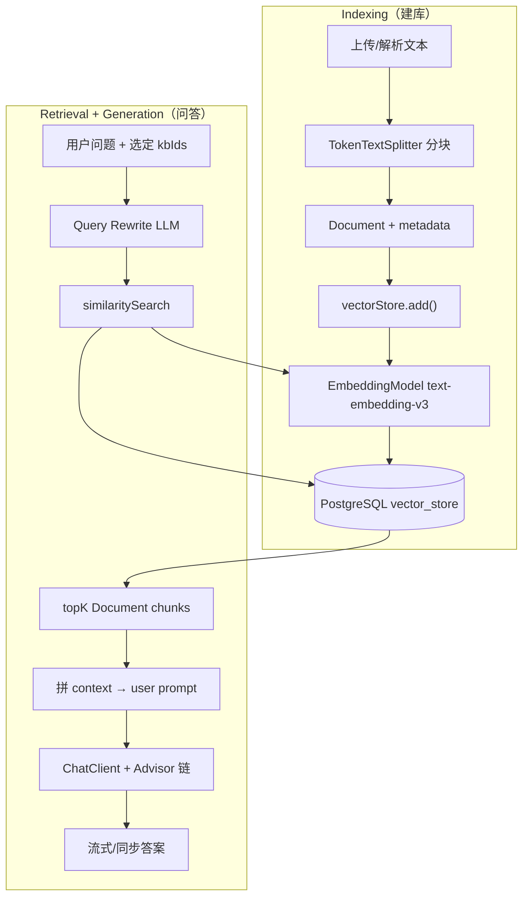
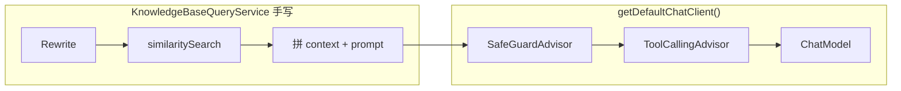

---
aliases:
  - RAG实战
  - interview-guide RAG
  - TokenTextSplitter
  - Query Rewrite
  - VectorStore实战
tags:
  - AI
  - Java
  - Spring
  - RAG
  - VectorStore
  - pgvector
  - interview-guide
---

# RAG 实战：interview-guide 全链路

> **6.9 工程与生态 · 本文定位**：**interview-guide 项目专属**——分块参数、PgVector SQL、Query Rewrite、配置速查。Spring AI RAG 通用概念见 [[AI/00-AI学习体系/02-概念库/06-工程生态/08-Spring-AI-RAG处理与基础设施|08]]。
>
> 前置：[[AI/00-AI学习体系/02-概念库/04-RAG进阶/01-RAG基础|RAG基础]] · [[AI/00-AI学习体系/02-概念库/06-工程生态/08-Spring-AI-RAG处理与基础设施|Spring-AI-RAG处理与基础设施]] · [[AI/00-AI学习体系/02-概念库/06-工程生态/04-Spring-AI入门与API|Spring-AI入门与API]] · [[AI/00-AI学习体系/02-概念库/06-工程生态/06-Spring-AI-Advisor与Tools|Spring-AI-Advisor与Tools]]
>
> 源码锚点：`KnowledgeBaseVectorService` · `KnowledgeBaseQueryService` · `RagChatSessionService` · `LlmProviderRegistry`

↑ [[AI/00-AI学习体系/02-概念库/06-工程生态/00-工程生态导航|工程生态导航]] · [[AI/00-AI学习体系/00-核心索引|核心索引]]

更新时间：2026-07-21

---

## 摘要

| 环节 | 本项目实现 | 是否用 RAG Advisor |
|------|-----------|-------------------|
| 分块 | `TokenTextSplitter` 默认配置 | ❌ |
| 向量化入库 | `VectorStore.add()` → `PgVectorStore` | ❌ |
| 检索 | 手写 `similaritySearch` + kb_id 过滤 | ❌ |
| Query Rewrite | 手写 LLM prompt（`knowledgebase-query-rewrite.st`） | ❌ |
| 多轮历史 | DB 读消息 + 手动 `.messages(history)` | ❌（不用 Memory Advisor） |
| 生成答案 | `getDefaultChatClient().prompt()...` | ⚠️ 仅 **ChatClient Advisor 链**参与 |

> **结论**：RAG 检索编排是 **Service 层手写**；`QuestionAnswerAdvisor` / `RetrievalAugmentationAdvisor` **未引入**（缺 `spring-ai-vector-store-advisor` / `spring-ai-rag` 依赖）。

---

## 一、全链路概览



**两条 API 路径（前端实际走 RAG 会话）：**

| 路径 | kbIds 来源 |
|------|-----------|
| `POST /api/knowledgebase/query/stream` | 请求体 `QueryRequest.knowledgeBaseIds` |
| `POST /api/rag-chat/sessions/{id}/messages/stream` | 会话关联表 `rag_session_knowledge_bases` → `session.getKnowledgeBaseIds()` |

前端 `KnowledgeBaseQueryPage`：**勾选 checkbox → `selectedKbIds` → 创建/加载会话 → 发消息**；流式接口 body 里只传 `question`，不传 kbIds。

---

## 二、分块：TokenTextSplitter

项目默认：

```java
TokenTextSplitter.builder().build();
```

| 默认参数 | 值 | 含义 |
|----------|-----|------|
| `chunkSize` | 800 | 目标 token 数（JTokkit `CL100K_BASE`） |
| `minChunkSizeChars` | 350 | 标点截断的最小字符位置 |
| `minChunkLengthToEmbed` | 5 | 短于此字符的块丢弃 |
| `maxNumChunks` | 10000 | 单文档最多块数 |
| `punctuationMarks` | `. ? ! \n` | 优先截断标点（**不含中文标点**） |
| overlap | 无 | 块之间不重叠 |

**算法要点：**

1. 全文 `encode` 成 token 列表
2. 每次取前 `min(800, 剩余)` 个 token，`decode` 回文本
3. 若还有剩余 token：找块内**最后一个**标点；位置 **> 350 字符** 则在标点处截断
4. 循环直到 token 耗尽或达 `maxNumChunks`
5. `TextSplitter.apply()` 为每块附加 metadata：`parent_document_id`、`chunk_index`、`total_chunks`

业务层还会写入：`kb_id`、`kb_target_id`、`kb_vector_job_id`（两阶段写入：pending → promote）。

### 分块注意事项（语义完整）

| 要点 | 说明 |
|------|------|
| token ≠ 字符 | 800 token 约 400~800 汉字量级；分词器 `CL100K_BASE` 与 embedding 模型不必一致 |
| 中文标点 | 默认只在 `.?!换行` 截断；中文文档建议 `.withPunctuationMarks(..., '。','！','？')` |
| 短文本 | token ≤ 800 通常只产生 **1 个 chunk** |
| 结构预处理 | PDF/Tika 纯文本易丢标题层级；`\n\n` 段落边界有助于换行处截断 |
| 改分块策略 | 必须 **全量 re-vectorize** |

---

## 三、本项目 PgVectorStore 配置

> `VectorStore` / `EmbeddingModel` 通用概念 → [[AI/00-AI学习体系/02-概念库/06-工程生态/08-Spring-AI-RAG处理与基础设施|08 §二–§三]]。

本项目实现：**`PgVectorStore`**（`spring-ai-starter-vector-store-pgvector`）。

| 方法 | 作用 |
|------|------|
| `add(List<Document>)` | 内部调 `EmbeddingModel`，写入 DB |
| `similaritySearch(SearchRequest)` | query embed → 近邻搜索 |
| `delete(...)` | 按 id 或 metadata 删（业务多用 `VectorRepository` 自定义 SQL） |

**表结构**（`public.vector_store`）：

| 列 | 类型 | 说明 |
|----|------|------|
| `id` | uuid | chunk ID |
| `content` | text | chunk 原文 |
| `metadata` | json | `kb_id`、`chunk_index` 等 |
| `embedding` | vector(1024) | DashScope text-embedding-v3 |

**配置**（`application.yml`）：HNSW 索引 + `COSINE_DISTANCE` + `dimensions: 1024`。

**与 VectorRepository 分工：**

- `VectorStore`：标准 add / search
- `VectorRepository`：按知识库删、临时 job 清理、`promoteVectorJob`（业务可靠性）

---

## 四、向量检索：具体怎么查

用户问题 **不会** 被解析成 SQL 关键词，而是 **embed 成向量做语义近邻搜索**。

### 4.1 业务层组装 SearchRequest

```java
SearchRequest.builder()
    .query(query)                    // 改写后或原问题
    .topK(8)                         // 动态：短问 20 / 中 12 / 长 8
    .similarityThreshold(0.28)       // 短问可降到 0.18
    .filterExpression("kb_id in ['3']")
    .build();
```

### 4.2 PgVectorStore 内部 SQL（余弦距离）

```sql
SELECT *, embedding <=> ? AS distance
FROM public.vector_store
WHERE embedding <=> ? < ?                    -- 1 - similarityThreshold
  AND metadata::jsonb @@ '...'::jsonpath     -- kb_id 过滤
ORDER BY distance
LIMIT ?;
```

| 绑定参数 | 示例 |
|----------|------|
| query 向量 | embed("Spring Boot 自动配置原理") → float[1024] |
| 距离阈值 | minScore=0.28 → distance < **0.72** |
| LIMIT | topK=8 |

返回 `Document.score = 1.0 - distance`。

### 4.3 检索失败回退

JSONPath 过滤异常时：`topK×3` 全库搜 → Java 侧按 `metadata.kb_id` 过滤 → `limit(topK)`。

### 4.4 kb_id 过滤语义

`kbId=3` = **只在知识库主键 id=3 的 chunk 里搜**（用户上传文件时 DB 自增 id；勾选/会话绑定决定列表）。

---

## 五、Query Rewrite（查询改写）

**检索前的「问题翻译器」**：用 LLM 把口语化、省略、有指代的问法改成 **更适合 embedding 检索** 的单句。

- 配置：`app.ai.rag.rewrite.enabled: true`
- Prompt：`prompts/knowledgebase-query-rewrite.st`
- 多轮：结合 `RagChatSessionService` 加载的历史消息理解追问

**候选 query 顺序：**

1. 改写版 → `similaritySearch`
2. 无命中 → 原版 → `similaritySearch`

**只用于检索**；拼 prompt 生成答案时仍用 **用户原始 question**。

示例：

```
用户（追问）: 那 @Conditional 起什么作用？
Rewrite 可能输出: Spring Boot 自动配置中 @Conditional 注解的作用是什么
```

---

## 六、生成阶段的 ChatClient Advisor（非 RAG 检索）

> 原生 RAG Advisor（`QuestionAnswerAdvisor` 等）→ [[AI/00-AI学习体系/02-概念库/06-工程生态/08-Spring-AI-RAG处理与基础设施|08 §四]]。ToolCalling / SafeGuard 源码 → [[AI/00-AI学习体系/02-概念库/06-工程生态/07-Spring-AI-三大Advisor实现与协作流程|07]]。

### 6.1 本项目：检索在 Service，生成走 ChatClient



| 默认 Advisor | 对 RAG 的影响 |
|--------------|--------------|
| `ToolCallingAdvisor` | 生成阶段可能触发 SkillsTool |
| `SafeGuardAdvisor` | 拦截敏感用户输入 |
| `MessageChatMemoryAdvisor` | **关**；历史由 `.messages(history)` 手动传 |

结构化 JSON 用 `getPlainChatClient()`（无 Tool）；RAG 问答用 `getDefaultChatClient()`。

### 6.2 手写 vs 原生 RAG Advisor（对照）

| 维度 | interview-guide | `QuestionAnswerAdvisor` |
|------|-----------------|-------------------------|
| kb 多库过滤 | ✅ `kb_id in [...]` | 需 `FILTER_EXPRESSION` |
| Query Rewrite + fallback | ✅ 自研 | Modular RAG 才有 |
| 动态 topK/minScore | ✅ 按问题长度 | 静态 `SearchRequest` |
| 流式无结果探测 | ✅ `normalizeStreamOutput` | 需扩展 |
| 代码量 | 多，可控 | 少，快速 PoC |

---

## 七、RAG 相关配置速查

```yaml
# VectorStore
spring.ai.vectorstore.pgvector:
  index-type: HNSW
  distance-type: COSINE_DISTANCE
  dimensions: 1024

# RAG 检索
app.ai.rag:
  rewrite.enabled: true
  search:
    short-query-length: 4
    topk-short: 20
    topk-medium: 12
    topk-long: 8
    min-score-short: 0.18
    min-score-default: 0.28

# ChatClient Advisors（非 RAG 检索）
app.ai.advisors:
  tool-call-enabled: true
  message-chat-memory-enabled: false
  safeguard-enabled: true
```

---

## 八、自检问题

- `TokenTextSplitter` 默认为什么中文文档容易句中硬切？怎么改？
- `VectorStore.add()` 和 `similaritySearch()` 各做什么？谁负责 embed？
- 用户问「原理呢？」时，检索 query 从哪来？最终回答用哪句 question？
- `kbId=3` 在 SQL 层如何体现？
- 为什么 RAG 不用 `MessageChatMemoryAdvisor` 却仍能多轮？
- `QuestionAnswerAdvisor` 与本项目手写 RAG 的边界分别是什么？

---

## 关联

- [[AI/00-AI学习体系/02-概念库/06-工程生态/08-Spring-AI-RAG处理与基础设施|Spring-AI-RAG处理与基础设施]] — **RAG 权威篇**（EmbeddingModel、VectorStore、RAG Advisor）
- [[AI/00-AI学习体系/02-概念库/04-RAG进阶/01-RAG基础|RAG基础]] — Indexing / Retrieval / Generation 三阶段
- [[AI/00-AI学习体系/02-概念库/04-RAG进阶/03-Embedding模型与向量检索|Embedding模型与向量检索]]
- [[AI/00-AI学习体系/02-概念库/06-工程生态/05-Spring-AI提示词角色与对话拼接|Spring-AI提示词角色与对话拼接]] — Memory + RAG Advisor 链顺序（原生模式）
- [[AI/00-AI学习体系/02-概念库/06-工程生态/06-Spring-AI-Advisor与Tools|Spring-AI-Advisor与Tools]] — ToolCalling / ChatClient Advisor 链
- [[AI/00-AI学习体系/02-概念库/06-工程生态/07-Spring-AI-三大Advisor实现与协作流程|Spring-AI-三大Advisor实现与协作流程]] — 本项目挂载的 SafeGuard / ToolCalling

官方：

- [Retrieval Augmented Generation](https://docs.spring.io/spring-ai/reference/2.0/api/retrieval-augmented-generation.html)
- [Advisors API](https://docs.spring.io/spring-ai/reference/2.0/api/advisors.html)
