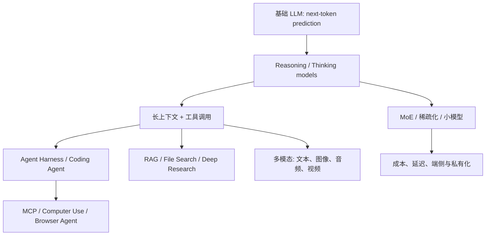

---
aliases:
  - 2026最新AI态势
  - AI前沿动态
---

# 2026 最新 AI 态势导航

> 更新时间：2026-07-01。
> 这组笔记用于承接“最新 AI 信息”：主流模型、技术趋势、Agent/RAG/多模态工程落地。基础原理仍回到 [[AI/00-AI学习体系/00-核心索引|核心概念]] 主索引学习。

## 为什么单独建这个目录

AI 前沿变化太快，直接塞进基础概念会让学习路径变乱。因此这里按“态势层”维护：

- 哪些模型和产品已经成为当前主流。
- 哪些技术方向已经从论文概念进入工程实践。
- 哪些旧认知需要修正。
- 学习时应该优先看什么，暂时只了解什么。

## 当前主线

## 本目录文件

- [[AI/00-AI学习体系/02-概念库/08-前沿动态/01-主流模型地图-2026-07|主流模型地图 2026-07]]
- [[AI/00-AI学习体系/02-概念库/08-前沿动态/02-2026技术趋势速查|2026 技术趋势速查]]
- [[AI/00-AI学习体系/02-概念库/08-前沿动态/03-AI工程选型原则-2026|AI 工程选型原则 2026]]

## 先记住 7 个变化

1. **推理模型常态化**：主流模型都开始支持 thinking / reasoning effort / hybrid thinking，不再只是 prompt 里写“请一步步思考”。
2. **长上下文进入百万级**：1M token 上下文已经出现在多家主流模型中，但不等于可以无脑塞全部资料，仍要做 context engineering。
3. **Agent 从 demo 进入工程系统**：Coding Agent、Deep Research、Computer Use、后台任务、IDE 集成逐渐变成产品能力。
4. **工具协议标准化**：MCP 让工具、资源、prompt 模板逐渐形成标准接口。
5. **多模态不只是看图**：图像、音频、视频、屏幕、PDF、语音实时交互都在统一到模型和工具链里。
6. **开源/开放权重继续追赶**：Llama 4、Qwen3、DeepSeek、Mistral 等路线让私有化、国产化、低成本部署更现实。
7. **评测从“问答分数”转向“任务完成”**：SWE-bench、Terminal-Bench、OSWorld、Deep Research 报告质量、Agent 成功率更重要。

## 学习优先级

必须跟进：

- [[AI/00-AI学习体系/02-概念库/01-模型层/03-推理模型|推理模型]]
- [[AI/00-AI学习体系/02-概念库/01-模型层/07-上下文与KV Cache|上下文与KV Cache]]
- [[AI/00-AI学习体系/02-概念库/03-Agent系统/05-Agent Harness|Agent Harness]]
- [[AI/00-AI学习体系/02-概念库/03-Agent系统/06-MCP协议|MCP协议]]
- [[AI/00-AI学习体系/02-概念库/06-工程生态/02-Context Engineering|Context Engineering]]

需要理解：

- [[AI/00-AI学习体系/02-概念库/01-模型层/02-MoE|MoE]]
- [[AI/00-AI学习体系/02-概念库/01-模型层/04-多模态模型|多模态模型]]
- [[AI/00-AI学习体系/02-概念库/04-RAG进阶/02-GraphRAG与Agentic RAG|GraphRAG与Agentic RAG]]
- [[AI/00-AI学习体系/02-概念库/05-评测/01-Eval Harness|Eval Harness]]

先了解即可：

- 最新模型排行榜的细微名次。
- 单个模型的营销 benchmark。
- 未开放、邀请制或 preview 阶段的能力。

## 来源优先级

维护这类笔记时，优先使用：

1. 官方模型文档 / 官方 release note。
2. 官方技术报告 / system card。
3. 论文和可复现实验。
4. 第三方 benchmark 和媒体报道。

不要把社交媒体爆料直接写成事实。
