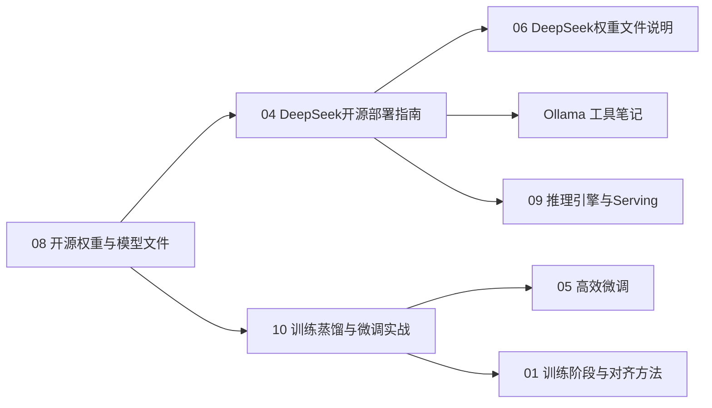

---
aliases:
  - 开放权重学习路径
  - 本地部署学习路径
  - 2026-07对话整理
---

# 开放权重本地部署学习路径 2026-07

> 更新时间：2026-07-08。
> 把一次从「开源权重是什么」到「怎么训练、怎么部署 DeepSeek」的讨论，整理成可复习的学习路径。

## 这条路径解决什么问题

- 听到 **Llama / Qwen / DeepSeek / Mistral 开源权重** 不知道指什么。
- 分不清 **权重文件** 和 **本地能跑的大模型**。
- 想知道 **DeepSeek 开源版** 有哪些、地址在哪、怎么部署。
- 想理解 **训练、蒸馏、微调** 的区别，以及个人能不能「训练」模型。

## 推荐阅读顺序



1. [[AI/00-AI学习体系/02-概念库/00-基础与LLM概论/08-开源权重与模型文件|开源权重与模型文件]] —— 四大家族、权重文件、下载 vs 本地部署。
2. [[AI/00-AI学习体系/02-概念库/08-前沿动态/04-DeepSeek开源部署指南|DeepSeek开源部署指南]] —— V3/R1/V4、官方地址、Ollama/vLLM/API。
3. [[AI/00-AI学习体系/02-概念库/08-前沿动态/06-DeepSeek开源权重文件说明|DeepSeek开源权重文件说明]] —— config、tokenizer、safetensors、MTP、FP8。
4. [[AI/02-环境与实操/Tools/ollama/Ollama|Ollama]] —— 本地「大模型 Docker」、11434 端口、接 Cursor/Agent。
5. [[AI/00-AI学习体系/02-概念库/02-训练与推理/10-训练蒸馏与微调实战|训练蒸馏与微调实战]] —— 训练 vs 蒸馏、LoRA 微调流程。
6. [[AI/00-AI学习体系/02-概念库/02-训练与推理/09-推理引擎与Serving|推理引擎与Serving]] —— 从 Ollama 进阶到 vLLM 生产部署。

## 核心结论速记

| 问题 | 答案 |
|---|---|
| 开源权重是什么 | 可下载的模型参数文件，可部署、可微调 |
| 权重文件是什么 | 训练后的神经网络参数（.safetensors 等） |
| 下了权重为何还不能聊 | 还需要推理引擎加载 |
| Ollama 是什么 | 本地跑开源模型的工具，不是模型本身 |
| 训练是什么 | 用数据改参数；个人通常指 **微调** |
| 蒸馏是什么 | 大模型教小模型；如 R1-Distill-7B |
| 个人怎么「训练」 | 开源权重 + 业务数据 + LoRA + LLaMA-Factory |
| DeepSeek 本地最简单 | `ollama pull deepseek-r1:7b` |

## 能力分层

```text
只试用           → Ollama + 7B 蒸馏
业务微调         → LLaMA-Factory + LoRA + Qwen/DeepSeek 基座
内网服务         → vLLM + 多卡 + V3/R1
不想运维         → DeepSeek / 其他官方 API
```

## 与体系其他章节的衔接

- 原理层：[[AI/00-AI学习体系/02-概念库/00-基础与LLM概论/02-神经网络与反向传播|神经网络与反向传播]]（训练为何能发生）
- 模型层：[[AI/00-AI学习体系/02-概念库/01-模型层/02-MoE|MoE]]（DeepSeek-V3/R1/V4 架构）
- 推理层：[[AI/00-AI学习体系/02-概念库/01-模型层/03-推理模型|推理模型]]（R1 系列）
- 选型层：[[AI/00-AI学习体系/02-概念库/08-前沿动态/03-AI工程选型原则-2026|AI工程选型原则 2026]]

## 自测

1. 说出「权重文件 → Ollama → 对话」三步各自是什么。
2. 为什么 R1-Distill-7B 适合 Mac，而 R1 671B 不适合？
3. 微调、蒸馏、预训练各解决什么问题？
