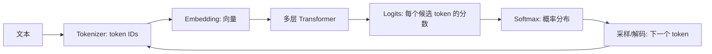

---
aliases:
  - LLM基础学习导航
---

# LLM 基础学习导航

> 这组笔记的目标不是把你训练成模型研究员，而是让你能**看懂 LLM 的基本工作方式**，再顺利进入 Transformer、RAG、Agent、评测与工程实践。

## 学习目标

读完本目录，你应该能用自己的话回答：

1. LLM 为什么本质上是在做「下一 token 预测」？
2. 文本为什么要先变成 token，再变成向量？
3. 神经网络如何通过 loss、梯度、反向传播学到参数？
4. Attention 的 Q/K/V 到底在解决什么问题？
5. Chat API、RAG、Agent 与底层 LLM 是什么关系？

## 推荐阅读顺序

1. [[AI/00-AI知识体系/概念/00-基础与LLM概论/01-什么是LLM|什么是LLM]]：LLM 是「概率续写器」+「通用任务接口」。
2. [[AI/00-AI知识体系/概念/00-基础与LLM概论/05-Tokenizer与分词|Tokenizer与分词]]：模型看见的是 token ID，不是字或词。
3. [[AI/00-AI知识体系/概念/00-基础与LLM概论/03-表示学习-从词嵌入到上下文|表示学习-从词嵌入到上下文]]：token 会被变成向量，向量随上下文变化。
4. [[AI/00-AI知识体系/概念/00-基础与LLM概论/04-语言模型与Next-Token-Prediction|语言模型与Next-Token-Prediction]]：训练目标与生成过程如何衔接。
5. [[AI/00-AI知识体系/概念/00-基础与LLM概论/02-神经网络与反向传播|神经网络与反向传播]]：loss 如何变成参数更新。
6. [[AI/00-AI知识体系/概念/00-基础与LLM概论/06-从RNN-CNN到Attention简史|从RNN-CNN到Attention简史]]：为什么 Transformer 取代 RNN/CNN。
7. [[AI/00-AI知识体系/概念/00-基础与LLM概论/07-注意力机制直觉-QKV|注意力机制直觉-QKV]]：Q/K/V 如何让 token 彼此取信息。

> 如果你喜欢从数学目标开始，也可以先读 04，再回到 05 和 03。两条路线都行。

## 一张总图

## 最小心智模型

- **数据层**：网页、书、代码、对话等文本，被切成 token 序列。
- **模型层**：token ID 变向量，经过 Transformer，输出下一个 token 的概率。
- **训练层**：真实下一个 token 是标签；预测错了就产生 loss；反向传播更新参数。
- **推理层**：模型每次生成一个 token，再把它接回上下文继续生成。
- **应用层**：Chat、RAG、Agent、工具调用，都是在这个生成循环外面加协议、检索、约束和执行。

## 学习时不要急着背的东西

- 不必一开始推导完整矩阵维度。
- 不必先学完深度学习所有优化理论。
- 不必从零实现 Transformer。
- 不必把每个采样参数都记住；先理解 temperature / top-p 改变的是「从概率分布里怎么选」。

## 自测清单

读完本目录后，拿一段话试着画出流程：

1. 这段话如何被 tokenizer 切成 token？
2. 每个 token 如何进入 embedding 表？
3. Attention 为什么不能看未来 token？
4. 模型输出的 logits 如何变成下一个 token？
5. 如果生成错了，训练时 loss 会如何推动参数更新？
6. 为什么 RAG 可以补知识，但不能改变模型本身参数？

如果这些问题能讲清楚，你再读 [[AI/00-AI知识体系/概念/01-模型层/01-Transformer架构|Transformer架构]] 会轻松很多。

## 与之相关

- 总索引：[[AI/00-AI知识体系/核心概念|核心概念]]
- 下一阶段：[[AI/00-AI知识体系/概念/01-模型层/01-Transformer架构|Transformer架构]]
- 训练全貌：[[AI/00-AI知识体系/概念/02-训练与推理/01-训练阶段与对齐方法|训练阶段与对齐方法]]
- 应用入口：[[AI/00-AI知识体系/概念/04-RAG进阶/01-RAG基础|RAG基础]]、[[AI/00-AI知识体系/概念/03-Agent系统/01-Workflow vs Agent|Workflow vs Agent]]
