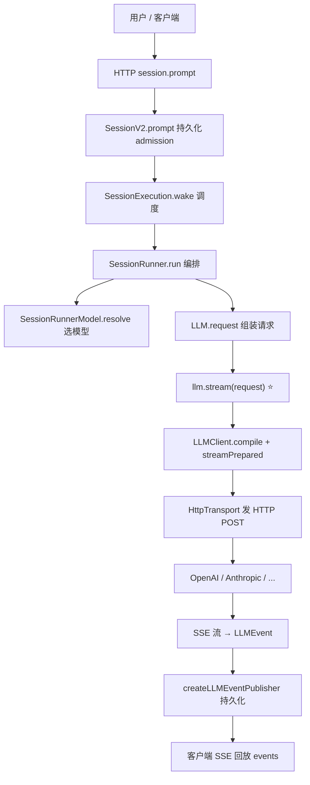
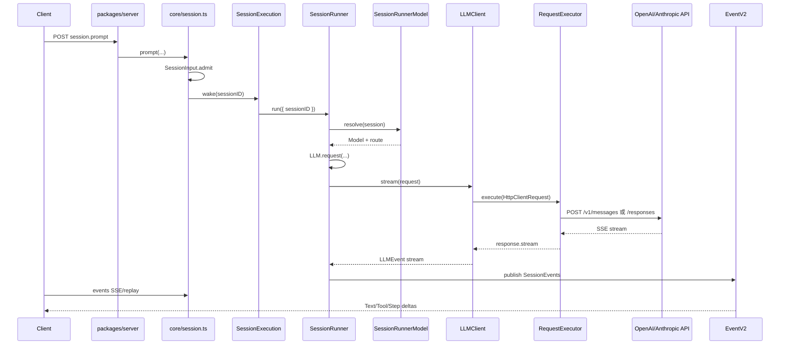

---
aliases:
  - opencode LLM 调用链路
tags:
  - AI
  - Coding Agent
  - opencode
  - 源码阅读
created: 2026-07-22
---

# opencode 大模型调用链路

> 基于本地仓库 `WebstormProjects/opencode` 源码梳理。V2 为主路径；V1 为 TUI/CLI 当前仍在用的遗留路径。

↑ [[AI/01-产品与工具/Coding-Agent/opencode/opencode|opencode]]

---

## 一句话总结

```
session.prompt
  → SessionV2.prompt（admit 持久化）
  → SessionExecution.wake（调度）
  → SessionRunner.runTurnAttempt（编排）
  → SessionRunnerModel.resolve（选模型 + Provider Route）
  → LLM.request(...)（组装请求）
  → llm.stream(request)          ← 编排层唯一 provider 调用点
  → LLMClient.compile + HTTP POST ← 网络层真正发请求
  → LLMEvent → SessionEvent → 客户端 SSE 回放
```

---

## 总体架构



---

## V2 核心链路（7 层）

### 1. 入口：HTTP API

| 位置 | 职责 |
|------|------|
| `packages/server/src/handlers/session.ts` | `"session.prompt"` handler → `SessionV2.Service.prompt(...)` |
| `packages/server/src/routes.ts` | 路由组装 `SessionV2.node` + `SessionExecutionLocal.node` |

### 2. Prompt 准入（不调用模型）

**文件**：`packages/core/src/session.ts` → `V2Session.prompt`

- 写入 durable `session_input` 行（`SessionInput.admit`）
- 默认 `resume !== false` 时调用 `SessionExecution.wake(sessionID)`
- **立即返回 admission receipt**，模型调用在后台 drain 中进行

设计要点（见仓库 `AGENTS.md`）：

- admission 与 model execution 分离
- 同一 Session ID 复用已有 Session
- `steer` / `queue` 两种 delivery 模式

### 3. 执行调度

```
SessionExecution.wake (packages/core/src/session/execution/local.ts)
  → SessionRunCoordinator.wake (packages/core/src/session/run-coordinator.ts)
      合并 wake、每 Session 串行 drain
  → SessionRunner.Service.run({ sessionID, force })
      通过 LocationServiceMap.get(session.location) 提供 Location 级服务
```

### 4. SessionRunner：编排核心

**文件**：`packages/core/src/session/runner/llm.ts` → `runTurnAttempt`

| 步骤 | 调用 | 作用 |
|------|------|------|
| 选 Agent | `agents.select(session.agent)` | 加载 agent 配置 |
| System Context | `SessionContextEpoch.initialize/prepare` | 系统上下文 epoch |
| **解析模型** | `models.resolve(session)` | catalog + credential → Route |
| 加载历史 | `SessionHistory.entriesForRunner` | 投影对话历史 |
| 物化工具 | `tools.materialize` | 工具定义与权限 |
| **组装请求** | `LLM.request({ model, system, messages, tools })` | 统一 LLMRequest |
| **调用模型** | `llm.stream(request)` ⭐ | 单次 provider turn |
| 工具结算 | `toolMaterialization.settle` | 本地 tool 执行 + continuation |

**约束**：每个 agent step 只调用 **一次** `llm.stream`（`specs/v2/session.md`）。

### 5. 最关键调用点

**编排层**（`packages/core/src/session/runner/llm.ts` ~L232）：

```ts
const request = LLM.request({ model, system, messages, tools, ... })
const providerStream = llm.stream(request).pipe(
  Stream.runForEach((event) => publish(event) + tool settlement),
)
```

**网络层**（`packages/llm/src/route/transport/http.ts` ~L133）：

```ts
runtime.http.execute(prepared.request)  // 实际 HTTP POST
```

**库入口**（`packages/llm/src/route/client.ts` L396）：

```ts
export function stream(request: LLMRequest): Stream.Stream<LLMEvent, LLMError>
```

### 6. 模型解析

**文件**：`packages/core/src/session/runner/model.ts`

```
SessionRunnerModel.resolve
  → catalog.model.available() / default()
  → integrations.connection.active() + resolve()  // OAuth / API Key
  → withVariant(session.model?.variant)
  → fromCatalogModel(model, credential)
      映射到 @opencode-ai/llm routes
```

| Provider API | Route 模块 |
|--------------|-----------|
| OpenAI Responses | `OpenAIResponses.route` |
| Anthropic Messages | `AnthropicMessages.route` |
| OpenAI Compatible | `OpenAICompatibleChat.route` |
| Gemini | `gemini.ts` |
| Bedrock Converse | `bedrock-converse.ts` |

Provider facade 位于 `packages/llm/src/providers/`。

### 7. LLM 包：编译 → HTTP → 解析流

**编译**（`packages/llm/src/route/client.ts`）：

```
compile(request)
  → route.body.from(resolved)        // LLMRequest → provider JSON
  → route.prepareTransport(body, ...) // HttpClientRequest
```

**Route 四轴模型**（`packages/llm/AGENTS.md`）：

| 轴 | 职责 | 示例 |
|----|------|------|
| Protocol | API 语义、body 构造、流解析 | `AnthropicMessages.protocol` |
| Endpoint | URL | `/v1/messages` |
| Auth | 认证 | `Auth.bearer(apiKey)` |
| Framing | 字节 → frame | `Framing.sse` |

**HTTP 执行链**：

```
LLMClient.stream
  → route.streamPrepared
  → HttpTransport.httpJson.frames
  → RequestExecutor.execute (packages/llm/src/route/executor.ts)
  → HttpClient.execute → Provider API
  → framing.frame(response.stream) → protocol.stream.step → LLMEvent
```

### 8. 响应回传

```
llm.stream 产出 LLMEvent 流
  → createLLMEventPublisher (packages/core/src/session/runner/publish-llm-event.ts)
      Step.Started, Text.Delta, Reasoning.*, Tool.*, Step.Ended
  → EventV2 持久化 DB + projector 更新 session messages
  → SessionV2.events(sessionID) SSE/replay
```

客户端订阅 **Session 事件流**，不是原始 LLM 字节流。

---

## 关键包职责

| 包 | 职责 |
|----|------|
| `packages/server` | V2 HTTP API（`session.prompt`、event replay） |
| `packages/core` | SessionV2、SessionExecution、SessionRunner、模型解析、工具、持久化事件 |
| `packages/llm` | Schema-first LLM 核心：`LLMRequest`、Route、Protocol、`LLMClient` |
| `packages/schema` / `protocol` | Prompt 输入、Session 事件、API 契约 |
| `packages/opencode` | V1 遗留（TUI、instance server、CLI） |

**全局 wiring**：`packages/core/src/effect/app-node-platform.ts` — `llmClient` 节点（`LLMClient.layer` + `RequestExecutor`）

---

## V1 遗留链路（TUI/CLI 当前路径）

生产 TUI / CLI 仍走 `packages/opencode`：

```
HTTP session.prompt (packages/opencode/src/server/routes/instance/httpapi/handlers/session.ts)
  → SessionPrompt.Service.prompt (packages/opencode/src/session/prompt.ts)
      内存 tool loop：SessionPrompt.loop
  → SessionProcessor.process (packages/opencode/src/session/processor.ts ~L640)
  → llm.stream(streamInput)
      packages/opencode/src/session/llm.ts
        默认: AI SDK streamText(...)
        可选 native: LLMNativeRuntime.stream → LLMClient.stream（同一 llm 包）
```

V2 **明确不桥接** `SessionPrompt.loop`（仓库 `AGENTS.md`）。

---

## 时序图（V2）



---

## 阅读源码建议顺序

1. `packages/server/src/handlers/session.ts` — HTTP 入口
2. `packages/core/src/session.ts` — `V2Session.prompt`
3. `packages/core/src/session/execution/local.ts` — wake / drain
4. `packages/core/src/session/runner/llm.ts` — **核心编排 + `llm.stream`**
5. `packages/core/src/session/runner/model.ts` — 模型解析
6. `packages/llm/src/route/client.ts` — `stream` / `compile`
7. `packages/llm/src/route/transport/http.ts` — HTTP POST
8. `packages/llm/src/protocols/` — 各 Provider 协议实现

---

## 相关

- [[AI/01-产品与工具/Coding-Agent/opencode/opencode|opencode 主笔记]]
- [[AI/00-AI学习体系/02-概念库/06-工程生态/01-Coding Agent|Coding Agent]]
- [[AI/00-AI学习体系/02-概念库/03-Agent系统/05-Agent Harness|Agent Harness]]
