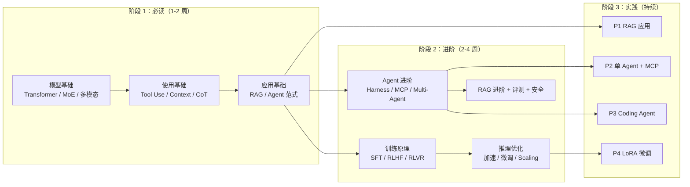

# AI 学习路线图：必读 → 进阶 → 实践

> 面向 **AI 应用 / Agent 工程师**（不是模型研究员）。把 [[核心概念|核心概念库]] 里的 31 个概念排成一条可执行学习路径。
>
> 三阶段：
> - **必读**：能跟上业内讨论、能用 API 搭出可用应用所需的最小知识。
> - **进阶**：理解原理、能做选型/调优、能读懂前沿论文要点。
> - **实践**：动手项目梯度 + 持续跟进资源。

---

## 总览路径图

---

## 阶段 1：必读（Foundation，1–2 周）

> 目标：**能用 LLM API 搭基本应用，看得懂主流模型对比与技术报告**。

### 1.1 模型基础（半天）
按顺序读：
1. [[Transformer架构]] —— 知道现代 LLM 的"骨架"。
2. [[MoE]] —— 理解为什么前沿模型都在用稀疏专家。
3. [[多模态模型]] —— Native Multimodal 是现在的事实标准。
4. [[小模型与端侧]] —— 知道什么场景该用小模型。

> 标志性能力：能看懂 DeepSeek / Llama / Qwen / GPT-5 的技术报告摘要。

### 1.2 使用基础（半天）
1. [[Tool Use与Function Calling]] —— LLM 应用的最小工程单元。
2. [[上下文与KV Cache]] —— 决定延迟与成本。
3. [[Context Engineering]] —— 替代传统 Prompt Engineering 的新思路。
4. [[推理时增强-CoT]] —— 简单几招提升输出质量。

> 标志性能力：能写出**带工具调用 + 结构化输出**的 LLM 调用代码，懂得控制 token 与延迟。

### 1.3 应用基础（1–2 天）
1. [[RAG基础]] —— 接外部知识的标准做法。
2. [[Workflow vs Agent]] —— 9 成"AI 应用"其实只需要 Workflow。
3. [[ReAct与Agent范式]] —— Agent 的基本心跳。

> 标志性能力：能用 LangChain / LlamaIndex（或手撸）做出一个**带 RAG + 工具调用**的 chatbot / Workflow。

### 阶段 1 checklist
- [ ] 用 OpenAI / Anthropic / Gemini API 之一跑通 chat + tool use
- [ ] 实现一个最朴素的 RAG（嵌入 → 召回 → 拼 prompt → 回答）
- [ ] 能说清 Workflow 与 Agent 的差别和选用时机
- [ ] 能解释为什么相同 prompt 在不同模型上效果差很多

---

## 阶段 2：进阶（Advanced，2–4 周）

> 目标：**能做技术选型、调优生产系统、读懂前沿论文/产品架构**。

### 2.1 训练与对齐原理（2–3 天，不必动手训）
1. [[训练阶段与对齐方法]] —— Pretraining → SFT → DPO/RLHF 全流程。
2. [[RLVR]] —— 当下推理模型崛起的核心。
3. [[PRM与ORM]] —— 推理模型奖励机制。
4. [[合成数据与Self-Play]] —— 现代模型的数据飞轮。

> 标志性能力：能解释"为什么 R1 这么强、便宜还开源"，能讲清 RLVR 和 RLHF 的区别。

### 2.2 推理优化与微调（2–3 天）
1. [[推理加速三件套]] —— FlashAttention / PagedAttention / Speculative Decoding。
2. [[高效微调]] —— LoRA / QLoRA / 量化全家桶。
3. [[Test-time Compute Scaling]] —— 第三条 Scaling Law。

> 标志性能力：能给一个生产 LLM 服务做**性能 + 成本**优化方案；知道什么时候微调、什么时候不该微调。

### 2.3 推理模型与新架构（1–2 天）
1. [[推理模型]] —— Reasoning Model 的能力边界与成本。
2. [[新架构-SSM与Mamba]] —— Attention 之外的可能性。

> 标志性能力：能合理使用 `reasoning_effort` 参数，知道何时该用 thinking 模型何时不该。

### 2.4 Agent 进阶（3–5 天，重点）
1. [[Agent Harness]] —— **理解"模型 × Harness = Agent 能力"**。
2. [[MCP协议]] —— 工具协议标准。
3. [[Multi-Agent编排]] —— Orchestrator / Handoff / Graph。
4. [[Agent Memory]] —— 长任务/跨会话的记忆系统。
5. [[Computer Use与Browser Agent]] —— GUI 自动化前沿。

> 标志性能力：能为一个真实业务设计一套 Agent 架构（含 harness、工具、权限、记忆、降级）。

### 2.5 RAG 进阶（1 天）
1. [[GraphRAG与Agentic RAG]] —— 朴素 RAG 解决不了的场景。

> 标志性能力：知道何时该升级到 GraphRAG / Agentic RAG，以及代价。

### 2.6 评测与可观测（1 天）
1. [[Eval Harness]] —— 学术评测脚手架。
2. [[Benchmark集合]] —— 各能力维度的 benchmark 选用指南。

> 标志性能力：能为自家 LLM/Agent 系统设计一套**自动化离线评测 + 在线监控**方案。

### 2.7 生态与安全（1 天）
1. [[Coding Agent]] —— 当下最成熟的 Agent 落地方向。
2. [[应用层框架]] —— LangGraph / DSPy / CrewAI 选型。
3. [[Prompt Injection与Agent安全]] —— Agent 上生产前必读。

> 标志性能力：能对一份"AI 创业产品 PRD"做技术 + 安全双角度评审。

### 阶段 2 checklist
- [ ] 用 LoRA 在 Colab 微调一次小模型（不必上线，跑通流程）
- [ ] 用 LangGraph 或自撸做一个**真 Agent**（有循环、有工具、有错误恢复）
- [ ] 给一个 RAG 系统加上 Hybrid Search + Reranker，对比效果
- [ ] 设计一份针对 Prompt Injection 的防御 + 评测方案

---

## 阶段 3：实践（Practice，持续输出）

> 目标：**通过项目梯度把知识转成手感**。建议按 P1 → P4 顺序，每个项目 1–4 周。

### P1：RAG 应用 —— "把一坨知识变成可问答"
- **场景**：用 Obsidian 笔记 / 公司文档 / 一本书 做问答系统。
- **必练**：分块策略、嵌入选型、Hybrid Search、Reranker、Citation。
- **工具**：LlamaIndex 起步 → 逐步换成自撸；向量库选 pgvector / Qdrant。
- **进阶**：上 [[GraphRAG与Agentic RAG]]，对比朴素 RAG 的差别。
- **评测**：自造 50 条 QA → 用 [[LLM-as-a-Judge]]（在 [[Benchmark集合]]）做自动化评测。

### P2：单 Agent + MCP —— "把工具变成能力"
- **场景**：让 Agent 完成"调研一个技术话题 → 整理报告 → 提交到 Obsidian"的端到端任务。
- **必练**：[[MCP协议]] 接 filesystem / web fetch / search / github；工具描述写作；权限审批。
- **工具**：Claude Code、Cursor Agent、OpenAI Agents SDK、LangGraph 任选一个 [[Agent Harness|harness]] 起步。
- **进阶**：加 [[Agent Memory]]，让 Agent 记住用户偏好。

### P3：Coding Agent / SWE-bench 微缩版 —— "把 Agent 拉到工程级"
- **场景**：跑 SWE-bench Verified 子集，先 10 题，逐步扩大。
- **必练**：[[Agent Harness]] 设计、[[Context Engineering]]、可观测（trace 每一步）。
- **工具**：OpenHands、SWE-Agent、Aider、Mini-SWE-Agent；模型选 Claude Sonnet 4+ 或 GPT-5。
- **进阶**：自己改 harness，对比 pass@1 是否提升 → 直观感受"模型 × Harness"公式。
- **评测**：见 [[Eval Harness]]、[[Benchmark集合]]。

### P4：LoRA 微调 —— "把模型变成自家模型"
- **场景**：用 Qwen2.5-7B / Llama 3.1-8B 微调一个垂直任务（分类、抽取、风格转换、Agent 函数调用）。
- **必练**：[[高效微调]]（QLoRA）、数据合成（见 [[合成数据与Self-Play]]）、量化部署。
- **工具**：**Unsloth**（最快入门）→ **Axolotl** / **LLaMA-Factory**（生产）。
- **进阶**：尝试 DPO 做偏好对齐；蒸馏一个大模型的能力到小模型。
- **评测**：自己一套 holdout + LLM-as-Judge。

---

## 持续跟进资源（每周 30–60 分钟）

### 论文
- **HuggingFace Papers**（papers.cool / huggingface.co/papers）—— 每日精选
- **arxiv-sanity**（karpathy 出品）
- **Sebastian Raschka**（Magazine + Twitter）—— 工程视角解读论文
- **AK on X**（@_akhaliq）—— 最快的新论文流

### 博客 / Newsletter
- **Simon Willison's Weblog** —— Prompt Injection / LLM 工程实战
- **Anthropic Engineering Blog** —— Building Effective Agents 等经典文
- **Latent Space**（newsletter + 播客）
- **The Pragmatic Engineer**（AI 工程视角）
- **Lilian Weng's Blog**（OpenAI）—— Agent / RL 综述质量极高

### 排行榜 & 实测
- **LMSYS Chatbot Arena** —— 人类盲投 Elo，最贴近真实使用感
- **Open LLM Leaderboard**（HuggingFace）
- **SWE-bench / Aider Leaderboard / LiveCodeBench**
- **OpenRouter Trending** —— 看真实开发者在用什么

### 课程
- **DeepLearning.AI 短课**（吴恩达系）—— 每个新概念都有 1 小时短课
- **HuggingFace LLM / Agents Course**
- **Andrej Karpathy Zero-to-Hero** —— 想从底层理解必看

### 关键人物（Twitter / X 关注名单）
- @karpathy、@_jasonwei、@hwchase17（LangChain）、@simonw、@jeremyphoward、@Teknium1、@nrehiew_

---

## 三个阶段时间预算建议

| 阶段 | 全职 | 业余（每天 1 小时） |
|---|---|---|
| 必读 | 3–5 天 | 1–2 周 |
| 进阶 | 1–2 周 | 4–6 周 |
| 实践 P1+P2 | 2–3 周 | 1.5–2 月 |
| 实践 P3+P4 | 3–4 周 | 2–3 月 |
| **合计到"独立设计 AI 系统"** | **2 个月** | **4–6 个月** |

---

## 自检题（学完阶段 2 应能答上）

1. 为什么 DeepSeek-R1 训练成本远低于 OpenAI o1，但效果接近？关键是什么？
2. 同样的模型，为什么在 Cursor / Codex / Aider 上 SWE-bench 分数差很多？
3. RAG 答得不准时，应该先优化召回还是先换 reranker？为什么？
4. 一个 Agent 接了浏览网页的工具，最大的安全风险是什么？怎么缓解？
5. 什么场景该用 thinking 模型，什么场景不该？成本结构如何？
6. 量化（INT4）会让模型变笨吗？对哪些任务影响最大？
7. MCP 解决了什么问题？为什么不是又一个 LangChain？

> 答不上的题，回到对应 [[核心概念|概念笔记]] 重读。

---

## 维护说明

- 学完一节就在 checklist 打勾；完成一个项目就在该项目下补一行"完成记录"。
- 跟进的好资源（论文/博客）可直接在对应概念笔记里加"延伸阅读"。
- 路线图本身每季度回看一次，剔除过时内容、加入新概念。

## 相关笔记

- [[核心概念]] —— 31 篇概念库的主索引（MOC）
- 产品笔记：[[Cursor]] · [[Codex]] · [[Claude]] · [[Antigravity]]
