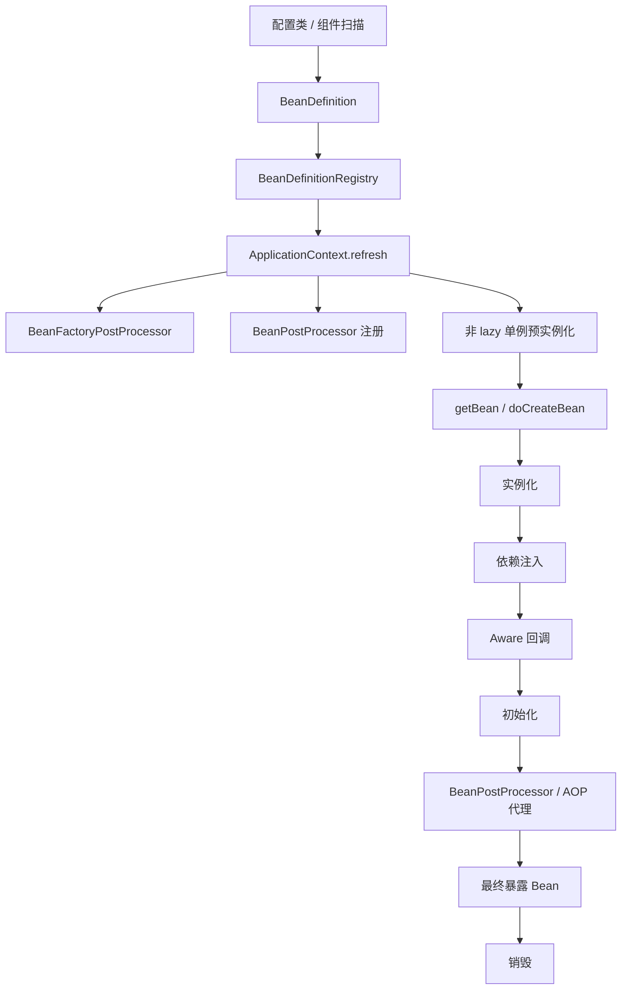

# Spring Framework 核心机制学习导航

> [!abstract] 体系定位
> 这套笔记聚焦 Spring Framework 6.2.x 的 IoC Container、Bean 生命周期、容器扩展、AOP 与声明式事务。目标不是逐篇阅读，而是先建立模型，再沿一条源码主链验证，最后按问题进入专题。

## 1. 最短掌握路径

### 第一阶段：30 分钟建立模型

1. [[2-速查-IoC与DI核心整合速查]]：概念、角色和完整主链。
2. [[1-注解入门-配置类与组件类]]：配置如何进入容器。
3. [[4-接口地图-IoC与DI重要接口大全]]：知道关键 API 在哪一层。

完成标准：

- 能区分控制反转（Inversion of Control, IoC）与依赖注入（Dependency Injection, DI）。
- 能区分 `BeanDefinition`、`BeanFactory`、`FactoryBean` 和 `ApplicationContext`。
- 能口述从配置到最终 Bean 的阶段顺序。

### 第二阶段：2 小时掌握容器主线

1. [[1-IoC与DI核心概念]]
2. [[1-元数据层-BeanDefinition三兄弟详解]]
3. [[2-元数据层-AnnotatedBeanDefinitionReader与组件注册详解]]
4. [[3-refresh方法详解]]
5. [[2-Bean加载原理与源码阅读路径]]
6. [[4-doCreateBean深度解析]]
7. [[5-依赖注入实现原理]]

主线：

```text
配置来源
  -> BeanDefinition
  -> BeanDefinitionRegistry
  -> ApplicationContext#refresh
  -> BeanFactory#getBean
  -> doCreateBean
  -> 实例化
  -> 依赖注入
  -> Aware 与初始化
  -> BeanPostProcessor
  -> 最终暴露对象
  -> 销毁
```

### 第三阶段：按问题进入高级机制

| 问题 | 进入文档 |
| --- | --- |
| 多候选依赖到底怎样选择 | [[Spring注入注解与byType-byName解析逻辑]] |
| 延迟、可选或批量取得依赖 | [[getBeanProvider与ObjectProvider有什么用]] |
| 单例为何能解决部分循环依赖 | [[6-循环依赖与三级缓存详解]] |
| Bean 如何取得容器基础设施 | [[3-生命周期层-Aware体系详解]] |
| 定义与实例分别如何被扩展 | [[7-IoC扩展点三部曲对照]] |
| 为什么最终 Bean 可能是代理 | [[8-Spring-AOP代理创建详解]] |
| 声明式事务怎样进入调用链 | [[10-Spring事务实现详解]] |
| 不同 Scope 如何影响身份与销毁 | [[5-生命周期层-Bean作用域与生命周期边界]] |

## 2. 知识地图



把每个机制放回三个问题：

1. 它处理的是 Bean 定义、Bean 实例，还是容器上下文？
2. 它发生在注册、创建、初始化，还是销毁阶段？
3. 它改变的是元数据、依赖、对象身份，还是调用行为？

## 3. 按目录查找

### `10-入门与速查`

| 文档 | 角色 |
| --- | --- |
| [[1-注解入门-配置类与组件类]] | 配置与组件注册的权威入门 |
| [[2-速查-IoC与DI核心整合速查]] | 十分钟总览 |
| [[3-速查-Spring厨房比喻大全]] | 辅助记忆，不承担正式定义 |
| [[4-接口地图-IoC与DI重要接口大全]] | API 定位地图 |
| [[5-工厂Bean-BeanFactory与FactoryBean的区别]] | 易混概念速查 |
| [[6-术语表-Spring核心概念中英文对照]] | 中英文标准术语与推荐简称 |

### `20-结构与元数据`

| 主题 | 权威文档 |
| --- | --- |
| Bean 定义 | [[1-元数据层-BeanDefinition三兄弟详解]] |
| 注解注册与组件扫描 | [[2-元数据层-AnnotatedBeanDefinitionReader与组件注册详解]] |
| 注册表与默认工厂实现 | [[3-注册层-BeanDefinitionRegistry与DefaultListableBeanFactory详解]] |
| BeanFactory 接口体系 | [[4-容器层-BeanFactory接口体系详解]] |
| ApplicationContext | [[5-Context层-ApplicationContext详解]] |
| Environment / PropertySource | [[6-Context层-Environment与PropertySource详解]] |
| Resource / ResourceLoader | [[7-Context层-Resource与ResourceLoader详解]] |
| ApplicationEvent | [[8-Context层-ApplicationEvent事件机制详解]] |

### `30-扩展点与生命周期`

| 主题 | 权威文档 |
| --- | --- |
| BeanFactoryPostProcessor | [[1-扩展点层-BeanFactoryPostProcessor详解]] |
| BeanPostProcessor | [[2-扩展点层-BeanPostProcessor详解]] |
| Aware 接口族 | [[3-生命周期层-Aware体系详解]] |
| FactoryBean | [[4-工厂Bean-FactoryBean接口体系详解]] |
| Bean Scope | [[5-生命周期层-Bean作用域与生命周期边界]] |

### `40-机制与源码`

| 主题 | 权威文档 |
| --- | --- |
| IoC / DI 概念 | [[1-IoC与DI核心概念]] |
| Bean 获取与创建路线 | [[2-Bean加载原理与源码阅读路径]] |
| 容器启动 | [[3-refresh方法详解]] |
| `doCreateBean` | [[4-doCreateBean深度解析]] |
| 依赖注入 | [[5-依赖注入实现原理]] |
| 循环依赖 | [[6-循环依赖与三级缓存详解]] |
| 三类扩展点对照 | [[7-IoC扩展点三部曲对照]] |
| Spring AOP | [[8-Spring-AOP代理创建详解]] |
| Bean 销毁 | [[9-Bean 销毁机制详解]] |
| 声明式事务 | [[10-Spring事务实现详解]] |
| 类型转换与数据绑定 | [[11-类型转换-ConversionService与DataBinder边界]] |
| 候选解析规则 | [[Spring注入注解与byType-byName解析逻辑]] |
| ObjectProvider | [[getBeanProvider与ObjectProvider有什么用]] |

`4.1-doCreateBean核心子方法深度解析` 已合并到主文档，旧文件仅保留章节映射。

### `50-实践与调试`

| 文档 | 用途 |
| --- | --- |
| [[1-源码调试与断点指南]] | 用断点验证容器主线 |
| [[2-测试驱动的refresh调用链-Aware与Processor]] | 用测试观察 refresh 与扩展回调 |
| [[Spring依赖注入形式分类与Demo]] | 依赖注入方式选择和示例 |

### `90-历史入口与边界`

只保存重定向和跨专题边界，不进入学习主线：

- Aware 历史问答 → [[3-生命周期层-Aware体系详解]]
- 未使用类问题 → [[2-元数据层-AnnotatedBeanDefinitionReader与组件注册详解#FAQ：类存在但没有被使用，Spring 会怎样处理？]]
- Java 动态代理 → [[1010-Java动态代理与运行时代理机制]]
- DDD 运行时装配 → [[02-DDD分层的编译时依赖与Spring运行时装配]]

## 4. 边界主题

| 不在本体系展开 | 去向 |
| --- | --- |
| Spring Boot 启动与自动配置 | [[Spring Boot 启动流程源码分析]] |
| Java 动态代理语言机制 | [[1010-Java动态代理与运行时代理机制]] |
| DDD 分层与组合根 | [[02-DDD分层的编译时依赖与Spring运行时装配]] |
| Spring MVC / WebFlux | 独立 Web 框架专题 |
| Spring Data / Security / Cloud | 各自独立专题 |

## 5. 版本与阅读规则

- 源码基线：Spring Framework `6.2.x`；本地参考源码为 `6.2.20-SNAPSHOT`。
- 源码文档优先写“类名 + 方法名 + 调用关系”，行号只作为临时调试线索。
- 正式概念第一次出现时使用“中文名（English Term / API）”，后文保持一种简称。
- 全体系术语基准：[[6-术语表-Spring核心概念中英文对照]]。
- `canonical` 是主题权威文档；`quick-reference` 只给摘要和导航；`redirect` 不再维护正文。
- 维护记录与旧新映射：[[00-Spring知识体系重构映射]]。
