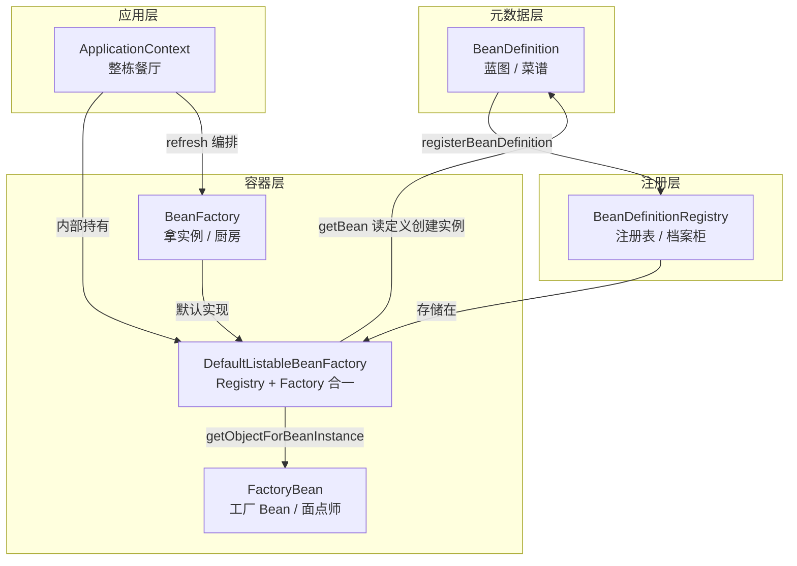

# IoC 与 DI 核心整合速查

> 导航：[[00-Spring-Bean加载-学习导航]] · **上篇 01–15** · 速查 · **结构 + 机制一页纸**
>
> 定位：**上篇首读** — 整合 IoC/DI 思想、结构五概念、运行机制；再读 [[05-接口地图-IoC与DI重要接口大全]] 展开接口细节
>
> 深度阅读：
> - [[06-元数据层-BeanDefinition三兄弟详解]]
> - [[08-注册层-BeanDefinitionRegistry与DefaultListableBeanFactory详解]]
> - [[09-容器层-BeanFactory与Registry详解]]
> - [[14-工厂Bean-BeanFactory与FactoryBean的区别]] · [[15-工厂Bean-FactoryBean接口体系详解]]
> - [[10-Context层-ApplicationContext详解]]

---

## 整合总览

| 层次 | 回答的问题 | 章节 |
|:----:|-----------|------|
| **思想** | 谁控制对象、怎么给依赖 | [[#思想：IoC 与 DI]] |
| **结构** | 有哪些角色 / 接口 | [[#一、结构核心 · 五概念]] |
| **机制** | 怎么注册、扩展、注入、销毁 | [[#二、机制核心整合]] |
| **流程** | 从配置到运行时对象 | [[#三、完整链路：从配置到对象]] |

```text
思想    IoC（容器控制） + DI（注入实现）
          ↓
结构    Definition → Registry → Factory → FactoryBean → Context
          ↓
机制    两阶段 · BFPP/BPP/Aware · resolveDependency · Scope · 三级缓存
          ↓
流程    refresh() / getBean() → createBean()
```

> 厨房比喻扩展 → [[04-速查-Spring厨房比喻大全]] · 下篇机制源码 → [[16-IoC与DI核心概念]] 起

---

## 思想：IoC 与 DI

| 概念 | 含义 |
|------|------|
| **IoC（控制反转）** | 对象的创建、组装、生命周期由**容器**管理，而不是业务代码自己 `new` |
| **DI（依赖注入）** | 容器把依赖**注入**对象（构造器 / Setter / 字段）；Spring 实现 IoC 的主路径 |

```text
IoC（思想：谁控制）
  └── DI（实现：怎么给依赖）
        ├── 构造器注入 ⭐ 官方推荐
        ├── Setter / 字段注入（@Autowired）
        └── Aware 回调（拉式拿容器资源，次选）
```

---

## 一、结构核心 · 五概念

### 一句话定位

| 概念                         | 类型         | 回答的问题                  | 比喻      |
| -------------------------- | ---------- | ---------------------- | ------- |
| **BeanDefinition**         | 元数据 / 蓝图   | Bean **长什么样**？         | 菜谱      |
| **BeanDefinitionRegistry** | 注册表接口      | 蓝图**存哪、怎么登记**？         | 菜单档案柜   |
| **BeanFactory**            | 容器接口       | **怎么拿到** Bean 实例？      | 整个厨房    |
| **FactoryBean**            | 特殊 Bean 接口 | 这个 Bean **怎么生产另一个对象**？ | 厨房里的面点师 |
| **ApplicationContext**     | 应用容器接口     | **怎么运行整个 Spring 应用**？  | 整栋餐厅    |

> 厨房比喻扩展（主厨、传菜口、品控等）→ [[04-速查-Spring厨房比喻大全]]

---

### 核心区别对比表

| 维度 | BeanDefinition | BeanDefinitionRegistry | BeanFactory | FactoryBean | ApplicationContext |
|------|----------------|------------------------|-------------|-------------|-------------------|
| **层级** | 元数据 | 注册层 | 容器层 | **容器里的一个 Bean** | 应用层 |
| **本质** | 数据结构 | 操作接口 | 容器接口 | 工厂型 Bean 接口 | 增强型容器接口 |
| **管什么** | 单个 Bean 的配置 | 所有定义的增删查 | 所有 Bean 的生命周期 | **一个**产品的创建 | Factory + 应用基础设施 |
| **典型操作** | `setBeanClass()` | `registerBeanDefinition()` | `getBean()` | `getObject()` | `refresh()`、`publishEvent()` |
| **谁实现/产生** | Scanner、Reader 创建 | DLBF 等实现 | DLBF 等实现 | 用户或框架代码实现 | `AnnotationConfigApplicationContext` 等 |
| **`getBean("xxx")`** | 不适用 | 不适用 | 普通 Bean → 实例 | **产品**（`getObject()` 返回值） | 同 BeanFactory |
| **模块** | spring-beans | spring-beans | spring-beans | spring-beans | spring-context |

---

## 关系总览

```text
ApplicationContext（餐厅：编排 + 环境 + 事件）
    └── DefaultListableBeanFactory（厨房：Registry + Factory 合一）
            ├── BeanDefinitionRegistry
            │     └── beanDefinitionMap 存 BeanDefinition（菜谱档案）
            │
            └── BeanFactory
                  ├── 普通 Bean → getBean("userService") → UserService 实例
                  └── FactoryBean → getBean("myProxy") → getObject() 的产品
                                    getBean("&myProxy") → FactoryBean 本身
```



---

## 二、机制核心整合

> 五概念是**名词（角色）**；下面是**动词与规则（机制）**。与 [[05-接口地图-IoC与DI重要接口大全]] 分层一一对应。

### 机制清单

| 机制                                | 归类      | 干什么                                     | 深入                                               |
| --------------------------------- | ------- | --------------------------------------- | ------------------------------------------------ |
| **两阶段模型**                         | 流程      | 先注册 Definition，再 `getBean` 创建实例         | [[17-Bean加载原理与源码阅读路径]]                           |
| **BFPP**                          | IoC 扩展  | 实例化**前**改 BeanDefinition                | [[11-扩展点层-BeanFactoryPostProcessor详解]]           |
| **BPP**                           | IoC 扩展  | 实例化**后**改 Bean 实例（含 AOP 代理）             | [[12-扩展点层-BeanPostProcessor详解]]                  |
| **Aware**                         | 生命周期    | 容器向 Bean **回调**基础设施                     | [[13-生命周期层-Aware体系详解]]                           |
| **AutowireCapableBeanFactory**    | DI 核心   | `resolveDependency()` — `@Autowired` 底层 | [[20-依赖注入实现原理]]                                  |
| **ObjectProvider**                | DI 消费   | 延迟 / 可选 / 多候选注入                         | [[05-接口地图-IoC与DI重要接口大全#五、DI 消费端接口]]              |
| **Scope + SingletonBeanRegistry** | 作用域     | singleton / prototype；三级缓存基础            | [[21-循环依赖与三级缓存详解]]                               |
| **Condition / @Conditional**      | Context | 条件装配（Boot 自动配置基础）                       | [[05-接口地图-IoC与DI重要接口大全#八、Context 层扩展（注解驱动 IoC）]] |
| **refresh()**                     | Context | 启动编排：BFPP → BPP → 预实例化                  | [[18-refresh方法详解]]                               |
| **销毁回调**                          | 生命周期    | `@PreDestroy` / `DisposableBean`        | [[24-Bean销毁机制详解]]                                |

### 扩展点三部曲（按 refresh 时序）

```text
BFPP 改定义 → 注册 BPP → getBean/createBean
  → populateBean（DI，BPP 执行 @Autowired）
  → initializeBean（Aware + @PostConstruct）
  → BPP AfterInit（AOP 代理等）
```

→ 对照总览 [[19-IoC扩展点三部曲对照]]

### DI 解析链（一句话）

```text
@Autowired → AutowiredAnnotationBeanPostProcessor
  → populateBean() → resolveDependency()
  → 候选筛选（@Primary / @Qualifier / AutowireCandidateResolver）
```

### 结构 ↔ 机制对照

| 结构（五概念） | 挂载的主要机制 |
|---------------|---------------|
| BeanDefinition | BFPP 修改；`createBean()` 读取 |
| BeanDefinitionRegistry | 阶段一注册；RegistryPostProcessor 动态注册 |
| BeanFactory / DLBF | `getBean()`、`createBean()`、Scope、三级缓存 |
| FactoryBean | `getObjectForBeanInstance()`；`&` 前缀取工厂本身 |
| ApplicationContext | `refresh()` 编排；Environment / 事件 / 条件装配 |

### 整合地图（结构 + 机制）

```text
@Configuration / @Service
    ↓ 扫描 / 解析（07）
BeanDefinition ──register──▶ Registry（08 DLBF）
    ↓ BFPP 改定义（11）
refresh()（19）──▶ 注册 BPP（12）
    ↓ getBean / preInstantiateSingletons
createBean()
    ├── populateBean + resolveDependency（21 DI）
    ├── 三级缓存（22，仅单例 setter/field 循环依赖）
    ├── Aware + 初始化（13）
    └── BPP AfterInit → AOP 代理（23）
ApplicationContext（10）= 编排以上 + Environment / Event
```

---

## 三、完整链路：从配置到对象

```text
阶段零：ApplicationContext 编排一切
  refresh()
    → 创建/刷新 BeanFactory
    → invokeBeanFactoryPostProcessors()（还能改 BeanDefinition）
    → finishBeanFactoryInitialization()（预创建单例）
    → 初始化事件、国际化、Environment

阶段一：登记蓝图
  @Service / @Bean / XML
        ↓ 解析
  BeanDefinition（"UserService 是单例，依赖 OrderRepository"）
        ↓ registerBeanDefinition("userService", def)
  BeanDefinitionRegistry（存入 beanDefinitionMap）

阶段二：创建实例
  getBean("userService")
        ↓ 读 BeanDefinition
        ↓ createBean() → 实例化 + DI + 初始化
  UserService 实例

阶段二变体：FactoryBean
  getBean("myProxy")
        ↓ 发现是 FactoryBean
        ↓ factory.getObject()
  代理对象（不是 FactoryBean 本身）
```

**两阶段心智模型**：

| 阶段 | 参与者 | 做什么 |
|------|--------|--------|
| **阶段一：注册** | BeanDefinition + Registry | 扫描/解析配置 → 写入 `beanDefinitionMap` |
| **阶段二：实例化** | BeanFactory（Context 触发） | 读定义 → `createBean()` → 得到运行时对象 |

---

## 四、逐个说明

### 1. BeanDefinition — 蓝图

**不是 Bean 本身**，是描述「怎么创建 Bean」的元数据：

```java
def.setBeanClass(UserService.class);
def.setScope(SCOPE_SINGLETON);
def.setLazyInit(false);
def.getPropertyValues().add("name", "张三");
```

| 来源 | 产生的 Definition 类型 |
|------|----------------------|
| `@Service` 扫描 | `ScannedGenericBeanDefinition` |
| `@Bean` 方法 | `ConfigurationClassBeanDefinition` |
| 运行时合并 | `RootBeanDefinition` |

→ 详见 [[06-元数据层-BeanDefinition三兄弟详解]]

---

### 2. BeanDefinitionRegistry — 注册表

Spring bean 工厂包里**唯一封装 Bean 定义注册**的接口：

```java
registry.registerBeanDefinition("userService", beanDefinition);
registry.getBeanDefinition("userService");
registry.containsBeanDefinition("userService");
```

| 角色 | 说明 |
|------|------|
| **写入方** | Scanner、Reader（解析配置后注册） |
| **存储方** | `DefaultListableBeanFactory.beanDefinitionMap` |
| **关键约束** | 标准 `BeanFactory` **不提供**注册能力，只有 `getBean()` |

→ 详见 [[08-注册层-BeanDefinitionRegistry与DefaultListableBeanFactory详解]]

---

### 3. BeanFactory — 容器

IoC **根接口**，定义怎么从容器拿 Bean：

```java
UserService user = factory.getBean("userService", UserService.class);
boolean exists = factory.containsBean("userService");
```

```text
getBean() → doGetBean() → createBean()
  → createBeanInstance()  [实例化]
  → populateBean()        [依赖注入]
  → initializeBean()      [初始化]
```

| 特点 | 说明 |
|------|------|
| 管**所有 Bean** | 定义访问 + 生命周期 |
| 默认 lazy | 不调用 `getBean()` 就不创建 |
| 典型实现 | `DefaultListableBeanFactory` |

→ 详见 [[09-容器层-BeanFactory与Registry详解]]

---

### 4. FactoryBean — 工厂型 Bean（最易混淆）

**不是容器**，是注册在容器里的**一种特殊 Bean**：

```java
public interface FactoryBean<T> {
    T getObject();              // 返回「产品」
    Class<?> getObjectType();   // 产品类型
    boolean isSingleton();      // 产品是否单例
}
```

| 调用 | 结果 |
|------|------|
| `getBean("dataSource")` | FactoryBean **产出的对象** |
| `getBean("&dataSource")` | FactoryBean **本身**（`&` 前缀） |

典型场景：`ProxyFactoryBean`（AOP 代理）、MyBatis `MapperFactoryBean`。

→ 详见 [[14-工厂Bean-BeanFactory与FactoryBean的区别]] · [[15-工厂Bean-FactoryBean接口体系详解]]

---

### 5. ApplicationContext — 企业级容器

**继承** `ListableBeanFactory`，在 Factory 之上增加应用能力：

```java
ConfigurableApplicationContext ctx = SpringApplication.run(App.class, args);
ctx.getBean(UserService.class);           // BeanFactory 能力
ctx.publishEvent(new OrderEvent());       // 额外：事件
ctx.getEnvironment().getProperty("...");  // 额外：环境
```

| 比 BeanFactory 多什么 | 说明 |
|----------------------|------|
| `refresh()` 启动编排 | BFPP → BPP → 预实例化单例 |
| Environment | Profile、`application.properties` |
| 事件 / 国际化 / 资源 | 应用级基础设施 |
| 启动预创建 | 非 lazy 单例启动时就绪 |

`getBean()` 最终仍走内部的 `DefaultListableBeanFactory`。

→ 详见 [[10-Context层-ApplicationContext详解]]

---

## 五、最易混淆的三组

### BeanFactory vs FactoryBean

| | BeanFactory | FactoryBean |
|--|-------------|-------------|
| 角色 | **整个容器** | 容器里的**一个 Bean** |
| 层级 | 容器级 | Bean 级 |
| 类比 | 厨房 | 面点师 |
| `getBean("xxx")` | 普通 Bean → 实例 | → `getObject()` 产品 |

```text
BeanFactory  = 容器（管所有 Bean）
FactoryBean  = 工厂 Bean（管一个产品）

getBean("name")   → 要产品
getBean("&name")  → 要工厂
```

---

### BeanDefinition vs Bean 实例

| | BeanDefinition | Bean 实例 |
|--|---------------|----------|
| 时机 | 启动时注册 | `getBean()` 时创建 |
| 本质 | 蓝图（可被 BFPP 修改） | 运行时 Java 对象 |
| 存储 | `beanDefinitionMap` | `singletonObjects` |

---

### BeanFactory vs ApplicationContext

| | BeanFactory | ApplicationContext |
|--|-------------|-------------------|
| 关系 | IoC 核心 | **是** BeanFactory 的超集 |
| 加载 | 默认 lazy | 启动时预实例化非 lazy 单例 |
| 功能 | 管 Bean 生命周期 | + 事件、国际化、Environment、AOP |
| 典型实现 | `DefaultListableBeanFactory` | `AnnotationConfigApplicationContext` |

---

## 六、常见面试题速答

| 问题 | 答案 |
|------|------|
| IoC 和 DI 区别？ | IoC=思想（容器控制）；DI=实现手段（注入依赖） |
| 五概念各自干什么？ | Definition=蓝图，Registry=存蓝图，Factory=拿实例，FactoryBean=产产品，Context=跑应用 |
| 除了五概念还有哪些核心？ | 两阶段、BFPP/BPP/Aware、resolveDependency、Scope、三级缓存、refresh |
| `@Autowired` 底层？ | `AutowireCapableBeanFactory.resolveDependency()`（经 BPP） |
| `getBean()` 最终谁执行？ | `DefaultListableBeanFactory.doGetBean()` |
| FactoryBean 和 BeanFactory？ | 前者是容器里的工厂 Bean，后者是整个 IoC 容器 |
| 为什么 Boot 启动慢？ | `refresh()` 扫描、BFPP/BPP、预创建非 lazy 单例 |

---

## 七、记忆口诀

```text
【思想】IoC 管控制，DI 来注入
【结构】
  BeanDefinition      = 菜谱
  BeanDefinitionRegistry = 档案柜
  BeanFactory         = 厨房
  FactoryBean         = 面点师
  ApplicationContext  = 餐厅
【机制】
  两阶段              = 先登记蓝图，再下厨
  BFPP                = 开伙前改菜谱
  BPP                 = 上桌前加料 / 换代理
  resolveDependency   = 配餐员（@Autowired）
  三级缓存            = 循环依赖应急通道
```

---

## 八、源码文件速查

| 概念 / 机制 | 核心文件 | 模块 |
|------------|---------|------|
| BeanDefinition | `config/BeanDefinition.java` | spring-beans |
| BeanDefinitionRegistry | `support/BeanDefinitionRegistry.java` | spring-beans |
| BeanFactory | `factory/BeanFactory.java` | spring-beans |
| DefaultListableBeanFactory | `support/DefaultListableBeanFactory.java` | spring-beans |
| AutowireCapableBeanFactory | `config/AutowireCapableBeanFactory.java` | spring-beans |
| BeanFactoryPostProcessor | `config/BeanFactoryPostProcessor.java` | spring-beans |
| BeanPostProcessor | `config/BeanPostProcessor.java` | spring-beans |
| FactoryBean | `factory/FactoryBean.java` | spring-beans |
| ApplicationContext | `context/ApplicationContext.java` | spring-context |
| refresh() | `support/AbstractApplicationContext.java` | spring-context |

本地源码：`/Users/guoyang/IdeaProjects/spring/spring-framework`

---

## 篇章导航

| 上一篇 | 下一篇 |
|--------|--------|
| [[02-注解入门-Configuration与Service等注解区别]] | [[04-速查-Spring厨房比喻大全]] |

---

## 关联

- [[00-Spring-Bean加载-学习导航]]
- [[05-接口地图-IoC与DI重要接口大全]]
- [[04-速查-Spring厨房比喻大全]]
- [[06-元数据层-BeanDefinition三兄弟详解]]
- [[08-注册层-BeanDefinitionRegistry与DefaultListableBeanFactory详解]]
- [[09-容器层-BeanFactory与Registry详解]]
- [[10-Context层-ApplicationContext详解]]
- [[14-工厂Bean-BeanFactory与FactoryBean的区别]] · [[15-工厂Bean-FactoryBean接口体系详解]]
- 下篇：[[16-IoC与DI核心概念]] · [[17-Bean加载原理与源码阅读路径]]

---

## 下一步可深入

- [ ] 按上篇顺序：[[05-接口地图-IoC与DI重要接口大全]] → 06–10 → 11–13
- [ ] 按下篇顺序：[[16-IoC与DI核心概念]] → 17 → 18 → 19 → 20 → 21 → 22
- [ ] 跟栈验证：[[25-源码调试与断点指南]]
