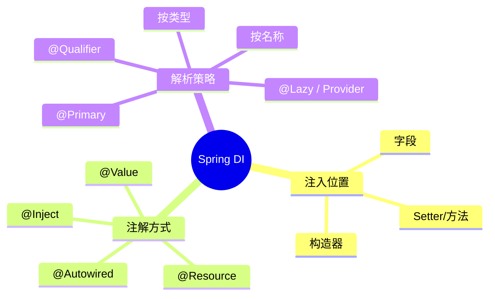

# Spring 依赖注入形式分类与 Demo

> 导航：[[00-Spring-Bean加载-学习导航]] · **100-Q&A** · 依赖注入
>
> 前置：[[20-依赖注入实现原理]] · [[12-扩展点层-BeanPostProcessor详解]]
>
> 关联：[[100-Q&A/Spring注入注解与byType-byName解析逻辑]] · [[21-循环依赖与三级缓存详解]]

---

## 一句话

Spring DI 可从 **注入位置**、**注解/配置方式**、**解析策略** 三个维度分类；构造器注入官方推荐，字段注入最常用但应谨慎。

---

## 分类总览



---

## 一、按注入位置分类

### 1. 构造器注入 — Spring 官方推荐

```java
@Service
public class OrderService {

    private final UserRepository userRepository;
    private final PaymentClient paymentClient;

    // 单个构造器时可省略 @Autowired（Spring 4.3+）
    public OrderService(UserRepository userRepository,
                        PaymentClient paymentClient) {
        this.userRepository = userRepository;
        this.paymentClient = paymentClient;
    }
}
```

| 特点 | 说明 |
|------|------|
| 依赖不可变 | 可 `final` |
| 易测试 | 构造时依赖明确 |
| 注入阶段 | `createBeanInstance` |
| 循环依赖 | Singleton 通常 **失败** |

---

### 2. 字段注入 — 最常见，核心服务慎用

```java
@Service
public class OrderService {

    @Autowired
    private UserRepository userRepository;

    @Autowired
    private PaymentClient paymentClient;
}
```

| 特点 | 说明 |
|------|------|
| 写法简洁 | 隐藏依赖、无法 `final` |
| 注入阶段 | `populateBean` |
| 循环依赖 | Singleton + 字段 → **三级缓存可解** |

→ [[21-循环依赖与三级缓存详解]]

---

### 3. Setter 注入

```java
@Service
public class OrderService {

    private UserRepository userRepository;

    @Autowired
    public void setUserRepository(UserRepository userRepository) {
        this.userRepository = userRepository;
    }
}
```

适用：可选依赖、运行期可替换的依赖。

---

### 4. 任意方法注入

```java
@Service
public class OrderService {

    private UserRepository userRepository;
    private PaymentClient paymentClient;

    @Autowired
    public void init(UserRepository userRepository, PaymentClient paymentClient) {
        this.userRepository = userRepository;
        this.paymentClient = paymentClient;
    }
}
```

---

## 二、按注解/规范分类

### 5. `@Autowired`（Spring 原生）

```java
@Service
public class Demo {

    @Autowired
    private UserRepository repo;

    @Autowired
    public Demo(@Qualifier("mysqlUserRepo") UserRepository repo) {
        this.repo = repo;
    }

    @Autowired(required = false)
    private AuditService auditService;  // 无对应 Bean 不报错
}
```

→ 解析逻辑：[[100-Q&A/Spring注入注解与byType-byName解析逻辑#二、@Autowired / @Inject 的解析逻辑]]

---

### 6. `@Resource`（JSR-250，按名称优先）

```java
@Service
public class Demo {

    @Resource(name = "mysqlUserRepo")
    private UserRepository userRepository;

    @Resource  // 默认按字段名 "userRepository" 找 Bean
    private UserRepository userRepository2;
}
```

| | `@Autowired` | `@Resource` |
|--|-------------|-------------|
| 来源 | Spring | JSR-250 |
| 默认策略 | 先类型，再名称 | **先名称，再类型** |
| 指定 Bean | `@Qualifier` | `name` 属性 |

---

### 7. `@Inject`（JSR-330）

```java
@Service
public class Demo {

    @Inject
    private UserRepository userRepository;
}
```

与 `@Autowired` 共用 `AutowiredAnnotationBeanPostProcessor`，解析逻辑相同；**不支持** `required=false`。

---

### 8. `@Value`（配置值 / SpEL）

```java
@Service
public class Demo {

    @Value("${app.name}")
    private String appName;

    @Value("${app.timeout:3000}")
    private int timeout;

    @Value("hello")
    private String literal;

    @Value("#{systemProperties['user.home']}")
    private String userHome;

    @Value("#{userRepository}")
    private UserRepository repo;
}
```

不走 Bean 类型查找，走 `doResolveDependency` Step 2。

---

## 三、按解析策略分类（多实现时）

### 9. `@Primary`（默认实现）

```java
@Primary
@Component
public class AlipayClient implements PaymentClient {}

@Component
public class WechatPayClient implements PaymentClient {}

@Service
public class OrderService {
    @Autowired
    private PaymentClient paymentClient;  // 注入 AlipayClient
}
```

---

### 10. `@Qualifier`（指定实现）

```java
@Autowired
@Qualifier("wechatPayClient")
private PaymentClient paymentClient;
```

---

### 11. 集合注入

```java
@Autowired
private List<MessageSender> senders;

@Autowired
private Map<String, MessageSender> senderMap;  // key = beanName

@Autowired
private MessageSender[] senderArray;
```

---

## 四、按时机分类

### 12. `@Lazy`

```java
@Lazy
@Autowired
private HeavyService heavyService;  // 代理，首次使用时创建
```

---

### 13. `ObjectProvider` / `ObjectFactory`

```java
@Service
public class OrderService {

    private final ObjectProvider<PaymentClient> paymentClientProvider;

    public OrderService(ObjectProvider<PaymentClient> paymentClientProvider) {
        this.paymentClientProvider = paymentClientProvider;
    }

    public void checkout() {
        PaymentClient client = paymentClientProvider.getIfAvailable();
        if (client != null) client.pay();
    }
}
```

适用：可选依赖、打破循环依赖、Prototype 注入 Singleton。

---

## 五、按配置来源分类

### 14. 注解配置

```java
@Configuration
@ComponentScan("com.example")
public class AppConfig {
    @Bean
    public DataSource dataSource() { return new HikariDataSource(); }
}
```

---

### 15. XML 配置

```xml
<bean id="orderService" class="com.example.OrderService" autowire="byType"/>
<bean id="orderService" class="com.example.OrderService">
    <property name="userRepository" ref="userRepository"/>
    <constructor-arg ref="paymentClient"/>
</bean>
```

| XML autowire | 含义 |
|--------------|------|
| `byName` | 属性名 = Bean id |
| `byType` | setter 参数类型 |
| `constructor` | 构造器注入 |

→ 详细逻辑：[[100-Q&A/Spring注入注解与byType-byName解析逻辑#四、XML autowire]]

---

### 16. 编程式注入

```java
@Bean
public OrderService orderService(ApplicationContext context) {
    OrderService service = new OrderService();
    context.getAutowireCapableBeanFactory().autowireBean(service);
    return service;
}
```

---

## 六、完整 Demo

```java
public interface UserRepository { String findName(Long id); }

@Repository("mysqlUserRepo")
@Primary
public class MysqlUserRepository implements UserRepository {
    public String findName(Long id) { return "Alice"; }
}

@Repository("redisUserRepo")
public class RedisUserRepository implements UserRepository {
    public String findName(Long id) { return "Bob"; }
}

@Service
public class UserAppService {

    private final UserRepository primaryRepo;

    @Autowired
    private UserRepository mysqlUserRepo;

    @Resource(name = "redisUserRepo")
    private UserRepository redisRepo;

    @Value("${app.title:Demo App}")
    private String appTitle;

    @Autowired
    private List<UserRepository> allRepos;

    public UserAppService(@Qualifier("mysqlUserRepo") UserRepository primaryRepo) {
        this.primaryRepo = primaryRepo;
    }

    @Autowired
    public void configure(@Value("${app.env}") String env) {
        System.out.println("env = " + env);
    }
}

@SpringBootApplication
public class DemoApplication {
    public static void main(String[] args) {
        SpringApplication.run(DemoApplication.class, args);
    }
}
```

`application.yml`：

```yaml
app:
  title: Spring DI Demo
  env: dev
```

---

## 七、速查对照表

| 分类维度 | 形式 | 典型注解/API | 注入阶段 |
|----------|------|-------------|----------|
| **位置** | 构造器 | 构造器 / `@Autowired` | `createBeanInstance` |
| | 字段 | `@Autowired` / `@Resource` / `@Inject` | `populateBean` |
| | Setter/方法 | 方法上的注解 | `populateBean` |
| **来源** | 注解 | `@Component` + DI 注解 | — |
| | XML | `<property>` / `autowire` | — |
| | 编程式 | `AutowireCapableBeanFactory` | — |
| **值类型** | Bean 依赖 | `@Autowired` 等 | — |
| | 配置值 | `@Value` | `populateBean` |
| **解析** | 按类型 | 默认 `@Autowired` Step 4b | — |
| | 按名称 | `@Resource` / 字段名 / `@Qualifier` | — |
| | 默认实现 | `@Primary` | — |
| **时机** | 立即 | 默认 | — |
| | 延迟 | `@Lazy` / `ObjectProvider` | — |

---

## 八、Spring 官方推荐

| 优先级 | 方式 | 原因 |
|:------:|------|------|
| ⭐⭐⭐ | **构造器注入** | 不可变、依赖明确、易测试 |
| ⭐⭐ | `ObjectProvider` / `@Lazy` | 可选依赖、延迟加载 |
| ⭐ | Setter 注入 | 可选、可变依赖 |
| ⚠️ | 字段注入 | 简洁但隐藏依赖 |

---

## 关联

- [[20-依赖注入实现原理]]
- [[100-Q&A/Spring注入注解与byType-byName解析逻辑]]
- [[21-循环依赖与三级缓存详解]]
- [[12-扩展点层-BeanPostProcessor详解]]
