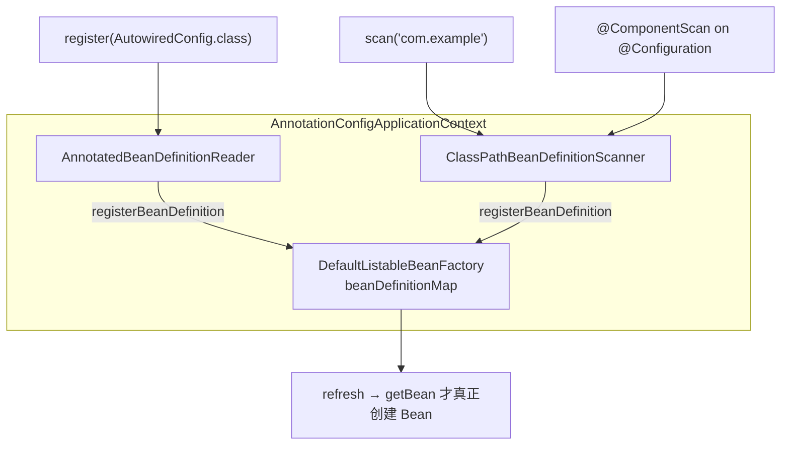
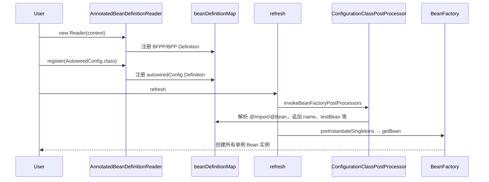
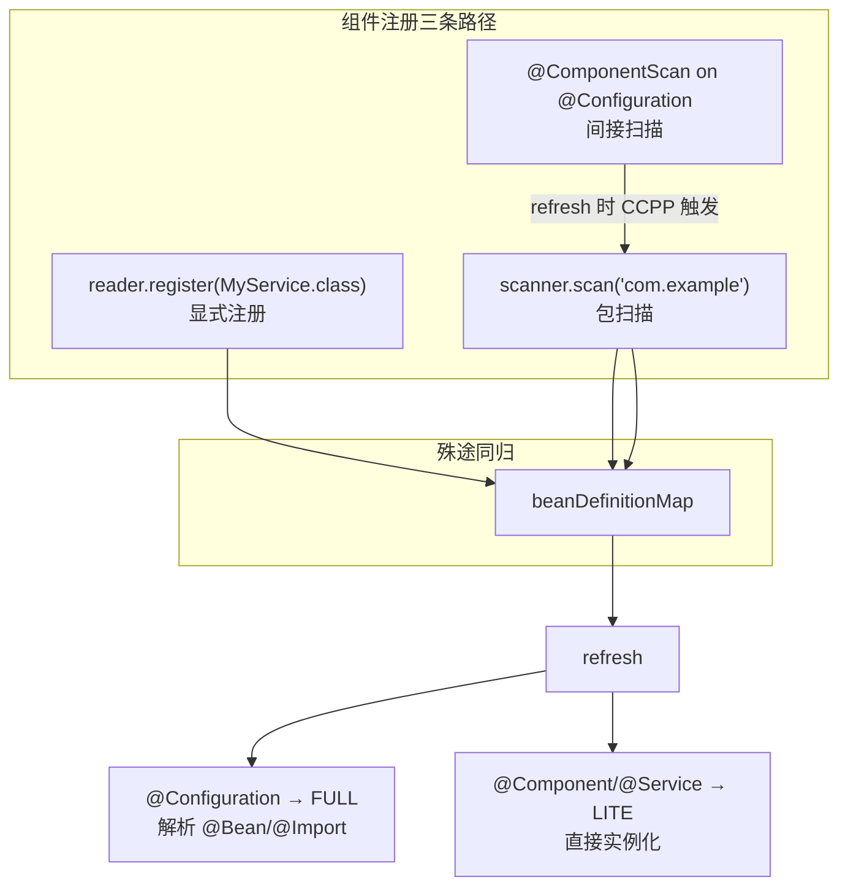

# AnnotatedBeanDefinitionReader 与组件注册详解

> 导航：[[00-Spring-Framework核心机制-学习导航]] · **20 · 结构与元数据** · 元数据层 · 注解扫描与组件注册
>
> 前置：[[1-元数据层-BeanDefinition三兄弟详解]] · [[1-注解入门-配置类与组件类]]
>
> 本地源码：
> - `spring-context/.../annotation/AnnotatedBeanDefinitionReader.java`
> - `spring-context/.../annotation/ClassPathBeanDefinitionScanner.java`
> - `spring-context/.../annotation/AnnotationConfigApplicationContext.java`
> - `spring-context/.../annotation/AnnotationConfigUtils.java`

---

## 一句话

**`AnnotatedBeanDefinitionReader`** = 注解版 **BeanDefinition 写入器**：把「你明确指定的 Class」变成 `BeanDefinition`，写入 `beanDefinitionRegistry`（`beanDefinitionMap`）。

- **不创建 Bean 实例**
- **不扫描 classpath**
- 只做：**Class → BeanDefinition → registerBeanDefinition**

> 包扫描的兄弟类是 [[#ClassPathBeanDefinitionScanner（包扫描）]]，两者殊途同归。

---

## 在容器中的位置

```text
AnnotationConfigApplicationContext
  ├── DefaultListableBeanFactory（beanDefinitionMap）
  ├── AnnotatedBeanDefinitionReader   ← register(Class) 显式注册
  └── ClassPathBeanDefinitionScanner  ← scan(package) 包扫描
```



---

## 四个核心字段

| 字段 | 作用 |
|------|------|
| `registry` | 写入目标，通常是 `ApplicationContext` 本身 |
| `beanNameGenerator` | 类 → beanName，如 `AutowiredConfig` → `autowiredConfig` |
| `scopeMetadataResolver` | 解析 `@Scope("prototype")` 等 |
| `conditionEvaluator` | 评估 `@Conditional` / `@Profile`，不满足则跳过注册 |

---

## 构造方法：搭好「注解容器」基础设施

`AnnotationConfigApplicationContext` 无参构造中会创建 Reader：

```java
this.reader = new AnnotatedBeanDefinitionReader(this);
```

### Reader 构造链路

```text
new AnnotatedBeanDefinitionReader(this)
  └─ this(this, getOrCreateEnvironment(this))
       ├─ ① this.registry = this
       │     ApplicationContext implements BeanDefinitionRegistry
       │
       ├─ ② new ConditionEvaluator(registry, environment, null)
       │     供 doRegisterBean 中 shouldSkip 评估 @Conditional
       │
       └─ ③ AnnotationConfigUtils.registerAnnotationConfigProcessors(registry)
             ★ 预注册基础设施 BeanDefinition（此时仍是定义，未实例化）
```

### ③ 预注册了哪些 Bean？

| Bean | 类型 | 何时生效 |
|------|------|----------|
| `ConfigurationClassPostProcessor` | BFPP | `refresh` 解析 `@Configuration` / `@Import` / `@Bean` |
| `AutowiredAnnotationBeanPostProcessor` | BPP | `populateBean` 处理 `@Autowired` |
| `CommonAnnotationBeanPostProcessor` | BPP | `@PostConstruct` / `@PreDestroy` |
| `EventListenerMethodProcessor` | BFPP | `@EventListener` |
| `DefaultEventListenerFactory` | BFPP | 事件监听器工厂 |

同时配置 BeanFactory：

- `AnnotationAwareOrderComparator` — `@Order` 排序
- `ContextAnnotationAutowireCandidateResolver` — `@Qualifier` 解析

> BFPP / BPP 详解 → [[1-扩展点层-BeanFactoryPostProcessor详解]] · [[2-扩展点层-BeanPostProcessor详解]]

---

## register 核心流程：doRegisterBean

以 `new AnnotationConfigApplicationContext(AutowiredConfig.class)` 为例：

```text
register(AutowiredConfig.class)
  └─ registerBean(AutowiredConfig.class)
       └─ doRegisterBean(...)
```

### 步骤拆解

| 步骤 | 代码 | 做什么 |
|:----:|------|--------|
| ① | `new AnnotatedGenericBeanDefinition(beanClass)` | ASM 解析类级注解，不加载实例 |
| ② | `conditionEvaluator.shouldSkip` | `@Conditional` 过滤 |
| ③ | `setAttribute(CANDIDATE_ATTRIBUTE, true)` | 标记配置类候选，供 BFPP 识别 |
| ④ | `generateBeanName` | 生成 beanName，如 `autowiredConfig` |
| ⑤ | `processCommonDefinitionAnnotations` | 读取 `@Lazy` / `@Primary` / `@DependsOn` |
| ⑥ | `applyScopedProxyMode` | `@Scope(proxyMode=TARGET_CLASS)` 代理包装 |
| ⑦ | `registerBeanDefinition` | 写入 `beanDefinitionMap` |

### register 之后、refresh 之前 Map 里有什么？

以 `autowiringIsEnabledByDefault` 测试为例：

```text
beanDefinitionMap:
  ├─ org.springframework.context.annotation.internalConfigurationAnnotationProcessor  (BFPP)
  ├─ org.springframework.context.annotation.internalAutowiredAnnotationProcessor      (BPP)
  ├─ org.springframework.context.annotation.internalCommonAnnotationProcessor         (BPP)
  ├─ ... (其他基础设施)
  └─ autowiredConfig   ← 用户注册的配置类（仅 Definition，无实例）
```

**还没有**：`name`（`NameConfig.@Bean`）、`testBean`（`AutowiredConfig.@Bean`）—— 这些在 `refresh` → `invokeBeanFactoryPostProcessors` 才追加。

---

## 与 refresh 的分工



| 阶段 | Reader 做了什么 | 没做什么 |
|------|----------------|----------|
| 构造 | 注册基础设施 BFPP/BPP | 不实例化 |
| register | 注册用户配置类 Definition | 不解析 `@Bean` / `@Import` |
| refresh | — | 由 BFPP/BPP / BeanFactory 接手 |

---

## 组件注解怎么注册？（@Component / @Service 等）

上一节主要用 `@Configuration` 举例，但 **Reader 不只服务配置类**。`@Component` 及其衍生注解有三条注册路径：

### 组件注解体系

```text
@Component          ← 根注解
  ├─ @Service
  ├─ @Repository
  ├─ @Controller
  └─ @Configuration  ← 也是 @Component 的元注解
```

### 三种注册方式对照

| 你手头有什么 | 怎么交给 Spring | 典型场景 |
|-------------|----------------|----------|
| `@Configuration` 类 | `reader.register(ThatClass.class)` | 测试、少量已知配置类 |
| 单个 `@Service` / `@Component` | `reader.register(ThatClass.class)` 也行 | 测试手动注册 |
| 一批 `@Component` 类 | `scanner.scan("包名")` | 生产环境批量发现 |
| Spring Boot 项目 | `@SpringBootApplication`（内含 `@ComponentScan`） | 最常用 |

---

### 方式 1：reader.register(MyService.class) — 显式注册

与 `@Configuration` **走同一套 `doRegisterBean`**，Reader 不区分注解类型：

```java
context.register(MyConfig.class);      // @Configuration
context.register(MyService.class);     // @Service
context.register(MyController.class);  // @Controller
```

区别在 **`refresh` 后 BFPP 如何分类**（`ConfigurationClassUtils.checkConfigurationClassCandidate`）：

| 注解 | CCPP 标记 | 后续行为 |
|------|-----------|----------|
| `@Configuration` | `CONFIGURATION_CLASS_FULL` | CGLIB 增强 + 解析 `@Bean` / `@Import` |
| `@Component` / `@Service` 等 | `CONFIGURATION_CLASS_LITE` | 类本身就是 Bean，直接实例化 |
| 普通类（无注解） | 不通过候选检查 | 可注册，但 refresh 时不被 CCPP 特殊处理 |

`@Service`、`@Repository` 带有 `@Component` 元注解，同样会被 `candidateIndicators` 识别：

```java
// ConfigurationClassUtils.java
Set.of(Component.class.getName, ComponentScan.class.getName, ...)
```

**测试常用写法：**

```java
AnnotationConfigApplicationContext ctx = new AnnotationConfigApplicationContext;
ctx.register(MyService.class);
ctx.refresh;
```

---

### 方式 2：scanner.scan("com.example") — 包扫描

**`@Service` / `@Controller` 在生产代码里的主流路径**：

```java
AnnotationConfigApplicationContext ctx = new AnnotationConfigApplicationContext;
ctx.scan("com.myapp.service", "com.myapp.web");
ctx.refresh;
```

```text
scan("com.example")
  └─ ClassPathBeanDefinitionScanner.doScan
       └─ findCandidateComponents(basePackage)
            ├─ classpath 扫描 **/*.class
            └─ TypeFilter 匹配 @Component（含 @Service/@Repository/@Controller）
       └─ registerBeanDefinition → beanDefinitionMap
```

---

### 方式 3：@ComponentScan — 配置类驱动的间接扫描

Spring Boot 和大多数项目实际使用的方式：

```java
@Configuration
@ComponentScan("com.myapp")
public class AppConfig { }
```

```text
register(AppConfig.class)          // Reader 注册配置类
refresh
  └─ ConfigurationClassPostProcessor
       └─ ConfigurationClassParser.parse
            └─ 发现 @ComponentScan
            └─ 创建 ClassPathBeanDefinitionScanner
            └─ scanner.scan("com.myapp")   // 间接调用 Scanner
```

**Reader 注册配置类 → refresh 时 BFPP 触发 Scanner**，这是 `@ComponentScan` 的真实工作方式。

---

### 三条路径汇总图



---

## @Configuration vs @Component 注册后行为差异

两者都能通过 Reader / Scanner 注册，但 refresh 后行为不同：

### @Configuration（FULL 模式）

```java
@Configuration
@Import(NameConfig.class)
public class AutowiredConfig {
    @Autowired String name;
    @Bean TestBean testBean { ... }
}
```

- CGLIB 增强配置类（保证 `@Bean` 单例）
- 解析 `@Import`、`@Bean`，**额外注册**更多 BeanDefinition
- 配置类本身也是一个 Bean

### @Service（LITE 模式）

```java
@Service
public class OrderService {
    @Autowired OrderRepository repo;
}
```

- **类本身就是 Bean**，没有 `@Bean` 工厂方法要解析
- `preInstantiateSingletons` 直接 `getBean("orderService")` 实例化
- `@Autowired` 仍由 `AutowiredAnnotationBeanPostProcessor` 在 `populateBean` 处理

> 配置类 vs 组件类角色对比 → [[1-注解入门-配置类与组件类]]

---

## ClassPathBeanDefinitionScanner（包扫描）

`AnnotationConfigApplicationContext` 无参构造中同时创建 Scanner：

```java
this.scanner = new ClassPathBeanDefinitionScanner(this);
```

### Scanner 构造链路

```text
new ClassPathBeanDefinitionScanner(this)
  └─ this(this, true, getOrCreateEnvironment(this), this)
       ├─ ① this.registry = this
       ├─ ② registerDefaultFilters
       │     @Component / @Service / @Repository / @Controller
       │     @ManagedBean / @Named（存在时）
       ├─ ③ setEnvironment(environment)
       └─ ④ setResourceLoader(this)
             PathMatchingResourcePatternResolver
             CachingMetadataReaderFactory（ASM 读注解，不加载类）
             CandidateComponentsIndex（spring.components 索引）
```

### Reader vs Scanner

| | Reader | Scanner |
|---|---|---|
| **输入** | 明确的 `Class<?>` | 包名 `"com.example"` |
| **发现** | 你指定 | classpath 自动扫描 |
| **构造时** | 注册 BFPP/BPP | 只初始化扫描能力，**不扫描** |
| **注册逻辑** | `doRegisterBean` | `doScan` → `findCandidateComponents` |
| **典型用途** | 测试、已知类 | 生产批量注册 |

Scanner 的 `scan` 末尾也会调 `registerAnnotationConfigProcessors`，但 Reader 构造时已注册，**幂等跳过**。

---

## 多种 registerBean 重载

Reader 提供多个重载，最终都汇聚到 `doRegisterBean`：

```java
registerBean(Class)                              // 最常用
registerBean(Class, String name)                 // 指定 beanName
registerBean(Class, Primary.class, ...)          // 编程式 @Primary
registerBean(Class, Supplier<T> supplier)        // 自定义实例创建
registerBean(Class, name, supplier, customizers) // 完全编程式
```

Spring Boot、`context.registerBean(...)` 底层也是这套机制。

---

## Debug 建议

测试类：`AnnotationConfigApplicationContextTests#autowiringIsEnabledByDefault`

| 断点 | 文件 | 看什么 |
|------|------|--------|
| Reader 构造 | `AnnotatedBeanDefinitionReader` | 基础设施 Definition 写入 |
| doRegisterBean | `AnnotatedBeanDefinitionReader` | Class → BeanDefinition |
| registerBeanDefinition | `DefaultListableBeanFactory` | Map 写入 |
| refresh | `AbstractApplicationContext` | BFPP 解析 @Bean |
| Scanner 四参构造 | `ClassPathBeanDefinitionScanner` | 扫描器初始化（不扫 classpath） |

**register 结束、refresh 开始前** 查看 `beanDefinitionMap`：应只有基础设施 + 用户配置类，是理解 Reader 边界的关键时刻。

> 完整 Debug 地图 → [[1-源码调试与断点指南]]

---

## FAQ：类存在但没有被使用，Spring 会怎样处理？

先区分“没有注册”和“注册后没有被引用”：

| 状态 | Spring 是否感知 | 默认结果 |
| --- | --- | --- |
| 类只存在于 classpath，没有注册为 Bean | 否 | 完全忽略，不创建 `BeanDefinition` |
| 已注册为非懒加载单例，但无人注入或调用 | 是 | `refresh` 末段仍会预实例化 |
| 已注册且标记 `@Lazy` | 是 | 保留定义，首次 `getBean` 时创建 |
| 已注册为 prototype Scope | 是 | 每次主动获取时创建 |
| `@Conditional` 条件不满足 | 否 | 不注册 `BeanDefinition` |
| 抽象 Bean 定义 | 是 | 可作为模板，但自身不实例化 |

Spring 不做“这个类有没有被业务代码使用”的死代码分析，只判断它是否形成 Bean 定义以及定义的作用域、懒加载和条件。

```text
类位于 classpath
  -> 是否通过扫描、@Bean、@Import 或显式 API 注册？
     -> 否：Spring 忽略
     -> 是：形成 BeanDefinition
        -> 非 lazy 单例：finishBeanFactoryInitialization 时预实例化
        -> lazy 单例：首次获取时实例化
        -> prototype：每次获取时实例化
```

几个直接后果：

- 非懒加载单例即使无人注入，也会执行依赖注入、`@PostConstruct` 和其他初始化回调。
- 手动 `new` 出来的对象不自动接受 Spring 注入和生命周期管理。
- 排查启动变慢时，应检查耗时的非懒加载单例，而不是只检查“被谁注入”。
- `@Service` 与 `@Bean` 只影响定义来源；注册完成后，同类作用域和懒加载配置遵循相同创建规则。

Bean 预实例化主线：[[2-Bean加载原理与源码阅读路径#非 lazy 单例的 eager 创建]]

---

## 记忆口诀

- **Reader** = 你指名道姓：`register(MyClass.class)`
- **Scanner** = 包路径自动发现：`scan("com.example")`
- **@ComponentScan** = 配置类里写扫描规则，refresh 时间接触发 Scanner
- **register 只写 Definition，refresh 才创建 Bean**

---

## 常见误区

| 误区 | 正解 |
|------|------|
| Reader 只能注册 `@Configuration` | 任何 Class 都能 register，`@Service` 也行 |
| register 会解析 `@Bean` | `@Bean` / `@Import` 要等 refresh 时 BFPP |
| Scanner 构造时就扫描了 | 构造只初始化，`scan` 调用时才扫 |
| `@Service` 和 `@Component` 注册路径不同 | 对 Spring 几乎一样，Scanner 用 `@Component` TypeFilter 统一匹配 |

---

## 篇章导航

| 上一篇 | 下一篇 |
|--------|--------|
| [[1-元数据层-BeanDefinition三兄弟详解]] | [[3-注册层-BeanDefinitionRegistry与DefaultListableBeanFactory详解]] |

---

## 关联

- [[00-Spring-Framework核心机制-学习导航]]
- [[1-注解入门-配置类与组件类]]
- [[2-Bean加载原理与源码阅读路径]]
- [[1-元数据层-BeanDefinition三兄弟详解]]
- [[5-Context层-ApplicationContext详解]]
- [[1-源码调试与断点指南]]
- [[1-扩展点层-BeanFactoryPostProcessor详解]]
- [[5-依赖注入实现原理]]
