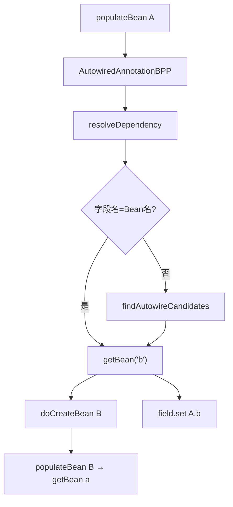
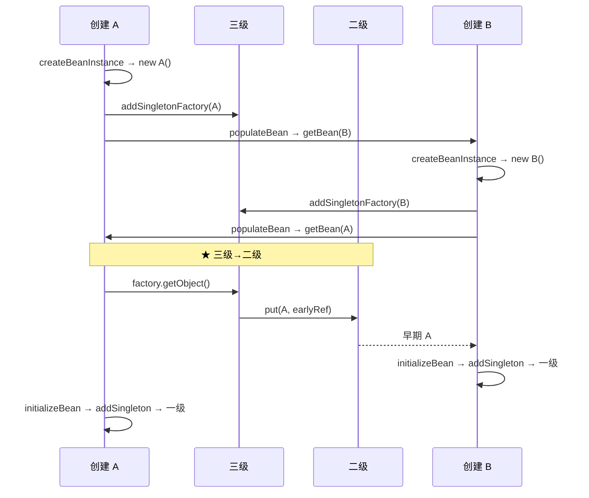

# 循环依赖与三级缓存详解

> 导航：[[00-Spring-Bean加载-学习导航]] · **下篇 16–25** · 循环依赖
>
> 源码：
> - `spring-beans/.../support/DefaultSingletonBeanRegistry.java`（三级缓存）
> - `spring-beans/.../support/AbstractAutowireCapableBeanFactory.java`（`doCreateBean` / `populateBean`）
> - `spring-beans/.../annotation/AutowiredAnnotationBeanPostProcessor.java`（`@Autowired` → `getBean`）
> - `spring-beans/.../support/DefaultListableBeanFactory.java`（`resolveDependency`）
> - `spring-aop/.../autoproxy/AbstractAutoProxyCreator.java`（`getEarlyBeanReference`）
>
> 前置：[[20-依赖注入实现原理]] · [[17-Bean加载原理与源码阅读路径]]
>
> 关联：[[22-Spring-AOP代理创建详解]] · [[12-扩展点层-BeanPostProcessor详解]] · [[25-源码调试与断点指南]]

---

## 文档结构

|           章节            | 内容                              |
| :---------------------: | ------------------------------- |
|   [[#一、问题：什么是循环依赖？]]    | 定义与后果                           |
|      [[#二、三级缓存概览]]      | 一/二/三级定义、`getSingleton` 查找顺序    |
|      [[#三、两种场景速览]]      | 无循环 vs 有循环 对照                   |
| [[#四、场景 A：无循环依赖（正常路径）]] | 三级注册了但 factory 不执行              |
| [[#五、场景 B：有循环依赖（A↔B）]]  | populate → getBean → 三级→二级 → 一级 |
|     [[#六、与注入方式的关系]]     | 构造器 / 字段 / Prototype            |
|    [[#七、AOP + 循环依赖]]    | 早期代理与一致性校验                      |
|     [[#八、解决不了的情况]]      | 速查表                             |
|  [[#九、源码行号 · 断点 · 面试]]  | 附录                              |

---

## 一句话

Spring **只对 Singleton + 字段/Setter 注入** 的循环依赖，用 **三级缓存** 提前暴露「半成品 Bean」；无循环时三级只是**预防性注册**，factory 不执行，依赖直接从**一级**取成品；有循环时 `populateBean` 经 **AutowiredAnnotationBeanPostProcessor** 触发 nested `getBean`，三级 **懒提升** 到二级。

---

## 一、问题：什么是循环依赖？

```java
@Service
class A { @Autowired B b; }

@Service
class B { @Autowired A a; }
```

```text
创建 A → populateBean → getBean(B)
       → 创建 B → populateBean → getBean(A) → 需要 early reference
```

若没有机制，会无限递归或永远等对方创建完。

---

## 二、三级缓存概览

**定义位置：** `DefaultSingletonBeanRegistry.java` L81–91

| 级别 | 字段 | 内容 | 写入时机 | 读出时机 |
|:----:|------|------|----------|----------|
| **一级** | `singletonObjects` | 完全初始化好的单例（成品） | `addSingleton()` | 任何 `getBean` 缓存命中 |
| **二级** | `earlySingletonObjects` | 早期暴露的实例（半成品或早期代理） | 有人**第一次**从三级 factory 取出后 | 循环依赖方再次 `getSingleton` |
| **三级** | `singletonFactories` | `ObjectFactory`，**延迟生成** early reference | `addSingletonFactory()` | 循环依赖方第一次 `getSingleton` 且二级为空 |

> **易混点：** `addSingletonFactory` 只进三级，**不等于**进二级。二级是懒提升，见 [[#5.3 三级 → 二级：何时提升？]]。

### `getSingleton(beanName)` 查找顺序

**位置：** `DefaultSingletonBeanRegistry.java` L226–264

```text
getSingleton(beanName, allowEarlyReference=true)
  ① singletonObjects.get(beanName)              成品，直接返回
  ② isSingletonCurrentlyInCreation(beanName)?
       earlySingletonObjects.get(beanName)       早期引用（已提升过）
  ③ singletonFactories.get(beanName)
       factory.getObject() → getEarlyBeanReference()
       ★ singletonFactories.remove + earlySingletonObjects.put   三级 → 二级
```

### 何时注册三级缓存

**位置：** `AbstractAutowireCapableBeanFactory.doCreateBean()` L601–611

```java
boolean earlySingletonExposure = (mbd.isSingleton()
    && this.allowCircularReferences              // 默认 true；Boot 2.6+ 可 false
    && isSingletonCurrentlyInCreation(beanName));

if (earlySingletonExposure) {
    addSingletonFactory(beanName, () -> getEarlyBeanReference(beanName, mbd, bean));
}
```

**在 doCreateBean 中的位置：**

```text
doCreateBean()
├─ createBeanInstance()              实例化（rawBean，依赖字段还是 null）
├─ addSingletonFactory()             ★ 三级（L611），必须在 populateBean 之前
├─ populateBean()                    @Autowired → nested getBean
├─ initializeBean()                  init + AOP
└─ 早期引用 vs 最终对象一致性校验（L631–657，仅 factory 执行过才生效）
```

---

## 三、两种场景速览

| | **无循环依赖**（A→B） | **有循环依赖**（A↔B） |
|--|----------------------|----------------------|
| 三级注册 | ✅ 同样 `addSingletonFactory` | ✅ |
| factory 执行 | ❌ 通常不执行 | ✅ B 要 A 时执行 |
| 二级 | 始终空 | 有 early reference |
| 依赖取值 | 一级成品 | 二级半成品 / 早期代理 |
| 一致性校验 | 跳过（earlyRef=null） | 可能执行 |
| 最终 | `addSingleton` 进一级，清二/三级 | 同上 |

→ 详细展开：[[#四、场景 A：无循环依赖（正常路径）]] · [[#五、场景 B：有循环依赖（A↔B）]]

---

## 四、场景 A：无循环依赖（正常路径）

### 示例：A 依赖 B（单向）

```java
@Service
class A { @Autowired B b; }

@Service
class B { /* 不依赖 A */ }
```

### 时间线

```text
getBean("a")
  getSingleton("a") miss → 开始创建

  doCreateBean("a")
    createBeanInstance()        → new A()
    addSingletonFactory("a")  → 三级 ✅ | 二级 — | 一级 —

    populateBean(a) 需要 B
      getBean("b")
        getSingleton("b") miss
        doCreateBean("b")
          createBeanInstance() → new B()
          addSingletonFactory("b")   → B 进三级
          populateBean(b)            → B 无依赖
          initializeBean(b)
          addSingleton("b")          → B 进一级 ✅，清 B 二/三级
        返回成品 B（一级命中）

      field.set(A.b, B)
      ★ 全程没人 getBean("a")，A 的三级 factory 从未执行

    initializeBean(a)
    addSingleton("a")           → A 进一级 ✅，清 A 二/三级

再次 getBean("a") / getBean("b") → 一级直接命中
```

### A 的缓存状态

| 阶段 | 一级 | 二级 | 三级 |
|------|:----:|:----:|:----:|
| `createBeanInstance(A)` 后 | — | — | — |
| `addSingletonFactory(A)` 后 | — | — | ✅ factory（备用，未用） |
| `populateBean` 注入 B 期间 | — | — | ✅ factory |
| `addSingleton(A)` 后 | ✅ 成品 A | — | — |

**二级始终为空**——没有循环，就不会有人在中途 `getBean(A)`。

### 三个关键机制

**① 依赖已创建 → 直接走一级**

```text
doGetBean("b") → getSingleton("b") → singletonObjects 命中 → 返回成品
```

**② 三级 factory 是「保险」，不是主路径**

每个 Singleton（`allowCircularReferences=true`）都会注册三级，但 **只有被请求 early reference 时才执行**。无环时 factory 闲置，`addSingleton` 时一并清除。

**③ 早期引用一致性校验跳过**

```java
// doCreateBean L633–635
Object earlySingletonReference = getSingleton(beanName, false);
if (earlySingletonReference != null) { ... }  // 无环时 null，整段跳过
```

### 依赖链 A → B → C（仍无环）

```text
创建 A：三级 A → getBean(B)
  创建 B：三级 B → getBean(C)
    创建 C：三级 C → populate 无依赖 → addSingleton(C) 一级
  addSingleton(B) 一级
addSingleton(A) 一级
```

每层三级都是「注册了但未用」；存活的是**一级成品**。

### 关闭循环引用支持（Boot 2.6+）

`spring.main.allow-circular-references=false` → 不 `addSingletonFactory`，路径更短：

```text
实例化 → populate → initialize → addSingleton 一级
```

---

## 五、场景 B：有循环依赖（A↔B）

### 5.1 populateBean 如何跳到 getBean？

**`populateBean` 不直接调 `getBean`**，经 BPP 间接触发：

```text
doCreateBean("a")
  populateBean("a")                                   // L1425
    AutowiredAnnotationBeanPostProcessor
      .postProcessProperties()                         // L506
        metadata.inject()                               // L509
          AutowiredFieldElement.inject()                // L752
            resolveFieldValue()
              resolveDependency(desc, "a", ...)         // L784
                doResolveDependency()
                  getBean("b")  ★
            field.set(A.b, value)
```

**resolveDependency → getBean 两条路径：**

| 路径 | 条件 | 代码 |
|------|------|------|
| **A** 字段名=Bean名 | `@Autowired B b`，Bean 名也是 `"b"` | `doResolveDependency` Step3 → `getBean("b")` L1772 |
| **B** 按类型匹配 | 字段名≠Bean名，或唯一实现 | `findAutowireCandidates` → `resolveCandidate` → `getBean` L1834 |

→ 构造器注入不走此路径：[[20-依赖注入实现原理#构造器注入 DI 地图]]



### 5.2 完整时间线

```text
1. getBean("a")
     doCreateBean("a")
       createBeanInstance()           → new A()
       addSingletonFactory("a")       → 三级
       populateBean(a)
         resolveDependency → getBean("b")

2. getBean("b")
     doCreateBean("b")
       createBeanInstance()           → new B()
       addSingletonFactory("b")       → 三级
       populateBean(b)
         resolveDependency → getBean("a")
           getSingleton("a")          ★ factory → 二级 → 早期 A
         注入 B.a = 早期 A
       initializeBean(b) → addSingleton("b") → 一级

3. 回到 A
       populateBean 注入完整 B
       initializeBean(a) → addSingleton("a") → 一级
```

### 5.3 三级 → 二级：何时提升？

**当 B 在 populateBean 嵌套 `getBean(A)`，而 A 正在创建中、一级/二级都没有时，调用三级 factory 并立刻写入二级。**

| # | 条件 | 含义 |
|:-:|------|------|
| ① | 一级未命中 | Bean 还没完全创建好 |
| ② | `isSingletonCurrentlyInCreation` | 正在创建中 |
| ③ | 二级未命中 | **第一次**被循环方请求 |
| ④ | `allowEarlyReference == true` | `getSingleton(name)` 默认 true |

```java
// DefaultSingletonBeanRegistry L244–249
singletonObject = singletonFactory.getObject();           // → getEarlyBeanReference()
this.singletonFactories.remove(beanName);                 // 从三级移除
this.earlySingletonObjects.put(beanName, singletonObject); // ★ 写入二级
```



### 5.4 A 的缓存状态（有环）

| 阶段 | 一级 | 二级 | 三级 |
|------|:----:|:----:|:----:|
| `addSingletonFactory(A)` 后 | — | — | ✅ factory |
| B 第一次 `getBean(A)` 后 | — | ✅ early A | — |
| 再次 `getBean(A)` | — | ✅ early A | — |
| `addSingleton(A)` 后 | ✅ 成品 A | — | — |

### 5.5 缓存完整生命周期（有环）

```text
① createBeanInstance(A)     堆上有 raw 对象，缓存为空
② addSingletonFactory(A)    三级 ✅，二级仍空
③ B getBean(A)              factory 执行 → 二级 ✅，三级清除
④ 再次 getBean(A)           直接读二级
⑤ addSingleton(A)           一级 ✅，清二/三级
```

### 容易误解

| 误解 | 实际 |
|------|------|
| `addSingletonFactory` 时就进二级 | ❌ 只进三级 |
| 无循环也会走二级 | ❌ 二级始终空，factory 不执行 |
| `initializeBean` 后进二级 | ❌ 完成后直接 `addSingleton` 进一级 |

---

## 六、与注入方式的关系

| 注入方式 | 循环依赖 | 原因 |
|----------|:--------:|------|
| **字段 / Setter `@Autowired`** | ✅ 三级缓存 | 先 `new` 空壳，populate 时才要依赖 |
| **构造器注入** | ❌ 失败 | 实例化时就要 B，无法先暴露 |
| **Prototype** | ❌ 失败 | 不进入单例缓存 |
| **`@DependsOn` 成环** | ❌ 失败 | 显式依赖环，直接抛异常 |

---

## 七、AOP + 循环依赖

B 注入 A 时，三级 factory 回调 `getEarlyBeanReference()`（L991–1000）：

```text
getEarlyBeanReference(beanName, mbd, rawBean)
  → AbstractAutoProxyCreator.getEarlyBeanReference()
       → wrapIfNecessary()          可能提前返回 A 的代理
```

A 在 `initializeBean` 末尾：`earlyBeanReferences` 已有记录 → 不再重复 wrap。

**不一致风险：** 早期注入 raw A，最终 proxy A → `doCreateBean` L639–655 可能抛异常。  
→ 完整 raw/proxy 替换机制：[[22-Spring-AOP代理创建详解#六、代理在 doCreateBean 中的时机与替换]]

---

## 八、解决不了的情况

| 场景 | 现象 |
|------|------|
| 构造器循环 `A(B)` + `B(A)` | `BeanCurrentlyInCreationException` |
| Prototype 互引 | 创建检测失败 |
| `@DependsOn` 双向 | `Circular depends-on relationship` |
| `allowCircularReferences=false` | 不注册 factory，循环直接失败 |

Spring 官方建议：**不要依赖循环引用**，能改设计就改。

---

## 九、源码行号 · 断点 · 面试

### 源码行号地图

| 步骤 | 类 | 行号 |
|------|-----|------|
| 三级 Map 定义 | `DefaultSingletonBeanRegistry` | L81–91 |
| `addSingletonFactory` | `DefaultSingletonBeanRegistry` | L192–197 |
| `getSingleton` 三级→二级 | `DefaultSingletonBeanRegistry` | L226–264 |
| `addSingleton` 写入一级 | `DefaultSingletonBeanRegistry` | L166–181 |
| `doGetBean` 一级缓存命中 | `AbstractBeanFactory` | L259–274 |
| `populateBean` → BPP | `AbstractAutowireCapableBeanFactory` | L1471–1483 |
| `postProcessProperties` / inject | `AutowiredAnnotationBeanPostProcessor` | L506–509、L752–784 |
| `resolveDependency` → `getBean` | `DefaultListableBeanFactory` | L1696–1777、L1833–1836 |
| 注册三级条件 | `AbstractAutowireCapableBeanFactory.doCreateBean` | L601–611 |
| 早期 vs 最终校验 | `AbstractAutowireCapableBeanFactory.doCreateBean` | L631–657 |
| `getEarlyBeanReference` | `AbstractAutowireCapableBeanFactory` | L991–1000 |
| AOP 早期代理 | `AbstractAutoProxyCreator` | L265–268 |

### 调试断点

| 顺序 | 位置 | 看什么 |
|:----:|------|--------|
| 1 | `doCreateBean` L611 | 是否 `addSingletonFactory` |
| 2 | `populateBean` L1477 | 是否进入 BPP |
| 3 | `resolveDependency` L1772/L1834 | 是否 nested `getBean` |
| 4 | `getSingleton` L244–249 | 三级→二级（**仅有环时命中**） |
| 5 | `getEarlyBeanReference` | AOP 早期代理 |
| 6 | `doCreateBean` L633–657 | 早期 vs 最终一致性 |

条件断点：`"a".equals(beanName)` 打在 `doCreateBean` 入口。  
配合 [[25-源码调试与断点指南]]。

### 常见面试题

| 问题 | 答案 |
|------|------|
| 三级缓存分别存什么？ | 一级成品、二级早期引用、三级 ObjectFactory |
| 无循环时缓存怎么用？ | 三级预防性注册但 factory 不执行；依赖从一级取；完成后 addSingleton 清二/三级 |
| populateBean 怎么触发 getBean？ | `AutowiredAnnotationBeanPostProcessor` → `resolveDependency` → `getBean` |
| 三级什么时候升到二级？ | populate 嵌套 getBean 且四条件满足时 factory.getObject() |
| 为什么需要三级，二级不够？ | 三级存 factory，延迟 `getEarlyBeanReference`（含 AOP 决策） |
| 构造器循环为什么不行？ | 实例化就要依赖，无法 early expose |
| `@Lazy` 能打破循环吗？ | 注入代理，用时再创建，间接缓解 |

### 记忆口诀

```text
无环正常路径      → 三级注册了但不用，依赖取一级成品
有环应急路径      → populate → getBean → 三级 factory → 二级 early ref
populate 之前     → addSingletonFactory（只进三级）
全部完成          → addSingleton 进一级，清空二/三级
构造器 / Prototype → 直接挂
AOP 有环          → getEarlyBeanReference 可能提前代理
```

---

## 篇章导航

| 上一篇 | 下一篇 |
|--------|--------|
| [[20-依赖注入实现原理]] | [[22-Spring-AOP代理创建详解]] |

## 关联

- [[00-Spring-Bean加载-学习导航]]
- [[17-Bean加载原理与源码阅读路径]]
- [[20-依赖注入实现原理]]
- [[22-Spring-AOP代理创建详解]]
- [[12-扩展点层-BeanPostProcessor详解]]
- [[25-源码调试与断点指南]]
