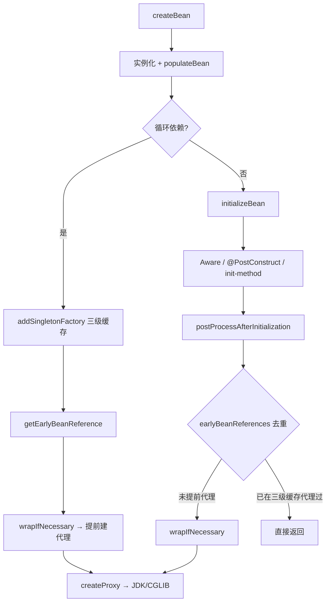

# Spring AOP 代理创建详解

> 导航：[[00-Spring-Bean加载-学习导航]] · **下篇 16–25** · AOP 机制与源码
>
> 前置：[[12-扩展点层-BeanPostProcessor详解]] · [[13-生命周期层-Aware体系详解]] · 上篇 [[06-元数据层-BeanDefinition三兄弟详解]]
>
> 关联：[[01-注解入门-配置类与组件类]] · [[18-refresh方法详解]] · [[25-源码调试与断点指南]]
>
> 本地源码：`/Users/guoyang/IdeaProjects/spring/spring-framework`
> - `spring-aop/.../autoproxy/AbstractAutoProxyCreator.java`
> - `spring-aop/.../DefaultAopProxyFactory.java`
> - `spring-context/.../ConfigurationClassEnhancer.java`

---

## 一句话

Spring **不会**给所有 Bean 都创建代理。只有 `AbstractAutoProxyCreator` 判定「有匹配的 Advisor」时，才会在 BPP 链里把原始对象包装成 **JDK 动态代理** 或 **CGLIB 代理**；`@Configuration` 的 CGLIB 增强是另一套机制，与 AOP 无关。

---

## 一、代理对象生成方式总览

Spring 里「看起来像代理」的对象，来源不止一种：

```text
                    Spring 代理生成
                          │
          ┌───────────────┼───────────────┐
          ▼               ▼               ▼
     AOP 代理      @Configuration 增强   Scoped 代理
  （本文主体）    ConfigurationClassEnhancer   ScopedProxyFactoryBean
          │
    DefaultAopProxyFactory
          │
    ┌─────┴─────┐
    ▼           ▼
 JDK 动态代理   CGLIB 子类
```

| 机制 | 技术 | 何时生成 | 目的 |
|------|------|----------|------|
| **AOP 代理** | JDK / CGLIB | `postProcessAfterInitialization` | 事务、切面、缓存等拦截 |
| **@Configuration 增强** | CGLIB 子类 | 配置类实例化时 | `@Bean` 方法互调走容器单例 |
| **Scoped 代理** | JDK / CGLIB | 注册 scoped Bean 时 | request / session 等短生命周期 |

---

## 二、两种「看起来像代理」的机制（AOP vs 配置类）

| 机制 | 触发条件 | 源码入口 | 目的 |
|------|----------|----------|------|
| **AOP 代理** | 有匹配的 Advisor（`@Transactional`、切面等） | `AbstractAutoProxyCreator` | 事务、缓存、切面拦截 |
| **配置类 CGLIB 增强** | `@Configuration` 且 `proxyBeanMethods=true`（默认） | `ConfigurationClassEnhancer.enhance()` | `@Bean` 方法间调用保证单例 |

**不要混淆：** 配置类被 CGLIB 增强 ≠ 该 Bean 有 AOP 能力；`@Bean` 产出的业务 Bean 也**默认不是** AOP 代理。

### @Configuration 增强在做什么？

```java
@Configuration
public class AppConfig {
    @Bean public A a() { return new A(); }
    @Bean public B b() { return new B(a()); }  // 增强后 a() 从容器取，不是 new
}
```

`ConfigurationClassEnhancer` 生成 CGLIB 子类，**重写** `@Bean` 方法：优先 `beanFactory.getBean()`，保证单例语义。与 AOP 拦截链无关。

---

## 三、哪些 Bean 默认是普通对象？

| Bean 类型 | 默认是否 AOP 代理 | 说明 |
|-----------|:------------------:|------|
| `@Component` / `@Service` / `@Repository` | ❌ | 无匹配 Advisor 就是普通对象 |
| `@Configuration` 配置类本身 | ❌ | 可能有 **ConfigurationClassEnhancer** 的 CGLIB，但不是 AOP |
| `@Bean` 方法创建的 Bean | ❌ | 同组件类，看 Advisor 是否匹配 |
| 带 `@Transactional` / 切面匹配的类 | ✅ | 满足 Advisor 条件才代理 |
| `@Aspect` / `Advisor` / `Advice` 等 | ❌ | 基础设施类，永远不 AOP 代理 |

### 常见注解会不会创建 AOP 代理？

| 注解 | 是否触发 AOP 代理 | 机制 |
|------|:----------------:|------|
| `@Slf4j` | ❌ | Lombok **编译期**生成 `log` 字段，与 Spring 无关 |
| `@PostConstruct` / `@PreDestroy` | ❌ | `InitDestroyAnnotationBeanPostProcessor` 反射调用，返回原 Bean |
| `@Autowired` / `@Value` | ❌ | 依赖注入，不包装代理 |
| `@Transactional` | ✅ | 事务 Advisor 匹配 |
| `@Cacheable` | ✅ | 缓存 Advisor 匹配 |
| `@Async` | ✅ | `AsyncAnnotationBeanPostProcessor` 也会包装代理 |

---

## 四、AutoProxyCreator 类继承体系

Spring AOP 代理的**核心枢纽**是 `AbstractAutoProxyCreator`——它把自身注册为 BPP，在 Bean 初始化完成后决定是否用代理替换原始对象。

```text
AbstractAutoProxyCreator                    ← wrapIfNecessary / createProxy / buildProxy
  └ AbstractAdvisorAutoProxyCreator           ← 收集容器中所有 Advisor Bean
       └ AspectJAwareAdvisorAutoProxyCreator
            └ AnnotationAwareAspectJAutoProxyCreator   ← @EnableAspectJAutoProxy 注册
```

| 类 | 职责 |
|----|------|
| `AbstractAutoProxyCreator` | 代理创建框架：`wrapIfNecessary()`、JDK/CGLIB 决策、`earlyBeanReferences` 去重 |
| `AbstractAdvisorAutoProxyCreator` | `findEligibleAdvisors()` — 从容器找 Advisor 并过滤 |
| `AnnotationAwareAspectJAutoProxyCreator` | 解析 `@Aspect` 类，与 XML/Advisor Bean 合并 |

**接入容器：**

```text
@EnableAspectJAutoProxy
  → AspectJAutoProxyRegistrar
  → 注册 AnnotationAwareAspectJAutoProxyCreator（BPP）
```

它实现 `SmartInstantiationAwareBeanPostProcessor`，因此能参与三个关键节点：

| 回调 | 作用 |
|------|------|
| `postProcessBeforeInstantiation()` | 仅自定义 TargetSource 时短路实例化 |
| `getEarlyBeanReference()` | 循环依赖 + AOP 时提前暴露代理 |
| `postProcessAfterInitialization()` | **绝大多数** AOP 的常规创建入口 |

---

## 五、创建代理的前提条件

### 5.1 容器里必须有 AutoProxyCreator

`@EnableAspectJAutoProxy` → `AspectJAutoProxyRegistrar` → 注册 `AnnotationAwareAspectJAutoProxyCreator`（一种 BPP）。

没有这个 BPP，`wrapIfNecessary()` 根本不会执行。

### 5.2 核心决策：`wrapIfNecessary()`

**位置：** `AbstractAutoProxyCreator.wrapIfNecessary()`

源码里用 ①–⑥ 标注的完整决策流程：

| 步骤 | 条件 | 结果 |
|:----:|------|------|
| ① | `targetSourcedBeans` 已包含 `beanName` | 返回原 Bean（已在 `postProcessBeforeInstantiation` 处理） |
| ② | `advisedBeans[cacheKey] == FALSE` | 返回原 Bean（缓存命中「不代理」） |
| ③ | `isInfrastructureClass()` 或 `shouldSkip()` | 返回原 Bean，缓存 FALSE |
| ④ | `getAdvicesAndAdvisorsForBean()` 返回 `DO_NOT_PROXY`（null） | 不代理 |
| ⑤ | 有匹配 Advisor | `createProxy()` → `SingletonTargetSource(bean)` → 返回代理 |
| ⑥ | 无匹配 Advisor | 缓存 FALSE，返回原 Bean |

```text
wrapIfNecessary(bean, beanName, cacheKey)
│
├─ ① targetSourcedBeans 已包含 beanName？          → 返回原 Bean
├─ ② advisedBeans 缓存已是 FALSE？                 → 返回原 Bean
├─ ③ isInfrastructureClass() 或 shouldSkip()？   → 返回原 Bean，缓存 FALSE
│
├─ ④ getAdvicesAndAdvisorsForBean() != DO_NOT_PROXY → ⑤ createProxy()，返回代理
└─ ⑥ 否则                                          → 返回原 Bean，缓存 FALSE
```

**关键点：** 代理用的是**初始化完毕的 raw bean**（`SingletonTargetSource(bean)`），因此 `@PostConstruct` / `InitializingBean` 跑在 target 上，而不是 proxy 上。

### 5.3 Advisor 从哪里来？

`getAdvicesAndAdvisorsForBean()` 是 `AbstractAutoProxyCreator` 的**抽象方法**，由子类决定 Advisor 来源：

| 来源 | 机制 | 典型场景 |
|------|------|----------|
| `@Aspect` 类 | `AspectJAdvisorFactory` 解析切点 | `@Around` / `@Before` |
| 容器中的 Advisor Bean | `AbstractAdvisorAutoProxyCreator.findAdvisorBeans()` | XML `<aop:advisor>` |
| 基础设施 Advisor | `InfrastructureAdvisorAutoProxyCreator` | `@Transactional`、`@Cacheable` |

```text
getAdvicesAndAdvisorsForBean(beanClass, beanName, null)
  → AbstractAdvisorAutoProxyCreator
       → findEligibleAdvisors()
            → findCandidateAdvisors()      // 容器里所有 Advisor
            → findAdvisorsThatCanApply()   // AopUtils 切点匹配
```

### 5.4 不创建代理的具体条件

**基础设施类 `isInfrastructureClass()`：**

- `Advice`、`Pointcut`、`Advisor`、`AopInfrastructureBean`
- AspectJ 模式下：`@Aspect` 类也算基础设施（`AnnotationAwareAspectJAutoProxyCreator` 重写）

**应跳过 `shouldSkip()`：**

- Bean 名是「原始实例」（`ORIGINAL_INSTANCE_SUFFIX`）
- 切面 Bean **不代理自己**（beanName == aspectName）

**无可用 Advisor：**

```java
// AbstractAdvisorAutoProxyCreator
List<Advisor> advisors = findEligibleAdvisors(beanClass, beanName);
if (advisors.isEmpty()) {
    return DO_NOT_PROXY;  // null → 不代理
}
```

Advisor 要能 **apply 到该 Bean**（`AopUtils.findAdvisorsThatCanApply`）：

- `ClassFilter` 匹配目标类
- `MethodMatcher` 至少匹配该类上的一个方法

---

## 六、代理在 `doCreateBean` 中的三个时机

| 时机 | 回调 | 典型场景 |
|------|------|----------|
| **实例化之前** | `postProcessBeforeInstantiation()` | 仅 **自定义 TargetSource**（如 LazyInitTargetSource）；**不是**普通 `@Transactional` 路径 |
| **初始化之后** | `postProcessAfterInitialization()` → `wrapIfNecessary()` | **绝大多数** AOP（`@Transactional`、`@Cacheable`、切面） |
| **循环依赖早期引用** | `getEarlyBeanReference()` → `wrapIfNecessary()` | A、B 循环依赖且 A 需要被代理 |

### 两条路径总览



### 与 `AbstractAutowireCapableBeanFactory` 的源码衔接

**常规路径** — `initializeBean()` 末尾：

```text
AbstractAutowireCapableBeanFactory.initializeBean()
  → applyBeanPostProcessorsAfterInitialization(wrappedBean, beanName)
       → AbstractAutoProxyCreator.postProcessAfterInitialization()
            → wrapIfNecessary()
                 → createProxy()
```

**循环依赖路径** — 三级缓存 `ObjectFactory` 回调：

```text
AbstractAutowireCapableBeanFactory.getEarlyBeanReference()
  → SmartInstantiationAwareBPP.getEarlyBeanReference()
       → AbstractAutoProxyCreator.getEarlyBeanReference()
            → earlyBeanReferences.put(cacheKey, bean)   // 记录 raw bean
            → wrapIfNecessary()                        // 可能提前返回 proxy
```

### `initializeBean()` 内的顺序（与 `@PostConstruct` 的关系）

```text
initializeBean()
├─ invokeAwareMethods()
├─ postProcessBeforeInitialization()     ← @PostConstruct 在这里（原始对象上执行）
├─ invokeInitMethods()                   ← InitializingBean / init-method
└─ postProcessAfterInitialization()      ← ★ AOP 代理在这里创建
```

**结论：** `@PostConstruct` 跑在代理创建**之前**，回调里的 `this` 是原始 Bean，不是代理。

### `earlyBeanReferences` 防重复代理

`postProcessAfterInitialization()` 中的去重逻辑：

```text
cacheKey = getCacheKey(bean.getClass(), beanName)
  // FactoryBean 用 "&beanName"，普通 Bean 用 beanName，无名称时用 Class

if (earlyBeanReferences.remove(cacheKey) != bean) {
    return wrapIfNecessary(bean, beanName, cacheKey);   // 未提前处理 → 常规 wrap
}
return bean;   // remove 返回值 == bean → 已在 getEarlyBeanReference 中代理过
```

| 场景 | `earlyBeanReferences.remove()` 返回值 | 行为 |
|------|--------------------------------------|------|
| 无循环依赖 | `null`（map 无此 key） | 走 `wrapIfNecessary()` |
| 循环依赖 + 已提前代理 | `rawBean`（== 当前 bean） | 直接返回，不重复代理 |
| 循环依赖 + 未匹配 Advisor | `rawBean` | 直接返回原 Bean |

---

## 七、一个接口多个实现 / 多个子类

Spring **按每个具体 Bean 独立判断**，不会给「接口」或「继承体系」统一加代理。

```java
public interface OrderService { void create(); }

@Service
class OrderServiceImpl implements OrderService {
    @Transactional
    public void create() { ... }   // → 会代理
}

@Service
class OrderServiceMock implements OrderService {
    public void create() { ... }   // → 不代理（无匹配 Advisor）
}
```

| 场景 | 结果 |
|------|------|
| 接口 N 个实现，只有部分有 `@Transactional` | 只有那些实现被代理 |
| 父类方法有 `@Transactional`，子类未重写 | 子类 Bean 通常也会代理 |
| 子类重写方法且未加事务 | 看切点是否仍匹配重写后的方法 |
| 多个 `@Slf4j` 实现类 | 全部是普通对象 |

注入 `OrderService` 时拿到的是 **被选中的那个 Bean**；它有没有代理，取决于 **那个实现类** 是否匹配 Advisor，与其他实现无关。

---

## 八、JDK 代理 vs CGLIB：生成方式与决策

### 8.1 两种代理如何「生成对象」

**JDK 动态代理** — `JdkDynamicAopProxy.getProxy()`：

```java
return Proxy.newProxyInstance(classLoader, proxiedInterfaces, this);
// this 实现 InvocationHandler.invoke() → 拦截器链 → target
```

- 代理类：`com.sun.proxy.$ProxyXX`
- 只能代理**接口方法**
- 注入类型通常是接口，不是实现类

**CGLIB 代理** — `CglibAopProxy`：

```java
Enhancer enhancer = new Enhancer();
enhancer.setSuperclass(targetClass);   // 继承目标类
enhancer.setCallbacks(callbacks);      // MethodInterceptor 等
return enhancer.create();              // UserService$$SpringCGLIB$$0
```

- 代理类是目标类的**子类**
- 可代理无接口的类；**不能**代理 final 类/方法

### 8.2 方法调用链（以 @Transactional 为例）

```text
client.getBean("orderService")  →  代理对象
proxy.create()
  → [JDK] InvocationHandler.invoke() / [CGLIB] MethodInterceptor.intercept()
  → 收集 Interceptor 链（TransactionInterceptor 等）
  → ReflectiveMethodInvocation.proceed()
  → TransactionInterceptor：开事务 → target.create() → 提交/回滚
```

无匹配 Advisor 时，**直接反射调用 target**，不建拦截链。

### 8.3 三层决策

```text
① wrapIfNecessary()              普通对象 vs 需要代理
        ↓ 需要代理
② buildProxy()                   配置 ProxyFactory（接口 / proxyTargetClass）
        ↓
③ DefaultAopProxyFactory         JdkDynamicAopProxy vs ObjenesisCglibAopProxy
```

### 8.4 第二层：`buildProxy()` 配置 ProxyFactory

**位置：** `AbstractAutoProxyCreator.buildProxy()`

```text
if (proxyFactory.isProxyTargetClass()) {
    // 已强制类代理（@EnableAspectJAutoProxy(proxyTargetClass=true) 等）
}
else if (shouldProxyTargetClass(beanClass, beanName)) {
    proxyFactory.setProxyTargetClass(true);      // BeanDefinition 上 preserveTargetClass
}
else {
    evaluateProxyInterfaces(beanClass, proxyFactory);
}
```

**`evaluateProxyInterfaces()`**（`ProxyProcessorSupport`）：

- 扫描 Bean 实现的接口
- 排除容器回调接口（`InitializingBean`、`Aware` 等）和 CGLIB 内部接口
- **有合理业务接口** → `addInterface()` → 走 JDK 路线
- **无合理接口** → `setProxyTargetClass(true)` → 走 CGLIB 路线

### 8.5 第三层：`DefaultAopProxyFactory.createAopProxy()`

**最终分叉点：**

```text
if (optimize || proxyTargetClass || !hasUserSuppliedInterfaces) {
    if (targetClass 是 interface / JDK Proxy / Lambda)
        → JdkDynamicAopProxy
    else
        → ObjenesisCglibAopProxy
}
else {
    → JdkDynamicAopProxy   // 有用户 supplied 接口且未强制类代理
}
```

### 8.6 决策对照表

| 条件 | 代理类型 |
|------|----------|
| 有业务接口 + 未 `proxyTargetClass` | **JDK** |
| 无业务接口 / 仅容器回调接口 | **CGLIB** |
| `@EnableAspectJAutoProxy(proxyTargetClass = true)` | **CGLIB**（目标是具体类时） |
| 目标本身是 interface / Lambda | **JDK**（即使强制类代理） |
| 无匹配 Advisor | **普通对象**（不进入本层） |

### 8.7 全局配置入口

```java
@EnableAspectJAutoProxy(proxyTargetClass = true)  // → AopConfigUtils.forceAutoProxyCreatorToUseClassProxying()
@Scope(proxyMode = ScopedProxyMode.TARGET_CLASS)    // → BeanDefinition PRESERVE_TARGET_CLASS_ATTRIBUTE
```

---

## 九、运行时如何判断

```java
AopUtils.isAopProxy(bean);           // 是否 AOP 代理
AopUtils.isJdkDynamicProxy(bean);    // JDK 动态代理
AopUtils.isCglibProxy(bean);         // CGLIB 代理
bean.getClass().getName();           // CGLIB 类名常含 $$SpringCGLIB$$

// 配置类增强（非 AOP）
EnhancedConfiguration.class.isAssignableFrom(bean.getClass());
```

---

## 十、源码调试断点推荐

| 顺序 | 类 · 方法 | 看什么 |
|:----:|-----------|--------|
| 1 | `AbstractAutoProxyCreator.wrapIfNecessary()` | 要不要代理 |
| 2 | `AbstractAdvisorAutoProxyCreator.getAdvicesAndAdvisorsForBean()` | Advisor 是否为空 |
| 3 | `AopUtils.findAdvisorsThatCanApply()` | 切点是否匹配 |
| 4 | `ProxyProcessorSupport.evaluateProxyInterfaces()` | 接口 vs CGLIB 倾向 |
| 5 | `DefaultAopProxyFactory.createAopProxy()` | JDK / CGLIB 最终分叉 |

配合 [[25-源码调试与断点指南]]、[[12-扩展点层-BeanPostProcessor详解#AbstractAutoProxyCreator 参与的回调]] 跟栈。

---

## 十一、常见误区速查

| 误区 | 正解 |
|------|------|
| 所有 `@Service` 都有代理 | 只有 Advisor 匹配才有 |
| `@Configuration` 一定有 AOP 代理 | 可能是 **ConfigurationClassEnhancer** 的 CGLIB，与 AOP 无关 |
| `@Slf4j` / `@PostConstruct` 会触发代理 | 不会；前者 Lombok 编译期，后者 BPP 反射回调 |
| 一个接口多个实现会一起代理 | 每个实现 Bean **独立**判断 |
| AOP 代理在 `@PostConstruct` 之前可用 | `@PostConstruct` 在代理创建**之前**，`this` 是原始对象 |
| `@Transactional` 在 `postProcessBeforeInstantiation` 建代理 | 常规路径在 **`postProcessAfterInitialization`** |

---

## 十二、与 BPP 专题的关系

AOP 代理是 BPP 链的典型案例：`AbstractAutoProxyCreator` 实现 `SmartInstantiationAwareBeanPostProcessor`，在 AfterInit 把原始 Bean **替换**为代理对象。

→ 完整 BPP 介入点、注册顺序、非 static `@Bean` 导致无法 auto-proxying 的 warn，见 [[12-扩展点层-BeanPostProcessor详解]]。

---

## 十三、后续阅读路径

按调用链由外到内：

| 顺序 | 类 / 模块 | 看什么 |
|:----:|-----------|--------|
| 1 | `AbstractAdvisorAutoProxyCreator` | Advisor 如何收集与匹配 |
| 2 | `DefaultAopProxyFactory` / `JdkDynamicAopProxy` | 代理对象如何拦截方法 |
| 3 | `AspectJAdvisorFactory` | `@Around` / `@Before` 如何变成 `Advisor` |
| 4 | `ReflectiveMethodInvocation` | 拦截器链如何依次执行 |

本地源码路径：

| 模块 | 核心类 |
|------|--------|
| `spring-aop` | `AbstractAutoProxyCreator`、`DefaultAopProxyFactory`、`JdkDynamicAopProxy` |
| `spring-beans` | `AbstractAutowireCapableBeanFactory.initializeBean()`、`getEarlyBeanReference()` |
| `spring-context` | `AspectJAutoProxyRegistrar`、`EnableAspectJAutoProxy` |

---

## 篇章导航

| 上一篇 | 下一篇 |
|--------|--------|
| [[21-循环依赖与三级缓存详解]] | [[23-Spring事务实现详解]] |

---

## 关联

- [[00-Spring-Bean加载-学习导航]]
- [[01-注解入门-配置类与组件类]]
- [[17-Bean加载原理与源码阅读路径]]
- [[19-IoC扩展点三部曲对照]]
- [[12-扩展点层-BeanPostProcessor详解]]
- [[18-refresh方法详解]]
- [[25-源码调试与断点指南]]
- [[23-Spring事务实现详解]]
