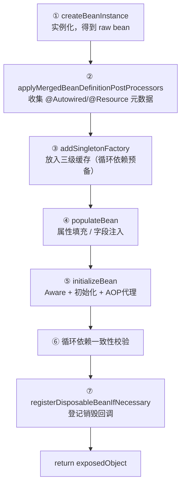
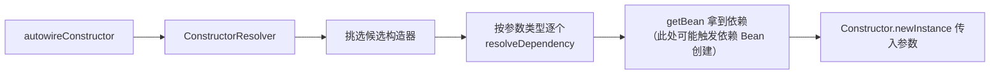
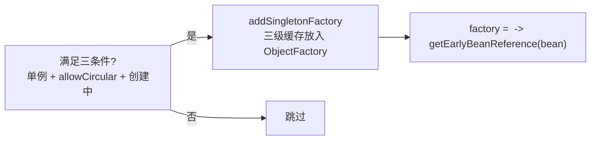
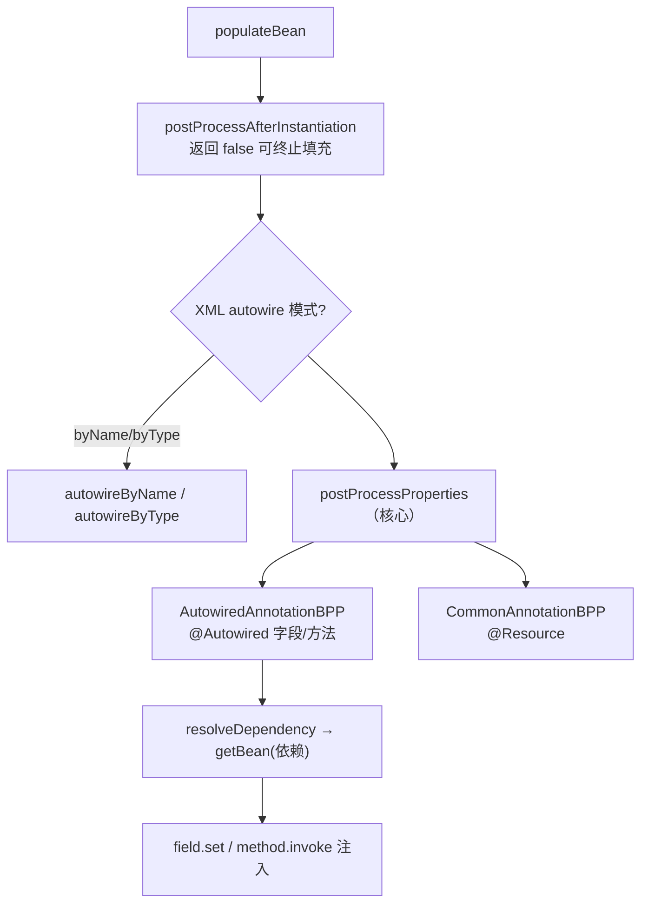
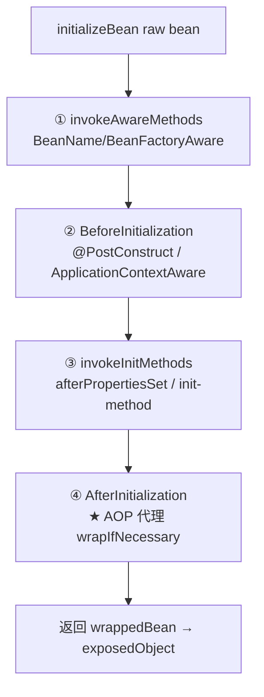
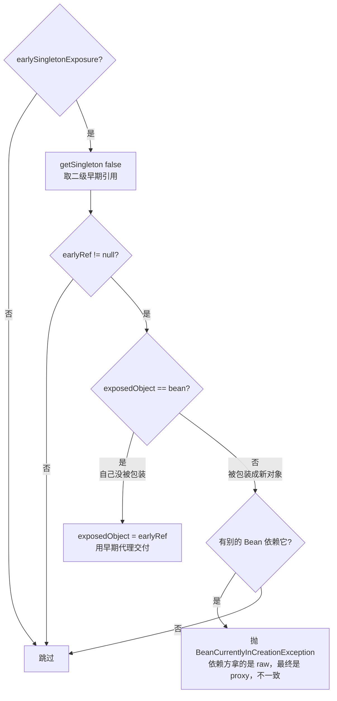

# doCreateBean 深度解析

> 导航：[[00-Spring-Framework核心机制-学习导航]] · **40 · 机制与源码** · Bean 创建主流水线 · 前置：[[2-Bean加载原理与源码阅读路径]]
>
> 关联：[[5-依赖注入实现原理]] · [[6-循环依赖与三级缓存详解]] · [[8-Spring-AOP代理创建详解]] · [[9-Bean 销毁机制详解]] · [[2-扩展点层-BeanPostProcessor详解]]
>
> 本地源码：`spring-beans/.../support/AbstractAutowireCapableBeanFactory.java`

---

## 定位

`doCreateBean` 是单个 Bean 从「一段字节码」变成「可用对象」的**主流水线**。上游 `getBean → doGetBean → getSingleton → createBean` 都是铺垫，真正干活的是它。

`createBeanInstance` 则是流水线的第一环——**决定用哪种方式把对象 new 出来**。

---

## 一、doCreateBean 整体骨架



贯穿全程的两个变量：

| 变量 | 是什么 | 会不会变 |
|------|--------|----------|
| `bean` | `createBeanInstance` 产出的**原始对象** | 不变，一直是 target |
| `exposedObject` | **对外交付的对象**（初值 = bean） | 可能被 `initializeBean` 换成代理 |

---

## 二、① createBeanInstance —— 「怎么把对象 new 出来」

唯一目标：**决定用哪种方式实例化，并返回一个 `BeanWrapper`（包着 raw 对象）**。

### 内部的六条分支（按优先级短路）

```mermaid
flowchart TB
    A[createBeanInstance] --> B{有 InstanceSupplier?}
    B -->|是| B1[obtainFromSupplier<br/>Lambda/函数式创建]
    B -->|否| C{有 factory-method?}
    C -->|是| C1[instantiateUsingFactoryMethod<br/>@Bean 方法 / XML factory-method]
    C -->|否| D{构造器已解析缓存?}
    D -->|命中且需注入| D1[autowireConstructor 复用]
    D -->|命中无参| D2[instantiateBean 复用]
    D -->|未命中| E{BPP 推断出构造器?<br/>或 autowire=constructor?<br/>或有构造器参数?}
    E -->|是| E1[autowireConstructor<br/>构造器注入]
    E -->|否| F{有 preferredConstructors?}
    F -->|是| F1[autowireConstructor]
    F -->|否| G[instantiateBean<br/>默认无参构造器反射]
```

### 每条分支干什么、什么场景

| 分支 | 内部方法 | 做什么 | 典型场景 |
|------|----------|--------|----------|
| **Supplier** | `obtainFromSupplier` | 直接执行 `supplier.get` 拿实例，不走反射 | 编程式注册 `BeanDefinition` 时设了 `instanceSupplier`（Spring Boot / 函数式注册） |
| **工厂方法** | `instantiateUsingFactoryMethod` | 反射调用 `@Bean` 方法或 XML `factory-method`，方法参数当依赖解析 | `@Configuration` 里的 `@Bean` 方法 |
| **缓存命中** | 复用 `autowireConstructor` / `instantiateBean` | 同一 BeanDefinition 第二次创建时，跳过构造器推断 | prototype 反复创建、`@Bean` 二次调用 |
| **构造器推断** | `determineConstructorsFromBeanPostProcessors` → `autowireConstructor` | 由 `AutowiredAnnotationBeanPostProcessor` 找出 `@Autowired` 构造器 / 唯一有参构造器，再逐参 `resolveDependency → getBean` | **构造器注入** |
| **preferred** | `autowireConstructor` | 处理 Kotlin 主构造器、record 等 | Kotlin / data class |
| **默认** | `instantiateBean` | 反射调用**无参构造器** `newInstance` | 最常见的 `@Service` 无显式构造器 |

### 两个核心子方法拆解

**`instantiateBean`（无参反射）：**

```text
instantiateBean
  → getInstantiationStrategy.instantiate(mbd, beanName, this)
       ├─ 无方法覆盖 → 直接 Constructor.newInstance
       └─ 有 lookup-method / replaced-method → CGLIB 子类生成
  → 包装成 BeanWrapperImpl
```

**`autowireConstructor`（构造器注入）—— 委托 `ConstructorResolver`：**



> **关键认知：构造器注入的 `getBean` 发生在这里**，即 `createBeanInstance` 阶段。这也是构造器循环依赖无法解决的根因——对象还没造出来，无法提前放进三级缓存。

### 为什么返回 `BeanWrapper`

`createBeanInstance` 返回的不是裸对象，而是包装对象的 `BeanWrapper`：

```java
Object bean = instanceWrapper.getWrappedInstance;
Class<?> beanType = instanceWrapper.getWrappedClass;
```

后续 `populateBean` 会借助它完成属性读写、类型转换和嵌套属性解析。构造器或工厂方法只负责得到实例，属性填充仍需要统一的访问层。

### 构造器解析缓存

同一 BeanDefinition 被重复创建时，Spring 使用以下状态避免重复推断构造器：

| 字段 | 含义 |
| --- | --- |
| `resolvedConstructorOrFactoryMethod` | 已经解析出的构造器或工厂方法 |
| `constructorArgumentsResolved` | 是否需要解析并注入构造器参数 |

读取这些字段时使用 `constructorArgumentLock` 避免并发竞态。缓存命中后，根据是否需要构造器参数直接复用 `autowireConstructor` 或 `instantiateBean`。

### createBeanInstance 执行完的状态

| 项 | 状态 |
|----|------|
| raw 对象 | ✅ 已在堆上 |
| 构造器依赖 | ✅ 已注入 |
| 字段 `@Autowired` | ❌ 仍是 null（等 ④populateBean） |
| 三级缓存 | ❌ 还没放 |

---

## 三、② applyMergedBeanDefinitionPostProcessors —— 「先扫描，后注入」

**作用：** 遍历 `MergedBeanDefinitionPostProcessor`，**提前解析并缓存注入点元数据**，为 ④populateBean 做准备。每个 BeanDefinition 只做一次（`postProcessed` 标记）。

| 处理器 | 缓存了什么 |
|--------|-----------|
| `AutowiredAnnotationBeanPostProcessor` | `@Autowired` / `@Value` 的字段、方法列表（`InjectionMetadata`） |
| `CommonAnnotationBeanPostProcessor` | `@Resource` / `@PostConstruct` / `@PreDestroy` 元数据 |

> 为什么单独一步？把「反射扫描注解」和「实际注入」分离——扫描结果缓存起来，后续 populate 直接用，避免重复解析。

---

## 四、③ addSingletonFactory —— 「循环依赖的保险栓」



- **只是注册一个 factory，并不立即执行**。
- factory 回调 `getEarlyBeanReference`，内部走 `SmartInstantiationAwareBeanPostProcessor`，AOP 场景可返回**早期代理**。
- 必须在 ④populateBean **之前**，否则循环依赖方来取时缓存里没有。

> 无循环依赖时，这个 factory 从头到尾都不会被调用，最后随 `addSingleton` 一起清掉。详见 [[6-循环依赖与三级缓存详解]]。

---

## 五、④ populateBean —— 「填充字段/属性」



**要点：**
- `populateBean` 自己不认识 `@Autowired`，它调用 **BPP** 来做。
- 字段/Setter 注入的 `getBean` 发生在这里 → **字段循环依赖的嵌套点**。
- 构造器注入不在此（已在 ①）。

> 完整的候选解析逻辑 → [[5-依赖注入实现原理]]、[[Spring注入注解与byType-byName解析逻辑]]

### 属性填充的完整阶段

| 阶段 | 做什么 | 关键边界 |
| --- | --- | --- |
| 前置检查 | 没有 `BeanWrapper` 或类型不允许属性写入时提前返回 | Record 的 final 状态主要由构造器完成 |
| A | `postProcessAfterInstantiation` | 任一 InstantiationAwareBPP 返回 `false` 可接管并终止填充 |
| B | `autowireByName` / `autowireByType` | XML 时代的自动装配模式 |
| C | `postProcessProperties` | AAP、CABPP 等处理注解注入，是现代项目的核心 |
| D | `checkDependencies` | 兼容旧式 dependency-check |
| E | `applyPropertyValues` | 通过 BeanWrapper 完成转换、解引用和属性写入 |

`applyMergedBeanDefinitionPostProcessors` 负责提前扫描和缓存 `InjectionMetadata`，阶段 C 只消费缓存并执行注入。这将“寻找注入点”和“写入依赖”分开，避免每次创建实例都重复扫描。

---

## 六、⑤ initializeBean —— 「初始化 + 变代理」



| 子阶段 | 处理什么 | 对象形态 |
|--------|----------|----------|
| ① Aware | 回填容器基础设施引用 | raw |
| ② 初始化前 BPP | `@PostConstruct`、Context 级 Aware | raw |
| ③ 初始化方法 | `InitializingBean` / 自定义 init-method | raw |
| ④ 初始化后 BPP | **AOP 代理**、`@Async` 包装 | **raw → proxy** |

> `@PostConstruct` 在代理**之前**执行，所以里面的 `this` 是原始对象。AOP raw→proxy 替换细节 → [[8-Spring-AOP代理创建详解]]

### BPP 责任链与 `synthetic`

初始化前、初始化后的 BPP 都按注册顺序形成责任链：上一个处理器的返回值是下一个处理器的输入；处理器返回 `null` 时停止继续处理并保留此前结果。因此调用方必须持续更新 `wrappedBean`。

框架标记为 `synthetic` 的合成 Bean 会跳过常规 BPP，避免内部对象被用户扩展点重复处理。

### `invokeInitMethods` 的顺序与去重

初始化方法按以下顺序执行：

```text
InitializingBean#afterPropertiesSet
  → 自定义 init-method（可配置多个）
```

`@PostConstruct` 不在 `invokeInitMethods` 中执行，而是由 `CommonAnnotationBeanPostProcessor` 在初始化前 BPP 阶段调用。Spring 会通过 externally-managed init method 记录以及方法名比较，避免 `@PostConstruct`、`afterPropertiesSet` 和自定义 init-method 指向同一方法时重复执行。

自定义初始化方法找不到且要求强制存在时，会抛出 `BeanDefinitionValidationException`。

---

## 七、⑥ 循环依赖一致性校验 —— 「早期引用 vs 最终对象」

只有开启了早期暴露（三级缓存被用过）才进入。



**目的：** 保证「循环依赖时 B 提前拿到的 A」和「A 最终注册进容器的对象」是**同一个**，避免 B 引用了过期的 raw 版本。

---

## 八、⑦ registerDisposableBeanIfNecessary —— 「登记怎么销毁」

- 判断 Bean 是否需要销毁回调（`DisposableBean` / `@PreDestroy` / `destroy-method` / `AutoCloseable`）。
- prototype 不登记销毁回调，创建后的生命周期由调用方负责。
- singleton 包装成 `DisposableBeanAdapter` 存入容器的 `disposableBeans`。
- 自定义 Scope 通过 `Scope#registerDestructionCallback` 接管销毁时机。
- **登记的是 `bean`（raw），不是 proxy**——销毁逻辑在原始对象上执行。

这里只登记“将来如何销毁”，并不执行销毁。容器关闭时，`DisposableBeanAdapter` 按 `DestructionAwareBeanPostProcessor`、`DisposableBean#destroy`、自定义 destroy-method 的顺序编排回调；单例按依赖关系和注册逆序销毁。

> 详见 [[9-Bean 销毁机制详解]]

---

## 九、返回 exposedObject

```text
return exposedObject
   → createBean 原样返回
   → getSingleton 回调结束
   → addSingleton 写入一级缓存
   → getBean 拿到最终对象（可能是 proxy）
```

---

## 十、一句话串联

```text
① new 出来（构造器 DI 在此）
② 扫描注解元数据
③ 塞三级缓存（循环依赖保险）
④ 填字段（字段 DI 在此）
⑤ 初始化 + 可能变代理
⑥ 循环场景对齐早期/最终引用
⑦ 登记销毁（raw）
→ 交付 exposedObject 进一级缓存
```

---

## 篇章导航

| 上一篇 | 下一篇 |
|--------|--------|
| [[2-Bean加载原理与源码阅读路径]] | [[5-依赖注入实现原理]] |

---

## 关联

- [[2-Bean加载原理与源码阅读路径]]
- [[5-依赖注入实现原理]]
- [[6-循环依赖与三级缓存详解]]
- [[8-Spring-AOP代理创建详解]]
- [[9-Bean 销毁机制详解]]
- [[2-扩展点层-BeanPostProcessor详解]]
- [[Spring注入注解与byType-byName解析逻辑]]
