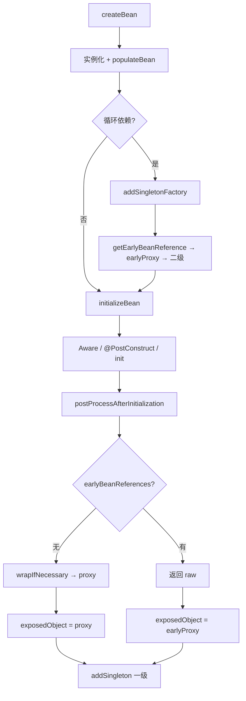

# Spring AOP 代理创建详解

> 导航：[[00-Spring-Framework核心机制-学习导航]] · **40 · 机制与源码** · AOP 机制与源码
>
> 前置：[[2-扩展点层-BeanPostProcessor详解]] · [[3-生命周期层-Aware体系详解]] · [[1-元数据层-BeanDefinition三兄弟详解]]
>
> 关联：[[6-循环依赖与三级缓存详解]] · [[1-注解入门-配置类与组件类]] · [[3-refresh方法详解]] · [[1-源码调试与断点指南]]
>
> 本地源码：`/Users/guoyang/IdeaProjects/spring/spring-framework`
> - `spring-aop/.../autoproxy/AbstractAutoProxyCreator.java`
> - `spring-aop/.../DefaultAopProxyFactory.java`
> - `spring-beans/.../AbstractAutowireCapableBeanFactory.java`（`initializeBean` / `doCreateBean`）

---

## 文档结构

| 章节 | 内容 |
|:----:|------|
| [[#一、代理对象生成方式总览]] | AOP vs Configuration vs Scoped |
| [[#二、两种「看起来像代理」的机制（AOP vs 配置类）]] | @Configuration CGLIB 增强 |
| [[#三、哪些 Bean 默认是普通对象？]] | 常见注解是否创建代理 |
| [[#四、AutoProxyCreator 类继承体系]] | BPP 三个回调 |
| [[#五、创建代理的前提条件]] | wrapIfNecessary 决策 |
| [[#六、代理在 doCreateBean 中的时机与替换]] | initializeBean、raw→proxy、循环依赖 |
| [[#七、buildProxy 详解（JDK/CGLIB 决策核心）]] | JDK/CGLIB 七步决策 |
| [[#八、一个接口多个实现 / 多个子类]] | 独立判断 |
| [[#九、JDK 代理 vs CGLIB：生成方式]] | DefaultAopProxyFactory |
| [[#十、源码定位 · 断点 · 误区]] | 附录 |
| [[#十一、运行时如何判断]] | 运行时类型判断 |

---

## 一句话

Spring **不会**给所有 Bean 都创建代理。只有 `AbstractAutoProxyCreator` 判定「有匹配的 Advisor」时，才会在 BPP 链里把原始对象包装成 **JDK 动态代理** 或 **CGLIB 代理**；`@Configuration` 的 CGLIB 增强是另一套机制，与 AOP 无关。

> 动态代理基础概念 → [[1010-Java动态代理与运行时代理机制]] · FactoryBean 与 BPP 两条「变样」路线 → [[4-工厂Bean-FactoryBean接口体系详解#FactoryBean 抽象的是什么？（不是「增强 Bean」的抽象）]]

---

## 一、代理对象生成方式总览

Spring 里「看起来像代理」的对象，来源不止一种：

```text
                    Spring 代理生成
                          │
          ┌───────────────┼───────────────┐
          ▼               ▼               ▼
     AOP 代理      @Configuration 增强   Scoped 代理
  （本文主体）    ConfigurationClassEnhancer   ScopedProxyFactoryBean
          │
    DefaultAopProxyFactory
          │
    ┌─────┴─────┐
    ▼           ▼
 JDK 动态代理   CGLIB 子类
```

| 机制 | 技术 | 何时生成 | 目的 |
|------|------|----------|------|
| **AOP 代理** | JDK / CGLIB | `postProcessAfterInitialization` | 事务、切面、缓存等拦截 |
| **@Configuration 增强** | CGLIB 子类 | 配置类实例化时 | `@Bean` 方法互调走容器单例 |
| **Scoped 代理** | JDK / CGLIB | 注册 scoped Bean 时 | request / session 等短生命周期 |

---

## 二、两种「看起来像代理」的机制（AOP vs 配置类）

| 机制 | 触发条件 | 源码入口 | 目的 |
|------|----------|----------|------|
| **AOP 代理** | 有匹配的 Advisor（`@Transactional`、切面等） | `AbstractAutoProxyCreator` | 事务、缓存、切面拦截 |
| **配置类 CGLIB 增强** | `@Configuration` 且 `proxyBeanMethods=true`（默认） | `ConfigurationClassEnhancer.enhance` | `@Bean` 方法间调用保证单例 |

**不要混淆：** 配置类被 CGLIB 增强 ≠ 该 Bean 有 AOP 能力；`@Bean` 产出的业务 Bean 也**默认不是** AOP 代理。

### @Configuration 增强在做什么？

```java
@Configuration
public class AppConfig {
    @Bean public A a { return new A; }
    @Bean public B b { return new B(a); }  // 增强后 a 从容器取，不是 new
}
```

`ConfigurationClassEnhancer` 生成 CGLIB 子类，**重写** `@Bean` 方法：优先 `beanFactory.getBean`，保证单例语义。与 AOP 拦截链无关。

---

## 三、哪些 Bean 默认是普通对象？

| Bean 类型 | 默认是否 AOP 代理 | 说明 |
|-----------|:------------------:|------|
| `@Component` / `@Service` / `@Repository` | ❌ | 无匹配 Advisor 就是普通对象 |
| `@Configuration` 配置类本身 | ❌ | 可能有 **ConfigurationClassEnhancer** 的 CGLIB，但不是 AOP |
| `@Bean` 方法创建的 Bean | ❌ | 同组件类，看 Advisor 是否匹配 |
| 带 `@Transactional` / 切面匹配的类 | ✅ | 满足 Advisor 条件才代理 |
| `@Aspect` / `Advisor` / `Advice` 等 | ❌ | 基础设施类，永远不 AOP 代理 |

### 常见注解会不会创建 AOP 代理？

| 注解 | 是否触发 AOP 代理 | 机制 |
|------|:----------------:|------|
| `@Slf4j` | ❌ | Lombok **编译期**生成 `log` 字段，与 Spring 无关 |
| `@PostConstruct` / `@PreDestroy` | ❌ | `InitDestroyAnnotationBeanPostProcessor` 反射调用，返回原 Bean |
| `@Autowired` / `@Value` | ❌ | 依赖注入，不包装代理 |
| `@Transactional` | ✅ | 事务 Advisor 匹配 |
| `@Cacheable` | ✅ | 缓存 Advisor 匹配 |
| `@Async` | ✅ | `AsyncAnnotationBeanPostProcessor` 也会包装代理 |

---

## 四、AutoProxyCreator 类继承体系

Spring AOP 代理的**核心枢纽**是 `AbstractAutoProxyCreator`——它把自身注册为 BPP，在 Bean 初始化完成后决定是否用代理替换原始对象。

```text
AbstractAutoProxyCreator                    ← wrapIfNecessary / createProxy / buildProxy
  └ AbstractAdvisorAutoProxyCreator           ← 收集容器中所有 Advisor Bean
       └ AspectJAwareAdvisorAutoProxyCreator
            └ AnnotationAwareAspectJAutoProxyCreator   ← @EnableAspectJAutoProxy 注册
```

| 类 | 职责 |
|----|------|
| `AbstractAutoProxyCreator` | 代理创建框架：`wrapIfNecessary`、JDK/CGLIB 决策、`earlyBeanReferences` 去重 |
| `AbstractAdvisorAutoProxyCreator` | `findEligibleAdvisors` — 从容器找 Advisor 并过滤 |
| `AnnotationAwareAspectJAutoProxyCreator` | 解析 `@Aspect` 类，与 XML/Advisor Bean 合并 |

**接入容器：**

```text
@EnableAspectJAutoProxy
  → AspectJAutoProxyRegistrar
  → 注册 AnnotationAwareAspectJAutoProxyCreator（BPP）
```

它实现 `SmartInstantiationAwareBeanPostProcessor`，因此能参与三个关键节点：

| 回调 | 作用 |
|------|------|
| `postProcessBeforeInstantiation` | 仅自定义 TargetSource 时短路实例化 |
| `getEarlyBeanReference` | 循环依赖 + AOP 时提前暴露代理 |
| `postProcessAfterInitialization` | **绝大多数** AOP 的常规创建入口 |

---

## 五、创建代理的前提条件

### 5.1 容器里必须有 AutoProxyCreator

`@EnableAspectJAutoProxy` → `AspectJAutoProxyRegistrar` → 注册 `AnnotationAwareAspectJAutoProxyCreator`（一种 BPP）。

没有这个 BPP，`wrapIfNecessary` 根本不会执行。

### 5.2 核心决策：`wrapIfNecessary`

**位置：** `AbstractAutoProxyCreator.wrapIfNecessary`

源码里用 ①–⑥ 标注的完整决策流程：

| 步骤 | 条件 | 结果 |
|:----:|------|------|
| ① | `targetSourcedBeans` 已包含 `beanName` | 返回原 Bean（已在 `postProcessBeforeInstantiation` 处理） |
| ② | `advisedBeans[cacheKey] == FALSE` | 返回原 Bean（缓存命中「不代理」） |
| ③ | `isInfrastructureClass` 或 `shouldSkip` | 返回原 Bean，缓存 FALSE |
| ④ | `getAdvicesAndAdvisorsForBean` 返回 `DO_NOT_PROXY`（null） | 不代理 |
| ⑤ | 有匹配 Advisor | `createProxy` → `SingletonTargetSource(bean)` → 返回代理 |
| ⑥ | 无匹配 Advisor | 缓存 FALSE，返回原 Bean |

```text
wrapIfNecessary(bean, beanName, cacheKey)
│
├─ ① targetSourcedBeans 已包含 beanName？          → 返回原 Bean
├─ ② advisedBeans 缓存已是 FALSE？                 → 返回原 Bean
├─ ③ isInfrastructureClass 或 shouldSkip？   → 返回原 Bean，缓存 FALSE
│
├─ ④ getAdvicesAndAdvisorsForBean != DO_NOT_PROXY → ⑤ createProxy，返回代理
└─ ⑥ 否则                                          → 返回原 Bean，缓存 FALSE
```

**关键点：** 代理用的是**初始化完毕的 raw bean**（`SingletonTargetSource(bean)`），因此 `@PostConstruct` / `InitializingBean` 跑在 target 上，而不是 proxy 上。

### 5.3 Advisor 从哪里来？

`getAdvicesAndAdvisorsForBean` 是 `AbstractAutoProxyCreator` 的**抽象方法**，由子类决定 Advisor 来源：

| 来源 | 机制 | 典型场景 |
|------|------|----------|
| `@Aspect` 类 | `AspectJAdvisorFactory` 解析切点 | `@Around` / `@Before` |
| 容器中的 Advisor Bean | `AbstractAdvisorAutoProxyCreator.findAdvisorBeans` | XML `<aop:advisor>` |
| 基础设施 Advisor | `InfrastructureAdvisorAutoProxyCreator` | `@Transactional`、`@Cacheable` |

```text
getAdvicesAndAdvisorsForBean(beanClass, beanName, null)
  → AbstractAdvisorAutoProxyCreator
       → findEligibleAdvisors
            → findCandidateAdvisors      // 容器里所有 Advisor
            → findAdvisorsThatCanApply   // AopUtils 切点匹配
```

### 5.4 不创建代理的具体条件

**基础设施类 `isInfrastructureClass`：**

- `Advice`、`Pointcut`、`Advisor`、`AopInfrastructureBean`
- AspectJ 模式下：`@Aspect` 类也算基础设施（`AnnotationAwareAspectJAutoProxyCreator` 重写）

**应跳过 `shouldSkip`：**

- Bean 名是「原始实例」（`ORIGINAL_INSTANCE_SUFFIX`）
- 切面 Bean **不代理自己**（beanName == aspectName）

**无可用 Advisor：**

```java
// AbstractAdvisorAutoProxyCreator
List<Advisor> advisors = findEligibleAdvisors(beanClass, beanName);
if (advisors.isEmpty) {
    return DO_NOT_PROXY;  // null → 不代理
}
```

Advisor 要能 **apply 到该 Bean**（`AopUtils.findAdvisorsThatCanApply`）：

- `ClassFilter` 匹配目标类
- `MethodMatcher` 至少匹配该类上的一个方法

---

## 六、代理在 doCreateBean 中的时机与替换

### 6.1 三个创建时机

| 时机           | 回调                                                       | 典型场景                                                |
| ------------ | -------------------------------------------------------- | --------------------------------------------------- |
| **实例化之前**    | `postProcessBeforeInstantiation`                       | 仅 **自定义 TargetSource**；**不是**普通 `@Transactional` 路径 |
| **初始化之后**    | `postProcessAfterInitialization` → `wrapIfNecessary` | **绝大多数** AOP（`@Transactional`、`@Cacheable`、切面）      |
| **循环依赖早期引用** | `getEarlyBeanReference` → `wrapIfNecessary`          | A↔B 循环且 A 需要被代理                                     |

### 6.2 两个变量：`bean` vs `exposedObject`

在 `doCreateBean` 中必须区分：

| 变量 | 含义 | 生命周期 |
|------|------|----------|
| `bean` | `createBeanInstance` 的 **原始对象（raw）** | 始终不变，作为代理的 **target** |
| `exposedObject` | **对外暴露的对象** | 可能是 raw，也可能被换成 proxy |

```java
// AbstractAutowireCapableBeanFactory.doCreateBean
Object exposedObject = bean;
populateBean(beanName, mbd, instanceWrapper);
exposedObject = initializeBean(beanName, exposedObject, mbd);  // ★ 可能变成 proxy
return exposedObject;  // → addSingleton 写入一级缓存
```

> Spring **不是**把一级缓存里的 raw 原地改成 proxy，而是 **返回新引用**；raw 藏在 `SingletonTargetSource.target` 里。

```text
┌─────────────┐
│  proxy A    │  ← getBean 返回、一级缓存
│  ┌───────┐  │
│  │ raw A │  │  ← SingletonTargetSource.target
│  └───────┘  │
└─────────────┘
```

### 6.3 `initializeBean` 四步顺序

**位置：** `AbstractAutowireCapableBeanFactory.initializeBean`

```text
initializeBean(beanName, rawBean, mbd)
  ① invokeAwareMethods                          BeanNameAware / BeanFactoryAware
  ② applyBeanPostProcessorsBeforeInitialization @PostConstruct / ApplicationContextAware
  ③ invokeInitMethods                           afterPropertiesSet + init-method
  ④ applyBeanPostProcessorsAfterInitialization  ★ AbstractAutoProxyCreator → proxy
  return wrappedBean → doCreateBean.exposedObject
```

**结论：** `@PostConstruct` / `InitializingBean` 在 **raw 对象**上执行；AOP 代理在步骤 ④ 才创建。

### 6.4 场景 A：无循环依赖（常规替换）

```text
createBeanInstance     → bean = raw A
addSingletonFactory    → 三级（factory 通常不执行）
populateBean(raw A)
initializeBean(raw A)
  ④ postProcessAfterInitialization
       earlyBeanReferences.remove → null
       wrapIfNecessary(raw A) → proxy A
exposedObject = proxy A
earlySingletonReference = null → 跳过一致性校验
addSingleton("a", proxy A)   → 一级存 proxy
```

### 6.5 场景 B：循环依赖 + AOP

```text
createBeanInstance     → bean = raw A
addSingletonFactory    → 三级 factory

B populateBean → getBean(A)
  getEarlyBeanReference(raw A)
    earlyBeanReferences.put(cacheKey, raw A)
    wrapIfNecessary(raw A) → earlyProxy A
  → 二级缓存 = earlyProxy，B.a = earlyProxy

A 继续 initializeBean(raw A)
  ④ postProcessAfterInitialization(raw A)
       earlyBeanReferences.remove(cacheKey) == raw A  → 跳过 wrap，返回 raw
exposedObject = raw A（暂时）

doCreateBean 步骤 4 一致性替换：
  earlySingletonReference = getSingleton("a", false)  → earlyProxy
  if (exposedObject == bean)  → exposedObject = earlyProxy A

addSingleton("a", earlyProxy A)  → 与 B 注入的是同一个 proxy
```

### 6.6 `earlyBeanReferences` 防重复代理

**位置：** `AbstractAutoProxyCreator.postProcessAfterInitialization`

```java
if (this.earlyBeanReferences.remove(cacheKey) != bean) {
    return wrapIfNecessary(bean, beanName, cacheKey);  // 常规：创建 proxy
}
return bean;  // 已 early wrap → 返回 raw，交给 doCreateBean 步骤 4 替换
```

| 场景 | `remove` 返回值 | 步骤 ④ 行为 | 最终 `exposedObject` |
|------|----------------|------------|---------------------|
| 无循环 | `null` | `wrapIfNecessary` → proxy | proxy |
| 循环 + AOP | `raw A`（== bean） | 返回 raw | 步骤 4 换成 earlyProxy |
| 循环无 AOP | `raw A` | 返回 raw | raw（无 proxy） |

### 6.7 不一致时报错

若早期注入 **raw A**，但步骤 ④ 又 wrap 成 **不同 proxy**：

```text
doCreateBean → BeanCurrentlyInCreationException
"B has been injected in its raw version ... but has eventually been wrapped"
```

→ 详见 [[6-循环依赖与三级缓存详解#七、AOP + 循环依赖]]

### 6.8 销毁注册用 raw

```java
registerDisposableBeanIfNecessary(beanName, bean, mbd);  // bean = raw，不是 proxy
```

`@PreDestroy` / `DisposableBean.destroy` 在 **原始对象**上执行。

### 6.9 两条路径总览



### 6.10 与源码衔接

**常规路径：**

```text
doCreateBean → initializeBean → applyBeanPostProcessorsAfterInitialization
  → AbstractAutoProxyCreator.postProcessAfterInitialization
       → wrapIfNecessary → createProxy → buildProxy
```

**循环依赖路径：**

```text
getEarlyBeanReference → getEarlyBeanReference(bean, beanName)
  → earlyBeanReferences.put + wrapIfNecessary → earlyProxy
```

---

## 七、buildProxy 详解（JDK/CGLIB 决策核心）

### 7.1 调用链

```text
wrapIfNecessary / getEarlyBeanReference
  → createProxy
      → buildProxy                         ← 本方法
          → ProxyFactory.getProxy(classLoader)
              → DefaultAopProxyFactory.createAopProxy
                  → JdkDynamicAopProxy       （基于接口）
                  → ObjenesisCglibAopProxy   （基于子类）
```

### 7.2 七步流程

**位置：** `AbstractAutoProxyCreator.buildProxy`

| 步骤 | 代码 | 作用 |
|:----:|------|------|
| ① | `AutoProxyUtils.exposeTargetClass` | 将 targetClass 写入 BeanDefinition 属性 |
| ② | `new ProxyFactory` + `copyFrom(this)` | 复制 AutoProxyCreator 配置 |
| ③ | JDK vs CGLIB 决策 | 见 [[#7.3 JDK vs CGLIB 决策树]] |
| ④ | `buildAdvisors` + `addAdvisors` | 组装拦截器链（specific + common） |
| ⑤ | `setTargetSource(targetSource)` | raw Bean 作为方法调用 target |
| ⑥ | `customizeProxyFactory` + `setFrozen` + `setPreFiltered` | 子类扩展 / 优化 |
| ⑦ | `getProxy(classLoader)` | 实例化代理（`classOnly=true` 时只返回 Class） |

### 7.3 JDK vs CGLIB 决策树

```text
buildProxy 步骤 ③
│
├─ proxyFactory.isProxyTargetClass == true（已强制 CGLIB）
│     ├─ 目标是 JDK Proxy / Lambda → addInterface → JDK
│     └─ 否则 → CGLIB
│
└─ 未强制
      ├─ shouldProxyTargetClass（preserveTargetClass）→ CGLIB
      └─ evaluateProxyInterfaces
            ├─ 有合理业务接口 → addInterface → JDK
            └─ 无（仅 Aware/InitializingBean 等）→ setProxyTargetClass(true) → CGLIB
```

**`evaluateProxyInterfaces`**（`ProxyProcessorSupport`）排除：
- 容器回调接口（`InitializingBean`、`Aware` 等）
- CGLIB 内部接口（`*.cglib.proxy.Factory`）

### 7.4 TargetSource 与 raw 对象

```java
// wrapIfNecessary
createProxy(beanClass, beanName, specificInterceptors,
    new SingletonTargetSource(bean));  // raw 作为 target
```

方法调用链：`proxy.method` → 拦截器链 → `SingletonTargetSource.getTarget` → **raw bean**

### 7.5 第三层：`DefaultAopProxyFactory.createAopProxy`

```text
if (optimize || proxyTargetClass || !hasUserSuppliedInterfaces) {
    if (targetClass 是 interface / JDK Proxy / Lambda)
        → JdkDynamicAopProxy
    else
        → ObjenesisCglibAopProxy
}
else {
    → JdkDynamicAopProxy
}
```

### 7.6 决策对照表

| 条件 | 代理类型 |
|------|----------|
| 有业务接口 + 未 `proxyTargetClass` | **JDK** |
| 无业务接口 / 仅容器回调接口 | **CGLIB** |
| `@EnableAspectJAutoProxy(proxyTargetClass = true)` | **CGLIB** |
| 目标本身是 interface / Lambda | **JDK**（即使强制类代理） |
| 无匹配 Advisor | **普通对象**（不进入 buildProxy） |

### 7.7 全局配置入口

```java
@EnableAspectJAutoProxy(proxyTargetClass = true)
@Scope(proxyMode = ScopedProxyMode.TARGET_CLASS)
```

---

## 八、一个接口多个实现 / 多个子类

Spring **按每个具体 Bean 独立判断**，不会给「接口」或「继承体系」统一加代理。

```java
public interface OrderService { void create; }

@Service
class OrderServiceImpl implements OrderService {
    @Transactional
    public void create { ... }   // → 会代理
}

@Service
class OrderServiceMock implements OrderService {
    public void create { ... }   // → 不代理（无匹配 Advisor）
}
```

| 场景 | 结果 |
|------|------|
| 接口 N 个实现，只有部分有 `@Transactional` | 只有那些实现被代理 |
| 父类方法有 `@Transactional`，子类未重写 | 子类 Bean 通常也会代理 |
| 子类重写方法且未加事务 | 看切点是否仍匹配重写后的方法 |
| 多个 `@Slf4j` 实现类 | 全部是普通对象 |

注入 `OrderService` 时拿到的是 **被选中的那个 Bean**；它有没有代理，取决于 **那个实现类** 是否匹配 Advisor，与其他实现无关。

---

## 九、JDK 代理 vs CGLIB：生成方式

### 9.1 两种代理如何「生成对象」

**JDK 动态代理** — `JdkDynamicAopProxy.getProxy`：

```java
return Proxy.newProxyInstance(classLoader, proxiedInterfaces, this);
// this 实现 InvocationHandler.invoke → 拦截器链 → target
```

- 代理类：`com.sun.proxy.$ProxyXX`
- 只能代理**接口方法**
- 注入类型通常是接口，不是实现类

**CGLIB 代理** — `CglibAopProxy`：

```java
Enhancer enhancer = new Enhancer;
enhancer.setSuperclass(targetClass);   // 继承目标类
enhancer.setCallbacks(callbacks);      // MethodInterceptor 等
return enhancer.create;              // UserService$$SpringCGLIB$$0
```

- 代理类是目标类的**子类**
- 可代理无接口的类；**不能**代理 final 类/方法

### 9.2 方法调用链（以 @Transactional 为例）

```text
client.getBean("orderService")  →  代理对象
proxy.create
  → [JDK] InvocationHandler.invoke / [CGLIB] MethodInterceptor.intercept
  → 收集 Interceptor 链（TransactionInterceptor 等）
  → ReflectiveMethodInvocation.proceed
  → TransactionInterceptor：开事务 → target.create → 提交/回滚
```

无匹配 Advisor 时，**直接反射调用 target**，不建拦截链。

### 9.3 三层决策总览

```text
① wrapIfNecessary              要不要代理
② buildProxy                   JDK vs CGLIB（见 [[#七、buildProxy 详解]]）
③ DefaultAopProxyFactory         实例化 JdkDynamicAopProxy / CglibAopProxy
```

> buildProxy 详细七步已移至 [[#七、buildProxy 详解（JDK/CGLIB 决策核心）]]，此处不再重复。

---

## 十、源码定位 · 断点 · 误区

### 10.1 源码方法地图

| 观察点 | 稳定定位 |
| --- | --- |
| Bean 初始化与最终对象替换 | `AbstractAutowireCapableBeanFactory#doCreateBean` |
| 初始化四步 | `AbstractAutowireCapableBeanFactory#initializeBean` |
| 获取容器早期引用 | `AbstractAutowireCapableBeanFactory#getEarlyBeanReference` |
| 判断是否需要包装 | `AbstractAutoProxyCreator#wrapIfNecessary` |
| 创建早期代理 | `AbstractAutoProxyCreator#getEarlyBeanReference` |
| 初始化后创建常规代理 | `AbstractAutoProxyCreator#postProcessAfterInitialization` |
| 组装代理 | `AbstractAutoProxyCreator#buildProxy` |
| 创建代理工厂配置 | `AbstractAutoProxyCreator#createProxy` |
| 评估代理接口 | `ProxyProcessorSupport#evaluateProxyInterfaces` |
| 选择 JDK / CGLIB 代理 | `DefaultAopProxyFactory#createAopProxy` |

### 10.2 调试断点

| 顺序 | 类 · 方法 | 看什么 |
|:----:|-----------|--------|
| 1 | `wrapIfNecessary` | 要不要代理 |
| 2 | `getAdvicesAndAdvisorsForBean` | Advisor 是否为空 |
| 3 | `initializeBean` | 进入 AfterInit |
| 4 | `postProcessAfterInitialization` | earlyBeanReferences 去重 |
| 5 | `buildProxy` | JDK / CGLIB 决策 + Advisor 组装 |
| 6 | `DefaultAopProxyFactory.createAopProxy` | 最终代理类型 |
| 7 | `doCreateBean` | exposedObject 替换为 earlyProxy |

配合 [[1-源码调试与断点指南]]、[[6-循环依赖与三级缓存详解#调试断点]]。

### 10.3 常见误区速查

| 误区 | 正解 |
|------|------|
| 所有 `@Service` 都有代理 | 只有 Advisor 匹配才有 |
| `@Configuration` 一定有 AOP 代理 | 可能是 ConfigurationClassEnhancer CGLIB |
| `@Slf4j` / `@PostConstruct` 会触发代理 | 不会 |
| 一级缓存存 raw 再改成 proxy | **返回新引用**；raw 在 TargetSource 里 |
| 循环+AOP 会创建两个不同 proxy | earlyProxy 与一级缓存是**同一个** |
| `@PostConstruct` 里 `this` 是 proxy | 是 **raw**；代理在 AfterInit 才创建 |
| `@Transactional` 在 beforeInstantiation 建代理 | 常规在 **postProcessAfterInitialization** |
| 销毁回调在 proxy 上执行 | 在 **raw bean** 上（`registerDisposableBeanIfNecessary(bean)`） |

### 10.4 与 BPP 专题的关系

AOP 代理是 BPP 链典型案例：`AbstractAutoProxyCreator` 在 AfterInit 把对外引用 **替换** 为 proxy。

→ [[2-扩展点层-BeanPostProcessor详解]]

### 10.5 后续阅读路径

| 顺序 | 类 / 模块 | 看什么 |
|:----:|-----------|--------|
| 1 | `AbstractAdvisorAutoProxyCreator` | Advisor 收集与匹配 |
| 2 | `DefaultAopProxyFactory` / `JdkDynamicAopProxy` | 方法拦截 |
| 3 | `AspectJAdvisorFactory` | `@Aspect` → Advisor |
| 4 | `ReflectiveMethodInvocation` | 拦截器链执行 |
| 5 | [[6-循环依赖与三级缓存详解]] | earlyProxy 与三级缓存 |
| 6 | [[10-Spring事务实现详解]] | TransactionInterceptor |

---

## 十一、运行时如何判断

```java
AopUtils.isAopProxy(bean);           // 是否 AOP 代理
AopUtils.isJdkDynamicProxy(bean);    // JDK 动态代理
AopUtils.isCglibProxy(bean);         // CGLIB 代理
bean.getClass.getName;           // CGLIB 类名常含 $$SpringCGLIB$$

// 配置类增强（非 AOP）
EnhancedConfiguration.class.isAssignableFrom(bean.getClass);
```

---

## 篇章导航

| 上一篇 | 下一篇 |
|--------|--------|
| [[6-循环依赖与三级缓存详解]] | [[10-Spring事务实现详解]] |

---

## 关联

- [[00-Spring-Framework核心机制-学习导航]]
- [[1-注解入门-配置类与组件类]]
- [[2-Bean加载原理与源码阅读路径]]
- [[7-IoC扩展点三部曲对照]]
- [[2-扩展点层-BeanPostProcessor详解]]
- [[3-refresh方法详解]]
- [[1-源码调试与断点指南]]
- [[6-循环依赖与三级缓存详解]]
- [[10-Spring事务实现详解]]
- [[Spring依赖注入形式分类与Demo]]
