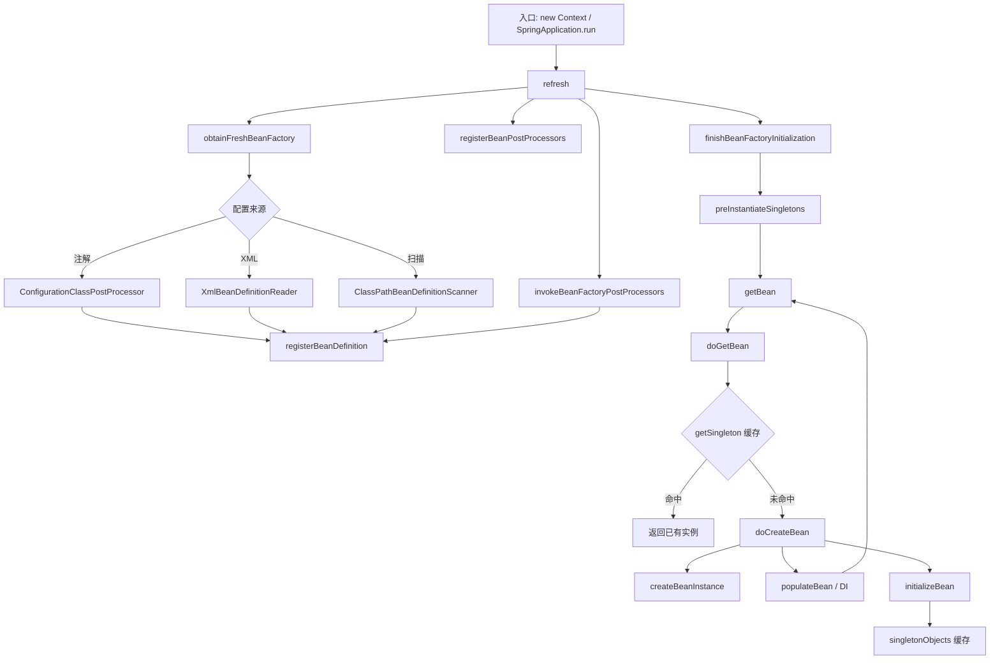

# 源码调试与断点指南

> 导航：[[00-Spring-Framework核心机制-学习导航]] · **50 · 实践与调试** · 断点指南 · 配套：[[2-Bean加载原理与源码阅读路径]]

## 前置条件

- 本地已 clone Spring Framework 源码：`/Users/guoyang/IdeaProjects/spring/spring-framework`
- IDE 中打开上述工程，确保能跳转源码
- 理论背景：[[1-IoC与DI核心概念]]、[[2-Bean加载原理与源码阅读路径]]

---

## 完整 Debug 地图

> 类似调用链图，按 **从上到下** 跟栈。★ = 建议断点。

---

### 地图一：注解版入口（推荐跟这个）

**测试类**：`AnnotationConfigApplicationContextTests#getBeanByType` 或 `autowiringIsEnabledByDefault`

```text
// ── ApplicationContext 入口 ──
new AnnotationConfigApplicationContext(Config.class)
  │
  ├─ AnnotationConfigApplicationContext#AnnotationConfigApplicationContext(Class...)
  │     ├─ this                                 // 搭舞台：Reader + Scanner + BFPP/BPP 预注册
  │     │     ├─ new AnnotatedBeanDefinitionReader(this)
  │     │     └─ new ClassPathBeanDefinitionScanner(this)
  │     ├─ register(configClasses)              // Reader.doRegisterBean → 注册配置类 BeanDefinition
  │     └─ refresh                            // ★ 容器启动总入口
  │
  └─ AbstractApplicationContext#refresh         // spring-context/.../AbstractApplicationContext
        ├─ prepareRefresh                       // 激活容器、校验、初始化 earlyApplicationEvents
        ├─ obtainFreshBeanFactory               // 获取/刷新 DefaultListableBeanFactory
        │     └─ GenericApplicationContext#refreshBeanFactory
        │           └─ new DefaultListableBeanFactory   // 创建 bean 工厂
        ├─ prepareBeanFactory(beanFactory)        // 设置 ClassLoader、SpEL、Environment、Scope
        ├─ postProcessBeanFactory(beanFactory)    // 子类扩展点
        │
        ├─ invokeBeanFactoryPostProcessors      // ★ 解析 @Configuration / @Bean / @Import
        │     └─ ConfigurationClassPostProcessor#postProcessBeanDefinitionRegistry
        │           └─ processConfigBeanDefinitions
        │                 └─ ConfigurationClassParser#parse
        │                       └─ registerBeanDefinition(...)   // 蓝图进 registry
        │
        ├─ registerBeanPostProcessors           // 注册 BPP（含 AutowiredAnnotationBeanPostProcessor）
        ├─ initMessageSource
        ├─ initApplicationEventMulticaster
        ├─ onRefresh                            // Web 容器在这启动 Tomcat 等
        ├─ registerListeners
        │
        ├─ finishBeanFactoryInitialization      // ★ 预创建所有非 lazy 单例
        │     └─ DefaultListableBeanFactory#preInstantiateSingletons
        │           └─ for (beanName : beanNames)
        │                 └─ getBean(beanName)    // ── 进入地图二 ──
        │
        └─ finishRefresh                          // 发布 ContextRefreshedEvent
```

> `register` / Reader 构造 / `@Component` 三条注册路径详解 → [[2-元数据层-AnnotatedBeanDefinitionReader与组件注册详解]]

---

### 地图二：getBean 创建单例（与你图片下半段对应）

```text
// 先从缓存拿，没有则创建一个新的
AbstractBeanFactory#getBean(name)
  └─ AbstractBeanFactory#doGetBean(name, ...)     // ★ spring-beans/.../AbstractBeanFactory
        ├─ transformedBeanName(name)                // 处理 & 前缀、别名
        ├─ DefaultSingletonBeanRegistry#getSingleton(beanName)   // ★ 查一级缓存
        │     ├─ 命中 → getObjectForBeanInstance  // 处理 FactoryBean
        │     └─ 未命中 ↓
        ├─ getMergedLocalBeanDefinition(beanName)   // 合并 parent 定义 → RootBeanDefinition
        ├─ 处理 depends-on 依赖（递归 getBean）
        └─ getSingleton(beanName,  -> createBean(...))   // 单例：加锁创建
              └─ AbstractAutowireCapableBeanFactory#createBean
                    ├─ resolveBeforeInstantiation         // 可能提前返回代理（AOP）
                    └─ doCreateBean                       // ★ 真正创建
                          ├─ createBeanInstance           // ★ 实例化（构造器注入在这）
                          │     └─ autowireConstructor    // @Autowired 构造器
                          ├─ applyMergedBeanDefinitionPostProcessors
                          ├─ addSingletonFactory          // 循环依赖：暴露早期引用
                          ├─ populateBean                 // ★ 属性/字段注入（@Autowired）
                          │     └─ AutowiredAnnotationBeanPostProcessor#postProcessProperties
                          │           └─ resolveDependency → getBean(依赖)
                          └─ initializeBean               // ★ 初始化
                                ├─ invokeAwareMethods     // BeanNameAware 等
                                ├─ BPP#postProcessBeforeInitialization
                                ├─ invokeInitMethods      // @PostConstruct / init-method
                                └─ BPP#postProcessAfterInitialization  // AOP 代理常在这
```

创建完成后：`singletonObjects.put(beanName, bean)` — 写入一级缓存。

→ DI 细节见 [[5-依赖注入实现原理]]

---

### 地图三：XML 版入口（与你图片一致）

**测试类**：可用 `ClassPathXmlApplicationContext` 相关测试，或自建 XML。

```text
// ApplicationContext 入口
new ClassPathXmlApplicationContext("applicationContext.xml")
  │
  ├─ ClassPathXmlApplicationContext#构造方法
  │     ├─ super(parent)                          // 初始化 accumulator、parser、environment
  │     ├─ setConfigLocations(configLocations)    // 解析占位符路径，存 XML 位置
  │     └─ refresh                              // ★ 同上，汇入地图一 refresh 后半段
  │
  └─ refresh
        ├─ obtainFreshBeanFactory
        │     └─ loadBeanDefinitions              // XmlBeanDefinitionReader 读 XML
        │           └─ registerBeanDefinition     // XML <bean> → BeanDefinition
        ├─ ...（同地图一 invokeBeanFactoryPostProcessors 等）
        └─ finishBeanFactoryInitialization          // ★ 完成对象工厂初始化，创建所有单例
              └─ preInstantiateSingletons
                    └─ getBean → doGetBean      // ── 进入地图二 ──
```

---

### 地图四：Spring Boot 正常项目（你不写 new，但链路相同）

```text
SpringApplication.run(App.class, args)
  └─ createApplicationContext                     // AnnotationConfigServletWebServerApplicationContext
  └─ refreshContext
        └─ AbstractApplicationContext#refresh       // ★ 与地图一完全相同
              └─ ... → preInstantiateSingletons → getBean

// 业务代码不写 getBean，但注入时容器内部仍走地图二：
@RestController
class OrderController {
    @Autowired OrderService orderService;            // populateBean → resolveDependency → getBean
}
```

---

### Mermaid 总览（一图看全流程）



---

### 断点速查（按跟栈顺序）

| 顺序 | 类#方法 | 文件 | 看什么 |
|:----:|---------|------|--------|
| 1 | `AbstractApplicationContext#refresh` | spring-context | 启动 12 步 |
| 2 | `ConfigurationClassPostProcessor#processConfigBeanDefinitions` | spring-context | @Bean 何时注册 |
| 3 | `DefaultListableBeanFactory#preInstantiateSingletons` | spring-beans | 哪些 Bean 被预创建 |
| 4 | `AbstractBeanFactory#doGetBean` | spring-beans | 缓存 vs 新建 |
| 5 | `AbstractAutowireCapableBeanFactory#doCreateBean` | spring-beans | 创建三阶段 |
| 6 | `populateBean` | spring-beans | @Autowired |
| 7 | `DefaultListableBeanFactory#doResolveDependency` | spring-beans | 依赖解析 |

**条件断点**：`doGetBean` 上设 `"yourBeanName".equals(name)`

---

### 推荐测试类（现成可 Debug）

| 跟什么 | 测试类#方法 |
|--------|------------|
| 启动 + getBean | `AnnotationConfigApplicationContextTests#getBeanByType` |
| @Autowired DI | `AnnotationConfigApplicationContextTests#autowiringIsEnabledByDefault` |
| 纯 DI 链路 | `AutowiredAnnotationBeanPostProcessorTests#processInjection` |
| @Configuration 解析 | `ConfigurationClassProcessingTests` / `ImportTests` |

路径：`spring-context/src/test/java/...` 或 `spring-beans/src/test/java/...`

---

## 最小 Demo

在 `spring-context` 的 test 目录或自建模块中写：

```java
@Configuration
@ComponentScan("com.example")
static class AppConfig { }

@Service
static class HelloService {
    public String hello { return "hello"; }
}

public static void main(String[] args) {
    AnnotationConfigApplicationContext ctx =
            new AnnotationConfigApplicationContext(AppConfig.class);
    ctx.getBean(HelloService.class).hello;
    ctx.close;
}
```

启动 `main`，按下面断点顺序跟栈。

---

## 推荐断点清单

| 优先级 | 类 | 方法 | 观察什么 |
|:------:|-----|------|----------|
| ⭐⭐⭐ | `AbstractApplicationContext` | `refresh` | 容器启动 12 步全貌 |
| ⭐⭐⭐ | `DefaultListableBeanFactory` | `preInstantiateSingletons` | 哪些 Bean 被 eager 创建 |
| ⭐⭐⭐ | `AbstractBeanFactory` | `doGetBean` | 单例缓存命中 vs 新建 |
| ⭐⭐⭐ | `AbstractAutowireCapableBeanFactory` | `doCreateBean` | 实例化 → 注入 → 初始化 |
| ⭐⭐ | `ConfigurationClassPostProcessor` | `processConfigBeanDefinitions` | `@Configuration` 如何展开 |
| ⭐⭐ | `ClassPathBeanDefinitionScanner` | `doScan` | 扫描注册了哪些类 |
| ⭐ | `AbstractAutowireCapableBeanFactory` | `createBean` | `resolveBeforeInstantiation` 是否提前返回代理 |
| ⭐ | `DefaultSingletonBeanRegistry` | `getSingleton` | 单例缓存内容 |

---

## 三次跟栈路线

### 路线 A：容器启动（宏观）

```text
AnnotationConfigApplicationContext 构造
  → refresh
      → obtainFreshBeanFactory
      → invokeBeanFactoryPostProcessors     ← 断点：看 @Bean 何时注册
      → finishBeanFactoryInitialization     ← 断点：preInstantiateSingletons
      → finishRefresh
```

**关注点**：`beanFactory.getBeanDefinitionNames` 在各阶段的变化。

### 路线 B：单个 Bean 创建（微观）

```text
getBean("helloService")
  → doGetBean
      → getSingleton                        ← 第一次 null，第二次命中
      → createBean
          → resolveBeforeInstantiation      ← 通常为 null
          → doCreateBean
              → createBeanInstance          ← 构造器 / 工厂方法
              → populateBean                ← @Autowired 注入
              → initializeBean              ← @PostConstruct 等
```

**关注点**：`beanName`、`mbd`（RootBeanDefinition）、每一步后的 bean 实例状态。

### 路线 C：配置类解析（注解专项）

```text
refresh
  → invokeBeanFactoryPostProcessors
      → ConfigurationClassPostProcessor.processConfigBeanDefinitions
          → ConfigurationClassParser.parse
          → ConfigurationClassBeanDefinitionReader.loadBeanDefinitions
              → registerBeanDefinition      ← 每个 @Bean 方法一条
```

**关注点**：`@Configuration` 类本身和 `@Bean` 产出是否分别注册了 BeanDefinition。

---

## 调试技巧

### 1. 条件断点

在 `doGetBean` 上设条件，只看某个 Bean：

```text
"helloService".equals(name)
```

### 2. 查看已注册定义

在 `refresh` 末尾 Evaluate Expression：

```java
Arrays.toString(((DefaultListableBeanFactory)
    context.getBeanFactory).getBeanDefinitionNames)
```

### 3. 对比 lazy vs eager

给 `HelloService` 加 `@Lazy`，再跟 `preInstantiateSingletons` — 该 Bean 不会出现在循环里，直到 `getBean` 才创建。

### 4. 观察单例缓存

在 `doCreateBean` 完成后查看：

```java
// DefaultSingletonBeanRegistry.singletonObjects
```

---

## 常见问题排查

| 现象 | 跟哪里 | 可能原因 |
|------|--------|----------|
| Bean 找不到 | `doScan` / `ConfigurationClassParser` | 包路径不对、缺少 stereotype |
| 循环依赖报错 | `addSingletonFactory` | 构造器注入循环、prototype 循环 |
| `@Bean` 方法返回不同实例 | `ConfigurationClassEnhancer` | `proxyBeanMethods=false` 或 Lite 模式 |
| 启动慢 | `preInstantiateSingletons` | 大量非 lazy 单例 eager 创建 |

---

## 建议阅读顺序（配合断点）

1. 先跟 **路线 A** 一遍，建立宏观印象
2. 再跟 **路线 B**，选一个简单 `@Service` 深入
3. 最后跟 **路线 C**，理解 `@Configuration` + `@Bean`
4. 对照 [[2-Bean加载原理与源码阅读路径]] 8 步清单逐文件阅读
5. 扩展点专题：[[7-IoC扩展点三部曲对照]] → 16 → 17 → 18 → 20

---

## 篇章导航

| 上一篇 | 下一篇 |
|--------|--------|
| [[9-Bean 销毁机制详解]] | [[00-Spring-Framework核心机制-学习导航|学习导航（完结）]] |

---

## 关联

- [[00-Spring-Framework核心机制-学习导航]]
- [[2-Bean加载原理与源码阅读路径]]
- [[7-IoC扩展点三部曲对照]]
- [[4-容器层-BeanFactory接口体系详解]]
- [[5-依赖注入实现原理]]
- [[5-Context层-ApplicationContext详解]]
- [[2-元数据层-AnnotatedBeanDefinitionReader与组件注册详解]]
- [[2-速查-IoC与DI核心整合速查]]
- [[4-接口地图-IoC与DI重要接口大全]]
