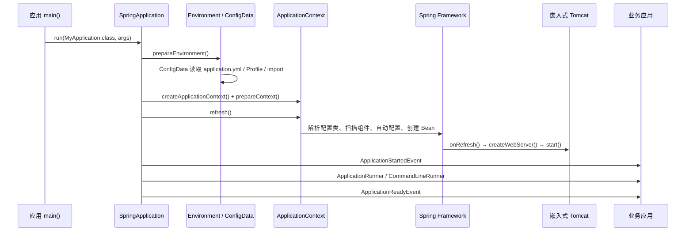

# Spring Boot 启动流程源码分析

> 基于 Spring Boot `3.5.16-SNAPSHOT` 源码梳理。本文以典型 Spring MVC + 内嵌 Tomcat 应用为主线。

## 一句话概览

`SpringApplication.run()` 先准备配置环境，再创建并刷新 `ApplicationContext`；在 `refresh()` 中完成组件扫描、自动配置、Bean 创建以及内嵌 Tomcat 启动。随后执行 `ApplicationRunner` / `CommandLineRunner`，最后发布 `ApplicationReadyEvent`。

自动配置的候选发现、条件过滤与排序细节见：[[Spring Boot 自动配置源码解析]]。



## 核心接口地图

> [!abstract] 阅读方法
> 先按“启动编排、环境配置、容器刷新、Web Server、就绪回调”定位接口。判断一个扩展点时，始终问三个问题：它处理什么对象、在什么时机介入、会改变什么结果。

### 启动编排与阶段通知

| API / 类型 | 中文定位 | 介入时机 | 核心职责 |
| --- | --- | --- | --- |
| `SpringApplication` | 启动总编排器 | `main()` 调用后 | 串联 Environment、Context、事件、Runner 和失败处理 |
| `BootstrapRegistryInitializer` | 引导注册器 | Context 创建前 | 向 `BootstrapContext` 注册启动早期依赖 |
| `ApplicationContextInitializer<C>` | Context 初始化器 | Context 已创建、`refresh()` 前 | 修改 Environment、注册属性源或调整 Context |
| `SpringApplicationRunListener` | 启动阶段监听协议 | 整个 `run()` 周期 | 接收 starting、environmentPrepared、started、ready、failed 等阶段回调 |
| `ApplicationListener<E>` | Spring 事件监听器 | 对应事件发布时 | 监听 Boot 启动事件或普通 Context 事件 |
| `ApplicationStartup` / `StartupStep` | 启动观测接口 | 各启动步骤执行时 | 记录启动步骤、耗时和标签 |

主要实现：`EventPublishingRunListener` 把 `SpringApplicationRunListener` 阶段回调转换为 `ApplicationEvent`。

### Environment 与配置数据

| API / 类型 | 处理对象 | 介入时机 | 核心职责 |
| --- | --- | --- | --- |
| `ConfigurableEnvironment` | 属性源、Profile | Context 创建前 | 保存系统属性、环境变量、命令行和配置文件结果 |
| `PropertySource<?>` | 一组键值配置 | Environment 准备阶段 | 表达配置来源及其优先级 |
| `EnvironmentPostProcessor` | Environment | `ApplicationEnvironmentPreparedEvent` | 在 Context 创建前增加、删除或调整属性源 |
| `ConfigDataLocationResolver` | 配置位置 | ConfigData 解析阶段 | 把 location 转换成可加载资源描述 |
| `ConfigDataLoader` | 配置资源 | ConfigData 加载阶段 | 读取配置并生成 PropertySource |
| `Binder` | Environment 属性 | 配置绑定阶段 | 将 `spring.main.*` 等属性绑定到 Java 对象 |

关键实现：`ConfigDataEnvironmentPostProcessor` 组织 resolver 与 loader，处理 `application.yml`、Profile 和 `spring.config.import`。

### Context、Bean 与 Web Server

| API / 类型 | 中文定位 | 介入位置 | 核心职责 |
| --- | --- | --- | --- |
| `ApplicationContextFactory` | Context 工厂策略 | `createApplicationContext()` | 根据 `WebApplicationType` 创建普通、Servlet 或 Reactive Context |
| `ConfigurableApplicationContext` | 可刷新应用上下文 | `prepareContext`、`refresh` | 承载 Environment、BeanFactory、事件和生命周期 |
| `BeanDefinitionRegistry` | Bean 定义注册表 | `refresh()` 早期 | 保存主配置类、扫描组件和自动配置产生的定义 |
| `BeanFactoryPostProcessor` | Bean 定义后处理器 | Bean 实例化前 | 修改 BeanDefinition 或继续注册定义 |
| `BeanPostProcessor` | Bean 实例后处理器 | Bean 初始化前后 | 注入注解依赖、执行生命周期协议、创建代理 |
| `ServletWebServerFactory` | Servlet Web Server 工厂 | Context `onRefresh()` | 创建 Tomcat、Jetty 或 Undertow Web Server |
| `WebServer` | 内嵌服务器抽象 | Context 刷新期间 | 启动端口、停止服务器、返回实际端口 |

### 启动完成与可用性

| API / 类型 | 输入 | 时机 | 适用场景 |
| --- | --- | --- | --- |
| `ApplicationRunner` | 结构化 `ApplicationArguments` | `ApplicationStartedEvent` 后 | 使用解析后的选项执行启动任务 |
| `CommandLineRunner` | 原始 `String[]` | `ApplicationStartedEvent` 后 | 兼容简单命令行启动逻辑 |
| `ApplicationAvailability` | Liveness / Readiness | Context 运行后 | 查询应用存活和接流状态 |
| `AvailabilityChangeEvent<S>` | 可用性状态 | started、ready 或自定义时点 | 广播 `LivenessState`、`ReadinessState` 变化 |

## 形象类比：餐厅开业

> [!warning] 使用边界
> 类比只用于建立第一次记忆。判断先后顺序和扩展能力时，请回到真实接口、处理对象与生命周期时机。

| 餐厅开业类比         | Spring Boot 类型                            | 真正职责                       |
| -------------- | ----------------------------------------- | -------------------------- |
| 总开业经理          | `SpringApplication`                       | 安排开业全过程并处理失败收尾             |
| 临时筹备办公室        | `BootstrapContext`                        | 在正式餐厅系统建立前保存早期资源           |
| 营业规则、供应商清单     | `Environment` / `PropertySource`          | 汇总配置及其优先级                  |
| 开业前修订运营手册      | `EnvironmentPostProcessor`                | 在正式 Context 创建前调整配置        |
| 餐厅完整管理系统       | `ApplicationContext`                      | 管理人员、设备、事件和生命周期            |
| 岗位与设备登记表       | `BeanDefinition`                          | 描述将要创建的 Bean，而不是 Bean 实例本身 |
| 全员到岗、设备通电、前厅启用 | `refresh()`                               | 解析定义、创建 Bean、启动内嵌服务器       |
| 前厅大门与接单窗口      | `WebServer`                               | 监听端口并接收网络连接                |
| 开业前最后检查表       | `ApplicationRunner` / `CommandLineRunner` | 在容器启动后完成业务初始化              |
| 正式挂出“营业中”      | `ApplicationReadyEvent`                   | 宣告启动任务完成并进入接受流量状态          |
| 广播系统           | `ApplicationEvent`                        | 把阶段变化通知给关注方                |

把主线记成一句话：**筹备办公室准备资源 → 汇总营业规则 → 建立餐厅系统 → 全员到岗并打开接单窗口 → 执行最后检查 → 宣告正式营业。**

## 完整启动调用链

```java
应用#main(String[] args)
    SpringApplication#run(MyApplication.class, args)
        SpringApplication#run(Class<?>[] primarySources, String[] args)
            new SpringApplication(primarySources)
                WebApplicationType#deduceFromClasspath()
                    // 判断应用类型：SERVLET / REACTIVE / NONE

                SpringFactoriesLoader#load(...)
                    // 加载 BootstrapRegistryInitializer
                    // 加载 ApplicationContextInitializer
                    // 加载 ApplicationListener

            SpringApplication#run(String... args)
                Startup#create()
                createBootstrapContext()
                    BootstrapRegistryInitializer#initialize()

                getRunListeners(args)
                    SpringFactoriesLoader#load(SpringApplicationRunListener.class)
                        EventPublishingRunListener

                SpringApplicationRunListeners#starting(...)
                    EventPublishingRunListener#starting(...)
                        发布 ApplicationStartingEvent
                        // Context 尚未创建；配置文件尚未读取

                new DefaultApplicationArguments(args)
                    // 解析 --server.port=8081 等命令行参数

                SpringApplication#prepareEnvironment(...)
                    getOrCreateEnvironment()
                        // MVC 应用通常为 ApplicationServletEnvironment

                    configureEnvironment(...)
                        // 添加命令行 PropertySource、配置 Profile 等

                    ConfigurationPropertySources#attach(environment)

                    SpringApplicationRunListeners#environmentPrepared(...)
                        EventPublishingRunListener#environmentPrepared(...)
                            发布 ApplicationEnvironmentPreparedEvent

                            EnvironmentPostProcessorApplicationListener#onApplicationEvent(...)
                                ConfigDataEnvironmentPostProcessor#postProcessEnvironment(...)
                                    ConfigDataEnvironment#processAndApply()
                                        // 读取 application.yml / application.properties
                                        // 读取 application-{profile}.yml
                                        // 处理 spring.config.import

                    bindToSpringApplication(environment)
                        // 将 spring.main.* 绑定到 SpringApplication

                SpringApplication#printBanner(environment)

                SpringApplication#createApplicationContext()
                    ApplicationContextFactory#create(...)
                        ServletWebServerApplicationContext

                SpringApplication#prepareContext(...)
                    context#setEnvironment(environment)
                    SpringApplication#applyInitializers(context)
                        ApplicationContextInitializer#initialize(context)

                    发布 ApplicationContextInitializedEvent
                    注册 springApplicationArguments、springBootBanner

                    SpringApplication#load(context, primarySources)
                        BeanDefinitionLoader#load()
                            AnnotatedBeanDefinitionReader#register(MyApplication.class)
                            // 此处注册启动类定义，尚未完成全部扫描和自动配置

                    发布 ApplicationPreparedEvent

                SpringApplication#refreshContext(context)
                    ServletWebServerApplicationContext#refresh()
                        AbstractApplicationContext#refresh()
                            prepareRefresh()
                            obtainFreshBeanFactory()
                            prepareBeanFactory(...)

                            invokeBeanFactoryPostProcessors(...)
                                ConfigurationClassPostProcessor#postProcessBeanDefinitionRegistry(...)
                                    解析 @SpringBootApplication
                                        @ComponentScan
                                            扫描 @Component / @Service / @Controller 等
                                        @EnableAutoConfiguration
                                            AutoConfigurationImportSelector#selectImports(...)
                                                从 AutoConfiguration.imports 读取候选项
                                                排除项、去重、条件筛选
                                                导入匹配的自动配置类

                            registerBeanPostProcessors(...)
                            initMessageSource()
                            initApplicationEventMulticaster()

                            onRefresh()
                                ServletWebServerApplicationContext#createWebServer()
                                    TomcatServletWebServerFactory#getWebServer(...)
                                        Tomcat#start()
                                        // Connector 开始监听 server.port

                            finishBeanFactoryInitialization(...)
                                preInstantiateSingletons()
                                // 创建非懒加载单例，完成依赖注入和 @PostConstruct

                            finishRefresh()
                                发布 ContextRefreshedEvent

                SpringApplicationRunListeners#started(...)
                    发布 ApplicationStartedEvent
                    发布 LivenessState.CORRECT

                SpringApplication#callRunners(...)
                    ApplicationRunner#run(args)
                    CommandLineRunner#run(args)

                SpringApplicationRunListeners#ready(...)
                    发布 ApplicationReadyEvent
                    发布 ReadinessState.ACCEPTING_TRAFFIC

                return ConfigurableApplicationContext
```

## 阶段与关键职责

| 阶段 | Context 状态 | 关键动作 | 常用扩展点 |
| --- | --- | --- | --- |
| `starting` | 未创建 | Bootstrap Context、早期启动事件 | `BootstrapRegistryInitializer`、`ApplicationStartingEvent` |
| `prepareEnvironment` | 未创建 | 命令行参数、配置文件、Profile、属性源合并 | `EnvironmentPostProcessor`、`ApplicationEnvironmentPreparedEvent` |
| `prepareContext` | 已创建，未刷新 | 应用 Initializer，注册主配置类 | `ApplicationContextInitializer`、`ApplicationContextInitializedEvent` |
| `refresh` | 正在刷新 | 配置类解析、扫描、自动配置、Bean 实例化、Tomcat 启动 | `BeanFactoryPostProcessor`、`BeanPostProcessor` |
| `started` | 已刷新 | Context 已可运行 | `ApplicationStartedEvent` |
| `runners` | 已刷新 | 执行启动业务任务 | `ApplicationRunner`、`CommandLineRunner` |
| `ready` | 已就绪 | 宣告可接收流量 | `ApplicationReadyEvent` |

## 四个容易混淆的重点

### 1. 配置文件早于容器读取

`application.yml` 并不是在 Bean 创建时读取，而是在 `prepareEnvironment()` 中由 `ConfigDataEnvironmentPostProcessor` 处理。因此 `@Value`、`@ConfigurationProperties` 需要的属性在 `ApplicationContext` 创建前已进入 `Environment`。

### 2. `load()` 不等于完成组件扫描

`SpringApplication#load()` 主要把 `MyApplication` 注册为配置类。真正的 `@ComponentScan`、`@Bean` 解析、`@Import` 和自动配置发生在 `refresh()` 内的 `ConfigurationClassPostProcessor`。

### 3. 自动配置不是“把所有配置都注册”

`@EnableAutoConfiguration` 导入 `AutoConfigurationImportSelector`。它从：

```text
META-INF/spring/org.springframework.boot.autoconfigure.AutoConfiguration.imports
```

读取候选配置，再应用排除规则和条件注解。例如：

- `@ConditionalOnClass`：相关依赖是否在 classpath；
- `@ConditionalOnProperty`：配置项是否满足；
- `@ConditionalOnBean`：指定 Bean 是否存在；
- `@ConditionalOnMissingBean`：用户是否已自定义同类 Bean。

这也是“用户自定义配置通常优先于默认自动配置”的来源。

### 4. Tomcat 在 Runner 之前启动

内嵌 Tomcat 在 `ServletWebServerApplicationContext#onRefresh()` 中创建并启动；`ApplicationStartedEvent`、`ApplicationRunner` 和 `ApplicationReadyEvent` 都在 `refresh()` 返回之后。

因此：

- `ApplicationStartedEvent`：容器已刷新，但 Runner 还未执行；
- `ApplicationReadyEvent`：Runner 已执行完，适合表示应用真正就绪；
- 容器端口可能已经开始监听，但健康检查应以 readiness 状态为准。

## 与 HTTP 请求链路的衔接

当 `ApplicationReadyEvent` 发布后，客户端请求进入已经启动的 Tomcat。典型 Spring MVC 请求链路为：

```text
客户端 HTTP 字节
    Tomcat#Http11InputBuffer#parseRequestLine()
    Tomcat#Http11InputBuffer#parseHeaders()
    Tomcat#CoyoteAdapter#service()
        StandardEngineValve#invoke()
            StandardHostValve#invoke()
                StandardContextValve#invoke()
                    StandardWrapperValve#invoke()
                        ApplicationFilterChain#doFilter()
                            CharacterEncodingFilter#doFilter()
                            DelegatingFilterProxy#doFilter()
                                FilterChainProxy#doFilter()
                                    Spring Security 内部过滤器链
                            自定义 Filter#doFilter()
                            DispatcherServlet#service()
                                FrameworkServlet#processRequest()
                                    DispatcherServlet#doService()
                                        DispatcherServlet#doDispatch()
                                            HandlerMapping#getHandler()
                                            HandlerAdapter#handle()
                                                Controller 方法
                                            HttpMessageConverter#write(...)
                                                // 序列化响应，例如 JSON
```

注意：Servlet 容器直接执行的是 `DelegatingFilterProxy`；它再委派给 Spring Security 的 `FilterChainProxy` 和匹配的 `SecurityFilterChain`。因此，`SecurityFilterChain` 不是通常意义上直接挂在 Tomcat `ApplicationFilterChain` 中的单一 Filter。

## 推荐断点

按下面顺序调试，能最快建立整体认知：

1. `SpringApplication#run(String...)`
2. `SpringApplication#prepareEnvironment(...)`
3. `ConfigDataEnvironmentPostProcessor#postProcessEnvironment(...)`
4. `SpringApplication#prepareContext(...)`
5. `AbstractApplicationContext#refresh()`
6. `ConfigurationClassPostProcessor#processConfigBeanDefinitions(...)`
7. `AutoConfigurationImportSelector#getAutoConfigurationEntry(...)`
8. `ServletWebServerApplicationContext#createWebServer()`
9. `SpringApplication#callRunners(...)`

## 关键源码位置（当前仓库）

- `spring-boot-project/spring-boot/src/main/java/org/springframework/boot/SpringApplication.java`
- `spring-boot-project/spring-boot/src/main/java/org/springframework/boot/context/event/EventPublishingRunListener.java`
- `spring-boot-project/spring-boot/src/main/java/org/springframework/boot/env/EnvironmentPostProcessorApplicationListener.java`
- `spring-boot-project/spring-boot/src/main/java/org/springframework/boot/context/config/ConfigDataEnvironmentPostProcessor.java`
- `spring-boot-project/spring-boot-autoconfigure/src/main/java/org/springframework/boot/autoconfigure/AutoConfigurationImportSelector.java`
