# Spring Boot 自动配置源码解析

> 基于 Spring Boot `3.5.16-SNAPSHOT` 源码梳理。本文解释“候选自动配置如何被发现、过滤、排序、导入及最终生效”。
>
> 启动流程总览见：[[Spring Boot 启动流程源码分析]]。

## 一句话概览

自动配置不是“扫描所有 `*AutoConfiguration` 类后全部注册”。它是一个分阶段决策过程：从 `.imports` 读取候选项，应用排除规则和快速条件过滤，统一排序后作为 `@Configuration` 导入，最后再由各个 `@ConditionalOn...` 完成精确条件评估。

```mermaid
flowchart LR
    A["@SpringBootApplication"] --> B["@EnableAutoConfiguration"]
    B --> C["AutoConfigurationImportSelector"]
    C --> D["读取 .imports 候选项"]
    D --> E["去重 + exclude"]
    E --> F["metadata + ImportFilter 预过滤"]
    F --> G["AutoConfigurationGroup 聚合"]
    G --> H["order / before / after 排序"]
    H --> I["作为 @Configuration 导入"]
    I --> J["@ConditionalOn... 精确评估"]
    J --> K["注册匹配的 BeanDefinition"]
```



## 核心接口地图

> [!abstract] 阅读方法
> 自动配置要分成“入口、候选发现、预过滤、排序导入、精确条件、诊断报告”六层。不要把候选配置、已导入配置和最终生效的 Bean 混为一谈。

### 入口与候选发现

| API / 注解 | 中文定位 | 输入 | 输出 / 作用 |
| --- | --- | --- | --- |
| `@EnableAutoConfiguration` | 自动配置总开关 | 主配置类注解元数据 | 导入默认包 Registrar 与自动配置 Selector |
| `@AutoConfigurationPackage` | 默认包登记入口 | 主配置类所在包 | 为 JPA、Repository 等保存默认扫描边界 |
| `DeferredImportSelector` | 延迟导入选择协议 | 配置类元数据 | 在普通配置类解析后返回待导入类名 |
| `AutoConfigurationImportSelector` | 自动配置候选选择器 | 注解属性、Environment、ClassLoader | 得到过滤后的自动配置候选集合 |
| `ImportCandidates` | `.imports` 资源读取器 | 注解类型、ClassLoader | 汇集 classpath 中全部候选类名 |

### 过滤、排序与导入

| API / 类型 | 处理对象 | 时机 | 核心职责 |
| --- | --- | --- | --- |
| `AutoConfigurationMetadata` | 编译期条件和顺序信息 | 候选预过滤、排序 | 不加载配置类即可读取部分条件与 before/after/order |
| `AutoConfigurationImportFilter` | 候选类名数组 | 配置类完整解析前 | 批量排除明显不匹配的候选项 |
| `DeferredImportSelector.Group` | 多个 Selector 结果 | 延迟导入收尾 | 聚合入口、统一排除、返回最终导入项 |
| `AutoConfigurationSorter` | 过滤后的候选类 | Group 返回前 | 处理 order、before、after 并检测循环 |
| `AutoConfigurationImportListener` | 候选项和排除项 | 基础筛选完成后 | 观察导入选择结果，不参与决策 |
| `ImportBeanDefinitionRegistrar` | BeanDefinitionRegistry | 配置类解析阶段 | 以代码方式注册基础设施 BeanDefinition |

主要实现：`OnClassCondition` 同时实现 `AutoConfigurationImportFilter` 和 Spring `Condition`，因此既能批量预过滤，也能在后续进行精确判断。

### 精确条件评估与报告

| API / 类型 | 中文定位 | 判断依据 | 结果 |
| --- | --- | --- | --- |
| `Condition` | Spring 条件根协议 | `ConditionContext`、注解元数据 | 决定配置类或 `@Bean` 是否应被跳过 |
| `SpringBootCondition` | Boot 条件基类 | Environment、BeanFactory、ClassLoader | 统一生成 Outcome、日志并记录报告 |
| `ConditionOutcome` | 条件判断结果 | match / noMatch + 原因 | 同时表达布尔结果和可诊断信息 |
| `OnClassCondition` | classpath 条件 | 目标类是否存在 | 支持 `@ConditionalOnClass` / `@ConditionalOnMissingClass` |
| `OnBeanCondition` | Bean 条件 | BeanDefinition、类型、注解 | 支持 OnBean、OnMissingBean、OnSingleCandidate |
| `OnPropertyCondition` | 配置属性条件 | Environment 属性值 | 支持 `@ConditionalOnProperty` |
| `OnWebApplicationCondition` | Web 类型条件 | Context、classpath、作用域 | 判断 Servlet、Reactive 或非 Web 应用 |
| `ConditionEvaluationReport` | 条件审计报告 | 候选、排除、每项 Outcome | 支撑 `--debug` 和 Actuator conditions 诊断 |

## 形象类比：智能餐厅的设备采购

> [!warning] 使用边界
> 类比用于区分“候选、过滤、排序、最终装配”。实际条件是否成立，必须回到注解、Environment、BeanFactory 和源码时机。

| 采购类比          | 自动配置类型                                     | 真正职责                          |
| ------------- | ------------------------------------------ | ----------------------------- |
| 启动智能采购模式      | `@EnableAutoConfiguration`                 | 开启自动配置入口                      |
| 所有供应商产品目录     | `AutoConfiguration.imports`                | 声明可考虑的自动配置候选类                 |
| 采购经理          | `AutoConfigurationImportSelector`          | 汇总候选、处理排除项并组织筛选               |
| 产品预检标签        | `spring-autoconfigure-metadata.properties` | 提前提供依赖条件和顺序信息                 |
| 仓库门口快速安检      | `AutoConfigurationImportFilter`            | 不拆箱就淘汰明显不适用的设备                |
| 禁购清单          | `exclude` / `spring.autoconfigure.exclude` | 明确排除指定自动配置                    |
| 安装排程员         | `AutoConfigurationSorter`                  | 按 order、before、after 安排配置解析顺序 |
| 现场验收标准        | `@ConditionalOn...` / `Condition`          | 根据真实环境、Bean、属性进行最终判断          |
| 已有自购设备则取消默认设备 | `@ConditionalOnMissingBean`                | 用户已定义 Bean 时让默认配置退避           |
| 设备采购与验收报告     | `ConditionEvaluationReport`                | 说明考虑过什么、排除了什么、为何匹配或不匹配        |

完整类比流程：

```text
读取供应商目录
  -> 应用禁购清单
  -> 根据产品标签快速安检
  -> 合并并安排安装顺序
  -> 到现场按真实条件验收
  -> 只登记通过验收的设备定义
  -> 保存完整采购与验收报告
```

对应正式链路：

```text
ImportCandidates
  -> exclusions
  -> AutoConfigurationImportFilter
  -> AutoConfigurationGroup + AutoConfigurationSorter
  -> SpringBootCondition
  -> BeanDefinition
  -> ConditionEvaluationReport
```

## 主调用链

```java
主启动类上的 @SpringBootApplication
    @EnableAutoConfiguration
        @AutoConfigurationPackage
            AutoConfigurationPackages.Registrar#registerBeanDefinitions(...)
                // 记录主启动类所在包
                // 供 JPA Entity、Repository 等自动配置决定默认扫描边界

        @Import(AutoConfigurationImportSelector.class)
            // 在 ConfigurationClassPostProcessor 解析配置类时触发

ConfigurationClassParser
    DeferredImportSelectorHandler
        AutoConfigurationImportSelector#getImportGroup()
            AutoConfigurationGroup

        AutoConfigurationImportSelector#selectImports(...)
            getAutoConfigurationEntry(...)
                getCandidateConfigurations(...)
                    ImportCandidates#load(AutoConfiguration.class, classLoader)
                        读取：
                        META-INF/spring/
                        org.springframework.boot.autoconfigure.AutoConfiguration.imports

                removeDuplicates(...)

                getExclusions(...)
                    @EnableAutoConfiguration#exclude
                    @EnableAutoConfiguration#excludeName
                    spring.autoconfigure.exclude

                ConfigurationClassFilter#filter(...)
                    AutoConfigurationMetadataLoader#loadMetadata(...)
                        读取所有依赖包中的：
                        META-INF/spring-autoconfigure-metadata.properties

                    AutoConfigurationImportFilter#match(...)
                        OnClassCondition#match(...)
                            // 根据 metadata 快速筛除缺少依赖类的候选项
                            // 此阶段不必加载全部自动配置类

                fireAutoConfigurationImportEvents(...)
                    ConditionEvaluationReportAutoConfigurationImportListener
                        // 记录候选项和显式排除项

        AutoConfigurationGroup#process(...)
            // 收集所有 @EnableAutoConfiguration 入口的候选结果

        AutoConfigurationGroup#selectImports()
            合并候选项并移除全局排除项
            AutoConfigurationSorter#getInPriorityOrder(...)
                @AutoConfigureOrder
                @AutoConfigureBefore
                @AutoConfigureAfter
                // 得到稳定且无循环的导入顺序

            将排序后的类作为 DeferredImportSelector.Entry 返回

ConfigurationClassPostProcessor
    继续把每个 AutoConfiguration 当作普通 @Configuration 解析
        SpringBootCondition#matches(...)
            OnClassCondition#getMatchOutcome(...)
            OnBeanCondition#getMatchOutcome(...)
            OnPropertyCondition#getMatchOutcome(...)
            OnWebApplicationCondition#getMatchOutcome(...)
            // 第二道精确条件评估

        条件满足
            注册配置类及其 @Bean 方法对应的 BeanDefinition
```

## 两层条件判断

最容易混淆的是：为什么 `@ConditionalOnClass` 会出现两次？答案是性能和正确性兼顾。

| 阶段 | 实现 | 输入 | 目的 |
| --- | --- | --- | --- |
| 预过滤 | `AutoConfigurationImportFilter` / `OnClassCondition#match` | 候选类名 + `spring-autoconfigure-metadata.properties` | 批量丢弃明显不匹配的自动配置，减少后续配置类解析 |
| 精确评估 | `SpringBootCondition#matches` | 当前配置类或 `@Bean` 方法的注解元数据、Environment、BeanFactory | 判断所有条件，包括 Bean 是否存在、属性值、Web 类型等 |

因此，预过滤后的候选配置也不保证一定最终生效。例如 `@ConditionalOnMissingBean` 必须等用户 BeanDefinition 已被解析后才能正确判断。

## 候选项从哪里来

Spring Boot 3.x 使用以下文件发现自动配置候选类：

```text
META-INF/spring/org.springframework.boot.autoconfigure.AutoConfiguration.imports
```

每个 starter 或自动配置模块都可以贡献该文件。`ImportCandidates` 汇集当前 classpath 中的所有同名资源，`AutoConfigurationImportSelector` 再完成：

1. 候选列表去重；
2. 处理注解 `exclude`、`excludeName`；
3. 处理 `spring.autoconfigure.exclude`；
4. 执行 `AutoConfigurationImportFilter` 批量过滤；
5. 通知 `AutoConfigurationImportListener`。

注意：`spring.factories` 在这里仍有作用，但用途不同：它用于发现 `AutoConfigurationImportFilter` 与 `AutoConfigurationImportListener` 等扩展实现，不再承担自动配置候选列表本身。

## 编译期 Metadata 为什么重要

`AutoConfigurationMetadataLoader` 合并所有依赖中的：

```text
META-INF/spring-autoconfigure-metadata.properties
```

该文件由配置处理器在构建自动配置模块时生成，包含如 `ConditionalOnClass`、`AutoConfigureBefore`、`AutoConfigureAfter` 等可预先获知的信息。

这使 Boot 可以在早期根据类名存在性筛掉不可能生效的配置，而无需加载每一个候选配置类；它是自动配置在大量 starter 共存时仍保持启动效率的关键。

## 排序只决定定义顺序，不等于业务执行顺序

`AutoConfigurationSorter` 的顺序规则为：

1. 按类名建立稳定初始顺序；
2. 应用 `@AutoConfigureOrder`；
3. 处理 `@AutoConfigureBefore` / `@AutoConfigureAfter`；
4. 检测排序环，出现环时直接失败。

该顺序决定配置类和 BeanDefinition 的解析先后，常用于让基础设施配置先被注册。它不等同于 Bean 实例化顺序，也不替代 `@Order` 对运行时回调、Filter、Runner 的排序语义。

## 默认包：`@AutoConfigurationPackage`

`@EnableAutoConfiguration` 还带有 `@AutoConfigurationPackage`。其 `Registrar` 将主启动类包名保存到 `AutoConfigurationPackages` 基础设施 BeanDefinition。

它通常被下列模块用作默认边界：

- JPA Entity 扫描；
- Spring Data Repository 扫描；
- 其他需要“应用根包”约定的自动配置。

它与 `@ComponentScan` 不同：前者只保存包名供其他模块使用，后者直接扫描并注册组件。

## 条件评估报告

`ConditionEvaluationReport` 以 `autoConfigurationReport` 单例保存在 BeanFactory 中，收集三类信息：

- 被考虑的自动配置候选项；
- 被显式排除的配置；
- 每一个 `@ConditionalOn...` 的匹配结果及失败原因。

诊断自动配置时，可以使用：

```bash
java -jar app.jar --debug
```

或在支持的应用中查看 Actuator 的 conditions 端点。报告应解释“为什么没有生效”；它不只是列出最终生效的配置。

## 核心源码文件与断点

| 目的 | 类 / 方法 |
| --- | --- |
| 自动配置入口 | `EnableAutoConfiguration`、`AutoConfigurationImportSelector#selectImports` |
| 读取候选列表 | `AutoConfigurationImportSelector#getCandidateConfigurations` |
| 排除与快速过滤 | `AutoConfigurationImportSelector#getAutoConfigurationEntry`、`ConfigurationClassFilter#filter` |
| metadata 加载 | `AutoConfigurationMetadataLoader#loadMetadata` |
| classpath 条件 | `OnClassCondition#getOutcomes`、`OnClassCondition#getMatchOutcome` |
| 导入排序 | `AutoConfigurationGroup#selectImports`、`AutoConfigurationSorter#getInPriorityOrder` |
| 最终条件结果 | `SpringBootCondition#matches`、`ConditionEvaluationReport#recordConditionEvaluation` |
| 默认包约定 | `AutoConfigurationPackages.Registrar#registerBeanDefinitions` |

推荐调试顺序：

1. `AutoConfigurationImportSelector#getAutoConfigurationEntry`；
2. `AutoConfigurationImportSelector.ConfigurationClassFilter#filter`；
3. `OnClassCondition#getOutcomes`；
4. `AutoConfigurationGroup#selectImports`；
5. `AutoConfigurationSorter#getInPriorityOrder`；
6. `SpringBootCondition#matches`；
7. `ConditionEvaluationReport#recordConditionEvaluation`。

## 常见误解

### 自动配置会覆盖用户配置

通常不会。自动配置经常使用 `@ConditionalOnMissingBean`，用户定义了同类型 Bean 后，默认配置会退避。但是否退避取决于具体自动配置上的条件，不能将它理解为绝对规则。

### `@SpringBootApplication(scanBasePackages = ...)` 会影响 JPA 扫描

不会直接影响。它只影响 `@ComponentScan`。实体和 Repository 的默认边界来自 `@AutoConfigurationPackage`；需要自定义时使用 `@EntityScan`、`@EnableJpaRepositories` 等专用注解。

### 条件报告中的 negative matches 表示错误

不表示错误。它说明某一候选配置的条件不满足，是自动配置正常的“按需生效”结果。
