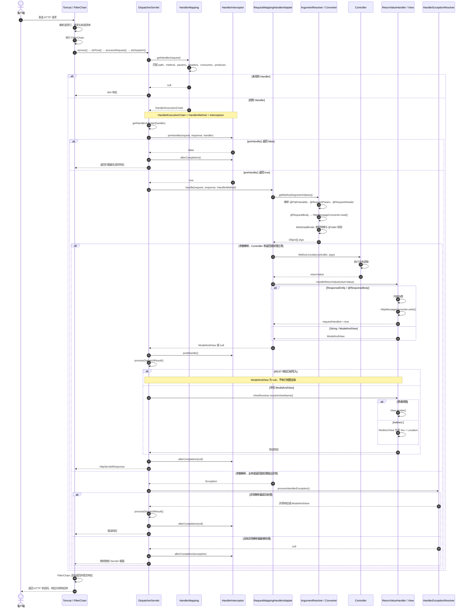

# 01 Spring MVC 请求处理总览

[[SpringMVC-HTTP请求处理全链路|返回索引]] · [[02-Servlet入口与DispatcherServlet|下一篇：Servlet 入口与 DispatcherServlet]]

## 1. Spring MVC 的边界

一次 HTTP 请求可以分成三层：

```text
网络层
  TCP字节、HTTP协议
        ↓
Servlet容器层
  Tomcat解析请求行和请求头
  创建HttpServletRequest、HttpServletResponse
        ↓
Spring MVC层
  路由、参数解析、Controller调用、返回值处理
```

Spring MVC 不直接解析 TCP 数据包。进入 `FrameworkServlet` 时，Tomcat 已经创建好了 Servlet request 和 response。

## 2. 核心组件

Spring MVC 并不是由 `DispatcherServlet` 独自完成所有工作。它负责组织流程，具体工作交给策略组件。

| 组件 | 回答的问题 | 常见实现 |
| --- | --- | --- |
| `HandlerMapping` | 谁处理这个请求？ | `RequestMappingHandlerMapping` |
| `HandlerAdapter` | 怎样调用这个处理器？ | `RequestMappingHandlerAdapter` |
| `HandlerMethodArgumentResolver` | Controller 参数从哪里来？ | `RequestParamMethodArgumentResolver` 等 |
| `HandlerMethodReturnValueHandler` | Controller 返回值表示什么？ | `HttpEntityMethodProcessor` 等 |
| `HttpMessageConverter` | Java 对象和 HTTP Body 如何互转？ | `MappingJackson2HttpMessageConverter` |
| `ViewResolver` | 逻辑视图名对应哪个 View？ | `InternalResourceViewResolver` 等 |
| `HandlerExceptionResolver` | 异常如何转换成 HTTP 响应？ | `ExceptionHandlerExceptionResolver` |
| `HandlerInterceptor` | Controller 前后执行什么逻辑？ | 自定义拦截器 |

核心设计：

```text
DispatcherServlet 负责调度
        +
策略接口负责具体工作
```

## 3. 完整流程图
[[KnowledgeVault/Senior Java Engineer/1-Java/框架/sprongmvc/SpringMVC-HTTP请求处理/附件/fa236f5cbc98fd311cc0ec094b85a742_MD5.jpg|Open: Pasted image 20260726012719.png]]

```mermaid
flowchart LR
    subgraph ENTRY["① Servlet 容器入口"]
        direction TB
        USER["客户端"]
        TOMCAT["Tomcat<br/>解析请求行、请求头和请求体"]
        FILTER["FilterChain<br/>编码、安全、日志等"]
        SERVICE["HttpServlet.service()"]
        FRAMEWORK["FrameworkServlet<br/>doPost() → processRequest()"]

        USER -->|"发送 HTTP 请求"| TOMCAT
        TOMCAT --> FILTER
        FILTER --> SERVICE
        SERVICE --> FRAMEWORK
    end

    subgraph DISPATCH["② DispatcherServlet 总调度"]
        direction TB
        DS["DispatcherServlet.doDispatch()<br/>前端控制器"]
        MULTIPART["checkMultipart()<br/>处理文件上传"]
        HM["HandlerMapping<br/>RequestMappingHandlerMapping"]
        MATCH["RequestMappingInfo 条件匹配<br/>path / method / params / headers<br/>consumes / produces"]
        CHAIN["HandlerExecutionChain<br/>HandlerMethod + Interceptors"]
        ADAPTER_SELECT["getHandlerAdapter()<br/>选择处理器适配器"]
        PRE["HandlerInterceptor.preHandle()"]

        DS --> MULTIPART
        MULTIPART -->|"getHandler()"| HM
        HM --> MATCH
        MATCH -->|"匹配成功"| CHAIN
        CHAIN --> ADAPTER_SELECT
        ADAPTER_SELECT --> PRE
    end

    FRAMEWORK --> DS

    subgraph INVOKE["③ HandlerAdapter 调用 Controller"]
        direction TB
        HA["RequestMappingHandlerAdapter"]
        INVOCABLE["ServletInvocableHandlerMethod<br/>invokeAndHandle()"]
        ARG["ArgumentResolver<br/>解析每一个 Controller 参数"]
        READ["HttpMessageConverter.read()<br/>JSON → Java 对象"]
        BIND["WebDataBinder + Validator<br/>类型转换、数据绑定、@Valid 校验"]
        CONTROLLER["HandlerMethod / Controller<br/>Method.invoke()"]
        RETURN["HandlerMethodReturnValueHandlerComposite<br/>处理 Controller 返回值"]

        HA --> INVOCABLE
        INVOCABLE --> ARG
        ARG -->|"@PathVariable / @RequestParam<br/>@RequestHeader 等"| BIND
        ARG -->|"@RequestBody"| READ
        READ --> BIND
        BIND --> CONTROLLER
        CONTROLLER --> RETURN
    end

    PRE -->|"返回 true"| HA

    subgraph RESULT["④ 返回值处理"]
        direction TB
        RETURN_TYPE{"Controller 返回值"}

        HTTP_ENTITY["HttpEntityMethodProcessor<br/>ResponseEntity"]
        RESPONSE_BODY["RequestResponseBodyMethodProcessor<br/>@ResponseBody"]
        WRITE["HttpMessageConverter.write()<br/>Java 对象 → JSON/XML/文本"]
        DIRECT["直接写入 HttpServletResponse<br/>requestHandled = true"]

        VIEW_HANDLER["ViewName / ModelAndView<br/>ReturnValueHandler"]
        MV["ModelAndView<br/>Model + ViewName"]

        RETURN_TYPE -->|"ResponseEntity"| HTTP_ENTITY
        RETURN_TYPE -->|"@ResponseBody / @RestController"| RESPONSE_BODY
        HTTP_ENTITY --> WRITE
        RESPONSE_BODY --> WRITE
        WRITE --> DIRECT

        RETURN_TYPE -->|"String / ModelAndView"| VIEW_HANDLER
        VIEW_HANDLER --> MV
    end

    RETURN --> RETURN_TYPE

    subgraph COMPLETE["⑤ DispatcherServlet 处理结果"]
        direction TB
        POST["HandlerInterceptor.postHandle()<br/>Controller 正常完成后逆序执行"]
        PROCESS["processDispatchResult()"]
        RESULT_TYPE{"是否需要视图渲染？"}

        VIEW_RESOLVER["ViewResolver<br/>解析逻辑视图名"]
        VIEW_TYPE{"具体 View"}
        VIEW["View.render()<br/>模板生成 HTML"]
        REDIRECT["RedirectView<br/>生成 3xx + Location"]

        RESPONSE["HttpServletResponse<br/>状态码 + 响应头 + 响应体"]
        AFTER["HandlerInterceptor.afterCompletion()<br/>逆序完成资源清理"]
        FINALLY["FrameworkServlet.processRequest() finally<br/>恢复请求上下文"]
        FILTER_RETURN["FilterChain 逐层返回"]

        POST --> PROCESS
        PROCESS --> RESULT_TYPE

        RESULT_TYPE -->|"REST：响应已经写入"| RESPONSE
        RESULT_TYPE -->|"存在 ModelAndView"| VIEW_RESOLVER
        VIEW_RESOLVER --> VIEW_TYPE
        VIEW_TYPE -->|"普通页面"| VIEW
        VIEW_TYPE -->|"redirect:"| REDIRECT
        VIEW --> RESPONSE
        REDIRECT --> RESPONSE

        RESPONSE --> AFTER
        AFTER --> FINALLY
        FINALLY --> FILTER_RETURN
    end

    DIRECT --> POST
    MV --> POST

    subgraph EXCEPTION["⑥ 异常处理分支"]
        direction TB
        EX_RESOLVER["HandlerExceptionResolver"]
        EX_HANDLER["ExceptionHandlerExceptionResolver<br/>@ExceptionHandler / @ControllerAdvice"]
        STATUS_HANDLER["ResponseStatusExceptionResolver<br/>@ResponseStatus"]
        DEFAULT_HANDLER["DefaultHandlerExceptionResolver<br/>Spring MVC 内置异常"]
        EX_RESULT["异常响应或 ModelAndView"]
        UNHANDLED["未处理异常<br/>交给 Servlet 容器"]

        EX_RESOLVER --> EX_HANDLER
        EX_RESOLVER --> STATUS_HANDLER
        EX_RESOLVER --> DEFAULT_HANDLER

        EX_HANDLER -->|"处理成功"| EX_RESULT
        STATUS_HANDLER -->|"处理成功"| EX_RESULT
        DEFAULT_HANDLER -->|"处理成功"| EX_RESULT
        EX_RESOLVER -->|"均未处理"| UNHANDLED
    end

    ARG -. "参数解析异常" .-> EX_RESOLVER
    BIND -. "绑定或校验异常" .-> EX_RESOLVER
    CONTROLLER -. "业务异常" .-> EX_RESOLVER
    RETURN -. "返回值处理异常" .-> EX_RESOLVER

    EX_RESULT --> PROCESS
    UNHANDLED --> AFTER

    MATCH -->|"未找到 Handler"| NOT_FOUND["404 / noHandlerFound()"]
    NOT_FOUND --> RESPONSE

    PRE -->|"返回 false"| RESPONSE

    FILTER_RETURN -->|"返回 HTTP 响应"| USER
```

![[KnowledgeVault/Senior Java Engineer/1-Java/框架/sprongmvc/SpringMVC-HTTP请求处理/附件/fa236f5cbc98fd311cc0ec094b85a742_MD5.jpg]]



图中实线表示正常处理路径，虚线表示异常分支。REST 响应由 `HttpMessageConverter` 直接写入 response；传统 MVC 则生成 `ModelAndView`，再经过 `ViewResolver` 和 `View`。

## 4. 泳道图：一次请求的时间顺序

整体链路图强调组件关系，下面的泳道图强调调用的先后顺序。横向是参与者，纵向从上到下表示时间推进。



泳道中的关键观察点：

- `DispatcherServlet` 负责组织调用顺序，本身不解析业务参数；
- `HandlerMapping` 只负责查找，不负责调用 Controller；
- `RequestMappingHandlerAdapter` 内部完成参数解析、Controller 调用和返回值处理；
- REST 响应在 HandlerAdapter 内部写出，MVC 视图在 `processDispatchResult()` 中渲染；
- 正常请求执行 `postHandle()`，异常请求会跳过它并进入 `HandlerExceptionResolver`；
- `afterCompletion()` 位于请求收尾阶段。

## 5. 本系列使用的请求

```http
POST /api/users/42/orders?notify=true HTTP/1.1
Host: localhost:8080
Content-Type: application/json
Accept: application/json
X-Request-Id: req-10001

{
  "productId": 1001,
  "quantity": 2
}
```

Controller：

```java
@RestController
@RequestMapping("/api/users")
public class OrderController {

    @PostMapping(
            value = "/{userId}/orders",
            consumes = "application/json",
            produces = "application/json")
    public ResponseEntity<OrderVO> createOrder(
            @PathVariable Long userId,
            @RequestParam boolean notify,
            @RequestHeader("X-Request-Id") String requestId,
            @Valid @RequestBody CreateOrderRequest request) {

        OrderVO order =
                orderService.create(userId, notify, requestId, request);

        return ResponseEntity
                .status(HttpStatus.CREATED)
                .body(order);
    }
}
```

HTTP 数据与参数的关系：

| Controller 参数 | HTTP 数据来源 |
| --- | --- |
| `userId` | 路径变量 `/users/42` |
| `notify` | 查询参数 `?notify=true` |
| `requestId` | 请求头 `X-Request-Id` |
| `request` | JSON 请求体 |

响应：

```http
HTTP/1.1 201 Created
Content-Type: application/json

{
  "id": 9001,
  "userId": 42,
  "productId": 1001,
  "quantity": 2
}
```

## 6. 主干调用链

```text
Tomcat
  -> FilterChain
  -> HttpServlet.service()
  -> FrameworkServlet.processRequest()
  -> DispatcherServlet.doService()
  -> DispatcherServlet.doDispatch()
  -> HandlerMapping
  -> HandlerAdapter
  -> ArgumentResolver
  -> Controller
  -> ReturnValueHandler
  -> HttpMessageConverter或ViewResolver
  -> HTTP响应
```

下一篇从 Servlet 入口开始逐方法展开。

[[SpringMVC-HTTP请求处理全链路|返回索引]] · [[02-Servlet入口与DispatcherServlet|下一篇：Servlet 入口与 DispatcherServlet]]
