# 《消息队列专题》学习课程


## I、大纲


[TOC]


## II、简介

```markdown
一站式速学 MQ 体系自学课程。
```


## III、各demo占用端口情况

| 模块                                   | 工程名                     | 端口                                    | 功能描述           |
| -------------------------------------- | -------------------------------- | --------------------------------------- | :----------------- |
| <font color='blue'>2.3小节</font> | mq2.3_rmqdemo       | 9500       | SpringCloudAlibaba 集成 RocketMQ |
| <font color='blue'>2.6小节</font> | mq2.6_trace | 9510 | 消息轨迹跟踪 |
| <font color='blue'>2.7小节</font> | mq2.7_spmc_consumer    | 9520                                     | 集群消费者组                        |
|                                    | mq2.7_spmc_producer    | 9525                                     | 集群生产者                          |
| <font color='blue'>2.8小节</font>  | mq2.8_orderly_consumer | 9530<br/>9531<br/>9532<br/>9533<br/>9534 | 顺序性消费者集群                    |
|                                    | mq2.8_orderly_producer | -                                        | 生产者发送全局消息<br/>局部有序消息 |
| <font color='blue'>2.9小节</font>  | mq2.9_delay            | -                                        | 延时消息                            |
| <font color='blue'>2.10小节</font> | mq2.10_batch           | -                                        | 批量消息                            |
| <font color='blue'>2.11小节</font> | mq2.11_filter          | -                                        | 过滤消息                            |
| <font color='blue'>2.12小节</font> | mq2.12_transaction     | -                                        | 事物消息                            |
| <font color='blue'>2.13小节</font> | mq2.13_retry           | -                                        | 重试消息                            |


## 一、RocketMQ 基本介绍


### 1.1 MQ 的使用场景


- MQ 是什么？
  - MessageQueue：消息+队列、任务+队列、指令+队列
  - 功能：应用程序之间（生产者 + 消费者）的一个通信的方式

- 日常开发的哪些功能有 MQ 的影子？

  - 单线程 + 单队列

    ​	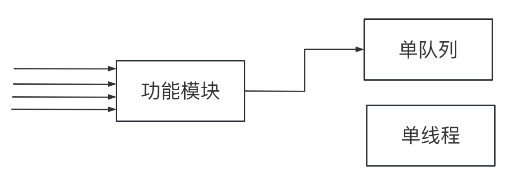

  - 多线程 + 单队列

    ​	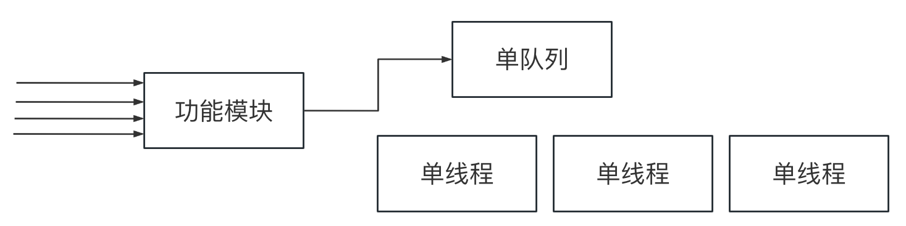

  - 多线程 + 多队列

- 从这些 “影子” 中可以推测出使用的场景？
  - 打起了线程的主意：引出了**异步**
    - 举例：用户注册，注册完成后，还需要继续送积分（积分系统）、送优惠券（优惠券系统）
  - 拆分主与子的关系：引出了**解耦**
    - 举例：用户注册、积分、优惠券，拆散成了不同的体系模块，各自关注自己的业务逻辑
  - 积分、优惠券关注点：引出了**数据分发**
    - 举例：积分系统、优惠券系统，都对用户注册的时机感兴趣
  - 单线程演变多线程：引出了**高流量**，从而最终引出**流量削峰**
    - 举例：用户注册、送积分、送优惠券，各消耗 33 毫秒，那意味着目前用户注册功能 QPS 约为 10

- 再举一些例子，找找感觉：

  - 商品上架，商品信息将来还需要被检索到

    ​	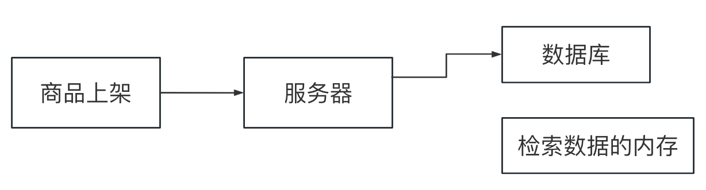

  - 用户下单，半小时未支付则自动取消订单

    ​	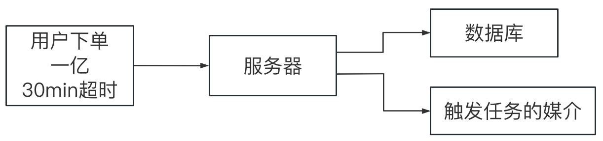

  - 支付完成，比如加积分、发送短信，推送结算

  - ......


### 1.2 MQ 解决的问题


- 回顾使用的一些场景
- 总结解决的问题：
  - 异步：侧重的处理流程，流程上将以前的一些同步逻辑，改造成为异步的逻辑流程
  - 解耦：侧重的功能设计，在做一些业务架构分析的时候，可以有力度有重点的区分主干流程、分支流程
  - 削峰限流：侧重在数量级的问题，相比于未接入MQ时能再次抗上几倍甚至几十倍、几百倍...的流量
  - 延迟调用（准实时、一定延时）：侧重定制化诉求，在 db 与 MQ 之间做了一个抉择


### 1.3 MQ 该如何选型


- 官网地址：https://rocketmq.apache.org/zh/docs/#rocketmq-vs-activemq-vs-kafka


| Messaging Product | Client SDK           | Protocol and Specification                           | Ordered Message                                              | Scheduled Message | Batched Message                                 | BroadCast Message | Message Filter                                          | Server Triggered Redelivery | Message Storage                                              | Message Retroactive                          | Message Priority | High Availability and Failover                               | Message Track | Configuration                                                | Management and Operation Tools                               |
| ----------------- | -------------------- | ---------------------------------------------------- | ------------------------------------------------------------ | ----------------- | ----------------------------------------------- | ----------------- | ------------------------------------------------------- | --------------------------- | ------------------------------------------------------------ | -------------------------------------------- | ---------------- | ------------------------------------------------------------ | ------------- | ------------------------------------------------------------ | ------------------------------------------------------------ |
| ActiveMQ          | Java, .NET, C++ etc. | Push model, support OpenWire, STOMP, AMQP, MQTT, JMS | Exclusive Consumer or Exclusive Queues can ensure ordering   | Supported         | Not Supported                                   | Supported         | Supported                                               | Not Supported               | Supports very fast persistence using JDBC along with a high performance journal，such as levelDB, kahaDB | Supported                                    | Supported        | Supported, depending on storage,if using levelDB it requires a ZooKeeper server | Not Supported | The default configuration is low level, user need to optimize the configuration parameters | Supported                                                    |
| Kafka             | Java, Scala etc.     | Pull model, support TCP                              | Ensure ordering of messages within a partition               | Not Supported     | Supported, with async producer                  | Not Supported     | Supported, you can use Kafka Streams to filter messages | Not Supported               | High performance file storage                                | Supported offset indicate                    | Not Supported    | Supported, requires a ZooKeeper server                       | Not Supported | Kafka uses key-value pairs format for configuration. These values can be supplied either from a file or programmatically. | Supported, use terminal command to expose core metrics       |
| RocketMQ          | Java, C++, Go        | Pull model, support TCP, JMS, OpenMessaging          | Ensure strict ordering of messages,and can scale out gracefully | Supported         | Supported, with sync mode to avoid message loss | Supported         | Supported, property filter expressions based on SQL92   | Supported                   | High performance and low latency file storage                | Supported timestamp and offset two indicates | Not Supported    | Supported, Master-Slave model, without another kit           | Supported     | Work out of box,user only need to pay attention to a few configurations | Supported, rich web and terminal command to expose core metrics |


ActiveMQ、Kafka、RocketMQ

- 中间件角度

  - 性能维度
    - 单机吞吐量：万，百万，十万
    - 消息发送时延：毫秒，毫秒，微秒
    - 可用性：主从，分布式、分布式

  - 扩展维度
    - 水平伸缩能力：支持，支持，支持
    - 技术栈：Java，Java/Scala，Java

- 应用架构师角度
  - 功能维度
    - 消息重试：支持，支持，支持
    - 消息堆积能力：弱，强、强
    - 消息过滤：支持，不支持，支持
    - 延迟消息：支持，支持，支持
    - 消息回溯：不支持，支持，支持


- 再次总结：https://time.geekbang.org/column/article/540810  《中间件核心技术与实战》

  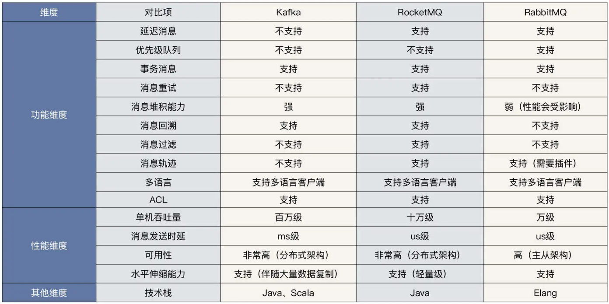


### 1.4 RocketMQ 领域模型


官网地址：https://rocketmq.apache.org/zh/docs/domainModel/01main

- Topic：主题，可以理解为类别、分类的概念
- MessageQueue：消息队列，存储数据的一个容器（队列索引数据），默认每个 Topic 下有 4 个队列被分配出来存储消息
- Message：消息，真正携带信息的载体概念
- Producer：生产者，负责发送消息
- Consumer：消费者，负责消费消息
- ConsumerGroup：众多消费者构成的整体或构成的集群，称之为消费者组
- Subscription：订阅关系，消费者得知道自己需要消费哪个 Topic 下的哪个队列的数据


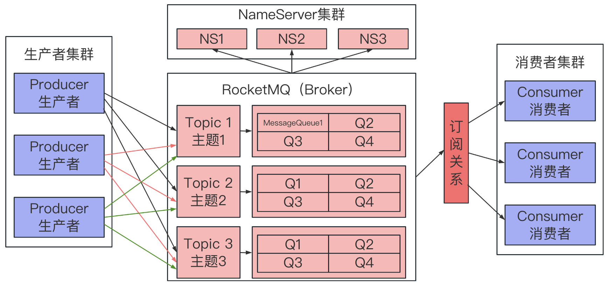


## 二、RocketMQ 实战

### 2.1 RocketMQ 单机服务搭建

- 搭建架构
  - 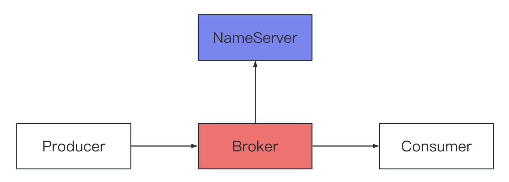

- 相关地址

  - RocketMQ 官网地址：https://rocketmq.apache.org/zh/docs/
  - 二进制下载主页：https://rocketmq.apache.org/zh/download/
  - 5.1.0 二进制包下载：https://dist.apache.org/repos/dist/release/rocketmq/5.1.0/

  - 启动参考步骤：https://github.com/apache/rocketmq

- NameServer 启动
  - 在 mqnamesrv.sh 文件中设置：export ROCKETMQ_HOME=/Users/mac/Documents/install/rocketmq-all-5.1.0
  - 修改 runserver.sh，内容为：export JAVA_HOME=/Library/Java/JavaVirtualMachines/jdk1.8.0_121.jdk/Contents/Home
  - 启动 mqnamesrv.sh 文件
    - The Name Server boot success. serializeType=JSON, address 0.0.0.0:9876
- Broker 启动
  - 新建 brokersrv.sh，内容为：./mqbroker -n localhost:9876 autoCreateTopicEnable=true，记得设置 chmod 777 brokersrv.sh
  - 修改 runbroker.sh，内容为：export JAVA_HOME=/Library/Java/JavaVirtualMachines/jdk1.8.0_121.jdk/Contents/Home
  - 在 mqbroker.sh 文件中设置：export ROCKETMQ_HOME=/Users/mac/Documents/install/rocketmq-all-5.1.0
  - 为了找到存储的目录，在 runbroker.sh 文件中设置：JAVA_OPT="${JAVA_OPT} -Duser.home=/Users/mac/Documents/mqdatas"

- 创建 Topic 关注的配置
  - 需要在 mqadmin.sh 文件中设置：export ROCKETMQ_HOME=/Users/mac/Documents/install/rocketmq-all-5.1.0


### 2.2 RocketMQ 源码启动服务

- RocketMQ 官网地址：https://rocketmq.apache.org/zh/docs/

- 如何找到源码启动类？想想我们怎么启动 broker 的？

- 找到了之后，我们怎么主动控制 store 目录应该存放的位置？

- 可以通过 -D 来设置 user.home 参数，指定存放位置
- 要不要设置  JAVA_HOME 这个环境变量？
  - 如果 idea 运行启动成功的话，那就说明不需要设置 JAVA_HOME 环境变量，其实是 idea正确关联了 JDK 的指定版本
  - 如果能在 idea 运行启动不成功的话，那就说明我们的 idea 环境本身设置的 JDK 有问题

- 启动 mqnamesrv.sh，然后源码启动 BrokerStartup 引导类

- 有同学想这么处理：
  - 想直接通过运行的窗口，引用一些文件
  - 又想独自设置一些启动命令


### 2.3 SCA 集成 RocketMQ  的最佳实践

- SpringCloudAlibaba源码网站：https://github.com/alibaba/spring-cloud-alibaba

- SpringCloud网站：https://spring.io/projects/spring-cloud

- 最佳实践框架层次

  - 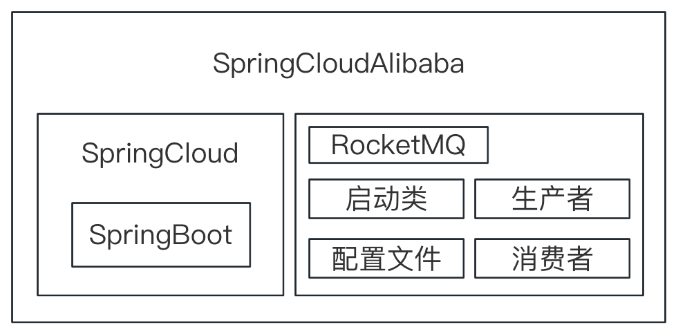

- 关键 POM 引用

  ```xml
  <parent>
    <artifactId>spring-boot-starter-parent</artifactId>
    <groupId>org.springframework.boot</groupId>
    <version>2.3.12.RELEASE</version>
  </parent>
  
  <properties>
    <project.build.sourceEncoding>UTF-8</project.build.sourceEncoding>
    <maven.compiler.source>1.8</maven.compiler.source>
    <maven.compiler.target>1.8</maven.compiler.target>
    <com.alibaba.cloud.version>2.2.8.RELEASE</com.alibaba.cloud.version>
    <com.cloud.version>Hoxton.SR12</com.cloud.version>
  </properties>
  
  <dependencyManagement>
    <dependencies>
      <dependency>
        <groupId>com.alibaba.cloud</groupId>
        <artifactId>spring-cloud-alibaba-dependencies</artifactId>
        <version>${com.alibaba.cloud.version}</version>
        <type>pom</type>
        <scope>import</scope>
      </dependency>
      <dependency>
        <groupId>org.springframework.cloud</groupId>
        <artifactId>spring-cloud-dependencies</artifactId>
        <version>${com.cloud.version}</version>
        <type>pom</type>
        <scope>import</scope>
      </dependency>
    </dependencies>
  </dependencyManagement>
  ```

  

- SpringCloudAlibaba 集成 RocketMQ 网站：https://github.com/alibaba/spring-cloud-alibaba/blob/2022.x/spring-cloud-alibaba-examples/rocketmq-example/readme.md

- 引入 stream 依赖，启动类、application.yml、收发Java代码


### 2.4 普通消息收发实战

 

- 启动项目：
  - 确定 nameServer 启动成功
  - 确定 broker 启动成功
  - 最后，再尝试启动 mq2.3_rmqdemo 这个工程

- 首次运行报错，解决为什么报错；

```java
Caused by: java.lang.IllegalArgumentException: Property 'group' is required - producerGroup
	at org.springframework.util.Assert.notNull(Assert.java:201) ~[spring-core-5.2.15.RELEASE.jar:5.2.15.RELEASE]
	at com.alibaba.cloud.stream.binder.rocketmq.integration.outbound.RocketMQProduceFactory.initRocketMQProducer(RocketMQProduceFactory.java:62) ~[spring-cloud-starter-stream-rocketmq-2.2.8.RELEASE.jar:2.2.8.RELEASE]
	at com.alibaba.cloud.stream.binder.rocketmq.integration.outbound.RocketMQProducerMessageHandler.onInit(RocketMQProducerMessageHandler.java:98) ~[spring-cloud-starter-stream-rocketmq-2.2.8.RELEASE.jar:2.2.8.RELEASE]
	at org.springframework.integration.context.IntegrationObjectSupport.afterPropertiesSet(IntegrationObjectSupport.java:214) ~[spring-integration-core-5.3.8.RELEASE.jar:5.3.8.RELEASE]
	at org.springframework.cloud.stream.binder.AbstractMessageChannelBinder.doBindProducer(AbstractMessageChannelBinder.java:230) ~[spring-cloud-stream-3.0.13.RELEASE.jar:3.0.13.RELEASE]
	... 11 common frames omitted
```

- 针对报错挖掘出的解决方案：参考 RocketMQBinderConfigurationProperties 源码类的 group 属性
- 再来看看目前配置的一些属性的含义，理清 application.yml 的属性

- 最后再次扩展一个收发渠道（input2、output2）来巩固学习的成果


### 2.5 DashBoard 控制台观测

 

- 官网地址：https://github.com/apache/rocketmq-dashboard

- 源码直接启动，观察启动是否有报错，若有解决报错情况；

  - 报错一：

    ```java
    java.lang.RuntimeException: org.apache.rocketmq.remoting.exception.RemotingConnectException: connect to null failed
    	at com.google.common.base.Throwables.propagate(Throwables.java:241)
    	at org.apache.rocketmq.dashboard.task.DashboardCollectTask.collectBroker(DashboardCollectTask.java:205)
    	at sun.reflect.NativeMethodAccessorImpl.invoke0(Native Method)
    	at sun.reflect.NativeMethodAccessorImpl.invoke(NativeMethodAccessorImpl.java:62)
    	at sun.reflect.DelegatingMethodAccessorImpl.invoke(DelegatingMethodAccessorImpl.java:43)
    	at java.lang.reflect.Method.invoke(Method.java:498)
    	at org.springframework.scheduling.support.ScheduledMethodRunnable.run(ScheduledMethodRunnable.java:84)
    ```

  - 报错二：

    ```json
    {"status":-1,"data":null,"errMsg":"org.apache.rocketmq.remoting.exception.RemotingConnectException: connect to null failed"}
    ```

  - 配置 nameserver 的地址，在 application.properties 添加 rocketmq.config.namesrvAddr=127.0.0.1:9876 配置之后，再次启动的话，那控制台就完全访问正常了

- 继续运行，然后想办法发几条消息，并且在观测台看看这几条消息；
- 体验控制台功能：
  - Topic 配置
  - 控制台发送消息


### 2.6 跟踪消息收发轨迹

 

- 引入轨迹的目的
  - 轨迹是实实在在存在的话，那么就可以避免一些相互“扯皮”的情况
  - 证实生产者是否发送了消息，也可以证实消费者是否消费了消息
  - 通过轨迹，轨迹就需要有轨迹应该体现的信息：
    - 从哪里来
    - 什么时间来
    - 停留在哪里
    - 停留的时间
    - 去向哪里
    - 去向的时间是多少
    - 整条消息消耗的时间是多少
    - ......
  
- 如何使用轨迹
  
  - 参照源码文档：rocketmq-all-5.1.0 2/docs/en/msg_trace/user_guide.md

  - 修改 custom.conf 文件内容：新增 traceTopicEnable=true
  
  - 修改 brokersrv.sh 文件内容，最后变成：
  
    ```shell
    ./mqbroker -n localhost:9876 -c /Users/mac/Documents/install/rocketmq-all-5.1.0/conf/custom.conf  autoCreateTopicEnable=true
    ```
  
  - 使用默认的队列
  
    ​	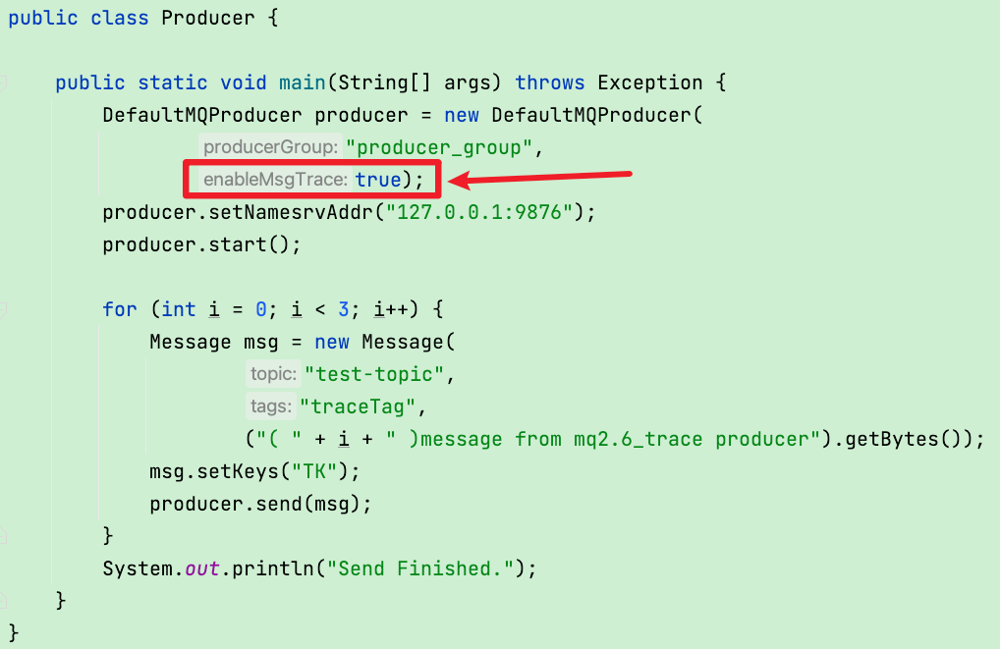
  
  - 使用自定义队列
  
    ​	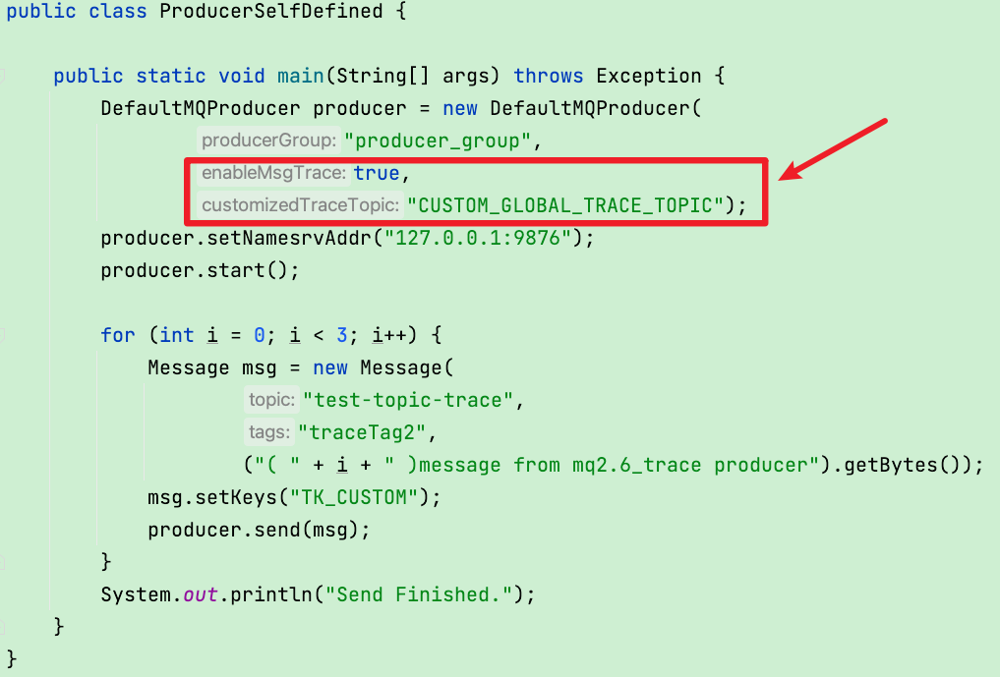
  
- 消息轨迹查询消息

  ​	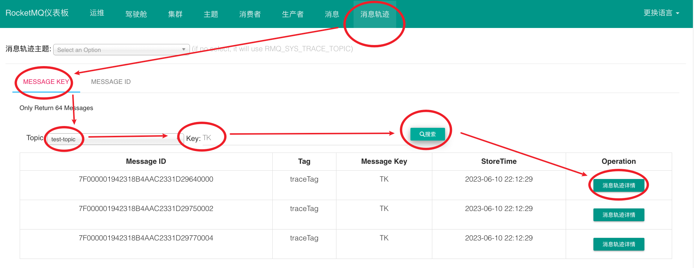

- 轨迹消息页面展示

  ​	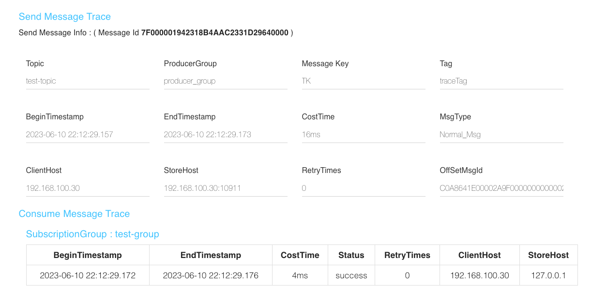

  


### 2.7 SPMC 集群消费实战


- SPMC：Single Producer Multi Consumer，单生产者，多消费者

- 拓扑架构图

  ​	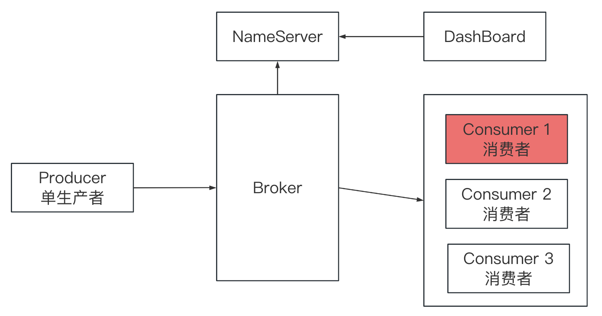

- 两个工程

  - mq2.7_spmc_consumer
  - mq2.7_spmc_producer

- 伪集群消费者搭建

  - 关注点：怎么将消费者变成伪集群的概念

    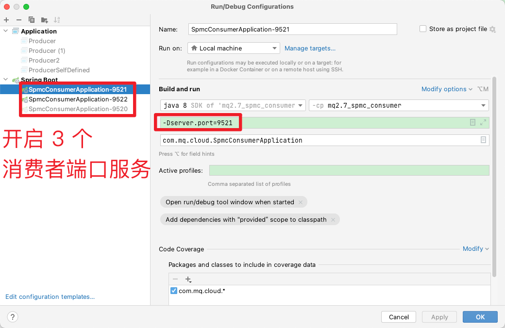

- 实现简单的消息收发

  ​	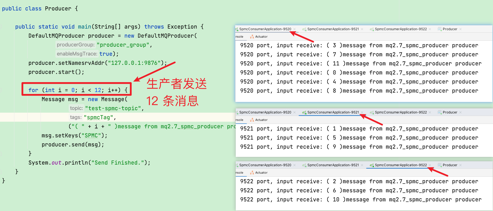
  
  


### 2.8 顺序消息收发实战


- 如何构造顺序消息的场景	
  - 全局有序：适用于性能不是特别高的场景，但是又要求消息又严格一致性的概念
  - 局部有序：适用于性能要求高的场景，想办法通过在设计层面处理有序的消息尽量发送到同一个Topic的同一个队列
  
- 两种有序创建方式
  - 全局有序：
    - perm：2：只写；  4-只读；   6-读写；
    
    - 在控制台创建了一个  Global-Orderly-Topic 全局有序的主题；
    
      - 创建主题：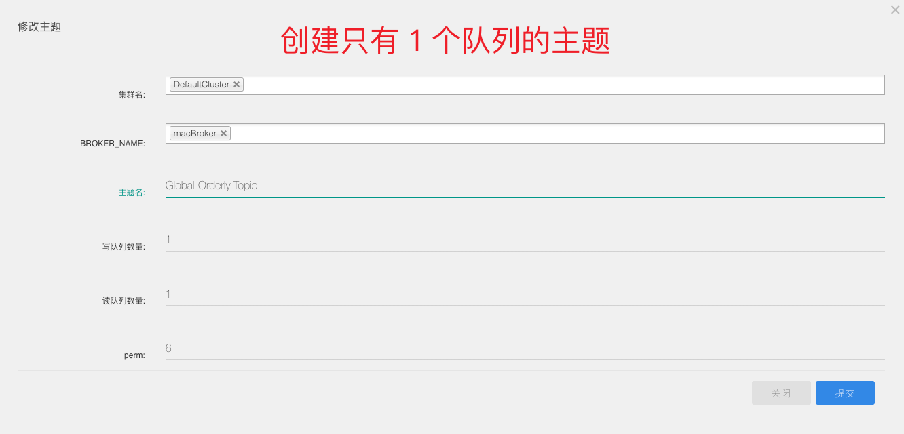
    
      - 代码呈现效果：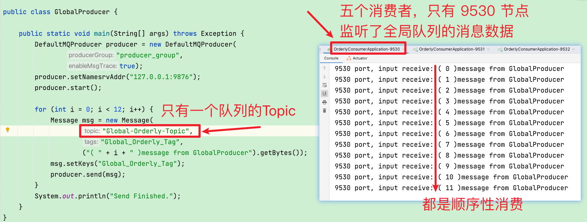
    
  - 局部有序：
  
    - 直接利用 Producer 书写一个全局有序的主题即可，然后 Broker 这边会自动创建一个
    - Partly-Orderly-Topic
    - 代码呈现效果：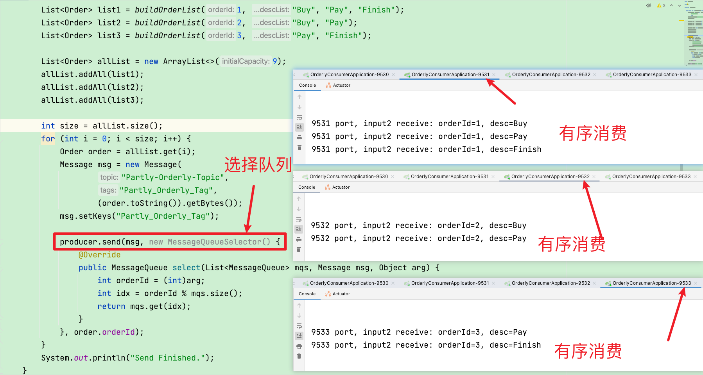
  
- 工程搭建
  - mq2.8_orderly_producer
  - mq2.8_orderly_consumer：使用集群概念来观察每个消费者消费Q的数据行为
  - 代码参考（一）：rocketmq-all-5.1.0 2/docs/en/Example_Orderly.md
  - 代码参考（二）：https://github.com/alibaba/spring-cloud-alibaba/blob/2022.x/spring-cloud-alibaba-examples/rocketmq-example/readme.md
  
- 监听方式实践
  - 顺序消费使用监听  MessageListenerOrderly
  - 并发消费使用监听  MessageListenerConcurrently

 


### 2.9 定时/延时消息收发实战

 

- 试着依葫芦画瓢，学会从源码的 API 找答案
- 了解发送一条消息，这条消息可以设置哪些属性
  - 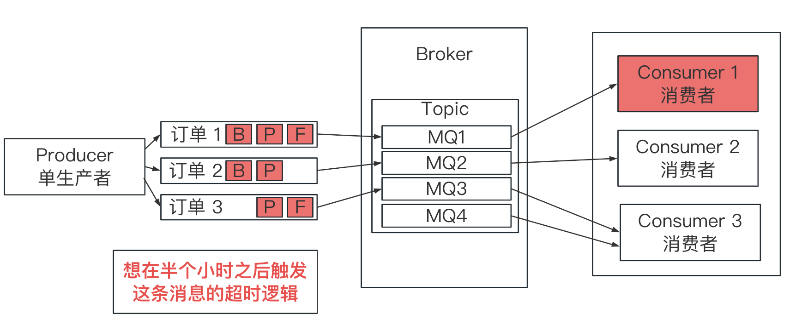
- 定时 API
  - setDelayTimeLevel：5.x 版本之前
  - setDelayTimeMs：5.x 版本叠加的新特性
- 试着使用一些原生 API 进行数据收发实战
  - 设置定时的逻辑
    "1s 5s 10s 30s 1m 2m 3m 4m 5m 6m 7m 8m 9m 10m 20m 30m 1h 2h";
    message.setDelayTimeLevel(2);

 


### 2.10 批量收发实战

 

- 为什么要有批量操作？

  - 好处；提升生产者的性能，减少频繁的网络IO开销，可以大大提升数据发送的吞吐量

  - 坏处：适宜是好的，但是过量那就不太好了，注意控制批量发送的数量

    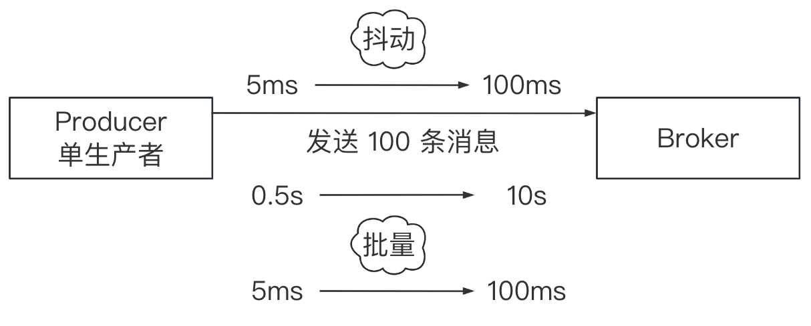

- 如何改善呢？

  - 假设每次最多发送 4M 的数据
  - 计算一下，这一类 Topic 的消息，每条消息的大小？可以粗略估算出来
  - 用【4M】除以【估算的每条大小】，得出【批量发送的数量】
  - 将最后得出来的数量，再次缩小 70% ～ 80% 的样子，不要挨着 4M 的边缘发送，留有一定的缓冲空间

- 一次性要发送的数据超过了 4M 怎么办呢？举例，一次需要发送一批数据，这些数据总量多达 8M：

  - 用【8M】除以【估算的每条大小】，得出【批量发送的数量】，得到一个 List 列表
  - 从这个数量挑选一个合适的批量数值作为临界点，List 有 100 个元素，挑选 N 个元素累加起来是小于 4M的，而这个 N 的挑选呢，可以参照上面【4M】的边界值挑选计算
  - 最后将这个 List 大小按照 N 来拆分，最后可能得到 Q 个【N 个元素的列表】

- MQ 的批量发送该如何处理呢？

  ​	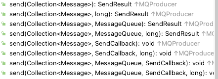

 


### 2.11 过滤消息收发实战


- 到底在过滤什么东西？
  - 过滤的是 Topic 下的一个子类消息（TAG 归类的概念）
  
    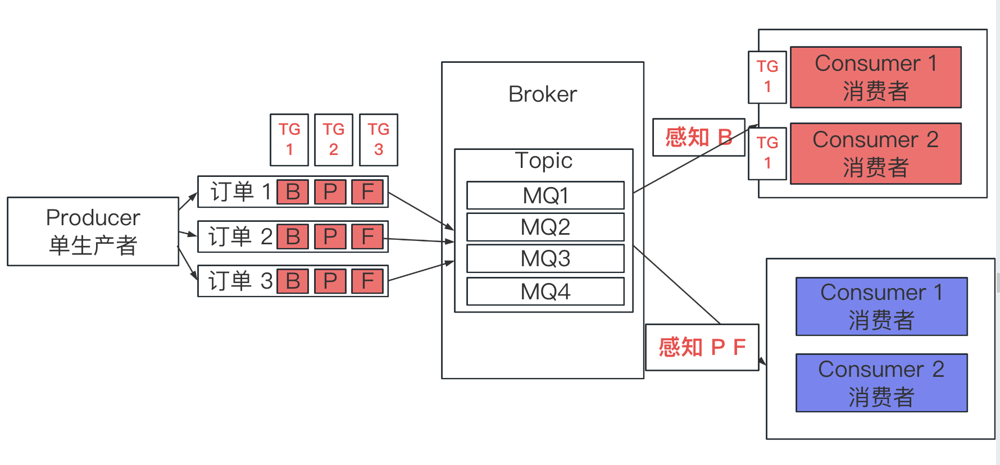
  
- 有什么过滤规约么？
  - 官网参考：https://rocketmq.apache.org/zh/docs/featureBehavior/07messagefilter
  - **消费者集群**中的任何一个**消费者**，如果**消费者**关注了一个 Topic，那么在这个**消费者集群**中，关注了这个 Topic 的**消费者**应该关注**同样的 Tag**
  - 如果消费者集群中的消费者关注的不是同样的 Tag 的话，那么就会在无形中丢失掉一些消息
  
- 有哪些订阅的过滤方式：

  - 订阅所有：consumer.subscribe("Filter-Test-Topic", "*");
  - 订阅指定：consumer.subscribe("Filter-Test-Topic", "TG1");
  - 订阅多个：consumer.subscribe("Filter-Test-Topic", "TG2 || TG3");
  - 订阅 SQL92 方式：consumer.subscribe("Filter-Test-Topic", MessageSelector.*bySql*("idx > 10"));
    - 服务端 custom.conf 文件修改：添加一行 enablePropertyFilter=true 配置


 


### 2.12 事务消息收发实战


- 为什么需要事务？

  - 数据库，也有事务

  - 转账业务：
    - 1、核减 A 账户金额（本 db 操作）；
  
    - 2、累加 B 账户金额（本 db 操作）；
  
- 不用事务怎么解决一致性问题？

  - 转账业务：
    - 1、核减 A 账户金额（远程操作）；
  
    - 2、累加 B 账户金额（远程操作）；
  
  - 先记录一笔任务在数据库中（任务：就是核减A，累加B，不同的状态就控制着不同的步骤）；
  
- MQ 是如何处理一致性问题的？

  - 转账业务：
    - 先记录一笔任务在数据库中（任务：就是核减A，累加B，不同的状态就控制着不同的步骤）；
    - 1、核减 A 账户金额（本 db 操作）；
    - 2、累加 B 账户金额（本 db 操作）；
  - MQ 事务流程：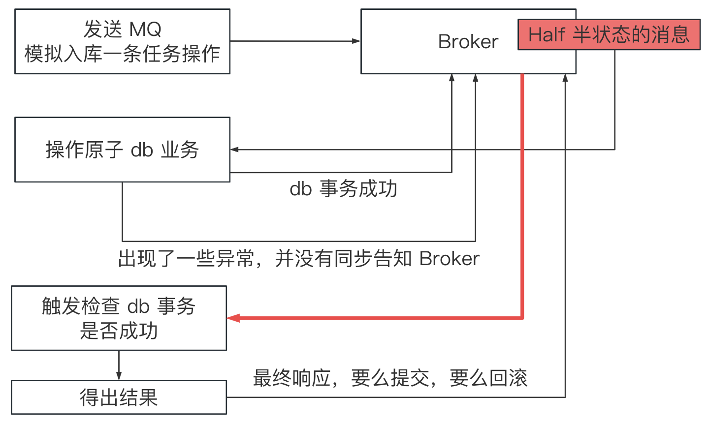

- 如何利用 MQ 实现事务收发消息

  - 生产者对象：TransactionMQProducer

  - 发送的方法：producer.sendMessageInTransaction(message, null);

  - 生产者注册事务监听：

    ```java
            // 3、设置一些事务的状态监听器
            producer.setTransactionListener(new TransactionListener() {
                @Override
                public LocalTransactionState executeLocalTransaction(Message msg, Object arg) {
                    // 执行本地事务，如果本地事务成功，那么就返回成功结果
                    // 如果本地事务失败的话，那么就返回失败的结果，回滚事务
                    // Sleep(100)
                    return LocalTransactionState.ROLLBACK_MESSAGE;
                }
    
                @Override
                public LocalTransactionState checkLocalTransaction(MessageExt msg) {
                    // 触发事务检查
                    // 返回成功，则提交事务，消费者将来可以看到该消息
                    // 返回失败，则回滚事务，消费者看不到该消息
                    return LocalTransactionState.ROLLBACK_MESSAGE;
                }
            });
    ```

    


### 2.13 最大重试消费实战


- 重试可以在哪里设置？

  - 生产者重试：比如网络失败，或者一些其他因素，若想继续重试的话，还得需要做一些策略变动处理。

  - 消费者重试：比如消费者自己处理业务失败后，那就有一种下次想再次消费的诉求，或者想一段时间之后再次消费的诉求。

- 生产者重试设置

  - 可能拥有重试功能的 API，研究对象：org.apache.rocketmq.client.producer.DefaultMQProducer

    - addRetryResponseCode：重试码参考 org.apache.rocketmq.common.protocol.ResponseCode

    - setRetryAnotherBrokerWhenNotStoreOK：如果发送失败，是否需要尝试发送到其他的 Broker 节点，就是没有特意的关注，到底是同步发送失败、还是异步发送失败，总之，只要是发送失败了后，看一看该变量，如果是 true 的话，那么就自动尝试将消息发送到其他的 Broker 节点

    - setRetryTimesWhenSendFailed：同步

    - setRetryTimesWhenSendAsyncFailed：异步

    - ```java
          /**
           * Maximum number of retry to perform internally before claiming sending failure in synchronous mode. </p>
           *
           * This may potentially cause message duplication which is up to application developers to resolve.
           */
          private int retryTimesWhenSendFailed = 2;
      
          /**
           * Maximum number of retry to perform internally before claiming sending failure in asynchronous mode. </p>
           *
           * This may potentially cause message duplication which is up to application developers to resolve.
           */
          private int retryTimesWhenSendAsyncFailed = 2;
      
          /**
           * Indicate whether to retry another broker on sending failure internally.
           */
          private boolean retryAnotherBrokerWhenNotStoreOK = false;
      ```

  - 发现的一些细节点：int timesTotal = communicationMode == CommunicationMode.*SYNC* ? 1 + this.defaultMQProducer.getRetryTimesWhenSendFailed() : 1;

- 消费者重试设置

  - 可能重试的一些 API，研究对象：org.apache.rocketmq.client.consumer.DefaultMQPushConsumer

    - setMaxReconsumeTimes

      ```java
          /**
           * Max re-consume times. 
           * In concurrently mode, -1 means 16;
           * In orderly mode, -1 means Integer.MAX_VALUE.
           *
           * If messages are re-consumed more than {@link #maxReconsumeTimes} before success.
           */
          private int maxReconsumeTimes = -1;
      ```

    - ConsumeOrderlyStatus#SUSPEND_CURRENT_QUEUE_A_MOMENT

    - ConsumeConcurrentlyStatus#RECONSUME_LATER


## 三、RocketMQ 基础特性原理

 

### 3.1 Broker 启动流程分析


- 为什么要了解启动流程，为什么要了解一些源码底层机制？

  - 如果想要很好的玩转一款框架的话，那你必须得了解框架底层的实现原理机制
  - 有一些产线比较奇葩的异常场景，又要必须解决它，那就又得去研究源码来找到解决方案
  - 自己想要实现一款底层插件，那你自己有没有一些底层插件的开发经验呢？

- 再来熟悉下大体流程

- 先创建 BrokerController

  - org.apache.rocketmq.broker.BrokerStartup#createBrokerController

    - BrokerController controller = *buildBrokerController*(args);  构建 BrokerController 控制器对象，里面富含各种  *Config* 配置对象， Manager  管理对象

      - ```java
        创建 4 大配置类：
        final BrokerConfig brokerConfig = new BrokerConfig();
        final NettyServerConfig nettyServerConfig = new NettyServerConfig();
        final NettyClientConfig nettyClientConfig = new NettyClientConfig();
        final MessageStoreConfig messageStoreConfig = new MessageStoreConfig();
        ```

      - 解析命令行、或 IDEA Arguments 的参数，然后做对应的处理：

        ```java
        Options options = ServerUtil.buildCommandlineOptions(new Options());
        CommandLine commandLine = ServerUtil.*parseCmdLine*(
            "mqbroker", args, buildCommandlineOptions(options), new DefaultParser());
        ```

      - 将 4 大配置，全部装进 BrokerController 当中

        ```java
        然后该 BrokerController 在构造方法中还创建了：
        各种 Manager 管理对象，
        各种Processor 处理对象
        各种 Queue 队列对象...等等
        可谓是 Broker 服务端的一个名副其实的【大总管】对象
        final BrokerController controller = new BrokerController(
            brokerConfig, 
            nettyServerConfig, 
            nettyClientConfig, 
            messageStoreConfig);
        ```

    - boolean initResult = controller.initialize();   对象创建完了后，再进行初始化动作，主要是触发一些数据的填充加载

    - if (!initResult) { controller.shutdown(); System.*exit*(-3); }   初始化失败的话，那就尝试关闭 BrokerController，然后进行进程关闭

    - Runtime.*getRuntime*().addShutdownHook(new Thread(*buildShutdownHook*(controller)));  能来到这里，说明是初始化成功的，那么就注册一个运行时的钩子线程；*在* *JVM*  进程关闭的时候，会尝试触发调用运行时钩子集合中的所有线程，以此来达到回收目的。

- 再启动 BrokerController

  - controller.start();

    - 调用 NameServer 的通信组件启动

      ```java
      if (this.brokerOuterAPI != null) {
          this.brokerOuterAPI.start();
      }
      ```

    - 向所有的 NameServer 进行挨个注册 Broker 自己

      ```java
      BrokerController.this.registerBrokerAll(true, false, brokerConfig.isForceRegister());
      ```

    - 有条件的发送定时心跳

      ```java
      if (this.brokerConfig.isEnableControllerMode()) {
          // 有条件的发送定时心跳
      		scheduleSendHeartbeat();
      }
      ```

      


### 3.2 NameServer 路由注册机制

 

- 回顾上章节 Broker 的启动，向 NameServer 进行了注册。

- NameServer 注册入口：DefaultRequestProcessor#processRequest

  ```java
  @Override
  public RemotingCommand processRequest(ChannelHandlerContext ctx,
      RemotingCommand request) throws RemotingCommandException {
      // 省略其他部分代码
      switch (request.getCode()) {
  case RequestCode.PUT_KV_CONFIG: return this.putKVConfig(ctx, request);
  case RequestCode.GET_KV_CONFIG: return this.getKVConfig(ctx, request);
  case RequestCode.DELETE_KV_CONFIG: return this.deleteKVConfig(ctx, request);
  case RequestCode.QUERY_DATA_VERSION: return queryBrokerTopicConfig(ctx, request);
  case RequestCode.REGISTER_BROKER: return registerBroker(ctx, request);
  case RequestCode.UNREGISTER_BROKER: return unregisterBroker(ctx, request);
  case RequestCode.BROKER_HEARTBEAT: return brokerHeartbeat(ctx, request);
  case RequestCode.GET_BROKER_MEMBER_GROUP: return getBrokerMemberGroup(ctx, request);
  case RequestCode.GET_BROKER_CLUSTER_INFO: return getBrokerClusterInfo(ctx, request);
  case RequestCode.WIPE_WRITE_PERM_OF_BROKER: return wipeWritePermOfBroker(ctx, request);
  case RequestCode.ADD_WRITE_PERM_OF_BROKER: return addWritePermOfBroker(ctx, request);
  case RequestCode.GET_ALL_TOPIC_LIST_FROM_NAMESERVER: return getAllTopicListFromNameserver(ctx, request);
  case RequestCode.DELETE_TOPIC_IN_NAMESRV: return deleteTopicInNamesrv(ctx, request);
  case RequestCode.REGISTER_TOPIC_IN_NAMESRV: return registerTopicToNamesrv(ctx, request);
  case RequestCode.GET_KVLIST_BY_NAMESPACE: return getKVListByNamespace(ctx, request);
  case RequestCode.GET_TOPICS_BY_CLUSTER: return getTopicsByCluster(ctx, request);
  case RequestCode.GET_SYSTEM_TOPIC_LIST_FROM_NS: return getSystemTopicListFromNs(ctx, request);
  case RequestCode.GET_UNIT_TOPIC_LIST: return getUnitTopicList(ctx, request);
  case RequestCode.GET_HAS_UNIT_SUB_TOPIC_LIST: return getHasUnitSubTopicList(ctx, request);
  case RequestCode.GET_HAS_UNIT_SUB_UNUNIT_TOPIC_LIST: return getHasUnitSubUnUnitTopicList(ctx, request);
  case RequestCode.UPDATE_NAMESRV_CONFIG: return updateConfig(ctx, request);
  case RequestCode.GET_NAMESRV_CONFIG: return getConfig(ctx, request);
  case RequestCode.GET_CLIENT_CONFIG: return getClientConfigs(ctx, request);
  default:
      String error = " request type " + request.getCode() + " not supported";
      return RemotingCommand.createResponseCommand(RemotingSysResponseCode.REQUEST_CODE_NOT_SUPPORTED, error);
      }
  }
  ```

- Broker 注册

  ```java
          RegisterBrokerResult result = this.namesrvController.getRouteInfoManager().registerBroker(
              requestHeader.getClusterName(),
              requestHeader.getBrokerAddr(),
              requestHeader.getBrokerName(),
              requestHeader.getBrokerId(),
              requestHeader.getHaServerAddr(),
              request.getExtFields().get(MixAll.ZONE_NAME),
              requestHeader.getHeartbeatTimeoutMillis(),
              requestHeader.getEnableActingMaster(),
              topicConfigWrapper,
              filterServerList,
              ctx.channel()
          );
  ```

  - Broker 注册的数据：

    ```json
    {
    	"filterServerList": [],
    	"topicConfigSerializeWrapper": {
    		"dataVersion": {
    			"counter": 33,
    			"stateVersion": 0,
    			"timestamp": 1686492374850
    		},
    		"mappingDataVersion": {
    			"counter": 0,
    			"stateVersion": 0,
    			"timestamp": 1686492374885
    		},
    		"topicConfigTable": {
    			"test-spmc-topic": {
    				"attributes": {},
    				"order": false,
    				"perm": 6,
    				"readQueueNums": 4,
    				"topicFilterType": "SINGLE_TAG",
    				"topicName": "test-spmc-topic",
    				"topicSysFlag": 0,
    				"writeQueueNums": 4
    			},
    			"custom-batch-topic": {
    				"attributes": {},
    				"order": false,
    				"perm": 6,
    				"readQueueNums": 4,
    				"topicFilterType": "SINGLE_TAG",
    				"topicName": "custom-batch-topic",
    				"topicSysFlag": 0,
    				"writeQueueNums": 4
    			},
    			"test-topic2": {
    				"attributes": {},
    				"order": false,
    				"perm": 6,
    				"readQueueNums": 4,
    				"topicFilterType": "SINGLE_TAG",
    				"topicName": "test-topic2",
    				"topicSysFlag": 0,
    				"writeQueueNums": 4
    			},
    			"%RETRY%Subscribe03_Multi_Consumer": {
    				"attributes": {},
    				"order": false,
    				"perm": 6,
    				"readQueueNums": 1,
    				"topicFilterType": "SINGLE_TAG",
    				"topicName": "%RETRY%Subscribe03_Multi_Consumer",
    				"topicSysFlag": 0,
    				"writeQueueNums": 1
    			},
    			"SCHEDULE_TOPIC_XXXX": {
    				"attributes": {},
    				"order": false,
    				"perm": 6,
    				"readQueueNums": 18,
    				"topicFilterType": "SINGLE_TAG",
    				"topicName": "SCHEDULE_TOPIC_XXXX",
    				"topicSysFlag": 0,
    				"writeQueueNums": 18
    			},
    			"%RETRY%Subscribe04_SQL92_Consumer_1": {
    				"attributes": {},
    				"order": false,
    				"perm": 6,
    				"readQueueNums": 1,
    				"topicFilterType": "SINGLE_TAG",
    				"topicName": "%RETRY%Subscribe04_SQL92_Consumer_1",
    				"topicSysFlag": 0,
    				"writeQueueNums": 1
    			},
    			"%RETRY%test-spmc-topic-group": {
    				"attributes": {},
    				"order": false,
    				"perm": 6,
    				"readQueueNums": 1,
    				"topicFilterType": "SINGLE_TAG",
    				"topicName": "%RETRY%test-spmc-topic-group",
    				"topicSysFlag": 0,
    				"writeQueueNums": 1
    			},
    			"SELF_TEST_TOPIC": {
    				"attributes": {},
    				"order": false,
    				"perm": 6,
    				"readQueueNums": 1,
    				"topicFilterType": "SINGLE_TAG",
    				"topicName": "SELF_TEST_TOPIC",
    				"topicSysFlag": 0,
    				"writeQueueNums": 1
    			},
    			"Global-Orderly-Topic": {
    				"attributes": {},
    				"order": false,
    				"perm": 6,
    				"readQueueNums": 1,
    				"topicFilterType": "SINGLE_TAG",
    				"topicName": "Global-Orderly-Topic",
    				"topicSysFlag": 0,
    				"writeQueueNums": 1
    			},
    			"macdeMBP": {
    				"attributes": {},
    				"order": false,
    				"perm": 7,
    				"readQueueNums": 1,
    				"topicFilterType": "SINGLE_TAG",
    				"topicName": "macdeMBP",
    				"topicSysFlag": 0,
    				"writeQueueNums": 1
    			},
    			"%RETRY%batch_group": {
    				"attributes": {},
    				"order": false,
    				"perm": 6,
    				"readQueueNums": 1,
    				"topicFilterType": "SINGLE_TAG",
    				"topicName": "%RETRY%batch_group",
    				"topicSysFlag": 0,
    				"writeQueueNums": 1
    			},
    			"%RETRY%Subscribe02_Single_Consumer": {
    				"attributes": {},
    				"order": false,
    				"perm": 6,
    				"readQueueNums": 1,
    				"topicFilterType": "SINGLE_TAG",
    				"topicName": "%RETRY%Subscribe02_Single_Consumer",
    				"topicSysFlag": 0,
    				"writeQueueNums": 1
    			},
    			"rmq_sys_SYNC_BROKER_MEMBER_macdeMBP": {
    				"attributes": {},
    				"order": false,
    				"perm": 1,
    				"readQueueNums": 1,
    				"topicFilterType": "SINGLE_TAG",
    				"topicName": "rmq_sys_SYNC_BROKER_MEMBER_macdeMBP",
    				"topicSysFlag": 0,
    				"writeQueueNums": 1
    			},
    			"rmq_sys_SYNC_BROKER_MEMBER_macBroker": {
    				"attributes": {},
    				"order": false,
    				"perm": 1,
    				"readQueueNums": 1,
    				"topicFilterType": "SINGLE_TAG",
    				"topicName": "rmq_sys_SYNC_BROKER_MEMBER_macBroker",
    				"topicSysFlag": 0,
    				"writeQueueNums": 1
    			},
    			"Transaction-Test-Topic": {
    				"attributes": {},
    				"order": false,
    				"perm": 6,
    				"readQueueNums": 4,
    				"topicFilterType": "SINGLE_TAG",
    				"topicName": "Transaction-Test-Topic",
    				"topicSysFlag": 0,
    				"writeQueueNums": 4
    			},
    			"%RETRY%Global-Orderly-Topic-group": {
    				"attributes": {},
    				"order": false,
    				"perm": 6,
    				"readQueueNums": 1,
    				"topicFilterType": "SINGLE_TAG",
    				"topicName": "%RETRY%Global-Orderly-Topic-group",
    				"topicSysFlag": 0,
    				"writeQueueNums": 1
    			},
    			"%RETRY%filter_group": {
    				"attributes": {},
    				"order": false,
    				"perm": 6,
    				"readQueueNums": 1,
    				"topicFilterType": "SINGLE_TAG",
    				"topicName": "%RETRY%filter_group",
    				"topicSysFlag": 0,
    				"writeQueueNums": 1
    			},
    			"Filter-Test-Topic": {
    				"attributes": {},
    				"order": false,
    				"perm": 6,
    				"readQueueNums": 4,
    				"topicFilterType": "SINGLE_TAG",
    				"topicName": "Filter-Test-Topic",
    				"topicSysFlag": 0,
    				"writeQueueNums": 4
    			},
    			"DefaultCluster": {
    				"attributes": {},
    				"order": false,
    				"perm": 7,
    				"readQueueNums": 16,
    				"topicFilterType": "SINGLE_TAG",
    				"topicName": "DefaultCluster",
    				"topicSysFlag": 0,
    				"writeQueueNums": 16
    			},
    			"DefaultCluster_REPLY_TOPIC": {
    				"attributes": {},
    				"order": false,
    				"perm": 6,
    				"readQueueNums": 1,
    				"topicFilterType": "SINGLE_TAG",
    				"topicName": "DefaultCluster_REPLY_TOPIC",
    				"topicSysFlag": 0,
    				"writeQueueNums": 1
    			},
    			"macBroker": {
    				"attributes": {},
    				"order": false,
    				"perm": 7,
    				"readQueueNums": 1,
    				"topicFilterType": "SINGLE_TAG",
    				"topicName": "macBroker",
    				"topicSysFlag": 0,
    				"writeQueueNums": 1
    			},
    			"CUSTOM_GLOBAL_TRACE_TOPIC": {
    				"attributes": {},
    				"order": false,
    				"perm": 6,
    				"readQueueNums": 4,
    				"topicFilterType": "SINGLE_TAG",
    				"topicName": "CUSTOM_GLOBAL_TRACE_TOPIC",
    				"topicSysFlag": 0,
    				"writeQueueNums": 4
    			},
    			"%RETRY%test-group2": {
    				"attributes": {},
    				"order": false,
    				"perm": 6,
    				"readQueueNums": 1,
    				"topicFilterType": "SINGLE_TAG",
    				"topicName": "%RETRY%test-group2",
    				"topicSysFlag": 0,
    				"writeQueueNums": 1
    			},
    			"rmq_sys_REVIVE_LOG_DefaultCluster": {
    				"attributes": {},
    				"order": false,
    				"perm": 6,
    				"readQueueNums": 8,
    				"topicFilterType": "SINGLE_TAG",
    				"topicName": "rmq_sys_REVIVE_LOG_DefaultCluster",
    				"topicSysFlag": 0,
    				"writeQueueNums": 8
    			},
    			"RMQ_SYS_TRANS_HALF_TOPIC": {
    				"attributes": {},
    				"order": false,
    				"perm": 6,
    				"readQueueNums": 1,
    				"topicFilterType": "SINGLE_TAG",
    				"topicName": "RMQ_SYS_TRANS_HALF_TOPIC",
    				"topicSysFlag": 0,
    				"writeQueueNums": 1
    			},
    			"%RETRY%Partly-Orderly-Topic-group": {
    				"attributes": {},
    				"order": false,
    				"perm": 6,
    				"readQueueNums": 1,
    				"topicFilterType": "SINGLE_TAG",
    				"topicName": "%RETRY%Partly-Orderly-Topic-group",
    				"topicSysFlag": 0,
    				"writeQueueNums": 1
    			},
    			"custom-delay-topic": {
    				"attributes": {},
    				"order": false,
    				"perm": 6,
    				"readQueueNums": 4,
    				"topicFilterType": "SINGLE_TAG",
    				"topicName": "custom-delay-topic",
    				"topicSysFlag": 0,
    				"writeQueueNums": 4
    			},
    			"%RETRY%test-group": {
    				"attributes": {},
    				"order": false,
    				"perm": 6,
    				"readQueueNums": 1,
    				"topicFilterType": "SINGLE_TAG",
    				"topicName": "%RETRY%test-group",
    				"topicSysFlag": 0,
    				"writeQueueNums": 1
    			},
    			"test-topic-trace": {
    				"attributes": {},
    				"order": false,
    				"perm": 6,
    				"readQueueNums": 4,
    				"topicFilterType": "SINGLE_TAG",
    				"topicName": "test-topic-trace",
    				"topicSysFlag": 0,
    				"writeQueueNums": 4
    			},
    			"RMQ_SYS_TRACE_TOPIC": {
    				"attributes": {},
    				"order": false,
    				"perm": 6,
    				"readQueueNums": 4,
    				"topicFilterType": "SINGLE_TAG",
    				"topicName": "RMQ_SYS_TRACE_TOPIC",
    				"topicSysFlag": 0,
    				"writeQueueNums": 4
    			},
    			"RMQ_SYS_TRANS_OP_HALF_TOPIC": {
    				"attributes": {},
    				"order": false,
    				"perm": 6,
    				"readQueueNums": 1,
    				"topicFilterType": "SINGLE_TAG",
    				"topicName": "RMQ_SYS_TRANS_OP_HALF_TOPIC",
    				"topicSysFlag": 0,
    				"writeQueueNums": 1
    			},
    			"Partly-Orderly-Topic": {
    				"attributes": {},
    				"order": false,
    				"perm": 6,
    				"readQueueNums": 4,
    				"topicFilterType": "SINGLE_TAG",
    				"topicName": "Partly-Orderly-Topic",
    				"topicSysFlag": 0,
    				"writeQueueNums": 4
    			},
    			"%RETRY%delay_group": {
    				"attributes": {},
    				"order": false,
    				"perm": 6,
    				"readQueueNums": 1,
    				"topicFilterType": "SINGLE_TAG",
    				"topicName": "%RETRY%delay_group",
    				"topicSysFlag": 0,
    				"writeQueueNums": 1
    			},
    			"test-topic": {
    				"attributes": {},
    				"order": false,
    				"perm": 6,
    				"readQueueNums": 4,
    				"topicFilterType": "SINGLE_TAG",
    				"topicName": "test-topic",
    				"topicSysFlag": 0,
    				"writeQueueNums": 4
    			},
    			"%RETRY%Subscribe04_SQL92_Consumer": {
    				"attributes": {},
    				"order": false,
    				"perm": 6,
    				"readQueueNums": 1,
    				"topicFilterType": "SINGLE_TAG",
    				"topicName": "%RETRY%Subscribe04_SQL92_Consumer",
    				"topicSysFlag": 0,
    				"writeQueueNums": 1
    			},
    			"%RETRY%batch_group_orderly": {
    				"attributes": {},
    				"order": false,
    				"perm": 6,
    				"readQueueNums": 1,
    				"topicFilterType": "SINGLE_TAG",
    				"topicName": "%RETRY%batch_group_orderly",
    				"topicSysFlag": 0,
    				"writeQueueNums": 1
    			},
    			"TBW102": {
    				"attributes": {},
    				"order": false,
    				"perm": 7,
    				"readQueueNums": 8,
    				"topicFilterType": "SINGLE_TAG",
    				"topicName": "TBW102",
    				"topicSysFlag": 0,
    				"writeQueueNums": 8
    			},
    			"%RETRY%Subscribe01_All_Consumer": {
    				"attributes": {},
    				"order": false,
    				"perm": 6,
    				"readQueueNums": 1,
    				"topicFilterType": "SINGLE_TAG",
    				"topicName": "%RETRY%Subscribe01_All_Consumer",
    				"topicSysFlag": 0,
    				"writeQueueNums": 1
    			},
    			"BenchmarkTest": {
    				"attributes": {},
    				"order": false,
    				"perm": 6,
    				"readQueueNums": 1024,
    				"topicFilterType": "SINGLE_TAG",
    				"topicName": "BenchmarkTest",
    				"topicSysFlag": 0,
    				"writeQueueNums": 1024
    			},
    			"%RETRY%TransactionConsumer": {
    				"attributes": {},
    				"order": false,
    				"perm": 6,
    				"readQueueNums": 1,
    				"topicFilterType": "SINGLE_TAG",
    				"topicName": "%RETRY%TransactionConsumer",
    				"topicSysFlag": 0,
    				"writeQueueNums": 1
    			},
    			"OFFSET_MOVED_EVENT": {
    				"attributes": {},
    				"order": false,
    				"perm": 6,
    				"readQueueNums": 1,
    				"topicFilterType": "SINGLE_TAG",
    				"topicName": "OFFSET_MOVED_EVENT",
    				"topicSysFlag": 0,
    				"writeQueueNums": 1
    			}
    		},
    		"topicQueueMappingDetailMap": {},
    		"topicQueueMappingInfoMap": {}
    	}
    }
    ```

    

- 路由注册信息管理：org.apache.rocketmq.namesrv.routeinfo.RouteInfoManager

  ```java
  Map<String/* topic */, Map<String/* brokerName */, QueueData>> topicQueueTable;
  Map<String/* brokerName */, BrokerData> brokerAddrTable;
  Map<String/* clusterName */, Set<String/* brokerName */>> clusterAddrTable;
  Map<BrokerAddrInfo/* brokerAddr */, BrokerLiveInfo> brokerLiveTable;
  Map<BrokerAddrInfo/* brokerAddr */, List<String>/* Filter Server */> filterServerTable;
  Map<String/* topic */, Map<String/*brokerName*/, TopicQueueMappingInfo>> topicQueueMappingInfoTable;
  ```

- 从路由注册机制中的 brokerLiveTable 存活列表，反向推出一些流程：

  - 反推 NameServer 的扫描探测 Broker 存活机制
  - 反推 NameServer 的启动流程，发现流程的手法和 Broker 启动是类似的，只是过程中的类不一样而已

- 从 NameServer 注册入口，举一反三后，可以多了解一些其他 Broker 与 NameServer 的流程
  - 当时找的是 brokerAddrTable 这个字段，找的时候，发现很多的 get 逻辑都是来源于 DefaultRequestProcessor 这个类的请求入口
  - 比如：RequestCode.BROKER_HEARTBEAT  心跳检测
  - 比如：RequestCode.GET_ALL_TOPIC_LIST_FROM_NAMESERVER  获取所有主题列表

- 从  NameServer 注册入口所在的 org.apache.rocketmq.namesrv.processor.DefaultRequestProcessor 类，观察这个类的旁边，有什么密切的类，结果发现了有 org.apache.rocketmq.namesrv.processor.ClientRequestProcessor 处理客户端请求的类
  - this.getRouteInfoByTopic(ctx, request)
  - 看方法名，大概就知道了，通过主题获取该主题对应的所有详细信息


### 3.3 生产者的发送消息流程

- （一）业务层调用

  - 1.1 创建构造方法：new DefaultMQProducerImpl(xxx)
  - 1.2 调用 send 方法发送消息：DefaultMQProducerImpl#send(Message)

- （二）消息处理层：DefaultMQProducerImpl#sendDefaultImpl

  - 2.1 两个检查：

    - 2.1.1 检查状态

      ```java
      private void makeSureStateOK() throws MQClientException {
          if (this.serviceState != ServiceState.RUNNING) {
              throw new MQClientException("The producer service state not OK, "
                  + this.serviceState
                  + FAQUrl.suggestTodo(FAQUrl.CLIENT_SERVICE_NOT_OK),
                  null);
          }
      }
      ```

    - 2.2.2 检查消息规范

      ```java
      public static void checkMessage(Message msg, DefaultMQProducer defaultMQProducer) throws MQClientException {
          // 省略 msg 为空的判断逻辑
        
          // 检查 topic 的长度不能大于 127，检查 topic 必须符合 ^[%|a-zA-Z0-9_-]+$ 表达式
          Validators.checkTopic(msg.getTopic());
          // 检查不允许发送一些系统自带的 topic 名称，
          // TopicValidator#NOT_ALLOWED_SEND_TOPIC_SET
          Validators.isNotAllowedSendTopic(msg.getTopic());
      
          // 省略 body 为空、或 body 长度为 0 的判断逻辑
      
          // body 的长度不能超过预设的长度（默认 4M，maxMessageSize = 1024 * 1024 * 4）
          if (msg.getBody().length > defaultMQProducer.getMaxMessageSize()) {
              throw new MQClientException(ResponseCode.MESSAGE_ILLEGAL,
                  "the message body size over max value, MAX: " + defaultMQProducer.getMaxMessageSize());
          }
      }
      ```

  - 2.2 获取 Topic 路由信息：this.tryToFindTopicPublishInfo(msg.getTopic());

    - 2.2.1 通过 topic 先尝试从本地缓存中获取

    - 2.2.2 缓存没有，则从 NameServer 获取 Topic 对应的路由信息

      ```java
      private TopicPublishInfo tryToFindTopicPublishInfo(final String topic) {
          // 通过 topic 先尝试从本地缓存中获取
          TopicPublishInfo topicPublishInfo = this.topicPublishInfoTable.get(topic);
          if (null == topicPublishInfo || !topicPublishInfo.ok()) {
              this.topicPublishInfoTable.putIfAbsent(topic, new TopicPublishInfo());
              // 缓存没有，则从 NameServer 获取 Topic 对应的路由信息
              this.mQClientFactory.updateTopicRouteInfoFromNameServer(topic);
              topicPublishInfo = this.topicPublishInfoTable.get(topic);
          }
      
          if (topicPublishInfo.isHaveTopicRouterInfo() || topicPublishInfo.ok()) {
              return topicPublishInfo;
          } else {
              // 缓存没有，则从 NameServer 获取 Topic 对应的路由信息
              this.mQClientFactory.updateTopicRouteInfoFromNameServer(topic, true, this.defaultMQProducer);
              topicPublishInfo = this.topicPublishInfoTable.get(topic);
              return topicPublishInfo;
          }
      }
      ```

  - 2.3 循环尝试次数，根据 Topic 信息选择要送的队列序号

    ```java
    for (; times < timesTotal; times++) {
        String lastBrokerName = null == mq ? null : mq.getBrokerName();
    
        // 根据 Topic 信息选择要送的队列序号
        MessageQueue mqSelected = this.selectOneMessageQueue(topicPublishInfo, lastBrokerName);
        // 省略其他相关代码...
    }
    ```

- （三）消息通信层：DefaultMQProducerImpl#sendKernelImpl

  - 3.1 通过 mq 得到对应 brokeName

    ```java
    String brokerName = this.mQClientFactory.getBrokerNameFromMessageQueue(mq);
    ```

  - 3.2 通过 brokeName 得到对应的 brokerAddr 地址

    ```java
    String brokerAddr = this.mQClientFactory.findBrokerAddressInPublish(brokerName);
    ```

  - 3.3 尝试压缩消息

    ```java
    int sysFlag = 0;
    boolean msgBodyCompressed = false;
    if (this.tryToCompressMessage(msg)) {
        sysFlag |= MessageSysFlag.COMPRESSED_FLAG;
        sysFlag |= compressType.getCompressionFlag();
        msgBodyCompressed = true;
    }
    ```

  - 3.4 看看是否有禁止发送的钩子函数

    ```java
    if (hasCheckForbiddenHook()) {
        CheckForbiddenContext checkForbiddenContext = new CheckForbiddenContext();
        checkForbiddenContext.setNameSrvAddr(this.defaultMQProducer.getNamesrvAddr());
        checkForbiddenContext.setGroup(this.defaultMQProducer.getProducerGroup());
        checkForbiddenContext.setCommunicationMode(communicationMode);
        checkForbiddenContext.setBrokerAddr(brokerAddr);
        checkForbiddenContext.setMessage(msg);
        checkForbiddenContext.setMq(mq);
        checkForbiddenContext.setUnitMode(this.isUnitMode());
        // 执行禁止拦截
        this.executeCheckForbiddenHook(checkForbiddenContext);
    }
    ```

  - 3.5 看看在真正发送消息之前，是否有一些前置发送拦截的钩子函数

    ```java
    if (this.hasSendMessageHook()) {
        context = new SendMessageContext();
        context.setProducer(this);
        context.setProducerGroup(this.defaultMQProducer.getProducerGroup());
        context.setCommunicationMode(communicationMode);
        context.setBornHost(this.defaultMQProducer.getClientIP());
        context.setBrokerAddr(brokerAddr);
        context.setMessage(msg);
        context.setMq(mq);
        context.setNamespace(this.defaultMQProducer.getNamespace());
        String isTrans = msg.getProperty(MessageConst.PROPERTY_TRANSACTION_PREPARED);
        if (isTrans != null && isTrans.equals("true")) {
            context.setMsgType(MessageType.Trans_Msg_Half);
        }
    
        if (msg.getProperty("__STARTDELIVERTIME") != null || msg.getProperty(MessageConst.PROPERTY_DELAY_TIME_LEVEL) != null) {
            context.setMsgType(MessageType.Delay_Msg);
        }
        // 执行前置拦截
        this.executeSendMessageHookBefore(context);
    }
    ```

  - 3.6 发送消息的模式

    - SYNC：同步发送

      ```java
      this.sendMessageSync(addr, brokerName, msg, timeoutMillis - costTimeSync, request);
      ```

    - ASYNC：异步发送

      ```java
      this.sendMessageAsync(addr, brokerName, msg, timeoutMillis - costTimeAsync, request, sendCallback, topicPublishInfo, instance,
                          retryTimesWhenSendFailed, times, context, producer);
      ```

    - ONEWAY：发送不用等回应

      ```java
      this.remotingClient.invokeOneway(addr, request, timeoutMillis);
      ```

  - 3.7 核心发送的前置、后置处理

    ```java
    protected void doBeforeRpcHooks(String addr, RemotingCommand request) {
        if (rpcHooks.size() > 0) {
            for (RPCHook rpcHook : rpcHooks) {
                rpcHook.doBeforeRequest(addr, request);
            }
        }
    }
    
    public void doAfterRpcHooks(String addr, RemotingCommand request, RemotingCommand response) {
        if (rpcHooks.size() > 0) {
            for (RPCHook rpcHook : rpcHooks) {
                rpcHook.doAfterResponse(addr, request, response);
            }
        }
    }
    ```

    

### 3.4 消费者的接收消息流程


- （一）业务层调用

  - 1.1 创建构造方法：new DefaultMQPushConsumer
  - 1.2 设置监听回调处理消息：consumer.registerMessageListener
  - 1.3 调用 start 方法：DefaultMQPushConsumer#start

- （二）消息准备层

  - 2.1 消费者实现类 start 方法：DefaultMQPushConsumerImpl#start

    - 2.1.1 检查配置

      ```java
      private void checkConfig() throws MQClientException {
          // 不能为空、长度不能大于 255、必须符合 ^[%|a-zA-Z0-9_-]+$ 这样的正则表达式
          Validators.checkGroup(this.defaultMQPushConsumer.getConsumerGroup());
      	
        	// 消费者组名称，不能为 DEFAULT_CONSUMER 这个默认字符串，省略该逻辑
        	// 消息的模式，不能为空，省略该逻辑
        	// 从哪里进行消费，也不能为空，省略该逻辑
      		// 从哪个具体时间戳开始消费，必须符合 yyyyMMddHHmmss 这样的时间格式，省略该逻辑
          // 分配消息队列的策略，也不能为空，省略该逻辑
      
          // 订阅信息也必须有值，省略该逻辑
          // 消息监听，也必须要有值，省略该逻辑
          // 消息监听的实现类，必须是 MessageListenerOrderly 或 MessageListenerConcurrently 的子类，省略该逻辑
          // 消费者的最小线程数量，不能小于 1，也不能大于 1000，省略该逻辑
          // 消费者的最大线程数量，不能小于 1，也不能大于 1000，省略该逻辑
          // 消费者的最小线程数量，不能大于最大线程数量
      
        	// 省略其他一堆的参数校验逻辑...
      }
      ```

    - 2.1.2 各种小组件初始化 start、load 逻辑

    - 2.1.3 重点关注 mQClientFactory.start() 方法：

      ```java
      public void start() throws MQClientException {
      
          synchronized (this) {
              switch (this.serviceState) {
                  case CREATE_JUST:
                      this.serviceState = ServiceState.START_FAILED;
                      // If not specified,looking address from name server
                      if (null == this.clientConfig.getNamesrvAddr()) {
                          this.mQClientAPIImpl.fetchNameServerAddr();
                      }
                      // Start request-response channel
                      this.mQClientAPIImpl.start();
                      // Start various schedule tasks
                      this.startScheduledTask();
                      // Start pull service  拉取消息
                      this.pullMessageService.start();
                      // Start rebalance service 重平衡服务
                      this.rebalanceService.start();
                      // Start push service
                      this.defaultMQProducer.getDefaultMQProducerImpl().start(false);
                      log.info("the client factory [{}] start OK", this.clientId);
                      this.serviceState = ServiceState.RUNNING;
                      break;
                  case START_FAILED:
                      throw new MQClientException("The Factory object[" + this.getClientId() + "] has been created before, and failed.", null);
                  default:
                      break;
              }
          }
      }
      ```

    - 2.1.4 消费者是如何拉取到消息的：pullMessageService.start();

      ```java
      public void run() {
          logger.info(this.getServiceName() + " service started");
      
          while (!this.isStopped()) {
              try {
                	// take 等待队列有数据
                	// 思考：又在哪里进行 put 的呢？
                  MessageRequest messageRequest = this.messageRequestQueue.take();
                  if (messageRequest.getMessageRequestMode() == MessageRequestMode.POP) {
                    	// 内部会有触发逻辑向 messageRequestQueue 放数据
                      this.popMessage((PopRequest)messageRequest);
                  } else {
                    	// 内部也会有触发逻辑向 messageRequestQueue 放数据
                      this.pullMessage((PullRequest)messageRequest);
                  }
              } catch (InterruptedException ignored) {
              } catch (Exception e) {
                  logger.error("Pull Message Service Run Method exception", e);
              }
          }
      
          logger.info(this.getServiceName() + " service end");
      }
      ```

  - 2.2 消息轨迹跟踪

    ```java
    if (null != traceDispatcher) {
        try {
            traceDispatcher.start(this.getNamesrvAddr(), this.getAccessChannel());
        } catch (MQClientException e) {
            logger.warn("trace dispatcher start failed ", e);
        }
    }
    ```

    


### 3.5 消息的可靠性应该如何保证


- 再次回顾生产者、消费者的领域模型

- 可以从哪些阶段来保证？
  - 生产阶段
    - 同步发送：预设一定到重试次数，添加ResponseCode、添加重试其他Broker
    - 异步发送：使用带回调函数的异步发送，也可以添加一定的重试次数，添加ResponseCode、添加重试其他Broker
    - 单向发送：不推荐使用，因为没有一定的保证机制，来促使消息一定会投递到Broker端
  - 存储阶段
    - Broker 突然 Crash：其实可以由刷盘策略来保证（同步刷盘不会丢消息，异步刷盘会丢失一点点消息）
    - 操作系统突然 Crash：其实还是可以由刷盘策略来保证（同步刷盘不会丢消息，异步刷盘会丢失一点点消息）
    - Broker 突然断电：其实还是可以由刷盘策略来保证（同步刷盘不会丢消息，异步刷盘会丢失一点点消息）
    - Broker 的磁盘受损：这台机器连保存到磁盘都成为一个问题的话，那有没有可能设计成为拥有备份节点都分布式或者主备或者HA
    - Broker 无法开机或者启动：就更得需要有备份节点
    - Broker 正常关闭：其实这个不用态关心，因为是正常操作，所以不用担心消息的丢失
  - 消费阶段
    - 先消费数据，再提交成功状态。这里有一个细节点，需要消费者有一定的**幂等性**处理，因为消费者有可能会消费多条数据（举一个典型的例子：就是并发消费的时，如果 offset 小的那条消息消费失败了，那即使 offset 大的那些消费成功了，那最后提交 offset 位移的时候，还是会将那个 offset 最小的成功值提交到 Broker 侧。）
    - 假设消费者进行了各种 Retry 到尝试，那还有最后一招，直接消费死信队列里面的数据。
    - 消息回溯：
      - 可以采用原来的消费者继续设置回溯的一些 API 来进行重新消费。
      - 也可以采用新的消费者组来进行重新消费。
      - 重新消费的 API：偏移量（consumeFromWhere）、时间戳（consumeTimestamp）


### 3.6 不同消息的有序性如何解决


- 有序的发送

  - 本质：将一堆的消息，按照一定的顺序进行发送

  - 发送到哪里去：不管是单队列，还是多队列，我们要将有序的消息放在一起，而且这些所谓的“一起”概念的消息，将来也需要被同一个消费者消费

  - 解决方案：

    - 使用单 Topic 单队列的形式，可以控制一个全局力度的有效性

    - 使用单 Topic 多队列的形式，这个时候需要生产者按照一定的规律，将一些需要有顺序性概念的消息发送到同一个队列中

    - ```java
      public SendResult send(Message msg, MessageQueueSelector selector, Object arg)
          throws MQClientException, RemotingException, MQBrokerException, InterruptedException {
          msg.setTopic(withNamespace(msg.getTopic()));
          return this.defaultMQProducerImpl.send(msg, selector, arg);
      }
      ```

  - 回归最本质的解决方案：就是想办法将一堆有序的消息，发送至一个队列中，至于这个队列是 Topic 的单队列（全局队列），还是 Topic 的 N 个队列中的其中一个队列，这都问题不大，主要的因素就是将消息放到了一个队列中而已。

- 有序的存储

  - 需要将消息进行有序存储的话，其实就是 CommitLog + MessageQueue + IndexFile 他们协同起来做的事情，其实顺序的核心要素就是要保证 MessageQueue 里面的消息是有序存储就好了。

- 有序的消费

  - 并发性消费：MessageListenerConcurrently 其实对有序的诉求不太严格，不建议使用。但是如果对于线程池玩的很溜的开发人员来说，可以去研究底层的线程池最大最小数量以及队列的参数，然后想办法让线程池变成一个单队列的形式。
  - 顺序性消费：MessageListenerOrderly 才是我们需要的正确进行有序消费的 API 接口


思考1：能否再多个队列中保持有序呢？

答：可以考虑在设计消息体的时候，考虑设计一个全局时间戳的字段，到时候将这一批消息全部存储到 db 中，然后从 db 中捞取数据并且按照【全局时间戳】字段生序排列，也就是从小到大排列，然后先消费【全局时间戳】小到记录，再消费【全局时间戳】大的记录。


### 3.7 Broker 接收消息的处理流程

 

- 从 Producer 发送消息的源头开始追踪

- 找到 Broker 处理消息的入口，如何证实找的就是收消息的入口？

- 深入展开 org.apache.rocketmq.broker.processor.SendMessageProcessor 处理消息逻辑

  - 1、解析请求头

    ```java
    SendMessageRequestHeader requestHeader = parseRequestHeader(request);
    ```

  - 2、创建消息上下文对象

    ```java
    sendMessageContext = buildMsgContext(ctx, requestHeader, request);
    ```

  - 3、单笔、批量消息的处理入口

    ```java
    // 批量
    if (requestHeader.isBatch()) {
        response = this.sendBatchMessage(ctx, request, sendMessageContext, requestHeader, mappingContext,
            (ctx1, response1) -> executeSendMessageHookAfter(response1, ctx1));
    }
    // 单笔
    else {
        response = this.sendMessage(ctx, request, sendMessageContext, requestHeader, mappingContext,
            (ctx12, response12) -> executeSendMessageHookAfter(response12, ctx12));
    }
    ```

  - 4、虽然起名叫预先发送，但是这里其实就是一些预先的检查而已

    ```java
    final RemotingCommand response = preSend(ctx, request, requestHeader);
    ```

  - 5、如果 queueIdInt 小于 0，则说明生产者并没有显示指定要发送至哪个队列，那么就干脆来个 99999999 随机指定就好了

    ```java
    if (queueIdInt < 0) {
        queueIdInt = randomQueueId(topicConfig.getWriteQueueNums());
    }
    ```

  - 6、处理超过最大重试的任务进入到 DLQ 死信队列中

    ```java
    if (!handleRetryAndDLQ(requestHeader, response, request, msgInner, topicConfig, oriProps)) {
        return response;
    }
    ```

  - 7、同步异步处理：

    - 如果 broker 【是】异步模式的话，那么就封装一个 Future 对象，核心逻辑在 asyncPutMessage 方法中；
    - 如果 broker 【不是】异步模式的话，那么就直接处理，核心逻辑在 putMessage 方法中，其实 putMessage 的内部还是调用了 asyncPutMessage 该方法，只不过是拿着 Future 对象在调用 get 等待结果而已。

  - 8、异步处理

    ```java
    @Override
    public CompletableFuture<PutMessageResult> asyncPutMessage(MessageExtBrokerInner msg) {
        // 如果有钩子函数，那就执行钩子函数，反正是给存储消息之前提供了一个可以干预的口子
        for (PutMessageHook putMessageHook : putMessageHookList) {
            PutMessageResult handleResult = putMessageHook.executeBeforePutMessage(msg);
            if (handleResult != null) {
                return CompletableFuture.completedFuture(handleResult);
            }
        }
    
        // 如果含有内部的 INNER_NUM 属性的话，也直接中断流程，不要老么写一些系统内部的属性
        if (msg.getProperties().containsKey(MessageConst.PROPERTY_INNER_NUM)
            && !MessageSysFlag.check(msg.getSysFlag(), MessageSysFlag.INNER_BATCH_FLAG)) {
            LOGGER.warn("[BUG]The message had property {} but is not an inner batch", MessageConst.PROPERTY_INNER_NUM);
            return CompletableFuture.completedFuture(new PutMessageResult(PutMessageStatus.MESSAGE_ILLEGAL, null));
        }
    
        if (MessageSysFlag.check(msg.getSysFlag(), MessageSysFlag.INNER_BATCH_FLAG)) {
            Optional<TopicConfig> topicConfig = this.getTopicConfig(msg.getTopic());
            if (!QueueTypeUtils.isBatchCq(topicConfig)) {
                LOGGER.error("[BUG]The message is an inner batch but cq type is not batch cq");
                return CompletableFuture.completedFuture(new PutMessageResult(PutMessageStatus.MESSAGE_ILLEGAL, null));
            }
        }
    
        // 提交文件写请求
        long beginTime = this.getSystemClock().now();
        CompletableFuture<PutMessageResult> putResultFuture = this.commitLog.asyncPutMessage(msg);
    
        // 文件操作完成后，再打印一下文件耗费的时常，
        putResultFuture.thenAccept(result -> {
            long elapsedTime = this.getSystemClock().now() - beginTime;
            if (elapsedTime > 500) {
                LOGGER.warn("DefaultMessageStore#putMessage: CommitLog#putMessage cost {}ms, topic={}, bodyLength={}",
                    elapsedTime, msg.getTopic(), msg.getBody().length);
            }
            this.storeStatsService.setPutMessageEntireTimeMax(elapsedTime);
    
            if (null == result || !result.isOk()) {
                this.storeStatsService.getPutMessageFailedTimes().add(1);
            }
        });
    
        return putResultFuture;
    }
    ```

  - 9、最后写文件操作、以及 HA 同步处理。


## 四、RocketMQ 高级特性原理

 

### 4.1 消息在 Broker 端的文件布局


- 文件布局架构图
  - 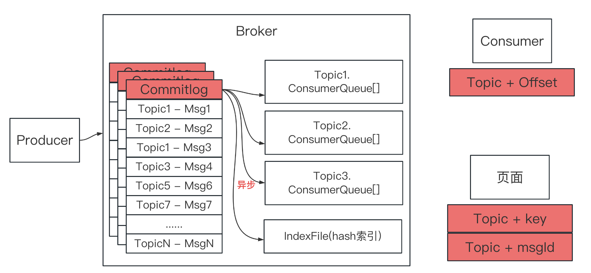

- commitlog：
  - 编码：org.apache.rocketmq.store.MessageExtEncoder#encode(MessageExtBrokerInner)
  
  - 替换：org.apache.rocketmq.store.CommitLog.DefaultAppendMessageCallback#doAppend(long, java.nio.ByteBuffer, int, org.apache.rocketmq.common.message.MessageExtBrokerInner, org.apache.rocketmq.store.PutMessageContext)
  
  - 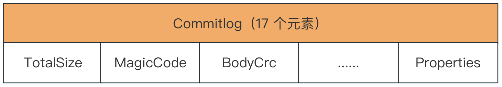
  
    
  
- 衔接转折点：org.apache.rocketmq.store.DefaultMessageStore.ReputMessageService#run

  

- consumequeue：org.apache.rocketmq.store.ConsumeQueue#putMessagePositionInfo
  
  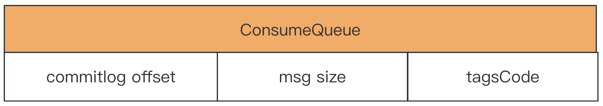
  
  
  
- index：org.apache.rocketmq.store.index.IndexFile#putKey

  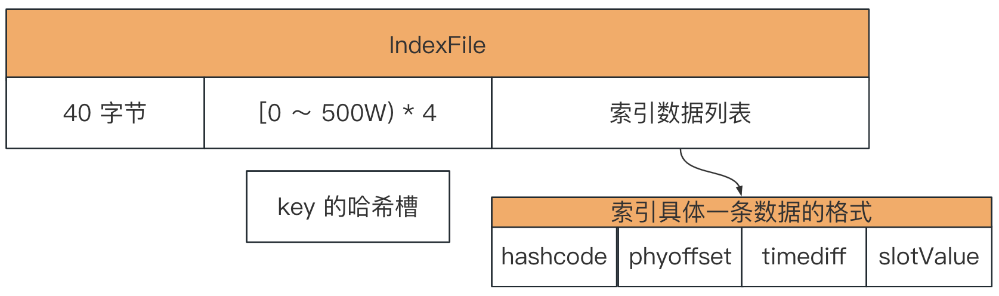


### 4.2 消息存储的高效与刷盘策略

 

- 常规认为：文件存储，就应该很慢，但是为什么 RocketMQ 却把文件玩转的这么溜呢？
- 磁盘的写速度：
  - 如果是随机写的话，那么这个速度就是我们常识所理解的慢，这个慢呢，速度也仅仅只有不到 100k 左右每秒的样子。
  - 如果是顺序写的话，性能特别高，有时候速度可以高达 600M / 每秒。
- 文件拷贝的动作（零拷贝）：
  - 正常的一个 File 的读写，它其实会从用户态经历到内核态到数据拷贝
  - 再 RocketMQ 这边呢，它会利用内存映射技术，也就是 MMP 这个机制直接从用户态向内核态写数据。

- 刷盘类型
  - 代码触发：org.apache.rocketmq.store.CommitLog.DefaultFlushManager#handleDiskFlush(org.apache.rocketmq.store.AppendMessageResult, org.apache.rocketmq.common.message.MessageExt)

  - 同步刷盘

  - 异步刷盘

    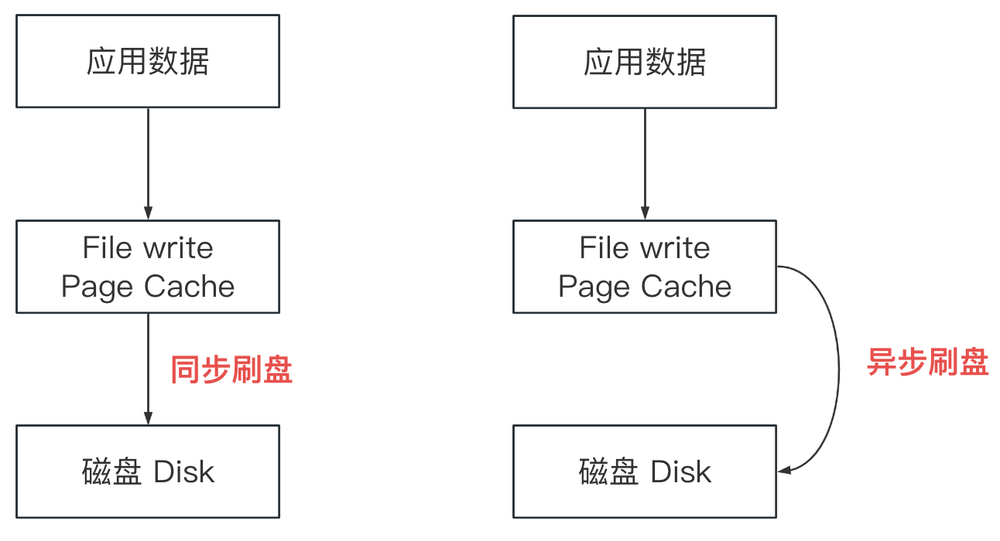

- 刷盘时机
  - 同步刷盘
  - 异步刷盘

- 刷盘选择

  - 同步刷盘：阻塞，等刷盘完成，损耗的是一个整体的吞吐量
  - 异步刷盘：
    - 关闭堆外内存：顶多丢失 500ms 的数据
    - 开启堆外内存：顶多丢失 200ms 的数据

- 两种机制，各有各的特点：

  - 如果想完全保证数据不丢失的话，那么你还真的必须使用同步刷盘
  - 如果能容忍几百毫秒之间的数据丢失的话，那么就尽量建议使用异步刷盘，因为异步刷盘可以最大力度的提升系统的吞吐量


### 4.3 Broker 快速读取消息机制


- 感受一下页面的查询机制

  - Topic + Key 检索：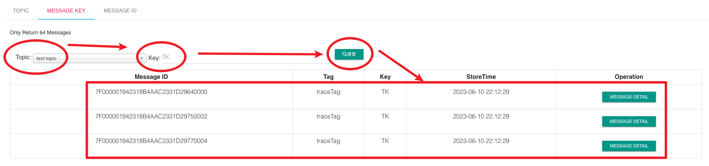

  - Topic + MessageId 检索：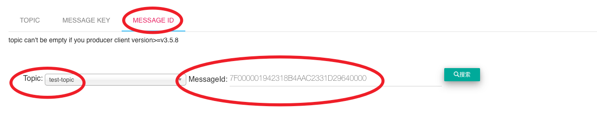

- 思考：Producer 产生了一条带有 Key 的消息，为什么可以通过 Topic + Key 的查询方式查到数据，还可以通过 Topic + MessageId 的方式也能查询到数据呢？
  - Topic 如果有索引的话，那么 Topic 可以得到一个 HashCode 值，我们叫做 A 值；

  - 然后 Topic + Key 的组合形式，如果也得到一个 HashCode 值的话，我们叫做 B 值；

  - 现在问题来了：【A 值 】 是否等价于 【B 值】

  - 如果系统真多建立了 Topic + Key 多 HashCode 值，通过这个 HashCode 值就能找到对应的实体消息

  - 是不是又可以推出：难道系统真多也为 Topic + MessageId 也建立了 HashCode 的操作么？

- 代码验证推测：

  - org.apache.rocketmq.store.index.IndexFile#putKey
  - org.apache.rocketmq.store.index.IndexFile#selectPhyOffset

- 源码阅读


### 4.4 文件恢复与 CheckPoint 机制

 

- 检测标准
  - 检测 Broker 是否正常退出的标准：abort 文件（存在，则表示异常退出）
  - 检测 CommitLog、ConsumeQueue、IndexFile 是否正常的标准：checkpoint 文件
    - physicMsgTimestamp：物理偏移量，记录 CommitLog 上一次刷盘的时点
    - logicsMsgTimestamp：逻辑偏移量，记录 ConsumeQueue 的刷盘时点
    - indexMsgTimestamp：索引偏移量，记录 IndexFile 的刷盘时点
- 文件恢复，到底在恢复什么东西呢？
  - 恢复主要是完成 flushedPosotion、commitedWhere 指针的位置，说到底，其实就是需要程序知道无缝的衔接上一次写的位置，然后继续接收消息继续写下去而已
- 源码到底是如何恢复的？
  - DefaultMessageStore#load


### 4.5 消息大量堆积了该怎么办


- 消息堆积的本质：生产者速度 >> 消费者速度
- 事后现场：
  - 超短时间内解决：不发版，简单配置，并发线程数、批次拉取消息的数量、扩容消费者（C数量 < Q数量）
  - 相对时长内解决：快速发版，快速修复BUG问题、新建临时新 Topic、准备转发器、征用数倍机器消费新的 Topic
    - 新建 Topic 的一个流程：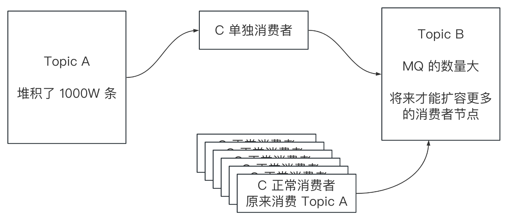
- 事前准备：
  - 流程上：产线前必须具备灰度、预发验证环节，测试环境雅策预演极限值，多Review代码来保证健壮性
  - 架构上：
    - 生产者：限流，批次改单次，充分评估Topic的峰值流量来合理设计Topic的队列数量，异常监控
    - 存储者：限流，次要消息转移
    - 消费者：降级次要消息消费，将重要消息落库（数据库、ES）再异步处理，合理根据Topic的队列数量和应用性能来部署产线消费者机器的数量
  - 之前在 Producer、Broker、Consumer 源码分析的过程中，其实看到了很多关于 Hook 相关的钩子机制，我们就可以很好利用这些钩子机制来充分准备这些事前要做的事情。


### 4.6 部署架构与高可用机制


- 六种部署架构

  - 第一种：单 Master。

    - “集群”中只有一个节点，宕机之后无法使用，那也就无法发送消息，也无法消费消息。

    - 也就是所谓的单点故障，那这种部署架构师绝对不可能部署在生产环境。

    - 通常用于学习入门，比如发消息、手消息、创建Topic、事务消息等等。

      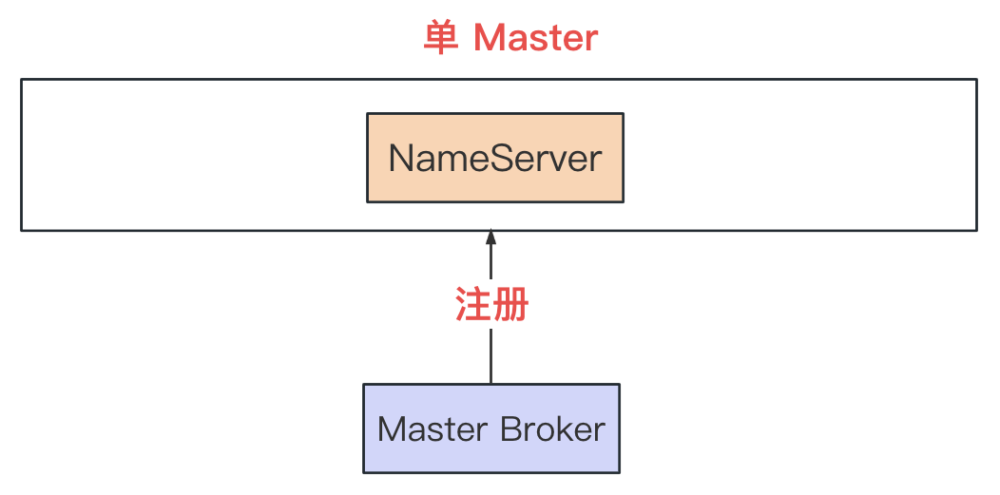

  - 第二种：单 Master、单 Slave。

    - 主从模式，Master 宕机后集群不可写入消息，但是可以从 Slave 进行读取消息，那相比于第一种架构而言呢，好歹是可以进行消息的读取了，稳定性稍微提高了那么一点点了。

    - 就是这种架构模式，勉强可以在生产上使用，只不过这种使用会对消息的生产带来阻碍性，主要因为Master 宕机后就无法接收消息了。

    - 其实这种架构，还是比较适用于个人深入学习主从同步的一个样子。

      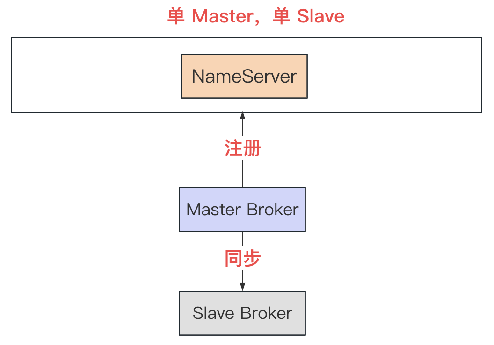

  - 第三种：多 Master，无 Slave。

    - 部署方式其实是最简单的，也是生产最容易使用的一种部署架构。

    - 这种部署方式，单个 Master 宕机后，不影响整体服务的提供。

    - 优点：说白了，就是配置简单，全部用 Master 来抗消息，抗流量。如果再配备一种更好的磁盘存储的话，比如 RAID10 它具备磁盘的可靠性非常高。

    - 缺点：单台机器宕机后，宕机的这台节点如果还有消息未被消费的话，那么在这台宕机的机器下次重启之前仍然无法被消费。

      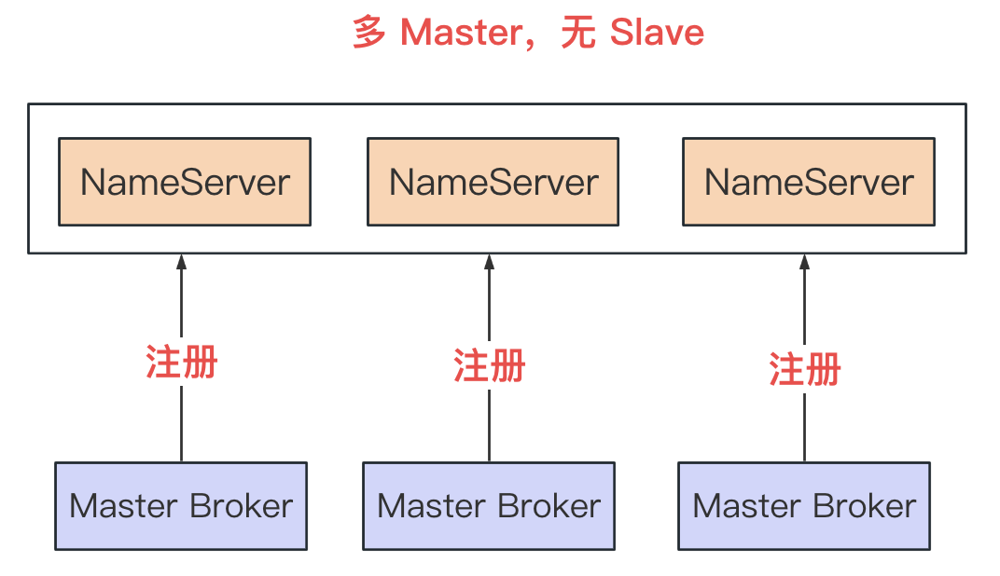

  - 第四种：多 Master、多 Slave、异步复制。

    - 优点：在有 Slave 节点多支持情况下，即使磁盘坏的情况下，那也有 Slave 节点继续作为备份节点提供消费的查询。

    - 缺点：Master 宕机后，磁盘也损坏的情况下，如果消息未发给 Slave 的话，那就会存在消息丢失的风险。

    - Master 如果磁盘损坏的情况下，还能给 Slave 发消息么？Master 其实在保存到磁盘的时候就已经受到威胁了，无法保存进去，那就意味着 CommitLog 里面的偏移量无法存储成功，也无法刷盘。从而也就意味着 ReputMessageService 就无法感知到 Commitlog 中新增的消息，也就无法做到异步的概念。

      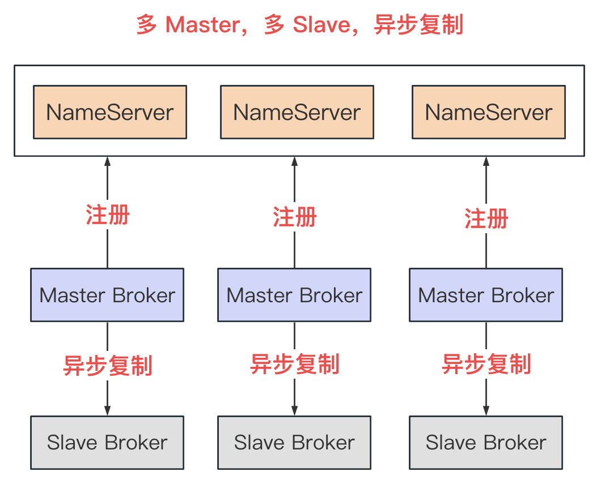

  - 第五种：多 Master、多 Slave、同步复制。

    - 优点：就是解决了第四种方案消息可能丢失的风险，但是消息被持久化保存的概率是相对来说非常非常高的。而且 Master、Slave 的机器宕机、同时他们两的磁盘同时坏掉的概率，几乎为 0，但是不能保证等于 0，只不过这种架构的部署方案是目前这五种里面最为稳定靠谱的一种。

    - 缺点：既然是同步复制了，那就意味着在大流量的情况下，吞吐量一定不会太高，因为我们每一次生产者发送消息的时候，都需要等待 Master、Slave 同时保存成功后，才能拿到成功结果，相当于等待的时长就变长了，那吞吐量也就自然的下降了。

      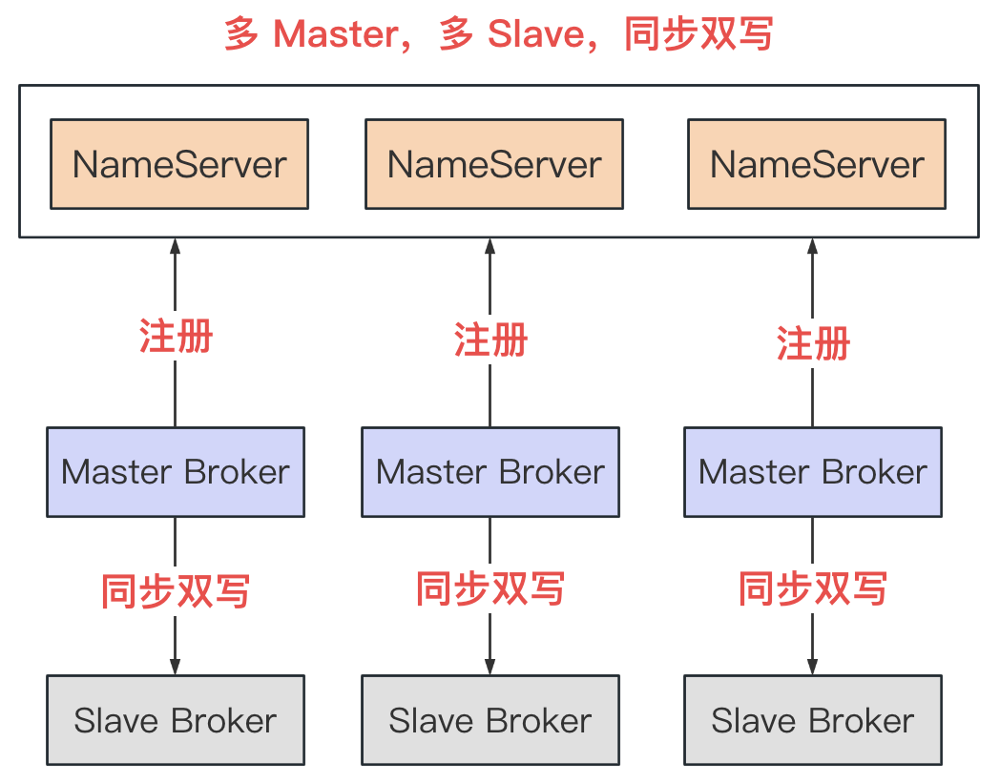

  - 第六种：Dledger 方式。

    - 解决了第四种、第五种方式，因为 Master 宕机之后，Slave 无法自动切换成 Master 的问题。

    - 从而引进了 Dledger 方式，但是这种方式在每一个 Dledger Group 情况下，至少得有 3 个 Broker 的存在。

    - 缺点：机器变多了，选举的处理模式也会造就一些消息的顺序读写就没那么好了。

      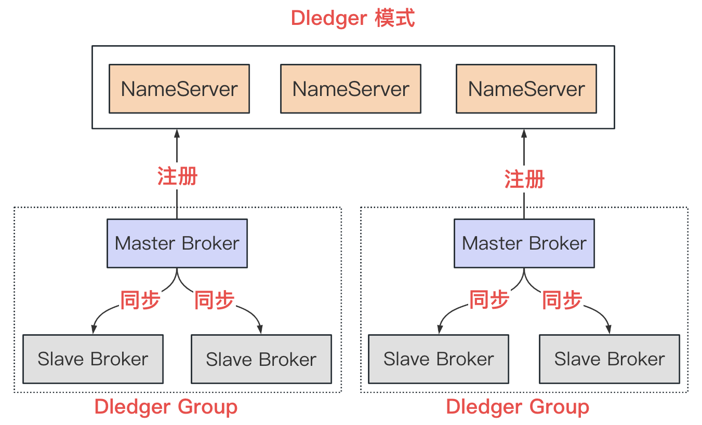

- 高可用机制

  - 高可用
  - 高并发
  - 可伸缩
  - 量级消息


### 4.7 NameServer 的设计理念

 

- 先来了解 NameServer 在 RocketMQ 中起着什么样的作用？

  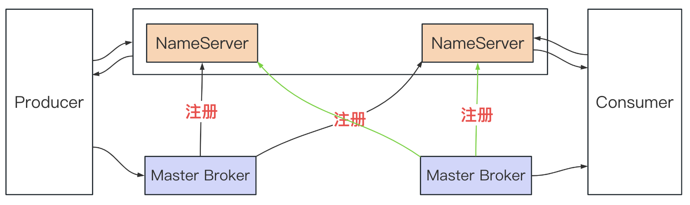

- 不同的角色：

  - NameServer
    - 不互通，但是每个 NameServer 都知道所有的 Broker 信息，默认会每 5s 扫描一次，扫描那些超过 120s 还没有更新的 Broker（该清除就清除）
  - Broker
    - 向所有 NameServer 进行注册，默认每隔 30s 注册所有的 NameServer
  - Producer、Consumer
    - 都会去感知 NameServer 的变更

- 考虑分区的概念

  ​	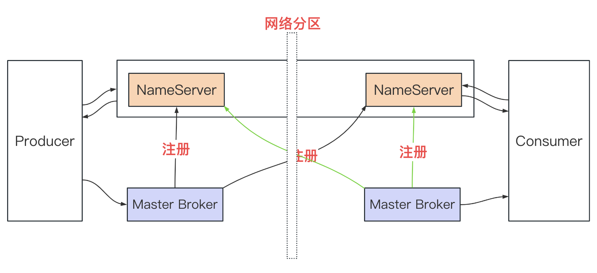

  - 对 Producer 的影响：
    - 其实对 Producer 的发送消息的能力，并不受影响。
    - 但是会影响消息将来发送存储到 Broker 这边的一个平衡状态，说白了就是消息的存储有倾斜问题，最终影响消息的分布情况。
  - 对 Consumer 的影响：
    - 影响的只是不能消费另外网络分区的数据而已
    - 但是这些消费不到的数据，其实并没有丢失，而是因为网络情况而无法消费而已
    - 等到将来网络分区的现象消失以后，那么消费者又可以消费到曾经无法消费的数据了

- 设计理念

  - 启动一个注册中心的作用
  - 分区的出现，都对整体影响不大，而且可用性还是有的
  - 看起来非常简单，就是平铺了 N 个 NameServer 节点，操作起来非常非常方便
  - 又带来了比 zk 更加友好的高性能能力，即使分区的出现，还是能正常提供服务


## 五、Kafka 特性原理

 

### 5.1 Kafka 基础架构运行流程


- Kafka 官网：https://kafka.apache.org/

- 介绍：Apache Kafka is an open-source distributed event streaming platform used by thousands of companies for high-performance data pipelines, streaming analytics, data integration, and mission-critical applications.

  > Apache Kafka 是一个开源分布式事件流平台，被数千家公司用于高性能数据管道、流分析、数据集成和任务关键型应用程序。

- 回顾 RocketMQ 的领域模型

  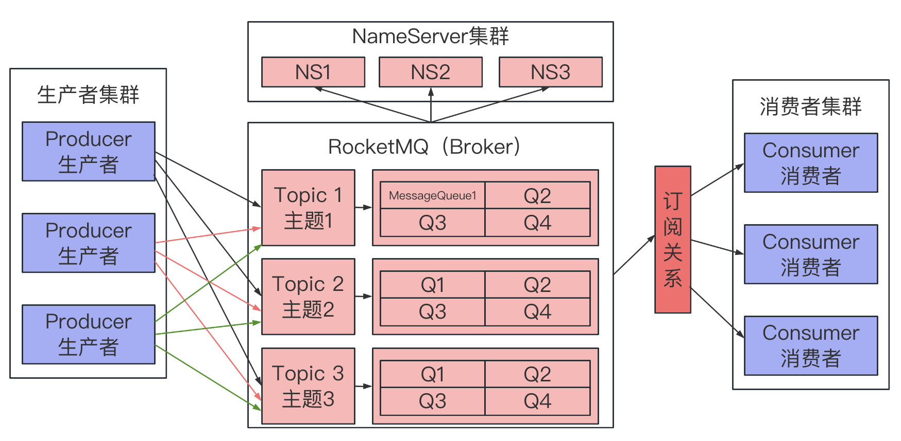

- 基础架构

  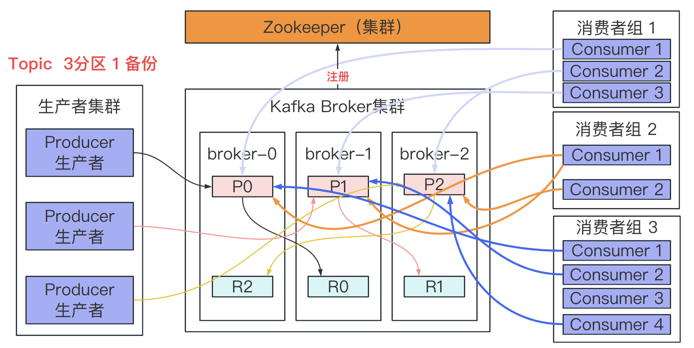

- 课后补充学习使用场景：https://kafka.apache.org/uses


### 5.2 生产者选择分区发送数据流程


- 下载地址：https://kafka.apache.org/downloads

- 快速开始：https://kafka.apache.org/documentation/#gettingStarted

- 搭建工程：

  - 如何找到引用：百度、官网、源码
  - 编码最佳实践：
    - 类注释：org.apache.kafka.clients.producer.KafkaProducer
    - 方法注释：org.apache.kafka.clients.producer.KafkaProducer#send
  - 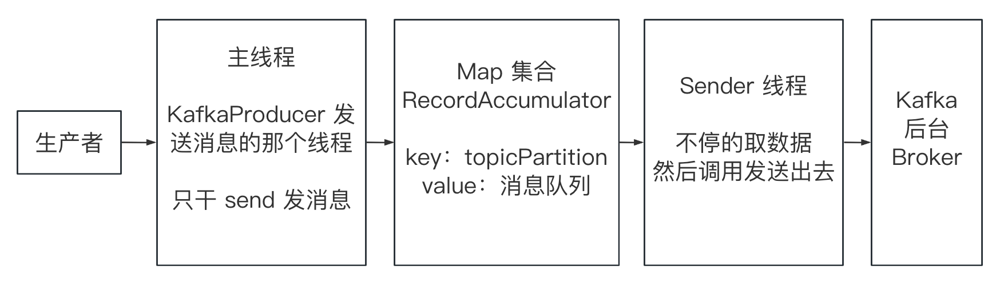

- 源码跟踪：

  - 发送 + 拦截：org.apache.kafka.clients.producer.KafkaProducer#send + interceptors.onSend

  - 核心发送：org.apache.kafka.clients.producer.KafkaProducer#doSend

    - 获取元数据：waitOnMetadata
    - 序列化器：keySerializer.serialize、valueSerializer.serialize
    - 分区器：int partition = partition(record, serializedKey, serializedValue, cluster)
    - 入队列：accumulator.append

  - 发送线程：org.apache.kafka.clients.producer.internals.Sender#run

    - 循环往复执行：org.apache.kafka.clients.producer.internals.Sender#runOnce

    - 生产者发送数据入口：org.apache.kafka.clients.producer.internals.Sender#sendProducerData

    - 收集即将要发送的批次数据：accumulator.drain

    - 循环发送批次：org.apache.kafka.clients.producer.internals.Sender#sendProduceRequests

    - 网络发送：client.newClientRequest、client.send(clientRequest, now);

    - 网络回应：org.apache.kafka.clients.producer.internals.Sender#handleProduceResponse

      - 完成批次发送：completeBatch(batch, partResp, correlationId, now);

      - 批次发送完成逻辑：org.apache.kafka.clients.producer.internals.ProducerBatch#complete

      - 来到临近结尾的触发回调：ProducerBatch#completeFutureAndFireCallbacks

      - 最后的触发回调：thunk.callback.onCompletion(metadata, null);

        ```java
        // 先触拦截机制的处理，也就相当于消息发送完成的系统回调逻辑
        this.interceptors.onAcknowledgement(metadata, exception);
        
        // 然后触发用户设置的回调函数
        if (this.userCallback != null)
            this.userCallback.onCompletion(metadata, exception);
        ```

        


### 5.3 生产者发送数据的可靠性保证


- 回忆 Kafka 的整体运行架构，生产者发送数据遇到问题了，怎么办？
  - 对于 RocketMQ 而言，其实有一系列的最大重试机制来尽最大努力保证将数据给到 Broker
  - 那对于 Kafka 而言呢，该如何保证呢？落地到程序上，生产者有哪些属性可以设置呢？
- 开发必须要阅读的生产者配置类：org.apache.kafka.clients.producer.ProducerConfig
- 可靠性的保证措施：org.apache.kafka.clients.producer.ProducerConfig#ACKS_CONFIG
  - acks = 0：异步形式，单向发送，不会等待 broker 的响应
  - acks = 1：主分区保存成功，然后就响应了客户端，并不保证所有的副本分区保存成功
  - acks = all 或 -1：等待 broker 的响应，然后 broker 等待副本分区的响应，总之数据落地到所有的分区后，才能给到 producer 一个响应

- ISR：in-sync replicas，一个分区中的所有活跃节点，都聚集在一起的队列

  

- 在可靠性的保证下，假设一些故障：

  - Broker 收到消息后，同步 ISR 异常：只要在 -1 的情况下，其实不会造成消息的丢失，因为有重试机制
  - Broker 收到消息，并同步 ISR 成功，但是响应超时：只要在 -1 的情况下，其实不会造成消息的丢失，因为有重试机制

- 可靠性能保证哪些，不能保障哪些？

  - 保证了消息不会丢失
  - 不保证消息一定不会重复（消息有重复的概率，其实需要消费者有幂等性控制机制）

  

 

### 5.4 服务端的消息处理架构模型


- 回顾一下 RocketMQ 的消息处理架构

- 平常处理请求会怎么处理呢？

  - 1、来一个请求，直接处理，ServerSocket.accept()，socket.read，processBiz
  - 2、来一个请求，分派一个线程处理

- Kafka 是如何处理请求的？

  - Reactor 模型

    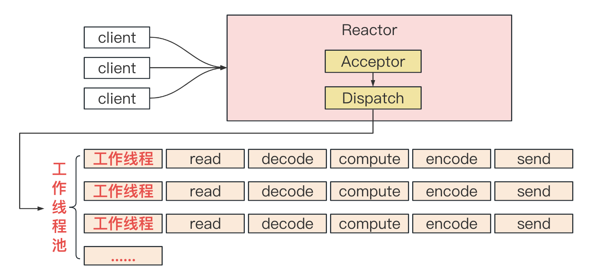

  - 翻译为 Kafka 的样子

    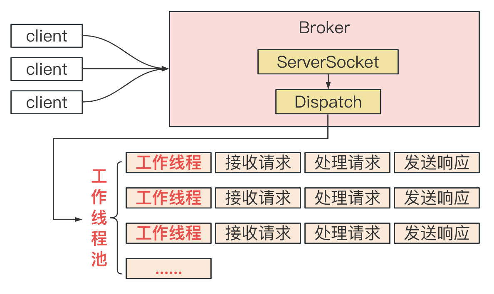

  - Kafka 真实的样子

    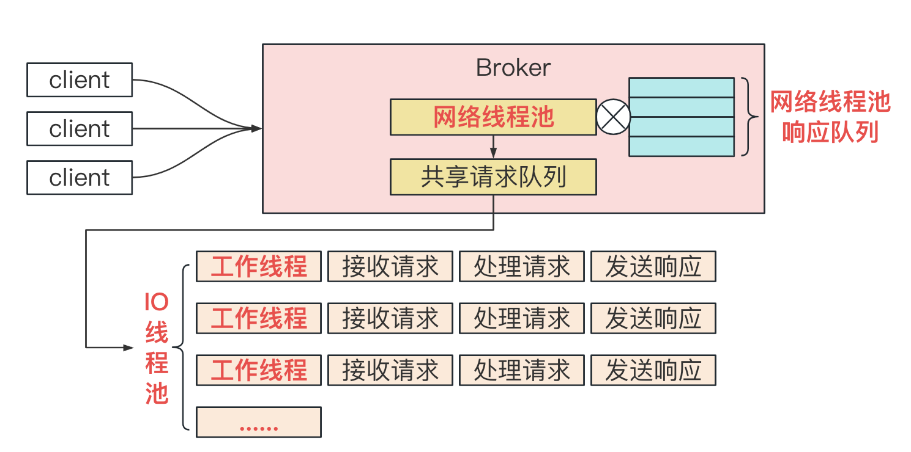

- 关注一些参数：

  - 网络线程池：num.network.threads，默认为 3，专门处理客户的发送的请求。
  - IO 线程池：num.io.threads，默认为 8，专门处理业务请求。


### 5.5 服务端消息存储的文件布局


- Topic 文件结构
- Segment 文件结构
  - 命名规则：
    - 一个 segment 的名称其实是当前 segment 第一条消息的偏移量
  - 查找机制
    - 通过偏移量来查找，怎么查呢？
    - 将所有的 segment 文件名进行生序排列
    - 然后找到偏移量最后落在哪个 segment 对象上
    - 继续从这个 segment 里面的 .index 文件找到消息的物理偏移量
    - 最后拿着物理偏移量去 .log 文件找到最终的实体消息
  - 删除机制：按照时间过期多少删（默认7天）、按照大小来删


### 5.6 如何保证服务端数据的一致性

 

- 了解主分片、复制分片的同步形式

- 为什么主分片、复制（副本、跟随节点）分片，他们之间的进度不一致？

  - 答：其实不同的 broker 节点复制的快慢不一样造成的。

- 名词解释

  - LEO：log end offset，last end offset，log 文件的最后一个写数据的位置

  - HW：high watermark，高水位的，消费者消费数据最高的位置

  - ISR：P0、R0、R3 构成一个队列，这个队列就是 ISR 队列

    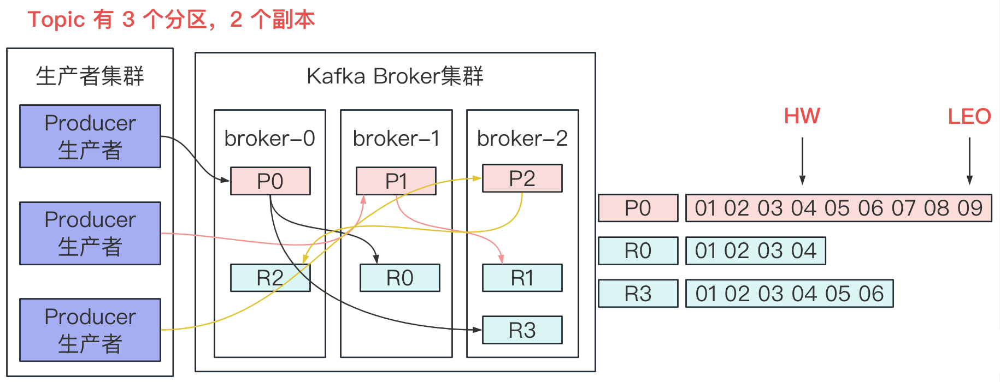

- 故障情况

  - 复制（副本分区、跟随节点）分区挂了：
    - 挂了的话，会从 ISR 队列中剔除
    - 活过来的时候，会向主分片获取 HW 高水位线，与自己的 LEO 比对，如果自己的 LEO 超过 HW 则干掉超过的部分，小于的话就从主分片复制数据过来
    - 复制的时候，如果复制之后的 LEO 与 HW 持平的话，那么就会重新加入到 ISR 同步队列中
  - 主分区挂了：
    - 挂了的话，会从 ISR 队列中剔除
    - 活过来的时候，发现已经有顶替的 leader 角色（主分片）了，那么就跟随就好了
    - 跟随的话，就继续向 leader 获取 HW 高水位线，与自己的 LEO 比对，大于 LEO 则删除，小于 LEO 则从 leader 这边复制数据过去
    - 复制数据的进度如果赶上了主分片的 HW 的话，那么就继续加入到 ISR 队列中

- 保证了什么，又不能保证什么？

  - Broker 保证了数据的一致性，以 HW 为准，HW 及其以下的数据是可以被消费的
  - Producer 保证了数据的不丢失


### 5.7 消费方如何消费数据/消费分区


- 回顾一下领域模型中，消费者是如何消费消息的。

- 生产者怎么找到样例代码的？消费者也可以效仿。
- 消费者订阅的入口：org.apache.kafka.clients.consumer.KafkaConsumer#subscribe
- 消费者消费的入口：org.apache.kafka.clients.consumer.KafkaConsumer#poll
- 分配分区
  - 对元数据重平衡处理：KafkaConsumer#updateAssignmentMetadataIfNeeded
  - 协调器的拉取处理：org.apache.kafka.clients.consumer.internals.ConsumerCoordinator#poll
  - 执行已完成的【消费进度】提交请求的回调函数：invokeCompletedOffsetCommitCallbacks();
  - 更新发送心跳相关的时间：pollHeartbeat
  - 确保消费者组活跃：AbstractCoordinator#ensureActiveGroup
  - 是否需要加入组：joinGroupIfNeeded(timer);
  - 发送入组请求：initiateJoinGroup、AbstractCoordinator#sendJoinGroupRequest
  - 处理入组响应：JoinGroupResponseHandler
  - 入组成功，自己被选为分配分区的 leader：AbstractCoordinator#onLeaderElected
  - 重新分配分区：assignor.assign、AbstractPartitionAssignor#assign
- 拉取消息
  - 拉取消息：org.apache.kafka.clients.consumer.KafkaConsumer#pollForFetches
  - 本地拉取：fetcher.collectFetch()
  - 远程拉取：sendFetches();、client.poll
  - 拦截返回：interceptors.onConsume


### 5.8 Kafka 该如何实现顺序消费


- 全局有序
  - 只有 1 个分区，至于备份分区，看着填
  - 将来消费的时候呢，就只有一个消费者会持有这个所谓的【 1 个分区】进行消费，然后我们就正常循环接收一条条消息消费就好了
- 分区有序
  - N 个分区，M 个备份分区，N 其实要区分的是，需要有序的一批消息，请放入同一个分区
  - int partition = partition(record, serializedKey, serializedValue, cluster);
  - 需要在创建 KafkaProducer 对象的时候，需要在 Properties 设置属性 partitioner.class 对应的全类名即可。


### 5.9 消费者组重平衡流程解析

 

- 什么是重平衡？
  - 作用是让组内所有的消费者实例，就消费哪些主题下的哪些分区，这个事情，来达成一致。
- 重平衡触发的条件：
  - 组员变化：加入、退出、闪退
  - 主题数量变化
  - 主题分区数变化
- 重平衡是如何通知到其他消费者实例的？
  - 答：靠心跳机制。
- 重平衡两大步骤：
  - JoinGroup：
    - 请求：上送自己需要消费哪些 Topic
    - 响应
      - leader：收到所有节点的所有 Topic 信息
      - 非 leader：收到你入队成功了
  - SyncGroup：
    - 请求：想办法获取当前节点应该消费哪些 Topic 下的哪些分区
      - leader：将分配方案给到了协调器，分配方案就是消费者应该消费哪个Topic下的哪个分区
      - 非 leader：就是发起一个简单的请求，要求协调器告诉自己应该消费哪些 Topic 下的哪些分区
    - 响应：直接告诉对应的消费者，你应该消费这些Topic下的这些分区
  - 重平衡加入组的一个流程：	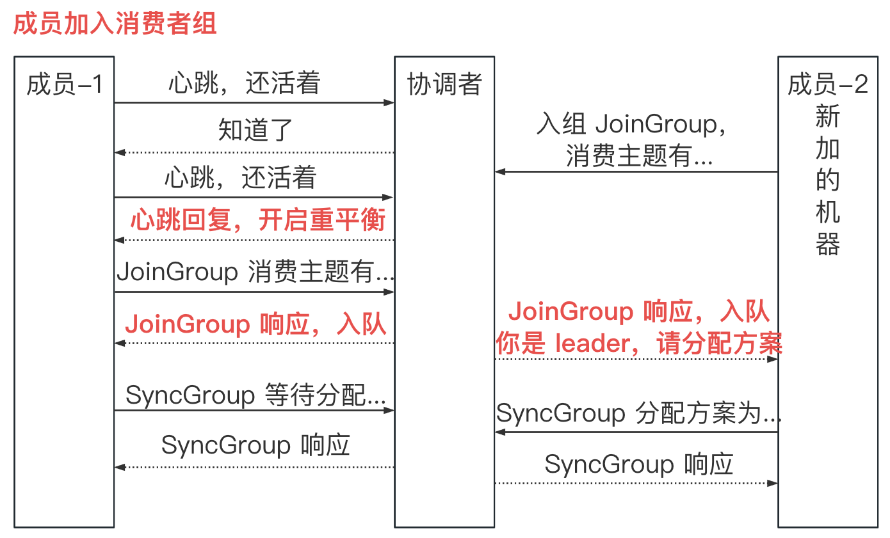


### 5.10 Kafka 有哪些高性能的设计


- 分区的概念，提升写的效率，主要提升了并行写的效率。
- Segment 的顺序写，顺序写的极致性能可达 600M/s，随机写 100k/s。
- 生产者采用线程+队列+批量的形式，最大化的节省了网络次数的调用，节省了网络的开销。
- 通过 offset 查找消息，很好的利用了一个零拷贝的思想，mmap + write。


- 零拷贝详细讲解：

  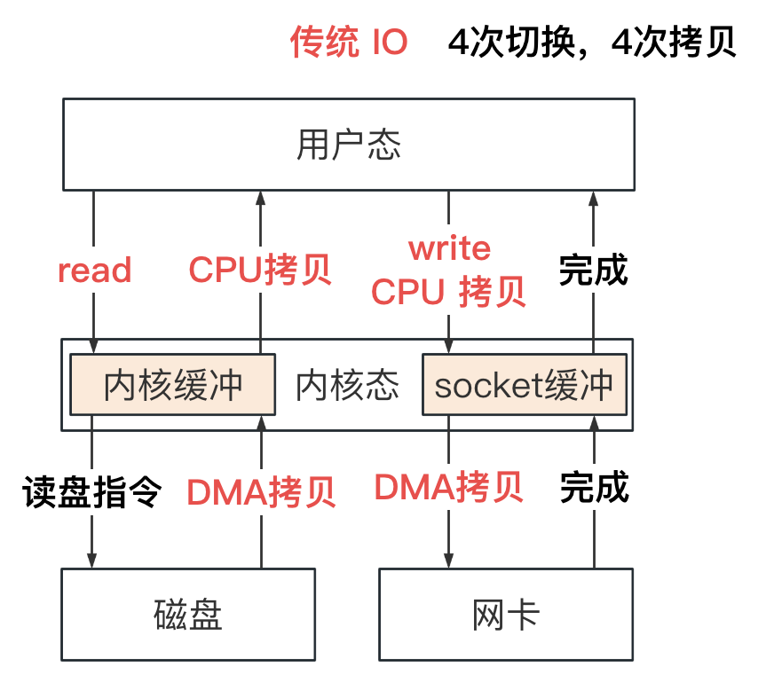


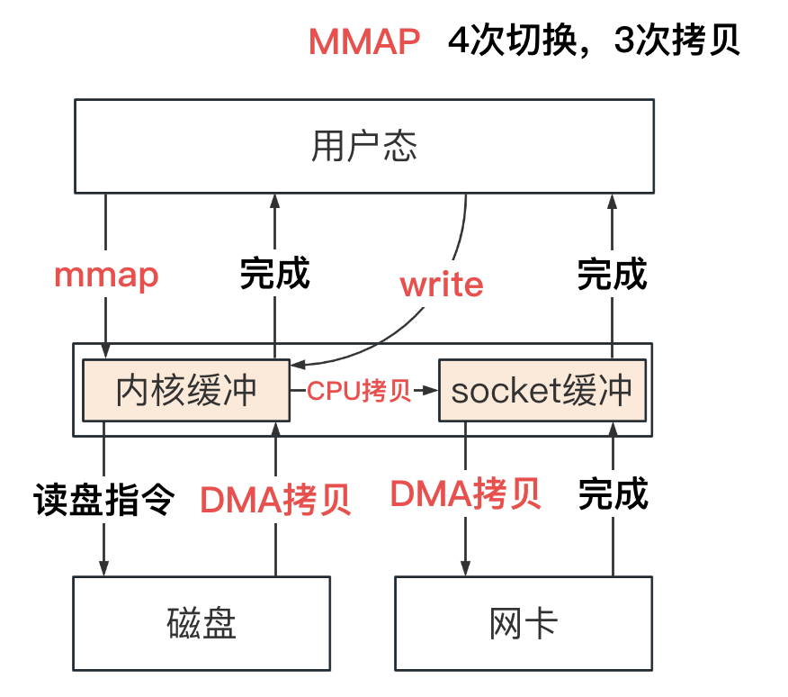


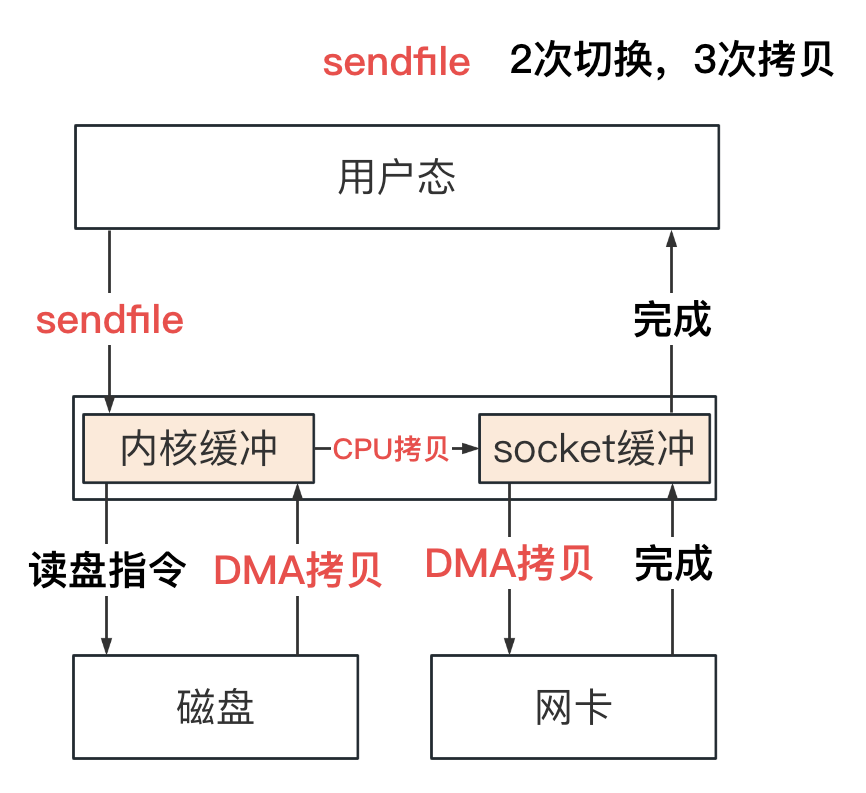


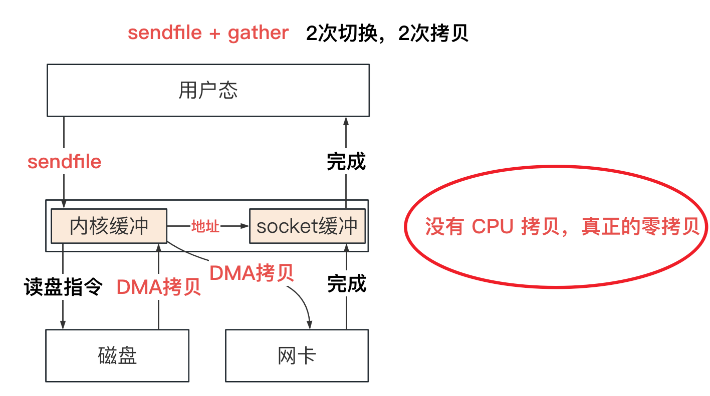


### 5.11 Kafka 与 RocketMQ 的主流功能对比

- 生产者

  - 发送方式：rmq 自己控制单笔批量发送，kafka底层控制批量发送
  - 顺序发送：rmq MessageQueueSelector，kafka Partitioner
  - 定时消息：rmq level 或 ms，kafka 不支持

- Broker

  - 消息过滤：rmq 支持，kafka 不支持

  - 消息轨迹：rmq 支持，kafka 不支持

  - 消息查询：rmq “topic+key”、“topic+messageId” 支持，kafka 不支持

    

  - 文件存储：rmq 一个 commitlog、messagequeue、indexfile，kafka N 个 segment（.log、.index）

  - 队列上限：rmq 单机支持 5W+，kafka 单机支持 64 partition

    

  - 单机性能：rmq 十万 TPS，kafka 百万 TPS

  - Master宕机有无自动切换：rmq 普通不支持但是 Dledger 支持，kafka 自动支持

  - 数据可靠：rmq 同步刷盘，kafka 异步刷盘

    

  - 开发语言：rmq java，kafka scala

  - 注册中心：rmq 使用去中心化 nameserver，kafka 使用中心化的 zookeeper

- 消费者
  - 消费并行：rmq mq*线程数，kafka 分区数
  - 消费重试：rmq 次数、间隔，kafka 不支持


