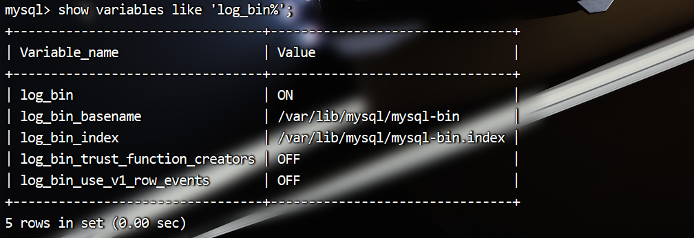
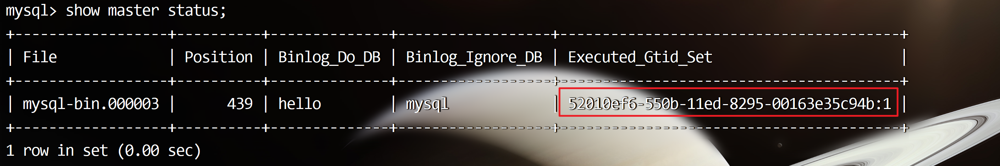
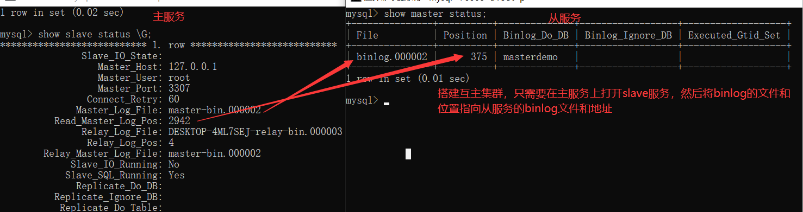
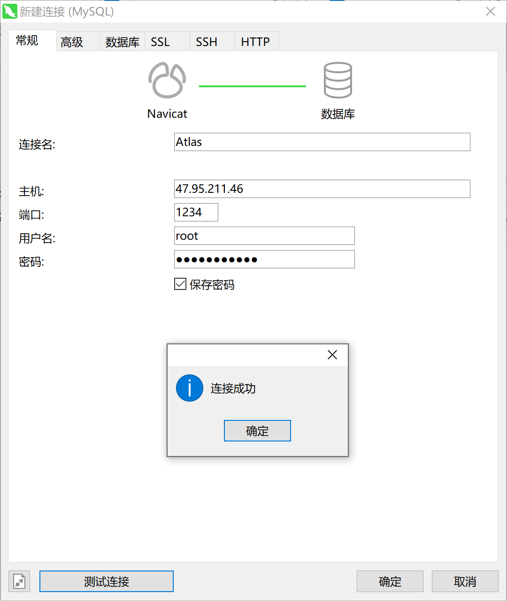
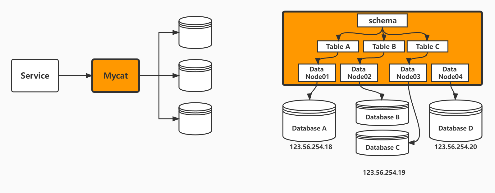
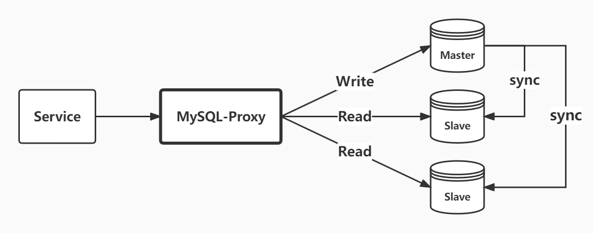

# MySQL高可用集群篇

## 1. 集群搭建之主从复制

### 1.1 主从复制作用


### 1.2 主从复制原理


### 1.3 binlog和relay日志


#### 1.3.1 binlog的三种模式


#### 1.3.2 开启binlog

修改my.cnf文件，在[mysqld]段下添加：

```properties
# binlog刷盘策略
sync_binlog=1
# 需要备份的数据库
binlog-do-db=hello
# 不需要备份的数据库
binlog-ignore-db=mysql
# 启动二进制文件
log-bin=mysql-bin
# 服务器ID
server-id=132
```


#### 1.3.3 调整binlog日志模式

查看binlog的日志模式：

```mysql
mysql> show variables like 'binlog_format';
+---------------+-------+
| Variable_name | Value |
+---------------+-------+
| binlog_format | ROW   |
+---------------+-------+
1 row in set (0.00 sec)
```

调整binlog的日志模式：binlog的三种格式：`STATEMENT`、`ROW`、`MIXED`。

```mysql
mysql> set binlog_format=STATEMENT;
Query OK, 0 rows affected (0.00 sec)

mysql> show variables like 'binlog_format';
+---------------+-----------+
| Variable_name | Value     |
+---------------+-----------+
| binlog_format | STATEMENT |
+---------------+-----------+
1 row in set (0.00 sec)
```


#### 1.3.4 如何查看binlog和relaylog日志？


##### 方式一：使用mysqlbinlog查看binlog日志文件 

因为binlog日志文件：mysql-bin.000005是二进制文件，没法用vi等打开，这时就需要mysql的自带的mysqlbinlog工具进行解码，执行：`mysqlbinlog mysql-bin.000005`可以将二进制文件转为可阅读的sql语句。

```sh
mysqlbinlog --base64-output=decode-rows -v -v mysql-bin.000001 > binlog.txt
```


##### 方式二：在MySQL终端查看binlog

`show master logs`，查看所有二进制日志列表 ，和`show binary logs` 同义。

```mysql
mysql> show master logs;
+------------------+-----------+
| Log_name         | File_size |
+------------------+-----------+
| mysql-bin.000001 |       385 |
+------------------+-----------+
1 row in set (0.00 sec)
```

使用`show binlog events`命令可以以列表的形式显示日志中的事件信息。

show binlog events命令的格式：

```sql
show binlog events [IN 'log_name'] [FROM pos] [LIMIT [offset,] row_count];
```

说明：

- IN ‘log_name’：指定要查询的binlog文件名（如果省略此参数，则默认指定第一个binlog文件）；
- FROM pos：指定从哪个pos起始点开始查起（如果省略此参数，则从整个文件的第一个pos点开始算）；
- LIMIT【offset】：偏移量（默认为0）；
- row_count：查询总条数（如果省略，则显示所有行）。

```mysql
mysql> show binlog events in 'mysql-bin.000001';
+--------------+-----+----------------+-----------+-------------+---------------------------------------+
| Log_name     | Pos | Event_type     | Server_id | End_log_pos | Info                                  |
+--------------+-----+----------------+-----------+-------------+---------------------------------------+
| mybin.000001 |   4 | Format_desc    |       132 |         123 | Server ver: 5.7.30-log, Binlog ver: 4 |
| mybin.000001 | 123 | Previous_gtids |       132 |         154 |                                       |
+--------------+-----+----------------+-----------+-------------+---------------------------------------+
2 rows in set (0.00 sec)
```

切换binlog文件：

```mysql
mysql> flush logs;
Query OK, 0 rows affected (0.00 sec)
```

> 注意：刷新日志会生成一个新的日志文件


### 1.4 案例：基于Pos主从复制

#### 1.4.1 开放端口

需要将3306端口放行，如果是内网也可关闭防火墙


#### 1.4.2 主服务器配置

查看binlog是否开启可以使用命令：

```mysql
mysql> show variables like 'log_bin%';
+---------------------------------+-------+
| Variable_name                   | Value |
+---------------------------------+-------+
| log_bin                         | OFF   |
| log_bin_basename                |       |
| log_bin_index                   |       |
| log_bin_trust_function_creators | OFF   |
| log_bin_use_v1_row_events       | OFF   |
+---------------------------------+-------+
5 rows in set (0.12 sec)
```

log_bin如果是`OFF`代表是未开启状态

 

##### 第一步：修改my.cnf文件

在[mysqld]段下添加：

```properties
# binlog刷盘策略
sync_binlog=1
# 需要备份的数据库
binlog-do-db=hello
# 不需要备份的数据库
binlog-ignore-db=mysql
# 启动二进制文件
log-bin=mysql-bin
# 服务器ID
server-id=132
```

##### 第二步：重启mysql服务

```bash
systemctl restart mysqld 
```

##### 第三步：主机给从机授备份权限

注意：先要登录到MySQL命令客户端

```mysql
mysql>GRANT REPLICATION SLAVE ON *.* TO '从机MySQL用户名'@'从机IP' identified by '从机MySQL密码';
```

**示例：**

```mysql
GRANT REPLICATION SLAVE ON *.* TO 'root'@'%' identified by 'root';
```

 **注意：**一般不用root帐号，“%”表示所有客户端都可能连，只要帐号，密码正确，此处可用具体客户端IP代替，如39.99.131.178，加强安全。

mysql5.7对密码的强度是有要求的，必须是字母+数字+符号组成的，可以使用如下方法调整密码强度

设置密码长度最低位数

`mysql> set global validate_password_length=4;`

设置密码强度级别

`mysql> set global  validate_password_policy=0;`

validate_password_policy有以下取值：

> | Policy      | Tests Performe                                               |
> | ----------- | ------------------------------------------------------------ |
> | 0 or LOW    | Length                                                       |
> | 1 or MEDIUM | numeric, lowercase/uppercase, and special characters         |
> | 2 or STRONG | Length; numeric, lowercase/uppercase, and special characters |

默认是1，即MEDIUM，所以刚开始设置的密码必须符合长度，且必须含有数字，小写或大写字母，特殊字符。

##### 第四步：刷新权限

```mysql
mysql> FLUSH PRIVILEGES;
```

##### 第五步：查询master的状态

```mysql
mysql> show master status;
+------------------+----------+--------------+------------------+-------------------+
| File             | Position | Binlog_Do_DB | Binlog_Ignore_DB | Executed_Gtid_Set |
+------------------+----------+--------------+------------------+-------------------+
| mysql-bin.000002 |      593 | hello        | mysql            |                   |
+------------------+----------+--------------+------------------+-------------------+
1 row in set
```

 

#### 1.4.3 从服务器配置

##### 第一步：修改my.conf文件

```properties
[mysqld]
server-id=133
```

##### 第二步：重启mysqld服务

```bash
systemctl restart mysqld 
```

##### 第三步：重启并登录到MySQL进行配置Slave

```mysql
mysql>change master to
master_host='123.57.135.5',
master_port=3306,
master_user='root',
master_password='root',
master_log_file='mysql-bin.000002',
master_log_pos=593,
MASTER_AUTO_POSITION=0;
```

> **注意：**语句中间不要断开，`master_port`为MySQL服务器端口号（无引号），`master_user`为执行同步操作的数据库账户，`593`无单引号（此处的`593`就是`show master status` 中看到的`position`的值，这里的`mysql-bin.000002`就是`file`对应的值）。

##### 第四步：启动从服务器复制功能

```mysql
mysql>start slave;
```

##### 第五步：检查从服务器复制功能状态

```mysql
mysql> show slave status \G;
……………………(省略部分)
Slave_IO_Running: Yes //此状态必须YES
Slave_SQL_Running: Yes //此状态必须YES
……………………(省略部分)
```


#### 1.4.4 测试

搭建成功之后，往主机中插入数据，看看从机中是否有数据


 

### 1.5 案例：基于GTID的主从复制

#### 1.5.1 什么是GTID？


#### 1.5.2 GTID 主从复制原理


#### 1.5.3 GTID解决了什么问题？


#### 1.5.4 搭建GTID同步集群

他的搭建方式跟我们上面的主从架构整体搭建方式差不多。只是需要在my.cnf中修改一些配置。

##### 1）主节点

```properties
gtid_mode=on
enforce_gtid_consistency=on

# 强烈建议，其他格式可能造成数据不一致
binlog_format=row  
```

##### 2）从节点

```properties
gtid_mode=on
enforce_gtid_consistency=on

# 做级联复制的时候，再开启。允许下端接入slave
log_slave_updates=1
```

##### 3）使用GTID的方式，salve重新挂载master端：

启动以后最好不要立即执行事务，先change master上，然后在执行事务，当然不是必须的。

使用下面的sql切换slave到新的master。

```SQL
# 停止从节点
stop slave;
# 切换主节点配置，比基于pos简单不少
change master to
master_host='123.57.135.5',
master_port=3306,
master_user='root',
master_password='root',
master_auto_position=1;
# 启动从节点
start slave;
```


##### 4）启动GTID的两种情况

分别重启主服务和从服务，就可以开启GTID同步复制，启动方法有两种情况

情况一：如果是新搭建的服务器，直接启动就行了

情况二：如果是在已经跑的服务器，需要重启mysqld

- 启动之前要先关闭master的写入，保证所有slave端都已经和master端数据保持同步

- 所有slave需要加上skip_slave_start=1的配置参数，避免启动后还是使用老的复制协议

  ```properties
  # 避免启动后还是使用老的复制协议
  skip_slave_start=1
  ```


##### 5）测试

```sql
show master status;
```




### 1.6 案例：其他主从集群：一主多从、互为主从

#### 1.6.1 互为主从

前面咱们搭建一主一从的MySQL主从同步集群，具有了数据同步的基础功能。而在生产环境中，通常会以此为基础，根据业务情况以及负载情况，搭建更大更复杂的集群。例如：一主多从集群、多级从的主从集群、多主集群

- 一主多从：进一步提高整个集群的读能力
- 一主多级从：减轻主节点进行数据同步的压力
- 多主集群：提高整个集群的高可用能力
- 互主集群：我们也可以扩展出互为主从的互主集群甚至是环形的主从集群，实现MySQL多活部署


**搭建互主集群只需要按照上面的方式，在主服务上打开一个slave进程，并且指向slave节点的binlog当前文件地址和位置。**




#### 1.6.2 一主多从

如果要扩展到一主多从的集群架构，其实更简单，只需要增加一个binlog复制就行了。但是，如果集群已经运行过一段时间，要扩展新的从节点就有一个问题，历史数据没办法通过binlog来恢复。所以扩展新的slave节点时，就需要增加数据复制的操作。

**操作如下：操作的本质是数据备份恢复**

- MySQL的数据备份恢复操作相对比较简单，可直接通过SQL语句直接来完成。

  ```sql
  mysqldump -u root -p --all-databases > backup.sql
  ```

- 通过这个指令，就可以将整个数据库的所有数据导出成backup.sql，然后把这个backup.sql分发到新的MySQL服务器上，并执行下面的指令将数据全部导入到新的MySQL服务中。

  ```sql
  mysql -u root -p < backup.sql
  ```

- 这样新的MySQL服务就已经有了所有的历史数据。然后，再按照上面的步骤，配置Slave数据同步


### 1.7 案例：半同步复制机制

#### 1.7.1 半同步复制介绍

##### 1）异步复制


##### 2）半同步复制


#### 1.7.2 搭建半同步复制集群

半同步复制需要基于特定的扩展模块来实现。而mysql从`5.5版本`开始，往上的版本都默认自带了这个模块。这个模块包含在mysql安装目录下的lib/plugin目录下的`semisync_master.so`和`semisync_slave.so`两个文件中。

需要在主服务上安装`semisync_master`模块，在从服务上安装`semisync_slave`模块。

 

检查是否支持动态插件

```SQL
mysql> select @@have_dynamic_loading;
+------------------------+
| @@have_dynamic_loading |
+------------------------+
| YES                    |
+------------------------+
1 row in set (0.00 sec)
```

查看半同步插件位置：

```SQL
mysql> show variables like 'plugin_dir';
+---------------+--------------------------+
| Variable_name | Value                    |
+---------------+--------------------------+
| plugin_dir    | /usr/lib64/mysql/plugin/ |
+---------------+--------------------------+
1 row in set (0.00 sec)

mysql> system ls -l /usr/lib64/mysql/plugin/ |grep semi
-rwxr-xr-x 1 root root   937936 8月  30 12:43 semisync_master.so
-rwxr-xr-x 1 root root   160888 8月  30 12:43 semisync_slave.so
```

##### 1）登陆Master，安装semisync_master模块：

```sql
# 通过扩展库来安装半同步复制模块，需要指定扩展库的文件名。
mysql> install plugin rpl_semi_sync_master soname 'semisync_master.so';
Query OK, 0 rows affected (0.01 sec)

# 查看系统全局参数
# rpl_semi_sync_master_timeout就是半同步复制时等待应答的最长等待时间，默认是10秒，可以根据情况自行调整。
mysql> show global variables like 'rpl_semi%';
+-------------------------------------------+------------+
| Variable_name                             | Value      |
+-------------------------------------------+------------+
| rpl_semi_sync_master_enabled              | OFF        |
| rpl_semi_sync_master_timeout              | 10000      |
| rpl_semi_sync_master_trace_level          | 32         |
| rpl_semi_sync_master_wait_for_slave_count | 1          |
| rpl_semi_sync_master_wait_no_slave        | ON         |
| rpl_semi_sync_master_wait_point           | AFTER_SYNC |
+-------------------------------------------+------------+
6 rows in set, 1 warning (0.02 sec)

# 打开半同步复制的开关
mysql> set global rpl_semi_sync_master_enabled=ON;
Query OK, 0 rows affected (0.00 sec)

# 单位是毫秒，可动态调整，表示主库事务等待从库返回commit成功信息超过30秒就降为异步模式，
set global rpl_semi_sync_master_timeout=30000;   

# 检查是否有成功加载
mysql> select * from mysql.plugin;
+----------------------+----------------------+
| name                 | dl                   |
+----------------------+----------------------+
| rpl_semi_sync_master | semisync_master.so   |
| validate_password    | validate_password.so |
+----------------------+----------------------+
2 rows in set (0.00 sec)
```

在第二行查看系统参数时，最后的一个参数`rpl_semi_sync_master_wait_point`其实表示一种半同步复制的方式。

半同步复制有两种方式：

- `AFTER_SYNC`方式：默认，主库把日志写入binlog并且复制给从库，然后开始等待从库的响应。从库返回成功后，主库再提交事务，接着给客户端返回一个成功响应
- `AFTER_COMMIT`方式：主库把日志写入binlog并且复制给从库，主库就提交自己的本地事务，再等待从库返回给自己一个成功响应，等到响应后主库再给客户端返回响应。
- 区别：提交事务的时机不同

##### 2）登陆Slave，安装smeisync_slave模块

```sql
mysql> install plugin rpl_semi_sync_slave soname 'semisync_slave.so';
Query OK, 0 rows affected (0.01 sec)

mysql> show global variables like 'rpl_semi%';
+---------------------------------+-------+
| Variable_name                   | Value |
+---------------------------------+-------+
| rpl_semi_sync_slave_enabled     | OFF   |
| rpl_semi_sync_slave_trace_level | 32    |
+---------------------------------+-------+
2 rows in set, 1 warning (0.01 sec)

mysql> set global rpl_semi_sync_slave_enabled = on;
Query OK, 0 rows affected (0.00 sec)

mysql> show global variables like 'rpl_semi%';
+---------------------------------+-------+
| Variable_name                   | Value |
+---------------------------------+-------+
| rpl_semi_sync_slave_enabled     | ON    |
| rpl_semi_sync_slave_trace_level | 32    |
+---------------------------------+-------+
2 rows in set, 1 warning (0.00 sec)

mysql> stop slave;
Query OK, 0 rows affected (0.01 sec)

mysql> start slave;
Query OK, 0 rows affected (0.01 sec)
```

> slave端的安装过程基本差不多，不过要注意下安装完slave端的半同步插件后，需要重启下slave服务。

##### 3）监控半同步复制环境

###### 主服务

```SQL
mysql> show status like 'rpl_semi_sync%';
+--------------------------------------------+-------+
| Variable_name                              | Value |
+--------------------------------------------+-------+
| Rpl_semi_sync_master_clients               | 1     |--显示处于半同步的slave节点个数
| Rpl_semi_sync_master_net_avg_wait_time     | 0     |
| Rpl_semi_sync_master_net_wait_time         | 0     |
| Rpl_semi_sync_master_net_waits             | 1     |
| Rpl_semi_sync_master_no_times              | 0     |
| Rpl_semi_sync_master_no_tx                 | 0     |--未成功发送到slave的事务数或不成功提交的数量
| Rpl_semi_sync_master_status                | ON    |--表示主库半同步模式处于打开状态
| Rpl_semi_sync_master_timefunc_failures     | 0     |
| Rpl_semi_sync_master_tx_avg_wait_time      | 2535  |
| Rpl_semi_sync_master_tx_wait_time          | 5071  |
| Rpl_semi_sync_master_tx_waits              | 1     |
| Rpl_semi_sync_master_wait_pos_backtraverse | 0     |
| Rpl_semi_sync_master_wait_sessions         | 0     |
| Rpl_semi_sync_master_yes_tx                | 1     |--已成功发送到slave的事务数或确认成功提交的数量
+--------------------------------------------+-------+
14 rows in set (0.00 sec)
mysql> use hello;
Database changed
mysql> create table t1(id int,name varchar(10));
Query OK, 0 rows affected (0.05 sec)

mysql> insert into t1 values (1,'hero');
Query OK, 1 row affected (0.01 sec)
```

###### 从服务

```SQL
mysql> show status like 'rpl_semi_sync%';
+----------------------------+-------+
| Variable_name              | Value |
+----------------------------+-------+
| Rpl_semi_sync_slave_status | ON    |--是否处于半同步状态
+----------------------------+-------+
1 row in set (0.00 sec)
```


##### 4）半同步复制测试

**场景：验证slave挂了后，同步模式的变化：**

1、将Slave主机停止slave的io线程

```SQL
mysql> stop slave io_thread;
Query OK, 0 rows affected (0.01 sec)
```

2、Master中执行插入语句，等待了30S

```SQL
mysql> insert into t1 values (2,'benson');
Query OK, 1 row affected (10.01 sec)
```

3、检查Master上的同步模式变化：

```SQL
mysql> show status like 'rpl_semi_sync%';
+--------------------------------------------+-------+
| Variable_name                              | Value |
+--------------------------------------------+-------+
| Rpl_semi_sync_master_clients               | 1     |
| Rpl_semi_sync_master_net_avg_wait_time     | 0     |
| Rpl_semi_sync_master_net_wait_time         | 0     |
| Rpl_semi_sync_master_net_waits             | 3     |
| Rpl_semi_sync_master_no_times              | 1     |
| Rpl_semi_sync_master_no_tx                 | 1     |有一个事务没有同步到slave
| Rpl_semi_sync_master_status                | OFF   |变成了off，表示为异步模式
| Rpl_semi_sync_master_timefunc_failures     | 0     |
| Rpl_semi_sync_master_tx_avg_wait_time      | 2535  |
| Rpl_semi_sync_master_tx_wait_time          | 5071  |
| Rpl_semi_sync_master_tx_waits              | 2     |
| Rpl_semi_sync_master_wait_pos_backtraverse | 0     |
| Rpl_semi_sync_master_wait_sessions         | 0     |
| Rpl_semi_sync_master_yes_tx                | 2     |
+--------------------------------------------+-------+
14 rows in set (0.00 sec)
```

4、启动Slave

```SQL
mysql> start slave;
Query OK, 0 rows affected (0.00 sec)
```

5、再次检查Master上的同步模式变化：

```SQL
mysql> show status like 'rpl_semi_sync%';
+--------------------------------------------+-------+
| Variable_name                              | Value |
+--------------------------------------------+-------+
| Rpl_semi_sync_master_clients               | 1     |
| Rpl_semi_sync_master_net_avg_wait_time     | 0     |
| Rpl_semi_sync_master_net_wait_time         | 0     |
| Rpl_semi_sync_master_net_waits             | 4     |
| Rpl_semi_sync_master_no_times              | 1     |
| Rpl_semi_sync_master_no_tx                 | 1     |
| Rpl_semi_sync_master_status                | ON    |
| Rpl_semi_sync_master_timefunc_failures     | 0     |
| Rpl_semi_sync_master_tx_avg_wait_time      | 2535  |
| Rpl_semi_sync_master_tx_wait_time          | 5071  |
| Rpl_semi_sync_master_tx_waits              | 2     |
| Rpl_semi_sync_master_wait_pos_backtraverse | 0     |
| Rpl_semi_sync_master_wait_sessions         | 0     |
| Rpl_semi_sync_master_yes_tx                | 2     |
+--------------------------------------------+-------+
14 rows in set (0.00 sec)
```


### 1.8 分析主从同步延迟的原因及解决办法


### 1.9 全库同步与部分同步


## 2. 集群搭建之读写分离

### 2.1 读写分离的理解


​        

### 2.2 案例：Atlas配置读写分离

#### 2.2.1 简介


#### 2.2.2 安装

```Bash
wget https://github.com/Qihoo360/Atlas/releases/download/2.2.1/Atlas-2.2.1.el6.x86_64.rpm
```

下载好了之后，进行安装

```Bash
# 卸载rpm包
rpm -e Atlas

# 安装rpm包
rpm -ivh Atlas-2.2.1.el6.x86_64.rpm 
```

安装好了，它会默认在”`/usr/local/mysql-proxy`”下给你生成4个文件夹，以及需要配置的文件，如下：

```bash
cd /usr/local/mysql-proxy
```


- bin目录下放的都是可执行文件
  1. “encrypt”是用来生成MySQL密码加密的，在配置的时候会用到
  2. “mysql-proxy”是MySQL自己的读写分离代理
  3. “mysql-proxyd”是360弄出来的，后面有个“d”，服务的启动、重启、停止。都是用他来执行的
- conf目录下放的是配置文件
  1. “test.cnf”只有一个文件，用来配置代理的，可以使用vim来编辑
- lib目录下放的是一些包，以及Atlas的依赖
- log目录下放的是日志，如报错等错误信息的记录

#### 2.2.3 配置

进入bin目录，使用`encrypt`来对数据库的密码进行加密，我的MySQL数据的用户名是root，密码是root，我需要对密码进行加密

```bash
/usr/local/mysql-proxy/bin/encrypt root
DAJnl8cVzy8=
```

配置Atlas，使用vim进行编辑

```bash
vim /usr/local/mysql-proxy/conf/test.cnf
```

进入后，可以在Atlas进行配置，360写的中文注释都很详细，根据注释来配置信息，其中比较重要，需要说明的配置如下：

> 这是用来登录到Atlas的管理员的账号与密码，与之对应的是“#Atlas监听的管理接口IP和端口”，也就是说需要设置管理员登录的端口，才能进入管理员界面，默认端口是2345，也可以指定IP登录，指定IP后，其他的IP无法访问管理员的命令界面。方便测试，我这里没有指定IP和端口登录。

```properties
# 管理接口的用户名
admin-username = hero
# 管理接口的密码
admin-password = hero
```

这是用来配置主数据的地址与从数据库的地址，这里配置的主数据库是132，从数据库是133

```properties
#Atlas后端连接的MySQL主库的IP和端口，可设置多项，用逗号分隔
proxy-backend-addresses = 123.57.135.5:3306

#Atlas后端连接的MySQL从库的IP和端口，@后面的数字代表权重，用来作负载均衡，若省略则默认为1，可设置多项，用逗号分隔
proxy-read-only-backend-addresses = 123.57.135.5:3306@1,47.95.211.46:3306@2
```

这个是用来配置MySQL的账户与密码的，我的MySQL的用户是buck,密码是hello,刚刚使用Atlas提供的工具生成了对应的加密密码

```properties
#用户名与其对应的加密过的MySQL密码，密码使用PREFIX/bin目录下的加密程序encrypt加密，下行的user1和user2为示例，将其替换为你的MySQL的用户名和加密密码！ 
pwds = root:qyMGHucYPhGZnKb0g+dxdA==
```

这是设置工作接口与管理接口的，如果ip设置的”0.0.0.0”就是说任意IP都可以访问这个接口，当然也可以指定IP和端口，方便测试我这边没有指定，工作接口的用户名密码与MySQL的账户对应的，管理员的用户密码与上面配置的管理员的用户密码对应。

```properties
#Atlas监听的工作接口IP和端口
proxy-address = 0.0.0.0:1234

#Atlas监听的管理接口IP和端口
admin-address = 0.0.0.0:2345
```

#### 2.2.4 启动

```SQL
/usr/local/mysql-proxy/bin/mysql-proxyd test start
OK: MySQL-Proxy of test is started
```

使用如下命令，进入Atlas的管理模式`mysql -h127.0.0.1 -P2345 -uuser -ppwd `，能进去说明Atlas正常运行，因为它会把自己当成一个MySQL数据库，所以在不需要数据库环境的情况下，也可以进入到MySQL数据库模式。

```SQL
[root@localhost bin]# mysql -h127.0.0.1 -P2345 -uhero -phero
Welcome to the MySQL monitor.  Commands end with ; or \g.
Your MySQL connection id is 1
Server version: 5.0.99-agent-admin

Copyright (c) 2000, 2022, Oracle and/or its affiliates.

Oracle is a registered trademark of Oracle Corporation and/or its
affiliates. Other names may be trademarks of their respective
owners.

Type 'help;' or '\h' for help. Type '\c' to clear the current input statement.

mysql>
```

可以访问“help”表，来看MySQL管理员模式都能做些什么。可以使用SQL语句来访问

```SQL
mysql> select * from help;
+----------------------------+---------------------------------------------------------+
| command                    | description                                             |
+----------------------------+---------------------------------------------------------+
| SELECT * FROM help         | shows this help                                         |
| SELECT * FROM backends     | lists the backends and their state                      |
| SET OFFLINE $backend_id    | offline backend server, $backend_id is backend_ndx's id |
| SET ONLINE $backend_id     | online backend server, ...                              |
| ADD MASTER $backend        | example: "add master 127.0.0.1:3306", ...               |
| ADD SLAVE $backend         | example: "add slave 127.0.0.1:3306", ...                |
| REMOVE BACKEND $backend_id | example: "remove backend 1", ...                        |
| SELECT * FROM clients      | lists the clients                                       |
| ADD CLIENT $client         | example: "add client 192.168.1.2", ...                  |
| REMOVE CLIENT $client      | example: "remove client 192.168.1.2", ...               |
| SELECT * FROM pwds         | lists the pwds                                          |
| ADD PWD $pwd               | example: "add pwd user:raw_password", ...               |
| ADD ENPWD $pwd             | example: "add enpwd user:encrypted_password", ...       |
| REMOVE PWD $pwd            | example: "remove pwd user", ...                         |
| SAVE CONFIG                | save the backends to config file                        |
| SELECT VERSION             | display the version of Atlas                            |
+----------------------------+---------------------------------------------------------+
16 rows in set (0.00 sec)

mysql>
```

也可以使用工作接口来访问，使用命令`mysql -h127.0.0.1 -P1234 -uroot -proot`

```SQL
[root@hero03 conf]# mysql -h127.0.0.1 -P1234 -uroot -proot
Welcome to the MySQL monitor.  Commands end with ; or \g.
Your MySQL connection id is 1
Server version: 5.0.81-log MySQL Community Server (GPL)

Copyright (c) 2000, 2022, Oracle and/or its affiliates.

Oracle is a registered trademark of Oracle Corporation and/or its
affiliates. Other names may be trademarks of their respective
owners.

Type 'help;' or '\h' for help. Type '\c' to clear the current input statement.

mysql>
```

如果工作接口可以进入了，就可以在Windows平台下，使用Navicat来连接数据库，填写对应的host，Port，用户名，密码就可以。

 

#### 2.2.5 测试

使用语句`mysql -uroot -proot -P1234 --protocol=tcp -e"select @@hostname"`来测试读写分离。

```SQL
mysql -uroot -proot -P1234 --protocol=tcp -e"select @@hostname"
```


### 2.3 案例：Mycat配置读写分离【要求】

#### 2.3.1 Mycat简介

##### 什么是Mycat？

Mycat是一个数据库中间件，支持读写分离、分库分表、还支持水平分片与垂直分片。

- 水平分片：一个表格的数据分割到多个节点上，按照行分割
- 垂直分片：一个数据库中多个表格A，B，C，A存储到节点1上，B存储到节点2上，C存储到节点3上。



**Mycat核心概念：**

Mycat通过定义表的分片规则来实现分片，每个表格可以捆绑一个分片规则，每个分片规则指定一个分片字段并绑定一个函数，来实现动态分片算法。

- **Schema**：逻辑库，与MySQL中的Database数据库对应，一个逻辑库中定义了所包括的Table。
- **Table**：表，即物理数据库中存储的某一张表，与传统数据库不同，这里的表格需要声明其所存储的逻辑数据节点DataNode。**在此指定表的分片规则。**
- **DataNode**：Mycat的逻辑数据节点，是存放table的具体物理节点，也称之为分片节点，通过DataHost来关联到后端某个具体数据库上
- **DataHost**：定义某个物理库的访问地址，用于捆绑到Datanode上

#### 2.3.2 下载安装

> 注意：需要jdk

**下载Mycat**

```Bash
wget http://dl.mycat.org.cn/1.6.7.1/Mycat-server-1.6.7.1-release-20190627191042-linux.tar.gz
```

**解压缩**

```Bash
tar -zxf Mycat-server-1.6.7.1-release-20190627191042-linux.tar.gz
```

**进行mycat/bin目录，启动Mycat**

```Bash
/root/mycat/bin/mycat start 
/root/mycat/bin/mycat stop 
/root/mycat/bin/mycat restart 
/root/mycat/bin/mycat status
```

**访问Mycat**

使用MySQL的客户端直接连接mycat服务。默认服务端口为【`8066`】。

```Bash
mysql -uroot -p123456 -h127.0.0.1 -P8066
```

#### 2.3.3 配置Mycat

##### 1）配置端口和密码

修改server.xml，配置端口和密码：

```xml
<!--修改mycat服务端口-->
<property name="serverPort">8067</property>
<user name="root" defaultAccount="true">
    <property name="password">123456</property>
    <property name="schemas">mycat</property>
</user>

<user name="user">
    <property name="password">user</property>
    <property name="schemas">mycat</property>
    <property name="readOnly">true</property>
</user>
```

##### 2）配置读写分离

修改schema.xml，配置读写分离：

```xml
<?xml version="1.0"?>
<!DOCTYPE mycat:schema SYSTEM "schema.dtd">
<mycat:schema xmlns:mycat="http://io.mycat/">

    <schema name="mycat" checkSQLschema="true" sqlMaxLimit="100">
        <table name="tb_user" dataNode="dn1" />
        <table name="t1" dataNode="dn1" />
        <table name="t2" dataNode="dn1" />
        <table name="t3" dataNode="dn1" />
    </schema>
    <dataNode name="dn1" dataHost="host1" database="mycat" />
    <dataHost name="host1" maxCon="1000" minCon="10" balance="1"
              writeType="0" dbType="mysql" dbDriver="native" switchType="1"  slaveThreshold="100">
        <heartbeat>select user()</heartbeat>
        <!-- can have multi write hosts -->
        <writeHost host="hostM1" url="123.57.135.5:3306" user="root" password="root">
        	<!-- can have multi read hosts -->
        	<readHost host="hostS2" url="47.95.211.46:3306" user="root" password="root" />
        </writeHost>
        <!-- <writeHost host="hostM2" url="localhost:3316" user="root" password="123456"/> -->
    </dataHost>
</mycat:schema>
```

或者

```xml
<?xml version="1.0"?>
<!DOCTYPE mycat:schema SYSTEM "schema.dtd">
<mycat:schema xmlns:mycat="http://io.mycat/">

    <schema name="mycat" checkSQLschema="false" sqlMaxLimit="100">
        <table name="tb_user" dataNode="dn1" />
        <table name="t1" dataNode="dn1" />
        <table name="t2" dataNode="dn1" />
        <table name="t3" dataNode="dn1" />
    </schema>
    <dataNode name="dn1" dataHost="host1" database="mycat" />
    <dataHost name="host1" maxCon="1000" minCon="10" balance="1"
              writeType="0" dbType="mysql" dbDriver="native" switchType="1"  slaveThreshold="100">
        <heartbeat>select user()</heartbeat>
        <!-- can have multi write hosts -->
        <writeHost host="hostM1" url="123.57.135.5:3306" user="root" password="root">
          <!-- can have multi read hosts -->
          <!--<readHost host="hostS2" url="47.95.211.46:3306" user="root" password="root" />-->
        </writeHost>
        <!-- <writeHost host="hostM2" url="localhost:3316" user="root" password="123456"/> -->
        <writeHost host="hostM2" url="47.95.211.46:3306" user="root" password="root"/>
    </dataHost>
</mycat:schema>
```


#### 2.4.4 读写分离测试

##### 1）创建表

```sql
use mycat;
CREATE TABLE tb_user (
  login_name VARCHAR ( 32 ) COMMENT '登录名',
  user_id BIGINT COMMENT '用户标识',
  TYPE INT COMMENT '用户类型 1 商家，2买家',
  passwd VARCHAR ( 128 ) COMMENT '密码',
PRIMARY KEY ( user_id ) 
);
```

##### 2）插入数据与查询数据

```sql
# 新增
INSERT INTO `tb_user`(`login_name`,`user_id`,`TYPE`,`passwd`) VALUES ('name-1',22,1,'passwd-A');
INSERT INTO `tb_user`(`login_name`,`user_id`,`TYPE`,`passwd`) VALUES ('name-2',22,1,'passwd-A');
# 查
select * from tb_user;
```

##### 3）测试

```sql
SELECT @@server_id;
```


### 2.4 案例：MySQL Proxy配置读写分离

mysql-proxy是mysql官方提供的mysql中间件服务，课提供读写分离的功能。

 

MySQLProxy虽然可以实现读写分离的操作，但是MySQLProxy官方并没有推出稳定版，其中的坑还是挺多的，并不推荐在生产环境使用。官方推荐使用MySQLRouter，所以关于MySQLProxy的使用大家做为了解内容即可。

#### 2.4.1 MySQL-Proxy安装

- 下载

```Bash
wget https://cdn.mysql.com/archives/mysql-proxy/mysql-proxy-0.8.5-linux-el6-x86-64bit.tar.gz
```

- 解压缩

```Bash
tar -zxf mysql-proxy-0.8.5-linux-el6-x86-64bit.tar.gz -C mysql-proxy-0.8.5
```

#### 2.4.2 MySQL-Proxy配置

- 创建mysql-proxy.conf文件

```SQL
[mysql-proxy]
user=root # 运行mysql-proxy用户
admin-username=root      # 主从mysql共有的用户
admin-password=hero      # admin密码
proxy-address=124.221.171.208:4040  # mysql-proxy运行ip和端口，不加端口，默认4040
proxy-backend-addresses=124.221.171.208:3306  # 指定后端主master写入数据
proxy-read-only-backend-addresses=43.142.77.65:3306  # 指定后端从slave读取数据
proxy-lua-script=./share/doc/mysql-proxy/rw-splitting.lua   # lua位置，参见上面的版本信息
log-file=./logs/mysql-proxy.log   # 日志文件存储路径
log-level=debug
keepalive=true   # 保持连接启动进程会有2个， 一号进程用来监视二号进程
daemon=true   # mysql-proxy以守护进程方式运行
```

- 修改mysql-proxy.conf文件的权限

```Bash
chmod 660 mysql-proxy.conf
```

- 修改rw-splitting.lua脚本

```Bash
vim share/doc/mysql-proxy/rw-splitting.lua 
if not proxy.global.config.rwsplit then
  proxy.global.config.rwsplit = {
    min_idle_connections = 1, # 默认超过4个连接数时，才开始读写分离，改为1 测试需要
    max_idle_connections = 1, # 默认8，改为1测试需要
    is_debug = false
  }
end
```

#### 2.4.3 MySQL-Proxy启动域测试

- 启动命令

```bash
nohup bin/mysql-proxy --defaults-file=mysql-proxy.conf > mysql-proxy.out 2>&1 &

# 注意：如果没有配置profile文件的环境变量，则需要去拥有mysql-proxy命令的目录通过./mysql-proxy进行启动。
```

- 在其他客户端，通过mysql命令去连接MySQL Proxy机器

```Bash
mysql -uroot -proot -h124.221.171.208 -P4040
```

#### 2.4.5 小结

MySQL Proxy虽然可以实现读写分离的操作，但是MySQL Proxy的坑还是挺多的，并不推荐在生产环境使用。官方推荐使用MySQL Router，所以关于MySQL Proxy的使用大家做为了解内容即可。


### 2.5 案例：MySQL Router配置读写分离【要求】

#### 2.5.1 简介

MySQL Router最早是作为MySQL-Proxy的替代方案出现的。作为一个轻量级中间件，MySQL Router可在应用程序和后端MySQL服务器之间提供透明路由和负载均衡，从而有效提高MySQL数据库服务的高可用性与可伸缩行。

MySQL Router 2.0是其初始版本，适用于MySQL Fabric用户，但已被弃用，不再支持。MySQL Router 2.1为支持MySQL InnoDB Cluster而引入，MySQL Router 8.0则是MySQL Router 2.1上的扩展，版本号与MySQL服务器版本号保持一致。即Router 2.1.5作为Router 8.0.3（以及MySQL Server 8.0.3）发布，2.1.x分支被8.0.x取代。这两个分支完全兼容。当前最新版本为8.0.17，MySQL强烈建议使用Router 8与MySQL Server 8和5.7一起使用。


#### 2.5.2 下载安装

```bash
wget http://ftp.iij.ad.jp/pub/db/mysql/Downloads/MySQL-Router/mysql-router-8.0.20-el7-x86_64.tar.gz
```

MySQL Router的安装过程依赖于所使用的操作系统和安装介质，二进制包的安装通常非常简单，而源码包则需要先编译再安装。例如在Linux上的安装最新的MySQL Router二进制包，只需要用mysql用户执行一条解压命令就完成了：

```bash
tar zxf mysql-router-8.0.20-el7-x86_64.tar.gz
```

#### 2.5.3 配置

创建mysqlrouter.conf并写入如下内容：

```properties
[logger]
level = INFO
 
[routing:secondary]
bind_address = localhost
bind_port = 7001
destinations = 192.168.68.132:3306,192.168.68.133:3306,192.168.68.134:3306
routing_strategy = round-robin
 
[routing:primary]
bind_address = localhost
bind_port = 7002
destinations = 192.168.68.132:3306
routing_strategy = first-available
```

1. 这里设置了两个路由策略：
   - 通过本地7001端口，配置读取服务，循环连接到192.168.68.132:3306、192.168.68.133:3306、192.168.68.134:3306三个实例，由round-robin路由策略所定义；
   - 通过本地7002端口，配置写入服务，并设置首个可用策略。
     - 首个可用策略：使用目标列表中的第一个可用服务器，即当192.168.68.132:3306可用时，所有7002端口的连接都转发到它，否则转发到后面的服务器，以此类推。Router不会检查数据包，也不会根据分配的策略或模式限制连接

2. 因此应用程序可以据此确定将读写请求发送到不同的服务器。
3. 本例中可将读请求发送到本地7001端口，将读负载均衡到三台服务器。同时将写请求发送到7002，这样只写一个服务器，从而实现的读写分离。


#### 2.5.4 启动并测试

进入mysql-router/bin目录下，启动mysqlrouter：

```Bash
./mysqlrouter -c mysqlrouter.conf &
```

测试：

```Bash
mysql -uroot -proot -P7001 --protocol=tcp -e"select @@hostname"
```

由上可见，发送到本地7001端口的请求，被循环转发到三个服务器，而发送到本地7002端口的请求，全部被转发到192.168.68.132:3306。

routing_strategy是MySQL Router的核心选项，从8.0.4版本开始引入，当前有效值为first-available、next-available、round-robin、round-robin-with-fallback。

顾名思义，该选项实际控制路由策略，即客户端请求最终连接到哪个MySQL服务器实例。相对于以前版本mode的选项，routing_strategy选项更为灵活，并且不能同时设置routing_strategy和mode，静态路由的设置只能选择其中之一。对于InnoDB Cluster而言，该设置时可选的，缺省使用round-robin策略。

- **round-robin：**每个新连接都以循环方式连接到下一个可用的服务器，以实现负载平衡。
- **round-robin-with-fallback：**用于InnoDB Cluster。每个新的连接都以循环方式连接到下一个可用的secondary服务器。如果secondary服务器不可用，则以循环方式使用primary服务器。
- **first-available：**新连接从目标列表路由到第一个可用服务器。如果失败，则使用下一个可用的服务器，如此循环，直到所有服务器都不可用为止。
- **next-available：**与first-available类似，新连接从目标列表路由到第一个可用服务器。与first-available不同的是，如果一个服务器被标记为不可访问，那么它将被丢弃，并且永远不会再次用作目标。重启Router后，所有被丢弃服务器将再次可选。


## 3. 高可用集群解决方案：基于主从复制


### 3.1 配置双主集群

#### 3.1.1 master1配置

修改`/etc/my.cnf`文件

```properties
# 服务器id，一般是ip的最后一段
server-id=132
# 开启binlog
log-bin=mysql-bin
# 表示自增长字段每次递增的量，其默认值是1，取值范围是1 .. 65535
auto_increment_increment=2
# 表示自增长字段从那个数开始，他的取值范围是1 .. 65535，另外一台服务器的offset为2，防止生成的主键冲突
auto_increment_offset=1
# 开启基于GTID的复制
gtid_mode = on
# 只记录对基于gtid的复制安全的语句
enforce-gtid-consistency=true
```

#### 3.1.2 master2配置

```properties
server-id=133
log-bin=mysql-bin
auto_increment_increment=2
# 生成主键从2开始
auto_increment_offset=2
gtid_mode = on
enforce-gtid-consistency=true
```


#### 3.1.3 建立主从关系

如果之前已经开启的主从复制，建议使用`stop slave`关闭。在每个节点上切换binlog，执行如下语句：

```mysql
# 使用新的binlog
mysql> flush logs;
# 清空binlog
mysql> reset master;
```

然后使用`change master`语句建立主从关系：

```mysql
mysql> change master to 
master_host='192.168.68.132',
master_port=3306,
master_user='root',
master_password='root',
master_auto_position = 1;
```


### 3.2 安装keepalived


#### 3.2.1 安装keepalived

安装keepalived非常简单可以直接使用yum方式在线安装：

```shell
yum install keepalived -y
```

获取配置文件路径

```shell
rpm -qc keepalived
/etc/keepalived/keepalived.conf
/etc/sysconfig/keepalived
```


#### 3.2.2 配置keepalived

```json
# 配置通知的email
global_defs {
   notification_email {
     acassen@firewall.loc
     failover@firewall.loc
     sysadmin@firewall.loc
   }
   notification_email_from Alexandre.Cassen@firewall.loc
   smtp_server 192.168.200.1
   smtp_connect_timeout 30
   router_id LVS_DEVEL
   vrrp_skip_check_adv_addr
   vrrp_strict
   vrrp_garp_interval 0
   vrrp_gna_interval 0
}
# 检查mysql脚本，定时执行
vrrp_script check_run {
   script "/usr/local/check_run.sh"
   interval 3
}
# 设置虚拟ip
vrrp_instance VI_1 {
    # 当前节点的状态MASTER、BACKUP
    state MASTER
    # 当前服务器使用的网卡名称，使用ifconfig查看
    interface eth0
    #VRRP组名，两个节点的设置必须一样
    virtual_router_id 51
    #Master节点的优先级（1-254之间）
    priority 100
    #组播信息发送间隔，两个节点设置必须一样
    advert_int 1
    #设置验证信息，两个节点必须一致
    authentication {
        auth_type PASS
        auth_pass 1111
    }
    #虚拟IP,对外提供MySQL服务的IP地址
    virtual_ipaddress {
        172.26.233.206
    }
}

```

#### 3.2.3 检查脚本check_run.sh

```bash
#!/bin/bash
. /root/.bashrc
count=1

while true
do

mysql -uroot -pitxiongge@1 -S /var/lib/mysql/mysql.sock -e "select now();" > /dev/null 2>&1
i=$?
ps aux | grep mysqld | grep -v grep > /dev/null 2>&1
j=$?
if [ $i = 0 ] && [ $j = 0 ]
then
   exit 0
else
   if [ $i = 1 ] && [ $j = 0 ]
   then
       exit 0
   else
        if [ $count -gt 5 ]
        then
              break
        fi
   let count++
   continue
   fi
fi

done

systemctl stop keepalived.service
```

#### 3.2.4 启动keepalived

```shell
systemctl start keepalived
```

#### 3.2.5 查看vip

```sh
[root@hero03 ~]# ip addr
1: lo: <LOOPBACK,UP,LOWER_UP> mtu 65536 qdisc noqueue state UNKNOWN group default qlen 1000
    link/loopback 00:00:00:00:00:00 brd 00:00:00:00:00:00
    inet 127.0.0.1/8 scope host lo
       valid_lft forever preferred_lft forever
2: eth0: <BROADCAST,MULTICAST,UP,LOWER_UP> mtu 1500 qdisc mq state UP group default qlen 1000
    link/ether 00:16:3e:0b:0f:0a brd ff:ff:ff:ff:ff:ff
    inet 172.26.233.197/20 brd 172.26.239.255 scope global dynamic eth0
       valid_lft 301467836sec preferred_lft 301467836sec
    inet 172.26.233.110/32 scope global eth0
       valid_lft forever preferred_lft forever
```


### 3.3 配置多源复制Slave节点


#### 3.3.1 将Master节点的数据同步到Slave节点

> 略


#### 3.3.2 配置my.cnf

```properties
server-id=134
gtid_mode=ON
enforce-gtid-consistency=ON
master_info_repository=table
relay_log_info_repository=table
```


#### 3.3.3 配置多源复制

```mysql
mysql> change master to 
master_host='192.168.68.133',
master_port=3306,
master_user='root',
master_password='root',
master_auto_position = 1
FOR CHANNEL 'm-133';
```

和普通复制不同的是需要增加`FOR CHANNEL 'xxx'`语句指定不同的频道复制。由于是多源复制必须指定参数`master_info_repository=table`


#### 3.3.4 配置跳过的GTID集合

```shell
#master节点 :
mysql> flush logs;
mysql> show global variables like 'gtid_executed' \G

#slave节点:
mysql> reset master;
Query OK, 0 rows affected (0.00 sec)

mysql> set global gtid_purged='79633990-a991-11ec-a07c-00163e0b0f0a:1-3,cb1eefb3-a996-11ec-a2ca-00163e146e7d:1';
Query OK, 0 rows affected (0.00 sec)

#启动节点
mysql> start slave for channel 'm-132';

#查看某一频道的复制状态
mysql> show slave status for channel 'm-132' \G
```
