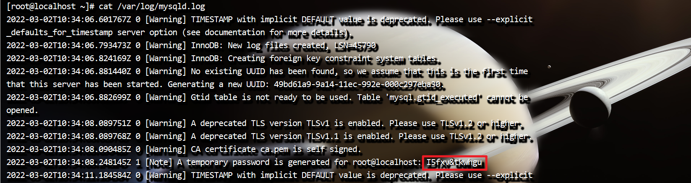
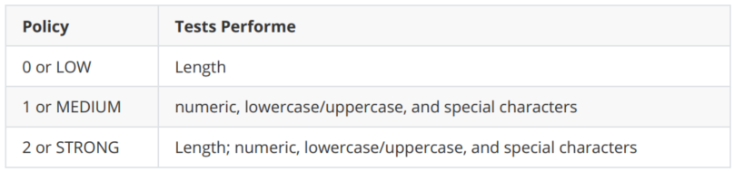

# MySQL安装v1.1

# 一、环境介绍

操作系统：CentOS 7

MySQL：5.7  

# 二、MySQL卸载

```sh
# 查看软件
rpm -qa|grep mysql
# 卸载MySQL
yum remove -y mysql mysql-libs mysql-common
rm -rf /var/lib/mysql
rm /etc/my.cnf
```

查看是否还有 MySQL 软件，有的话继续删除。

软件卸载完毕后如果需要可以删除 MySQL 的数据库： /var/lib/mysql  

# 三、MySQL安装

## 3.1 安装

```sh
#下载yum源
wget https://repo.mysql.com//mysql80-community-release-el7-3.noarch.rpm
#安装yum源
rpm -ivh mysql80-community-release-el7-3.noarch.rpm
#使用此命令可以查看 MySQL Yum 存储库中的所有子存储库，并查看其中哪些子存储库已启用或禁用
yum repolist all | grep mysql
#关闭mysql8的下载源
yum-config-manager --disable mysql80-community
#开启mysql5.7下载源
yum-config-manager --enable mysql57-community
#安装mysql5.7
yum install -y mysql-community-server --nogpgcheck
```

## 3.2 配置

```sh
vim /etc/my.cnf
```

修改内容如下

```sh
[mysqld]
# MySQL设置大小写不敏感：默认：区分表名的大小写，不区分列名的大小写
# 0：大小写敏感 1：大小写不敏感
lower_case_table_names=1
# 默认字符集
character-set-server=utf8
```

## 3.3 启动

```sh
systemctl start mysqld
```

## 3.4 设置root用户密码

安装了mysql5.7之后初始密码不再默认为空，初始密码会生成一个默认密码。密码会输出到mysql日志中。日志文件的位置在 /var/log/mysqld.log 

### 查看初始密码

 

### 修改初始密码

```sh
#1.登录mysql
[root@localhost ~]# mysql -uroot -pI5fxv&tkwhgu
#mysql5.7以后对密码的强度是有要求的，必须是字母+数字+符号组成的，如果想设置简单密码例
如‘root’，需要做以下设置
#2.设置密码长度最低位数
mysql> set global validate_password_length=4;
#3.设置密码强度级别
mysql> set global validate_password_policy=0;
#4.修改密码
mysql> alter user 'root'@'localhost' identified by 'itxiongge@123';
#5.进入mysql数据库：
mysql> use mysql;
#6.查看user表中的数据：
mysql> select Host, User from user;
#7.修改user表中的Host: 
mysql> update user set Host='%' where User='root'; 　　
#说明： % 代表任意的客户端,可替换成具体IP地址。
#8.刷新权限
mysql> flush privileges;
#9.更改权限
mysql> alter user 'root'@'%' identified by 'itxiongge@123';
#10.刷新权限
mysql> flush privileges;
```

**validate_password_policy有以下取值：**  

 

默认是1，即MEDIUM，所以刚开始设置的密码必须符合长度，且必须含有数字，小写或大写字母，特殊字符。  

**错误：**解决mysql Operation ALTER USER failed for ‘root’@’%'

```
1、连接服务器: `mysql -u root -p`
8、注意：一定要记得在写sql的时候要在语句完成后加上" ; "
9、 修改密码:ALTER USER 'root'@'%' IDENTIFIED WITH mysql_native_password BY 'root';
alter user 'root'@'%' identified by 'itxiongge@123';
10、最后刷新一下：flush privileges;
```


# 四、远程连接MySQL授权

## 登陆

```sh
mysql -uroot -proot
```

## 授权

授权命令  

```
grant 权限 on 数据库对象 to 用户
```

示例：

授予root用户对所有数据库对象的全部操作权限：  

```sh
mysql>GRANT ALL PRIVILEGES ON *.* TO 'root'@'%' IDENTIFIED BY 'root' WITH GRANT OPTION;
```

命令说明

- ALL PRIVILEGES :表示授予所有的权限，此处可以指定具体的授权权限。
- `*.*` :表示所有库中的所有表
- `'root'@'%'` ： myuser是数据库的用户名，%表示是任意ip地址，可以指定具体ip地址。
- IDENTIFIED BY 'mypassword' ：mypassword是数据库的密码。  

