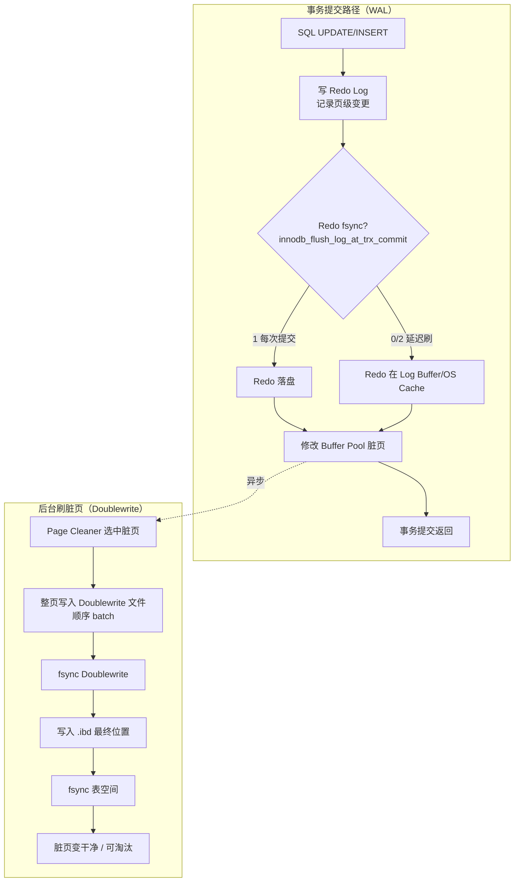
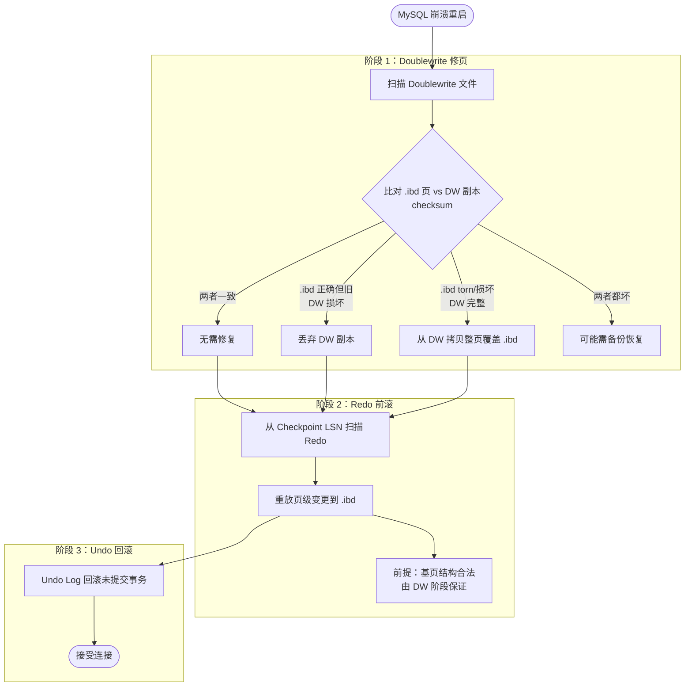

# InnoDB Redo 日志与崩溃恢复

> **MySQL / InnoDB 专题 · 01**  
> Redo 记什么、怎么恢复、边界在哪（Torn Page / Doublewrite / 与 Binlog·Undo 分工）。与 [[Senior Java Engineer/4-架构与设计/数据密集型应用系统设计/02-逐章精读/03-第03章-存储与检索|DDIA 第 3 章 WAL]] 互补。

## 阅读导航

```text
Part I  Redo 记什么        → Physiological Logging、MLOG 类型、mtr
Part II 三角分工           → Redo / Undo / Binlog / Buffer Pool（Binlog/Relay/复制见 [[Senior Java Engineer/3-数据库/2002-MySQL-Binlog-Relay与主从复制|2002 专篇]]）
Part III 崩溃恢复          → 前滚、回滚、两种宕机场景
Part III½ Redo+DW 流程图   → 正常运行与崩溃恢复总览
Part IV  Torn Page         → 为何 Redo  alone 不够、Doublewrite
Part V   Redo 不负责的边界 → 查缓存写失效、Checkpoint 覆盖
```

↑ [[Senior Java Engineer/4-架构与设计/数据密集型应用系统设计/02-逐章精读/03-第03章-存储与检索|DDIA 03 存储与检索]]

---

## 一句话概括

**Redo Log** 是 InnoDB 对**数据页物理变更**的 WAL：先写日志再改页，崩溃后**前滚**恢复未刷盘的已提交修改；它不记 SQL、不记查询结果，也**不能**修复 Torn Page（需 Doublewrite）。

---

# Part I：Redo 记什么

## 1. 官方定义

> *A write ahead log of changes applied to contents of data pages.*

| 记什么 | 不记什么 |
|--------|----------|
| 哪个页（Space ID + Page Number） | SQL 语句原文 |
| 页内偏移 / 记录的变更字节 | SELECT 结果集 |
| 文件级操作（建表空间等） | 事务回滚所需旧值（→ Undo） |

## 2. Physiological Logging（物理+页内逻辑）

介于逻辑日志与整页物理快照之间：

| 类型 | 示例 | 特点 |
|------|------|------|
| 逻辑日志 | `UPDATE t SET a=1 WHERE id=5` | 体积小，重放慢 |
| 物理日志 | 整页 16KB 二进制快照 | 重放快，体积大 |
| **Physiological** | 定位到页 + 页内 record/offset 的变更 | InnoDB 选用，平衡体积与速度 |

## 3. 一条 Redo 记录的结构（以 UPDATE 为例）

常见类型 `MLOG_REC_UPDATE_IN_PLACE`：

```text
┌─ 公共头 ─────────────────────────────────────┐
│  Type（记录类型）                              │
│  Space ID + Page Number  →  唯一标识数据页      │
├─ 类型特有 ────────────────────────────────────┤
│  Record Offset           →  页内记录位置         │
│  Update Field Count      →  修改字段数           │
│  每字段：Field Number + Length + 新值          │
└──────────────────────────────────────────────┘
```

其他常见 MLOG 类型：

| 类型 | 含义 |
|------|------|
| `MLOG_REC_INSERT` | 页内插入记录 |
| `MLOG_REC_DELETE` | 页内删除记录 |
| `MLOG_REC_UPDATE_IN_PLACE` | 页内原地更新 |
| `MLOG_WRITE_STRING` / `MLOG_NBYTES` | 页内某偏移写 N 字节 |
| `MLOG_INIT_FILE_PAGE` | 初始化新页 |
| `MLOG_FILE_*` | 表空间创建/删除/重命名 |

## 4. 写入路径：Mini-Transaction (mtr)

```text
事务修改
  → mtr 修改 Buffer Pool 中的页（脏页）
  → mtr 内部收集多条 redo record（可跨多页）
  → mtr_commit() 写入 Log Buffer
  → fsync 刷到 redo 文件（#innodb_redo/ 或 ib_logfile*）
```

物理格式：512 字节 / Block（12B 头 + 4B 尾 checksum）；多条 record 可共 Block，也可跨 Block。LSN（Log Sequence Number）单调递增，标识日志位置。

---

# Part II：Redo / Undo / Binlog / Buffer Pool

```text
┌─────────────┬──────────────────────┬─────────────────────┐
│ 组件        │ 层级                 │ 职责                │
├─────────────┼──────────────────────┼─────────────────────┤
│ Redo Log    │ InnoDB 引擎          │ 崩溃恢复 Durability │
│ Undo Log    │ InnoDB 引擎          │ 回滚 + MVCC         │
│ Binlog      │ MySQL Server         │ 复制 + PITR         │
│ Buffer Pool │ InnoDB 引擎          │ 缓存数据/索引页     │
│ Query Cache │ Server（8.0 已移除） │ 缓存 SELECT 结果    │
└─────────────┴──────────────────────┴─────────────────────┘
```

| 对比 | Redo | Undo | Binlog |
|------|------|------|--------|
| 内容 | 页上**新变更** | **改回去**的旧版本 | **逻辑**操作（SQL/行事件） |
| 时机 | 事务进行中，改页前/同时 | 改页前写旧值 | 事务提交时（两阶段提交） |
| 崩溃后 | **前滚**已提交变更 | **回滚**未提交事务 | 不参与 InnoDB 引擎恢复 |

主库提交时 **Redo ↔ Binlog 两阶段提交（2PC）** 保证引擎与 Binlog 一致；**Relay Log** 仅从库持有，是 Binlog 事件副本。详见 [[Senior Java Engineer/3-数据库/2002-MySQL-Binlog-Relay与主从复制|2002 Binlog/Relay 与主从复制]]。

**Buffer Pool vs Query Cache（历史）：**

- Buffer Pool：缓存**数据页**，任意 SQL 读同一页都受益
- Query Cache：缓存 **SQL 文本 → 完整结果**；表有写则**全部相关条目失效**（MySQL 8.0 移除，因 mutex 竞争 + 失效粒度太粗）

---

# Part III：崩溃恢复流程

重启时 InnoDB 自动执行：

```text
1. Doublewrite 修复：扫描 DW 文件，修 .ibd 中的 Torn Page（见 Part IV）
2. 从最近 Checkpoint LSN 开始扫描 Redo，前滚页级变更
3. Undo 回滚：撤销仍处于 active 状态的事务
→ 接受连接
```

> **顺序要点**：先 DW 提供**合法基页**，Redo 才能打增量补丁；Undo 最后清理未提交事务。

### 两种宕机场景

| 场景 | 磁盘 .ibd 状态 | 谁恢复 |
|------|-----------------|--------|
| **脏页未刷** | 完整旧页 | Redo 前滚 ✅ |
| **刷到一半 (Torn Page)** | 半新半旧损坏页 | Doublewrite ✅，Redo alone ❌ |
| **Redo 损坏/丢失** | 任意 | 备份 + Binlog PITR |

---

# Part IV：Torn Page 与 Doublewrite

## 1. 问题

16KB 页刷盘写到一半宕机 → 页内一半新一半旧，页头/checksum/LSN 可能损坏。

Redo 是**增量补丁**，前提：**基页结构合法**。在损坏页上重放可能更糟。

## 2. Doublewrite 机制

```text
刷脏页：
  1. 完整页 → Doublewrite Buffer（顺序写、整页）
  2. fsync
  3. 同一页 → .ibd 最终位置（可能在此崩溃）

恢复时：
  .ibd 页损坏 → 从 Doublewrite 拷贝完整页覆盖 → 再按需 Redo 前滚
```

| .ibd 最终位置 | Doublewrite | 处理 |
|--------------|-------------|------|
| 正确 | 正确 | 无需修复 |
| 正确但旧 | DW 有问题 | Redo 更新到新状态 |
| **损坏 (Torn)** | 有完整副本 | **从 Doublewrite 恢复** |

> 生产环境勿关 `innodb_doublewrite`（或勿用 `DETECT_ONLY`），否则 Torn Page 可能导致不可恢复损坏。

---

# Part III½：Redo + Doublewrite 共同流程图

> Redo 记「改了什么」，Doublewrite 保「页写完整」；恢复时先 DW 修基页，再 Redo 打补丁。

## 1. 正常运行：事务写入 → 刷脏页



要点：

- **Redo 先写**（WAL）：保证「改了什么」有持久记录
- **Doublewrite 后刷**：保证「整页落盘」不 torn
- 顺序：**Redo → 改内存页 →（异步）DW fsync → .ibd 写**

## 2. 崩溃恢复：启动时两者协作



## 3. 合并总览（ASCII）

```text
┌─────────────────────────────────────────────────────────────────────────┐
│                         正常运行                                         │
├─────────────────────────────────────────────────────────────────────────┤
│  SQL → [Redo Log 顺序写] → Buffer Pool 脏页                             │
│              │                              │                            │
│              │ WAL 保证 durability          │ 异步刷盘                    │
│              ▼                              ▼                            │
│         崩溃可重放变更              [Doublewrite 整页+fsync] → [.ibd]     │
└─────────────────────────────────────────────────────────────────────────┘
                                    │
                              ⚡ 宕机 ⚡
                                    ▼
┌─────────────────────────────────────────────────────────────────────────┐
│                         崩溃恢复                                         │
├─────────────────────────────────────────────────────────────────────────┤
│  ① Doublewrite：.ibd torn? → 用 DW 完整页覆盖                            │
│  ② Redo 前滚：在合法基页上打增量补丁（Checkpoint LSN → 最新）             │
│  ③ Undo 回滚：撤销未提交事务                                              │
└─────────────────────────────────────────────────────────────────────────┘
```

## 4. 分工对照

| 阶段 | Redo | Doublewrite |
|------|------|-------------|
| **正常运行** | 记录页变更（增量） | 刷页前存整页副本 |
| **宕机：DW fsync 前** | 有日志，可前滚 | 批次可能无效 → 靠 Redo + .ibd 旧页 |
| **宕机：.ibd 写一半** | 有日志但缺合法基页 | 用 DW 整页修复 .ibd |
| **恢复顺序** | ② 前滚 | ① 先修 torn page |

---

# Part V：Redo 不负责的边界

## 1. 查缓存写失效

表上有 DML → Query Cache 中涉及该表的所有 SELECT 结果**主动清除**（防脏读）。

Redo **无法恢复**这些缓存：它只记录页变更，不含 SQL 结果集；且失效是正确性设计，不是故障。

## 2. Checkpoint 后旧 Redo 被覆盖

Redo 文件循环写；Checkpoint 之前、且对应脏页已落盘的 Redo 空间可被覆盖。

被覆盖的旧 Redo **不能**用于回到更早时间点 → 需 **全量备份 + Binlog**（PITR）。

## 3. 数据文件物理损坏

.ibd 页本身损坏且无 Doublewrite 副本 → Redo 无能为力 → 靠备份。

---

## 关键参数（速查）

| 参数 | 含义 |
|------|------|
| `innodb_flush_log_at_trx_commit` | 1=每次提交 fsync（最安全）；2=写 OS 缓存；0=每秒刷 |
| `innodb_buffer_pool_size` | Buffer Pool 大小 |
| `innodb_doublewrite` | `DETECT_AND_RECOVER`（默认，推荐） |

---

## 与之相关

- [[Senior Java Engineer/3-数据库/2002-MySQL-Binlog-Relay与主从复制|2002 Binlog/Relay 与主从复制]] — 2PC、主从链路、Redo+Binlog+Relay 流程图
- [[Senior Java Engineer/4-架构与设计/数据密集型应用系统设计/02-逐章精读/03-第03章-存储与检索|DDIA 第 3 章 — WAL / B+Tree / InnoDB 对照]]
- [[Senior Java Engineer/1-Java/Java基础/1008-零拷贝|1008 零拷贝]] — 页缓存、OS Page Cache 与 I/O
- [[Senior Java Engineer/1-Java/Java基础/1009-堆外内存与DirectBuffer|1009 堆外内存]] — 内存 vs 磁盘 I/O 层次

## 外部参考

- [MySQL 8.4 — Redo Log](https://dev.mysql.com/doc/refman/8.4/en/innodb-redo-log.html)
- [MySQL 8.4 — Doublewrite Buffer](https://dev.mysql.com/doc/refman/8.4/en/innodb-doublewrite-buffer.html)
- [InnoDB Redo Log 内部文档](https://dev.mysql.com/doc/dev/mysql-server/8.0.45/PAGE_INNODB_REDO_LOG.html)
- [An In-Depth Analysis of REDO Logs in InnoDB](https://www.alibabacloud.com/blog/an-in-depth-analysis-of-redo-logs-in-innodb_598965) — Physiological Logging、MLOG 结构
- [Percona: Torn Pages](https://www.percona.com/blog/a-tale-of-two-databases-how-postgresql-and-mysql-handle-torn-pages/)

---

## 更新记录

- source: https://dev.mysql.com/doc/refman/8.4/en/innodb-redo-log.html , https://dev.mysql.com/doc/refman/8.4/en/innodb-doublewrite-buffer.html , https://www.alibabacloud.com/blog/an-in-depth-analysis-of-redo-logs-in-innodb_598965
- updated: 2026-07-22
- 沉淀自对话：Redo 记录内容、Torn Page、Doublewrite、查缓存写失效边界
- 2026-07-22：新增 Part III½ Redo+Doublewrite 共同流程图；修正崩溃恢复顺序（DW → Redo → Undo）
- 2026-07-22：Part II 增加 2PC 与 2002 Binlog/Relay 专篇链接
