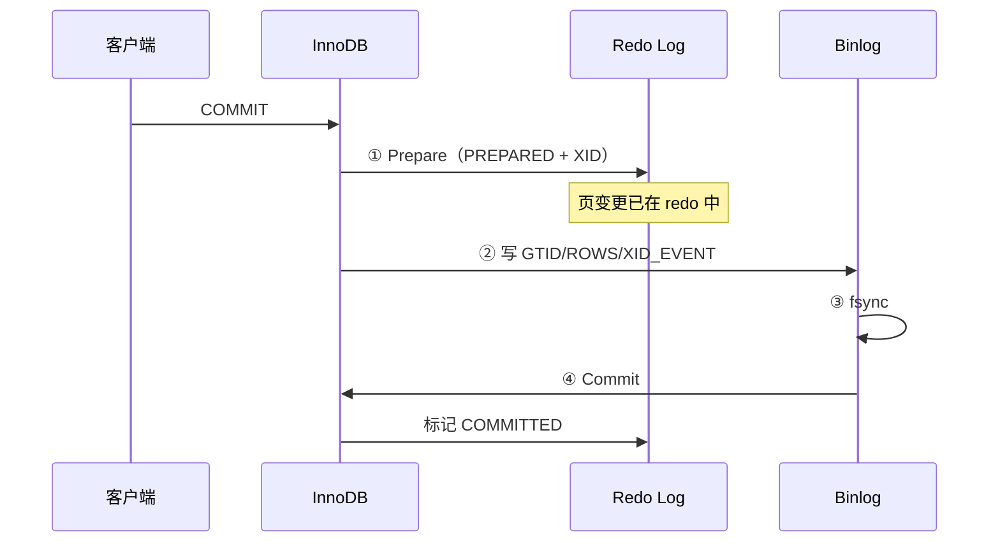
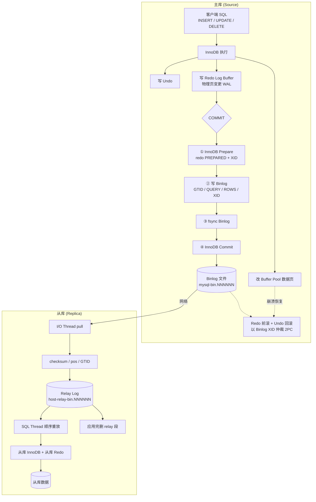

# MySQL Binlog、Relay 与主从复制

> **MySQL / InnoDB 专题 · 02**  
> Binlog 记什么、Relay 是什么、与 Redo 如何通过两阶段提交对齐、主从如何最终一致。与 [[Senior Java Engineer/3-数据库/2001-InnoDB-Redo日志与崩溃恢复|2001 InnoDB Redo]]、[[Senior Java Engineer/4-架构与设计/数据密集型应用系统设计/02-逐章精读/05-第05章-复制|DDIA 第 5 章 复制]] 互补。

## 阅读导航

```text
Part I  三份日志分工         → Redo / Binlog / Relay 各写什么、在哪
Part II Binlog 事件结构      → ROW / STATEMENT / MIXED
Part III 主库两阶段提交      → InnoDB ↔ Binlog 2PC、XID
Part IV 主从复制链路         → I/O Thread → Relay → SQL Thread
Part V  一致性保证与例外     → 何时会不一致
Part VI  总流程图            → Redo + Binlog + Relay 合并
Part VII 运维速查            → 参数、命令、与操作文档链接
```

↑ [[Senior Java Engineer/3-数据库/2001-InnoDB-Redo日志与崩溃恢复|2001 Redo 专篇]] · [[Senior Java Engineer/4-架构与设计/数据密集型应用系统设计/02-逐章精读/05-第05章-复制|DDIA 05 复制]]

---

## 一句话概括

**Binlog** 是主库 Server 层的**变更事件原件**（复制 / PITR / CDC）；**Relay Log** 是从库上 **Binlog 的格式相同副本**（I/O 写、SQL 读）；**Redo** 是各节点 InnoDB 自己的**物理页 WAL**，不参与跨节点传输。主库靠 **Redo↔Binlog 两阶段提交** 保证引擎与 Binlog 一致；主从靠 **顺序重放 + 位点/GTID** 保证最终一致。

---

# Part I：三份日志分工

```text
┌─────────────┬──────────────────┬─────────────────────┬──────────────────────┐
│   日志      │   所在节点       │   写什么            │   谁用               │
├─────────────┼──────────────────┼─────────────────────┼──────────────────────┤
│ Redo Log    │ 主库 + 从库      │ 物理页变更（WAL）   │ 本机 InnoDB 崩溃恢复 │
│             │ （各自独立）     │                     │                      │
├─────────────┼──────────────────┼─────────────────────┼──────────────────────┤
│ Binlog      │ 主库（原件）     │ 逻辑/行级变更事件   │ 复制、PITR、CDC      │
│             │ 从库可选*        │                     │                      │
├─────────────┼──────────────────┼─────────────────────┼──────────────────────┤
│ Relay Log   │ 仅从库           │ = 主库 Binlog 副本  │ I/O 写、SQL 重放     │
│             │                  │ （格式完全相同）    │                      │
└─────────────┴──────────────────┴─────────────────────┴──────────────────────┘
* 从库默认 `log_replica_updates=ON` 时也会写 Binlog（级联复制用）
```

| 对比 | Redo | Binlog | Relay |
|------|------|--------|-------|
| 层级 | InnoDB 引擎 | MySQL Server | 复制组件（从库） |
| 内容 | 页上**新变更**（物理） | **SQL/行事件**（逻辑） | **同 Binlog 事件** |
| 时机 | 事务进行中 | 事务 **COMMIT** 时（2PC） | I/O 线程从主库拉取后 |
| 跨节点 | ❌ 不传 | ✅ 复制源 | ✅ 本地缓冲队列 |

> Redo 与 Binlog 的引擎层对比见 [[Senior Java Engineer/3-数据库/2001-InnoDB-Redo日志与崩溃恢复#Part II：Redo / Undo / Binlog / Buffer Pool|2001 Part II]]。

---

# Part II：Binlog 写了什么

Binlog 记录**会改变库表结构或数据**的事件；普通 `SELECT` 通常不记录。

## ROW 模式（`binlog_format=ROW`，生产常用）

一个事务的典型事件序列：

```text
GTID_EVENT（若开启 GTID）
QUERY_EVENT              -- BEGIN
TABLE_MAP_EVENT          -- 表元数据（库名、表 id、列类型）
WRITE_ROWS_EVENT         -- INSERT 行镜像
UPDATE_ROWS_EVENT        -- UPDATE 前后镜像
DELETE_ROWS_EVENT        -- DELETE 行镜像
XID_EVENT                -- 提交；XID 与 InnoDB 2PC 对齐
```

## STATEMENT / MIXED

| 模式 | 记录内容 | 特点 |
|------|----------|------|
| **STATEMENT** | 原始 SQL | 省空间；`UUID()`、`NOW()`、无 ORDER BY 的 LIMIT 等可能导致主从不一致 |
| **ROW** | 行变更前后镜像 | 安全、体积大 |
| **MIXED** | 按语句自动选择 | 折中 |

文件级还有：`FORMAT_DESCRIPTION`（文件头）、DDL 的 `QUERY_EVENT`、rotate 事件等。

---

# Part III：主库两阶段提交（Redo ↔ Binlog）

Binlog 与 Relay **不是**两套独立业务数据；主库上首先要保证 **InnoDB 数据页 ↔ Binlog** 一致。

## 提交时序（简化）

```text
COMMIT：
  ① InnoDB Prepare  →  redo 写 PREPARED + XID，刷盘（视 innodb_flush_log_at_trx_commit）
  ② 写 Binlog       →  事务 events + XID_EVENT
  ③ fsync Binlog    →  视 sync_binlog
  ④ InnoDB Commit   →  redo 标记 COMMITTED
```

## 序列图



## 崩溃恢复仲裁

以 **Binlog 为真相源**：

| redo 状态 | binlog 中是否有完整 XID | 结果 |
|-----------|-------------------------|------|
| PREPARED | 有 | **Commit** |
| PREPARED | 无 | **Rollback** |
| COMMITTED | — | 已提交 |

→ 已提交事务在 **InnoDB 与 Binlog 中一致**（`sync_binlog=1` 等配置下 durability 才有保障）。

---

# Part IV：主从复制链路

## 复制线程

```text
                    主库 (Source)                    从库 (Replica)
              ┌─────────────────────┐         ┌──────────────────────────┐
  业务写入 ──▶│ InnoDB + 写 Binlog   │         │                          │
              │ mysql-bin.000001     │         │  I/O Thread（Receiver）   │
              │ mysql-bin.000002     │──pull──▶│    ↓ 写入                │
              └─────────────────────┘         │  Relay Log               │
                                              │  host-relay-bin.000001   │
                                              │    ↓ 读取                │
                                              │  SQL Thread（Applier）    │
                                              │    ↓ 重放                │
                                              │  从库 InnoDB + 从库 Redo │
                                              └──────────────────────────┘
```

1. **主库**：事务经 2PC 写入 Binlog。
2. **I/O 线程**：连主库，按 **binlog position / GTID** pull 事件 → 写入 **Relay**（格式与 Binlog 相同，可 checksum 校验）。
3. **SQL 线程**：读 Relay，**顺序重放** event → 从库 InnoDB 变更（从库本地也会产生 Redo/Undo）。
4. **Relay 清理**：SQL 线程应用完某 relay 文件后**自动删除**（非 binlog 那样长期保留）。

## Relay 写了什么

**就是主库 Binlog 对应片段的事件副本**，不是从库重新生成的第二套逻辑。

```text
主库 mysql-bin.000003 @ pos 1540
        │  网络传输（checksum）
        ▼
从库 host-relay-bin.000005 @ relay pos 890   ← 内容一致
        │
        ▼
SQL 线程重放 → 从库表数据
```

元数据（InnoDB 表，崩溃可恢复）：

- `mysql.slave_master_info` — 连主库、读到主库哪个 binlog 文件/position
- `mysql.slave_relay_log_info` — relay 应用到哪；与事务提交绑定，避免位点与数据不一致

---

# Part V：一致性保证与例外

## 两层一致性问题

| 层次 | 问题 | 机制 |
|------|------|------|
| **主库内部** | InnoDB 页 vs Binlog | Redo↔Binlog **2PC** + XID |
| **主库 vs 从库** | Binlog vs Relay vs 从库数据 | Relay = 副本；**顺序重放** + 位点/GTID |

Relay **不是第二真相源**，只是传输缓冲：网络快、应用慢时先落盘，避免反压主库；断线可从 relay + 位点续传。

## 何时真的不一致

| 场景 | 原因 |
|------|------|
| **异步复制 + 主库宕机** | 部分已提交 Binlog 未传到从库 → RPO > 0 |
| **`binlog_format=STATEMENT`** | 非确定性 SQL 主从重放结果不同 |
| **从库直接写入** | 双写源，复制无法覆盖本地修改 |
| **复制过滤** | `replicate-do/ignore-*` 有意缩小数据集 |
| **主从 schema 不同** | 重放失败或静默错误 |
| **`sync_binlog=0` 主库 crash** | 可能丢失最后一批 Binlog |
| **半同步** | 降低丢数据概率，不消除 lag |

---

# Part VI：Redo + Binlog + Relay 总流程图



## 数据流 ASCII

```text
主库:  SQL → InnoDB改页 → Redo(WAL) ──2PC──▶ Binlog(变更原件)
                              ↓
从库:  Binlog ──I/O──▶ Relay(副本队列) ──SQL重放──▶ 从库 InnoDB + Redo
```

**要点：**

- **Redo** 管本机 durability，**不跨节点传输**
- **Binlog** 是复制的**唯一变更源**
- **Relay** 是传输缓冲，内容与 Binlog 对应片段一致

---

# Part VII：运维速查

## 关键参数

| 参数 | 含义 |
|------|------|
| `log-bin` | 开启 Binlog |
| `sync_binlog` | 1=每次提交组 fsync Binlog（最安全） |
| `binlog_format` | ROW / STATEMENT / MIXED |
| `binlog_expire_logs_seconds` | Binlog 过期清理 |
| `log_replica_updates` | 从库重放后是否写本机 Binlog（级联） |
| `relay_log` / `relay_log_index` | Relay 路径 |
| `innodb_flush_log_at_trx_commit` | Redo 刷盘策略（见 2001） |

## 常用命令

```sql
SHOW BINARY LOGS;
SHOW MASTER STATUS;
SHOW RELAYLOG EVENTS;
SHOW REPLICA STATUS\G
```

```bash
mysqlbinlog --base64-output=decode-rows -v mysql-bin.000001
```

Binlog 与 Relay **均可用 `mysqlbinlog` 解码**（格式相同）。

## 操作文档

集群搭建、开启 Binlog、`binlog_format` 调整、日志查看命令详见：

[[Senior Java Engineer/3-数据库/17-数据库集群-操作文档&MySQL安装文档/17-数据库集群-操作文档#1.3 binlog和relay日志|17-数据库集群-操作文档 §1.3]]

---

## 与之相关

- [[Senior Java Engineer/3-数据库/2001-InnoDB-Redo日志与崩溃恢复|2001 InnoDB Redo 与崩溃恢复]] — Redo/Undo、Doublewrite、崩溃恢复
- [[Senior Java Engineer/4-架构与设计/数据密集型应用系统设计/02-逐章精读/05-第05章-复制|DDIA 第 5 章 — 复制]] — 半同步、lag、读保证
- [[Senior Java Engineer/4-架构与设计/数据密集型应用系统设计/02-逐章精读/03-第03章-存储与检索|DDIA 第 3 章 — WAL 对照]]
- [[Senior Java Engineer/3-数据库/17-数据库集群-操作文档&MySQL安装文档/17-数据库集群-操作文档|17-数据库集群-操作文档]] — 主从搭建与运维

## 外部参考

- [MySQL 8.4 — Binary Log](https://dev.mysql.com/doc/refman/8.4/en/binary-log.html)
- [MySQL 8.4 — Relay Log](https://dev.mysql.com/doc/refman/8.4/en/replica-logs-relaylog.html)
- [MySQL 8.4 — Replication Implementation](https://dev.mysql.com/doc/refman/8.4/en/replication-implementation.html)
- [MySQL 8.4 — Locks Set by SQL / Binlog events](https://dev.mysql.com/doc/refman/8.4/en/innodb-locks-set.html)
- [XID_EVENT 与 2PC](https://readyset.io/blog/replication-internals-decoding-the-mysql-binary-log-part-9-xid_event-transaction-commit)

---

## 更新记录

- source: https://dev.mysql.com/doc/refman/8.4/en/binary-log.html , https://dev.mysql.com/doc/refman/8.4/en/replica-logs-relaylog.html , https://dev.mysql.com/doc/refman/8.4/en/replication-implementation.html
- updated: 2026-07-22
- 沉淀自对话：Binlog/Relay 分工、2PC、事件结构、一致性例外、Redo+Binlog+Relay 流程图
