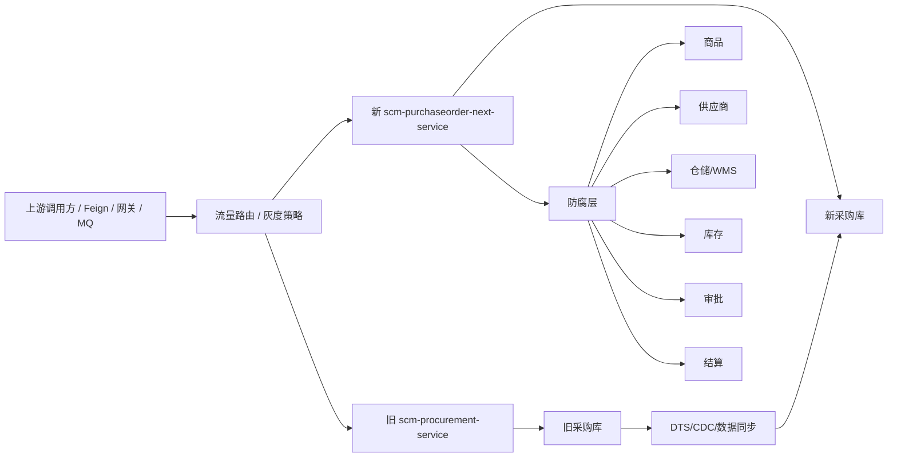

# 新采购服务替换方案总览

## 1. 目标

在不改动现有 `scm-procurement-service` 业务代码的前提下，重新设计并建设一个新的采购服务，逐阶段替换旧服务的查询、命令、MQ 回调、外部集成和数据归属。

新服务暂定名：

```text
scm-purchaseorder-next-service
```

最终对外可以继续承接旧服务的服务名和接口契约，但建设期必须作为独立服务旁路运行。

## 2. 设计原则

来自《实现领域驱动设计》的落地原则：

- 先划限界上下文，再设计实体和值对象。
- 应用服务负责编排，领域模型负责业务规则。
- 聚合保护强一致性边界，一个事务尽量只修改一个聚合。
- Repository 面向聚合，不面向数据库表。
- 外部系统通过防腐层接入，外部 DTO 不进入领域模型。
- 领域事件表达业务事实，集成事件表达跨系统通知。
- 新旧系统并行期间，以可验证、可回滚、可灰度为第一优先级。

## 3. 新旧服务关系



## 4. 限界上下文

新服务内部按业务语言拆分为多个限界上下文，先在同一个服务内模块化，不立即拆成多个微服务。

| 上下文 | 主要职责 | 第一阶段是否纳入 |
|---|---|---|
| 采购需求 `requisition` | PR、PRD、供应商确认、采购异常确认、转 PO | 是 |
| 采购订单 `purchaseorder` | PO/PSO 创建、提交、审批、作废、发货、收货、入库 | 是，核心 |
| 出口履约 `exportshipment` | 待出口、货柜、装柜、车辆检查、柜明细 | 第二优先级 |
| 资质商检 `inspection` | 资质校验、商检资料、商检回调 | 第二优先级 |
| 结算费用 `settlement` | 费用初始化、结算推送、畅收付状态 | 第三优先级 |
| 异常预警 `exceptionwarning` | PO/PR 异常、超期批次、跟单提醒 | 第三优先级 |
| 导入导出 `fileoperation` | Excel/PDF/异步文件任务 | 查询/工具能力，后置 |

## 5. 分阶段文档

| 阶段 | 文档 | 交付目标 |
|---|---|---|
| 阶段 0 | [01-阶段0-边界识别与契约冻结](./01-阶段0-边界识别与契约冻结.md) | 冻结旧接口、状态机、数据口径和替换边界 |
| 阶段 1 | [02-阶段1-新服务领域模型与架构骨架](./02-阶段1-新服务领域模型与架构骨架.md) | 建立新服务 DDD/六边形架构和核心聚合 |
| 阶段 2 | [03-阶段2-数据迁移与同步模型](./03-阶段2-数据迁移与同步模型.md) | 建立新库、历史迁移、CDC 同步和数据校验 |
| 阶段 3 | [04-阶段3-影子运行与差异校验](./04-阶段3-影子运行与差异校验.md) | 新服务旁路运行，验证读模型和命令模型正确性 |
| 阶段 4 | [05-阶段4-分流切换与双轨运行](./05-阶段4-分流切换与双轨运行.md) | 分上下文/接口灰度接管生产流量 |
| 阶段 5 | [06-阶段5-旧服务下线与治理收口](./06-阶段5-旧服务下线与治理收口.md) | 完成替换、冻结旧服务、治理补偿和监控 |
| 领域模型 | [07-领域模型图](./07-领域模型图.md) | 展示新采购服务限界上下文、核心聚合、领域事件和防腐层 |
| 导入对象边界 | [08-导入对象与领域对象边界](./08-导入对象与领域对象边界.md) | 说明 Excel 导入对象、应用层命令、领域对象和导入任务聚合的边界 |

## 6. 总体替换策略

替换顺序建议：

```text
查询接口
→ 低副作用命令，如草稿保存、预校验
→ PO 创建/提交
→ 审批回调/作废
→ 发货/收货/入库回调
→ 货柜/商检/结算/异常
→ MQ 消费者和定时任务
```

不建议最先替换：

- WMS 入库回调。
- 库存/中台推送。
- 结算推送。
- 自动转单。
- 旧服务中已有历史补偿逻辑的接口。

这些链路副作用强，应在影子校验稳定后再切。

## 7. 成功标准

- 新服务能够独立表达采购领域模型，不依赖旧服务代码。
- 新服务兼容旧 Feign/API 协议，或提供明确的协议升级路径。
- 历史数据迁移可重复执行，数据校验有量化报表。
- 影子运行期间，关键查询差异率可解释并收敛到业务可接受范围。
- 灰度切换支持按租户/国家/订单类型/接口/调用方控制。
- 任一阶段都能回滚到旧服务继续承接流量。
