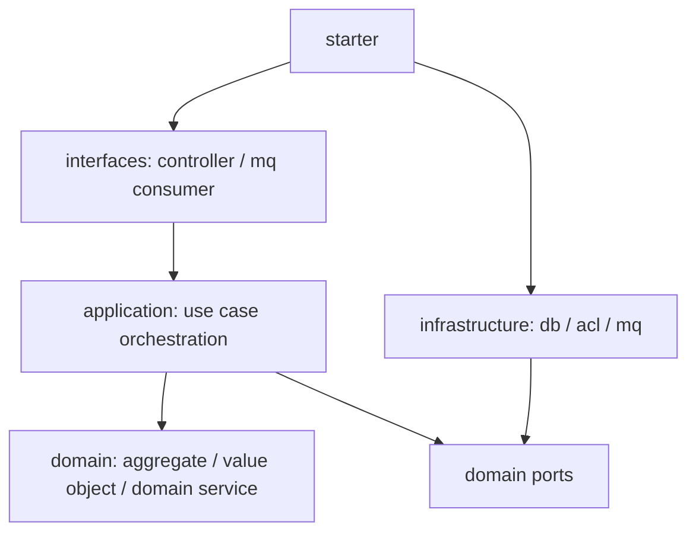

# 阶段 1：新服务领域模型与架构骨架

## 1. 阶段目标

创建独立的新采购服务，建立领域模型、应用服务、端口、防腐层、持久化适配器和兼容接口骨架。旧服务不变，新服务暂不承接生产流量。

## 2. 新服务模块

建议 Maven 模块：

```text
scm-purchaseorder-next-service
  purchaseorder-next-api
  purchaseorder-next-application
  purchaseorder-next-domain
  purchaseorder-next-infrastructure
  purchaseorder-next-interfaces
  purchaseorder-next-starter
  purchaseorder-next-test
```

依赖方向：



硬性规则：

- `domain` 不依赖 Spring、MyBatis、Feign、MQ、旧服务 DTO。
- `application` 可以依赖事务抽象和端口接口，但不直接依赖 Mapper。
- `infrastructure` 实现 Repository 和外部 Port。
- `interfaces` 只做协议转换，不写业务规则。

## 3. 包结构

```text
com.bo.rt.biz.scm.purchaseorder.next
  interfaces
    feign
    mq
    job
  application
    purchaseorder
      command
      query
      assembler
    requisition
    exportshipment
    inspection
    settlement
  domain
    purchaseorder
      model
      event
      repository
      policy
      service
    requisition
    exportshipment
    inspection
    settlement
  infrastructure
    persistence
      purchaseorder
      requisition
    acl
      goods
      supplier
      warehouse
      stock
      approval
      settlement
    messaging
    id
    transaction
```

## 4. 第一批聚合

### 4.1 PurchaseOrder 聚合

聚合根：`PurchaseOrder`

内部实体：

- `PurchaseSubOrder`
- `PurchaseOrderLine`
- `PurchaseDestination`
- `PurchaseDeliveryPlan`

值对象：

- `PurchaseOrderCode`
- `PurchaseSubOrderCode`
- `SupplierRef`
- `Destination`
- `Money`
- `Quantity`
- `DeliveryTerm`
- `PurchaseOrderType`
- `PurchaseOrderStatus`

核心行为：

```text
createDraft()
replaceDraftLines()
submit()
approve()
reject()
cancel()
confirmSupplierDelivery()
markTransitReceived()
markTransitInbounded()
markDestinationReceived()
markDestinationInbounded()
```

聚合保护的不变量：

- 非草稿不可直接覆盖明细。
- 已取消、已完成订单不可再次提交或发货。
- PO 和 PSO 的状态流转必须由聚合方法统一控制。
- 同一 PO 下币种一致。
- 数量、金额、税额计算由模型或领域服务统一完成。
- 目的地类型与采购类型匹配。

### 4.2 PurchaseRequisition 聚合

聚合根：`PurchaseRequisition`

内部实体：

- `PurchaseRequisitionDetail`

核心行为：

```text
supplierConfirm()
confirmException()
cancel()
markTransferredToPo()
close()
```

## 5. 应用服务

命令应用服务：

```text
PurchaseOrderCommandService
  createGoodsDraft(command)
  createMaterialDraft(command)
  submit(command)
  approve(command)
  reject(command)
  cancel(command)
  confirmDelivery(command)
  receiveCallback(command)
```

查询应用服务：

```text
PurchaseOrderQueryService
  page(query)
  detail(query)
  supplierPage(query)
  warehousePage(query)
```

应用服务流程：

```text
解析 Command
→ 调用 Port 获取外部快照
→ 调用 Factory/DomainService 创建或加载聚合
→ 调用聚合行为
→ Repository 保存
→ afterCommit 发布领域事件/集成事件
→ 返回 DTO
```

## 6. 防腐层端口

领域和应用层只依赖端口：

```text
GoodsCatalogPort
SupplierProfilePort
WarehouseDirectoryPort
StoreDirectoryPort
ApprovalWorkflowPort
StockIntegrationPort
WmsIntegrationPort
SettlementPort
OrderNoPort
DomainEventPublisher
```

外部 DTO 在 `infrastructure.acl.*` 内翻译成本地模型。

## 7. 接口策略

新服务同时提供两类接口：

1. 兼容旧接口：路径和请求响应尽量保持一致，用于灰度替换。
2. 新 v2 接口：按 Command/Query 设计，供后续调用方迁移。

兼容层不得直接暴露旧领域对象，只做转换：

```text
旧 Request
→ Command
→ ApplicationService
→ Result DTO
→ 旧 Response DTO
```

## 8. 退出条件

- 新服务可以独立启动。
- domain 模块无 Spring/MyBatis/Feign 依赖。
- PO 创建草稿、提交、审批、取消的领域单测完成。
- 新服务兼容接口可返回 mock/空实现，不接生产流量。
- 第一批 Port 和 Repository 接口定义完成。
