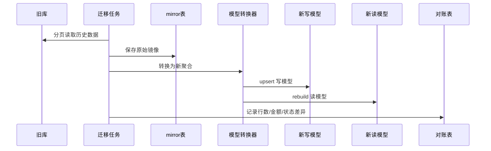

# 阶段 2：数据迁移与同步模型

## 1. 阶段目标

建立新服务自己的数据库和读写模型，通过历史迁移 + 增量同步，让新服务可以旁路读取旧服务生产数据，并为影子运行做准备。

本阶段旧服务仍然是唯一生产写入方。

## 2. 数据策略

采用三层数据模型：

```text
旧库原始数据
→ mirror 原始镜像层
→ domain 写模型层
→ query 读模型层
```

说明：

- `mirror` 保留旧表字段，便于对账和回放。
- `domain` 按新聚合建表，是未来新服务写入主模型。
- `query` 面向页面和旧接口响应，可冗余、可重建。

## 3. 新库建议

数据库暂定：

```text
biz_scm_purchaseorder_next_db
```

表分组：

| 分组 | 表示例 | 用途 |
|---|---|---|
| mirror | `mirror_purchase_order`、`mirror_purchase_sub_order` | 旧库同步镜像 |
| command | `po_order`、`po_sub_order`、`po_status_log` | 新聚合写模型 |
| query | `q_po_page`、`q_supplier_po_page`、`q_export_po_page` | 查询读模型 |
| event | `domain_event_outbox`、`integration_event_outbox` | 事件可靠发布 |
| migration | `migration_batch`、`migration_diff_result` | 迁移批次和对账 |

## 4. 历史数据迁移

迁移流程：



迁移粒度：

- 先按 PO 单号迁移。
- 一个 PO 及其 PSO、属性、费用、状态日志作为一个迁移单元。
- PR 可作为单独迁移单元，但保留与 PO 的业务关联。

## 5. 增量同步

优先方案：

- 使用 DTS/CDC 订阅旧库核心表 binlog。
- 新服务消费 CDC 事件更新 mirror 层。
- 通过重建器刷新新读模型。

备选方案：

- 定时拉取 `update_time` 增量。
- 适合早期验证，不适合长期替代。

CDC 注意点：

- 必须按业务主键保证幂等。
- 同一 PO 多表变更需要聚合重建延迟窗口。
- 删除逻辑以 `deleted` 字段为准。
- 对旧库脏数据要记录差异，不在同步阶段静默修正。

## 6. 数据校验

对账维度：

| 维度 | 校验规则 |
|---|---|
| 数量 | PO 数、PSO 数、PR 数、货柜数一致 |
| 状态 | PO/PSO/PR 状态映射一致 |
| 金额 | 含税总额、不含税总额、税额按币种汇总一致 |
| 关联 | PO-PSO、PR-PRD、PRD-PSO 关联完整 |
| 时间 | 提交、审批、发货、收货、入库时间一致 |
| 标记 | 寄售、是否中转、目的地、采购类型一致 |

差异处理：

- 差异进入 `migration_diff_result`。
- 标记为：模型差异、历史脏数据、转换缺陷、同步延迟。
- 只有转换缺陷需要修新服务。

## 7. 新旧主键策略

业务主键保持旧系统编码：

- PO：`purchase_order_code`
- PSO：`purchase_sub_order_code`
- PR：`purchase_requisition_code`
- PRD：保留旧 `prd_detail_id` / `pr_detail_id` 映射

新服务内部可使用新自增 ID 或雪花 ID，但对外必须以业务编码为准。

## 8. 退出条件

- 最近 90 天 PO/PR 核心数据可完整迁移。
- CDC 增量同步延迟稳定在可接受范围。
- 查询读模型可重建。
- 核心对账报表可每日输出。
- 差异分类机制完成，差异率达到进入影子运行标准。
