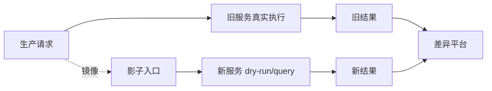

# 阶段 3：影子运行与差异校验

## 1. 阶段目标

新服务旁路运行，不承接真实写流量。通过请求镜像、日志回放、CDC 事件重放验证新服务的查询结果、命令决策和领域规则是否与旧服务一致或可解释。

旧服务仍然是生产唯一事实来源。

## 2. 影子运行类型

### 2.1 查询影子

同一查询请求同时打到旧服务和新服务，新服务结果不返回给用户，只记录差异。

适合接口：

- PO 分页。
- PO 详情。
- 供应商端列表。
- 仓储端查询。
- 待出口列表。

### 2.2 命令影子

真实命令仍由旧服务执行。新服务只做 dry-run：

```text
接收同样请求
→ 加载新服务镜像数据
→ 执行领域校验和状态推演
→ 不写业务状态
→ 记录决策结果
```

适合接口：

- PO 创建预校验。
- PO 提交校验。
- 作废校验。
- 供应商确认发货校验。

不适合早期 dry-run 的接口：

- WMS 入库回调。
- 库存扣减/推送。
- 结算推送。
- MQ 消费后直接产生外部副作用的链路。

### 2.3 事件重放

从旧服务状态变更、MQ 记录、CDC 中重放事件，验证新服务状态机。

事件示例：

```text
PO_CREATED
PO_SUBMITTED
PO_APPROVED
SUPPLIER_DELIVERY_CONFIRMED
TRANSIT_WAREHOUSE_INBOUNDED
DESTINATION_INBOUNDED
PR_SUPPLIER_CONFIRMED
```

## 3. 差异平台

差异记录建议字段：

```text
diff_id
biz_type
biz_code
request_hash
old_result_hash
new_result_hash
diff_type
diff_detail
severity
created_at
resolved_status
```

差异类型：

| 类型 | 说明 | 处理 |
|---|---|---|
| 字段命名差异 | 新旧 DTO 字段表达不同 | 转换层修复 |
| 排序差异 | 分页排序口径不同 | 明确排序规则 |
| 历史脏数据 | 旧库存在不满足新模型的数据 | 建兼容转换或数据治理 |
| 状态机差异 | 新旧状态推导不同 | 高优先级修复 |
| 金额差异 | 金额、税额、币种不同 | 阻断切流 |
| 外部快照差异 | 商品/供应商/仓库信息实时变化 | 固化快照口径 |

## 4. 影子运行架构



请求镜像可以来自：

- 网关流量镜像。
- Feign 调用日志回放。
- 旧服务 access log 回放。
- MQ 消息复制消费组。

## 5. 验证指标

进入切流前建议达到：

- PO 查询核心字段一致率 ≥ 99.9%。
- PO 金额汇总差异为 0，或全部有业务解释。
- PO 状态推导差异为 0。
- 命令 dry-run 拒绝/通过结论一致率 ≥ 99.5%。
- 新服务 P95 查询耗时不高于旧服务 120%。
- 新服务错误率低于旧服务，或错误全部来自影子数据不完整。

## 6. 退出条件

- 查询影子稳定运行至少 2 周。
- 命令影子覆盖核心 PO 类型。
- P0/P1 差异清零。
- 已选定第一批灰度接口和灰度维度。
- 回滚方案经过演练。
