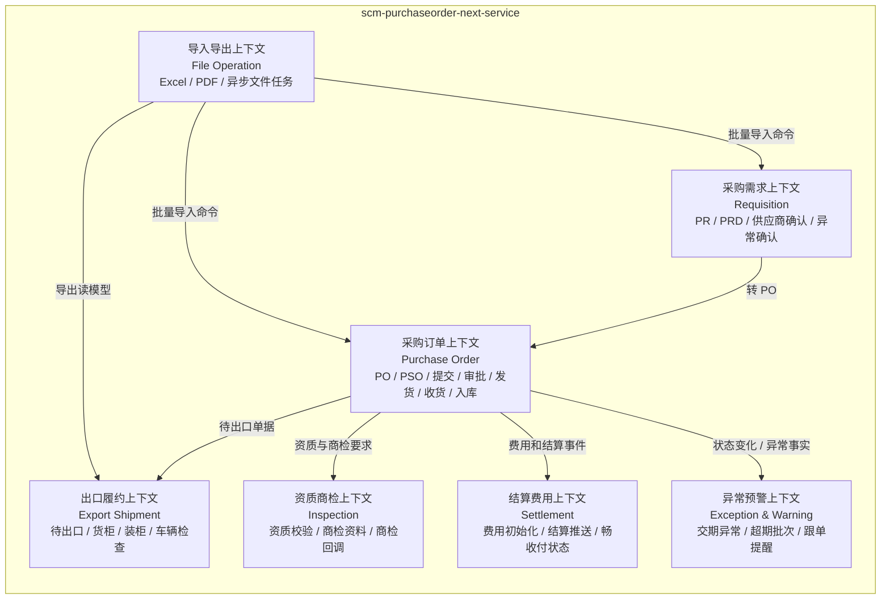
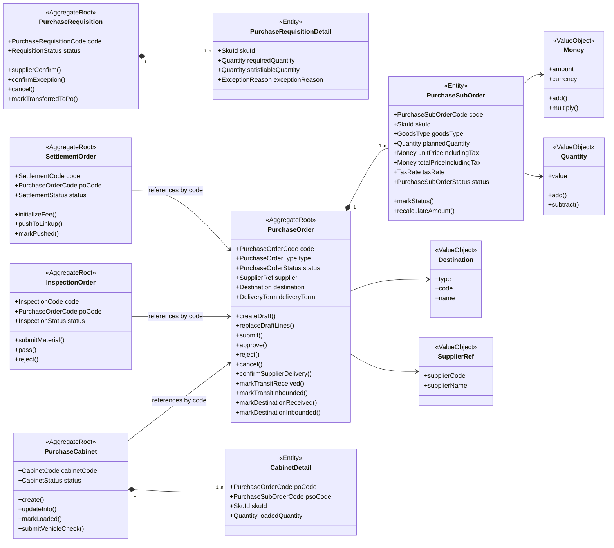
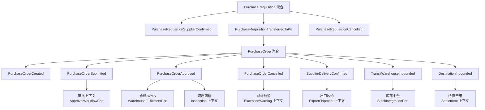
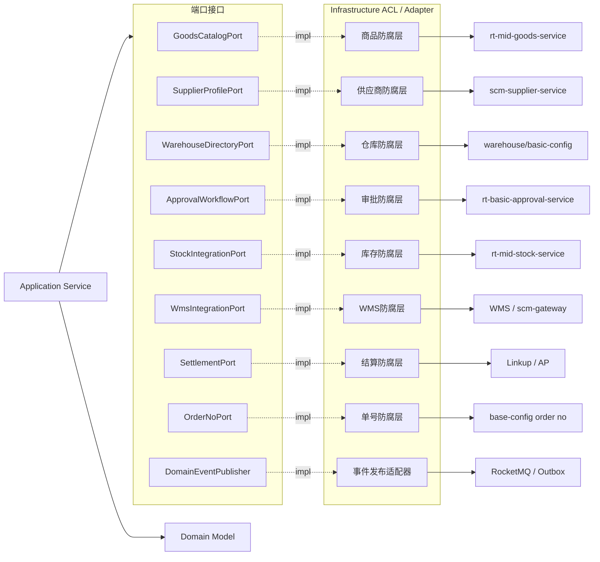

# 领域模型图

> [!warning] 第一版模型图
> 本文用于保留第一版设计演进记录。结合原服务代码审计后，限界上下文和聚合边界已调整，请以 [[10-限界上下文与上下文映射-第二版]] 与 [[11-采购订单聚合与状态模型-第二版]] 为准。

## 1. 模型阅读说明

这份图不是数据库 ER 图，而是新 `scm-purchaseorder-next-service` 的领域模型图。它表达的是：

- 哪些业务概念属于同一个限界上下文。
- 哪些对象是聚合根，哪些对象只能通过聚合根修改。
- 哪些规则应该放在领域模型里，而不是散落在应用服务或 Repository 里。
- 哪些外部系统需要通过防腐层接入。

## 2. 限界上下文图



设计约束：

- `PurchaseOrder` 是第一阶段核心上下文。
- `PurchaseRequisition` 与 `PurchaseOrder` 通过业务事件和编码关联，不在一个大聚合里。
- 货柜、商检、结算、异常预警都可以订阅采购订单事件，但不能绕过采购订单聚合直接修改 PO/PSO 状态。

## 3. 核心聚合模型图



聚合边界原则：

- `PurchaseOrder` 聚合内强一致维护 PO/PSO 状态、数量、金额、目的地和采购类型约束。
- `PurchaseCabinet`、`InspectionOrder`、`SettlementOrder` 只通过 `PurchaseOrderCode` 引用 PO，不持有完整 `PurchaseOrder` 对象。
- `Money`、`Quantity`、`Destination`、`SupplierRef` 作为值对象，避免基础字段散落。
- 页面列表、导出报表、看板统计不进入聚合，放到 Query Model。

## 4. 领域事件模型图



事件设计规则：

- 领域事件只表达“已经发生的业务事实”，例如 `PurchaseOrderApproved`。
- 跨系统通知使用集成事件，从领域事件转换而来。
- 生产副作用必须通过 outbox 或等价可靠消息机制 afterCommit 发布。
- 每个集成事件必须有幂等键，优先使用业务单号 + 事件类型 + 版本号。

## 5. 防腐层与端口图



防腐层规则：

- 外部 DTO 只能存在于 `infrastructure.acl`。
- 应用层拿到的是本地语言对象，例如 `SupplierSnapshot`、`GoodsSnapshot`、`WarehouseSnapshot`。
- 领域层只依赖本地值对象和端口接口，不感知 Feign、MQ、Mapper。

## 6. 第一阶段建模重点

第一阶段只做采购订单主生命周期的领域闭环：

```text
创建草稿
→ 提交
→ 审批通过/驳回
→ 供应商确认发货
→ 中转仓/目的地收货
→ 入库完成
→ 作废/完成
```

暂不把 Excel、PDF、报表、历史数据修复放进领域模型。它们应该作为应用层或查询层能力存在，避免污染核心采购模型。
