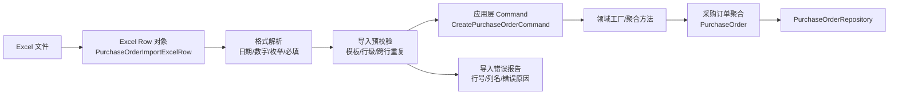

# 导入对象与领域对象边界

## 1. 结论

Excel 导入对象不是领域对象。

Excel 导入对象描述的是“外部文件长什么样、单元格里传了什么、哪一行出错”；领域对象描述的是“采购业务中真实存在什么、允许发生什么业务行为、必须满足什么业务规则”。

因此，新采购服务中应遵守一个核心原则：

```text
领域层不知道 Excel 的存在。
```

Excel、PDF、异步文件任务、行号、列名、单元格错误、模板版本，都属于导入导出上下文或应用层输入模型，不应进入 `purchaseorder`、`requisition` 等核心领域模型。

## 2. 对象分层

| 对象类型 | 推荐命名示例 | 所属层/上下文 | 主要职责 | 是否属于领域模型 |
|---|---|---|---|---|
| Excel 行对象 | `PurchaseOrderImportExcelRow` | 接口层 / 文件导入适配器 | 承接 Excel 列、行号、原始单元格值 | 否 |
| 导入命令对象 | `ImportPurchaseOrderCommand` / `CreatePurchaseOrderCommand` | 应用层 | 表达一次用例输入，组织后续校验和创建动作 | 否，偏用例模型 |
| 领域聚合 | `PurchaseOrder` / `PurchaseRequisition` | 领域层 | 维护业务状态、业务规则和生命周期 | 是 |
| 值对象 | `Money` / `Quantity` / `SupplierRef` / `Destination` | 领域层 | 表达不可变业务概念，保护局部规则 | 是 |
| 导入任务聚合 | `ImportBatch` / `ImportRecord` | 导入导出上下文 | 管理上传、解析、校验、确认、失败报告、重试 | 视业务需要，可作为独立领域模型 |

## 3. 转换流程



这个流程里，`PurchaseOrder` 不接收 Excel 行对象，也不暴露 Excel 错误信息。Excel 行对象必须先被转换成应用层命令，再由应用层调用领域工厂或聚合方法创建领域对象。

## 4. Excel 行对象应该表达什么

Excel 行对象应该尽量贴近模板，不急着承载业务规则。

示例字段：

```text
rowIndex
supplierCode
skuCode
purchaseQuantityText
purchasePriceText
arrivalWarehouseCode
expectedArrivalDateText
```

设计要点：

- 可以保留字符串原值，因为 Excel 单元格天然是不可信外部输入。
- 可以包含 `rowIndex`、`sheetName`、`templateVersion` 等文件处理信息。
- 可以使用注解绑定列名，例如 `@ExcelProperty`。
- 可以做轻量格式校验，例如必填、数字格式、日期格式。
- 不承载采购单状态流转、供应商确认、发货、入库、作废等领域行为。

不建议在 Excel 行对象中出现：

```text
submit()
approve()
cancel()
receive()
calculatePayableAmount()
```

这些是领域行为，应属于采购订单聚合、领域服务或应用服务编排。

## 5. 领域对象应该表达什么

领域对象不关心数据来自 Excel、页面、Feign、MQ 还是定时任务。它只关心业务事实是否成立。

以采购订单为例，领域对象应该表达：

```text
采购订单号
供应商
采购主体
采购明细
采购数量
采购金额
目的仓
预计到货日期
当前状态
```

领域对象应该保护规则：

```text
采购数量必须大于 0
供应商必须有效
SKU 必须可采购
采购单提交后不能随意修改核心明细
已入库采购单不能取消
审批通过后才能进入供应商发货确认
```

领域对象也应该提供业务行为：

```text
submit()
approve()
reject()
cancel()
confirmSupplierDelivery()
receiveAtTransitWarehouse()
receiveAtDestinationWarehouse()
completeInbound()
```

这些行为可以产生领域事件，例如：

```text
PurchaseOrderSubmitted
PurchaseOrderApproved
SupplierDeliveryConfirmed
DestinationInbounded
```

## 6. 导入任务什么时候可以成为领域模型

如果导入只是“读 Excel，然后创建采购单”，导入过程可以只是应用层用例，不需要建立独立领域聚合。

但如果导入本身存在明确业务生命周期，就应把它建模为独立上下文中的聚合。

典型生命周期：

```text
上传
解析中
校验完成
待人工确认
处理中
部分成功
全部成功
失败
撤销
```

这时可以设计：

```text
ImportBatch
ImportRecord
ImportError
ImportResult
```

但它们属于 `fileoperation` 或 `batchimport` 上下文，不应混入 `purchaseorder` 聚合。

## 7. 新采购服务建议落点

建议在 `scm-purchaseorder-next-service` 中这样放置：

```text
interfaces
└── file
    └── excel
        └── PurchaseOrderImportExcelRow

application
└── purchaseorder
    ├── ImportPurchaseOrderUseCase
    ├── CreatePurchaseOrderCommand
    └── ImportPurchaseOrderResult

domain
└── purchaseorder
    ├── PurchaseOrder
    ├── PurchaseSubOrder
    ├── PurchaseOrderLine
    ├── Quantity
    ├── Money
    └── PurchaseOrderRepository

domain
└── fileoperation
    ├── ImportBatch
    ├── ImportRecord
    └── ImportError
```

如果第一阶段不把导入任务作为强业务对象，可以暂时只保留：

```text
interfaces.file.excel
application.purchaseorder.importing
domain.purchaseorder
```

等后续出现“人工确认、失败重试、导入历史、部分成功补偿”等稳定业务诉求后，再提炼 `ImportBatch` 聚合。

## 8. 反模式

### 8.1 把 Excel 注解放进领域对象

不建议：

```text
PurchaseOrder 上出现 @ExcelProperty
PurchaseOrderLine 上出现 rowIndex
```

问题是领域模型会被文件模板污染。模板列名一改，领域对象也被迫变动。

### 8.2 Excel 行对象直接入库

不建议：

```text
ExcelRow -> DO -> DB
```

这会绕过领域规则，导致导入链路和页面/Feign/MQ 链路产生不同业务口径。

### 8.3 导入校验和领域规则重复两套

导入层可以做格式校验和友好错误提示，但关键业务规则必须由领域对象兜底。

推荐边界：

| 校验类型 | 应放位置 |
|---|---|
| 列是否存在 | Excel 解析层 |
| 单元格是否为空 | Excel 解析层 / 应用层 |
| 数字、日期格式是否正确 | Excel 解析层 |
| 供应商是否存在 | 应用层通过端口查询 |
| SKU 是否可采购 | 应用层通过端口查询，领域层兜底规则 |
| 采购数量是否大于 0 | 值对象 `Quantity` |
| 当前状态是否允许修改 | 采购订单聚合 |

## 9. 一句话原则

```text
导入对象负责翻译外部表格，领域对象负责保护业务世界。
```

Excel 对象是外部输入的影子；领域对象是系统真正承认的业务事实。
