# 采购项目单据流程图

本文以 `project` 中的领域模型和应用服务为准，说明采购业务单据、过程控制记录和查询投影之间的产生关系、状态变化及失败补偿。

采购路线不是独立单据，其值对象、计算矩阵和建单接入见
[采购路线实现](PROCUREMENT_ROUTE.md)。

## 1. 单据分类

| 分类 | 中文名称 | 代码模型 | 事实所有者 |
|---|---|---|---|
| 业务单据 | 采购需求单 | `ProcurementDemand` | 采购计划 |
| 业务单据 | 采购申请单 | `PurchaseRequisition` | 采购计划 |
| 控制记录 | 转单预占 | `TransferReservation` | 采购计划 |
| 业务单据 | 采购订单 | `PurchaseOrder` | 采购订单 |
| 业务单据 | 订单变更单 | `OrderChange` | 采购订单 |
| 业务单据 | 供应商履约单 | `SupplierFulfillmentOrder` | 供应商履约 |
| 业务单据 | 供应商发运单 | `SupplierShipment` | 供应商履约 |
| 业务单据 | 对样单 | `SampleMatchingCase` | 质量检验 |
| 业务单据 | 质量检验单 | `QualityInspectionOrder` | 质量检验 |
| 业务单据 | 采购结算单 | `ProcurementSettlement` | 采购结算 |
| 版本快照 | 结算版本 | `SettlementRevision` | 采购结算 |
| 控制记录 | 执行要求计划 | `ExecutionRequirementPlan` | 采购履约协同 |
| 控制记录 | 履约执行任务 | `ExecutionTask` | 采购履约协同 |
| 业务单据 | 履约异常单 | `ExecutionExceptionCase` | 采购履约协同 |
| 查询投影 | 订单旅程 | `OrderJourney` | 采购履约协同 |
| 查询投影 | 采购订单执行视图 | `PurchaseOrderExecutionView` | 采购查询 |

`TransferReservation` 不是采购订单，也不是安全凭证。它是跨事务保留 PR 可下单数量的业务令牌；后续通过 `reservationId` 确认或释放。

## 2. 端到端单据总流程

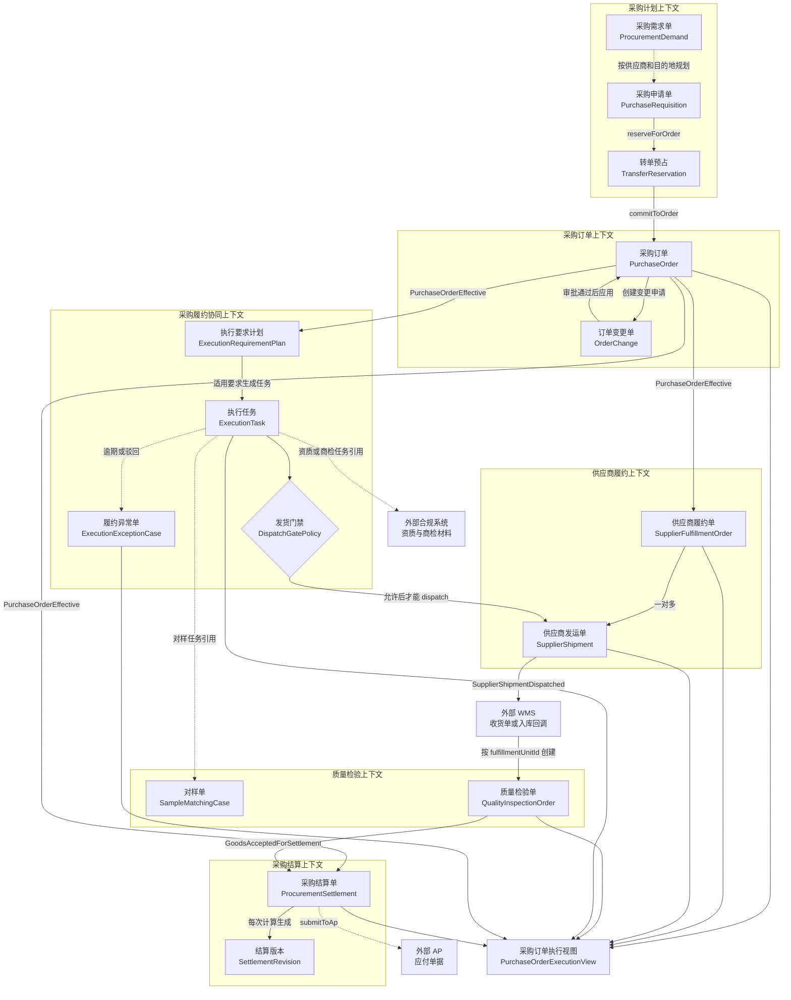
```mermaid
flowchart TD
  subgraph PLAN["采购计划上下文"]
    DEMAND["采购需求单<br/>ProcurementDemand"]
    PR["采购申请单<br/>PurchaseRequisition"]
    RESERVATION["转单预占<br/>TransferReservation"]
  end

  subgraph ORDER["采购订单上下文"]
    PO["采购订单<br/>PurchaseOrder"]
    CHANGE["订单变更单<br/>OrderChange"]
  end

  subgraph COLLAB["采购履约协同上下文"]
    REQUIREMENT_PLAN["执行要求计划<br/>ExecutionRequirementPlan"]
    TASK["执行任务<br/>ExecutionTask"]
    EXCEPTION["履约异常单<br/>ExecutionExceptionCase"]
    GATE{"发货门禁<br/>DispatchGatePolicy"}
  end

  subgraph SUPPLIER["供应商履约上下文"]
    FULFILLMENT["供应商履约单<br/>SupplierFulfillmentOrder"]
    SHIPMENT["供应商发运单<br/>SupplierShipment"]
  end

  subgraph QUALITY["质量检验上下文"]
    SAMPLE["对样单<br/>SampleMatchingCase"]
    INSPECTION["质量检验单<br/>QualityInspectionOrder"]
  end

  subgraph SETTLEMENT["采购结算上下文"]
    SETTLEMENT_ORDER["采购结算单<br/>ProcurementSettlement"]
    REVISION["结算版本<br/>SettlementRevision"]
  end

  WMS["外部 WMS<br/>收货单或入库回调"]
  COMPLIANCE["外部合规系统<br/>资质与商检材料"]
  AP["外部 AP<br/>应付单据"]
  VIEW["采购订单执行视图<br/>PurchaseOrderExecutionView"]

  DEMAND -.->|"按供应商和目的地规划"| PR
  PR -->|"reserveForOrder"| RESERVATION
  RESERVATION -->|"commitToOrder"| PO

  PO -->|"创建变更申请"| CHANGE
  CHANGE -->|"审批通过后应用"| PO

  PO -->|"PurchaseOrderEffective"| FULFILLMENT
  PO -->|"PurchaseOrderEffective"| REQUIREMENT_PLAN
  PO -->|"PurchaseOrderEffective"| SETTLEMENT_ORDER

  REQUIREMENT_PLAN -->|"适用要求生成任务"| TASK
  TASK -.->|"对样任务引用"| SAMPLE
  TASK -.->|"资质或商检任务引用"| COMPLIANCE
  TASK --> GATE
  TASK -.->|"逾期或驳回"| EXCEPTION

  FULFILLMENT -->|"一对多"| SHIPMENT
  GATE -->|"允许后才能 dispatch"| SHIPMENT
  SHIPMENT -->|"SupplierShipmentDispatched"| WMS
  WMS -->|"按 fulfillmentUnitId 创建"| INSPECTION

  INSPECTION -->|"GoodsAcceptedForSettlement"| SETTLEMENT_ORDER
  SETTLEMENT_ORDER -->|"每次计算生成"| REVISION
  SETTLEMENT_ORDER -.->|"submitToAp"| AP

  PO --> VIEW
  FULFILLMENT --> VIEW
  SHIPMENT --> VIEW
  INSPECTION --> VIEW
  SETTLEMENT_ORDER --> VIEW
  TASK --> VIEW
  EXCEPTION --> VIEW
```

图例：

- 实线表示当前代码已经存在领域操作或应用编排。
- 虚线表示领域模型已经表达，但应用服务、外部适配器或自动化编排尚未完整实现。
- 查询视图只消费事件，不反向修改业务单据。

## 3. 采购需求、采购申请与转单预占

### 3.1 PR 预占转 PO

项目当前采用两阶段数量转移：

```text
Try：available 转为 reserved
Confirm：reserved 转为 ordered
Cancel：reserved 重新转回 available
```

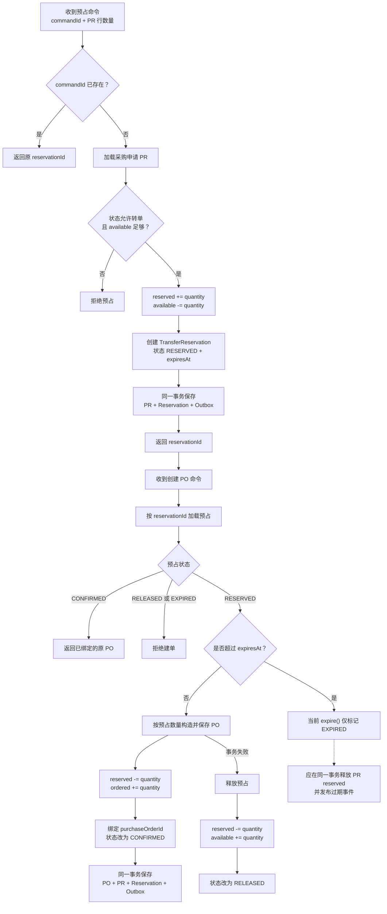
```mermaid
flowchart TD
  START["收到预占命令<br/>commandId + PR 行数量"] --> IDEMPOTENT{"commandId 已存在？"}
  IDEMPOTENT -->|"是"| OLD["返回原 reservationId"]
  IDEMPOTENT -->|"否"| LOAD_PR["加载采购申请 PR"]

  LOAD_PR --> CHECK{"状态允许转单<br/>且 available 足够？"}
  CHECK -->|"否"| REJECT["拒绝预占"]
  CHECK -->|"是"| RESERVE_QTY["reserved += quantity<br/>available -= quantity"]
  RESERVE_QTY --> CREATE_RESERVATION["创建 TransferReservation<br/>状态 RESERVED + expiresAt"]
  CREATE_RESERVATION --> SAVE_TRY["同一事务保存<br/>PR + Reservation + Outbox"]
  SAVE_TRY --> RETURN_TOKEN["返回 reservationId"]

  RETURN_TOKEN --> CREATE_PO["收到创建 PO 命令"]
  CREATE_PO --> LOAD_TOKEN["按 reservationId 加载预占"]
  LOAD_TOKEN --> TOKEN_STATUS{"预占状态"}

  TOKEN_STATUS -->|"CONFIRMED"| RETURN_PO["返回已绑定的原 PO"]
  TOKEN_STATUS -->|"RELEASED 或 EXPIRED"| INVALID["拒绝建单"]
  TOKEN_STATUS -->|"RESERVED"| EXPIRED{"是否超过 expiresAt？"}

  EXPIRED -->|"否"| BUILD_PO["按预占数量构造并保存 PO"]
  BUILD_PO --> COMMIT_QTY["reserved -= quantity<br/>ordered += quantity"]
  COMMIT_QTY --> CONFIRM_TOKEN["绑定 purchaseOrderId<br/>状态改为 CONFIRMED"]
  CONFIRM_TOKEN --> SAVE_CONFIRM["同一事务保存<br/>PO + PR + Reservation + Outbox"]

  BUILD_PO -->|"事务失败"| RELEASE["释放预占"]
  RELEASE --> RELEASE_QTY["reserved -= quantity<br/>available += quantity"]
  RELEASE_QTY --> RELEASE_TOKEN["状态改为 RELEASED"]

  EXPIRED -->|"是"| EXPIRE_NOW["当前 expire() 仅标记 EXPIRED"]
  EXPIRE_NOW -.-> SHOULD_COMPENSATE["应在同一事务释放 PR reserved<br/>并发布过期事件"]
```

PR 行数量账公式：

```text
availableToOrder = confirmed - reserved - ordered - cancelled
```

| 时点 | `confirmed` | `reserved` | `ordered` | `availableToOrder` |
|---|---:|---:|---:|---:|
| 供应商确认 100 | 100 | 0 | 0 | 100 |
| A 预占 60 | 100 | 60 | 0 | 40 |
| A 建单成功 | 100 | 0 | 60 | 40 |
| A 建单失败并释放 | 100 | 0 | 0 | 100 |

### 3.2 采购需求单状态

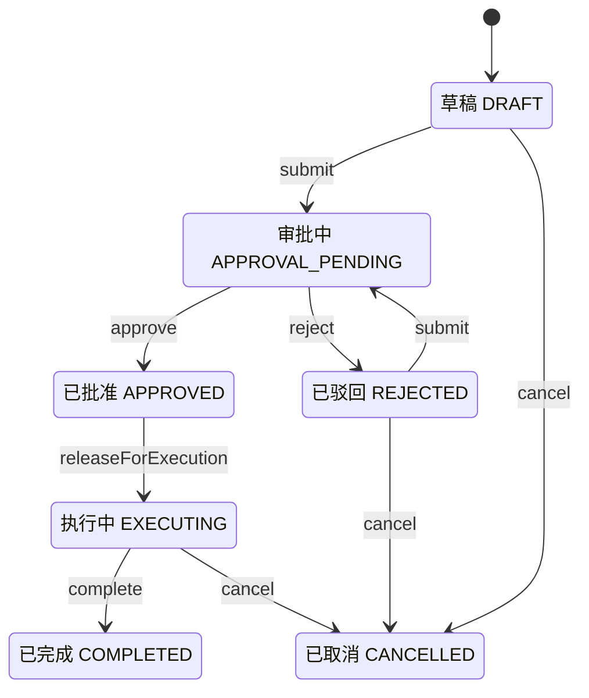
```mermaid
stateDiagram-v2
  state "草稿 DRAFT" as DRAFT
  state "审批中 APPROVAL_PENDING" as APPROVAL_PENDING
  state "已批准 APPROVED" as APPROVED
  state "已驳回 REJECTED" as REJECTED
  state "执行中 EXECUTING" as EXECUTING
  state "已完成 COMPLETED" as COMPLETED
  state "已取消 CANCELLED" as CANCELLED

  [*] --> DRAFT
  DRAFT --> APPROVAL_PENDING : submit
  REJECTED --> APPROVAL_PENDING : submit
  APPROVAL_PENDING --> APPROVED : approve
  APPROVAL_PENDING --> REJECTED : reject
  APPROVED --> EXECUTING : releaseForExecution
  EXECUTING --> COMPLETED : complete
  DRAFT --> CANCELLED : cancel
  REJECTED --> CANCELLED : cancel
  EXECUTING --> CANCELLED : cancel
```

### 3.3 采购申请单状态

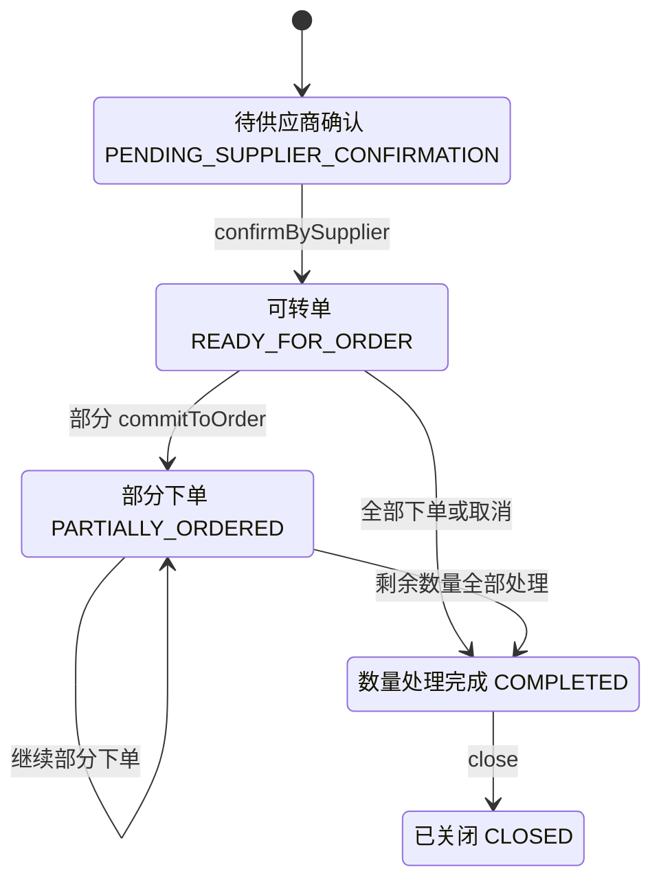
```mermaid
stateDiagram-v2
  state "待供应商确认 PENDING_SUPPLIER_CONFIRMATION" as PENDING
  state "可转单 READY_FOR_ORDER" as READY
  state "部分下单 PARTIALLY_ORDERED" as PARTIAL
  state "数量处理完成 COMPLETED" as COMPLETED
  state "已关闭 CLOSED" as CLOSED

  [*] --> PENDING
  PENDING --> READY : confirmBySupplier
  READY --> PARTIAL : 部分 commitToOrder
  READY --> COMPLETED : 全部下单或取消
  PARTIAL --> PARTIAL : 继续部分下单
  PARTIAL --> COMPLETED : 剩余数量全部处理
  COMPLETED --> CLOSED : close
```

创建和释放预占不会单独代表 PR 已下单。只有 `commitToOrder` 才增加 `ordered` 并重新计算 PR 状态。

### 3.4 转单预占状态

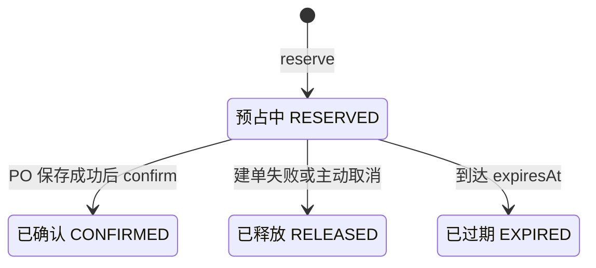
```mermaid
stateDiagram-v2
  state "预占中 RESERVED" as RESERVED
  state "已确认 CONFIRMED" as CONFIRMED
  state "已释放 RELEASED" as RELEASED
  state "已过期 EXPIRED" as EXPIRED

  [*] --> RESERVED : reserve
  RESERVED --> CONFIRMED : PO 保存成功后 confirm
  RESERVED --> RELEASED : 建单失败或主动取消
  RESERVED --> EXPIRED : 到达 expiresAt
```

`CONFIRMED`、`RELEASED` 和 `EXPIRED` 都是终态，同一个 `reservationId` 不能再次用于创建新的 PO。

## 4. 采购订单与订单变更

### 4.1 采购订单状态

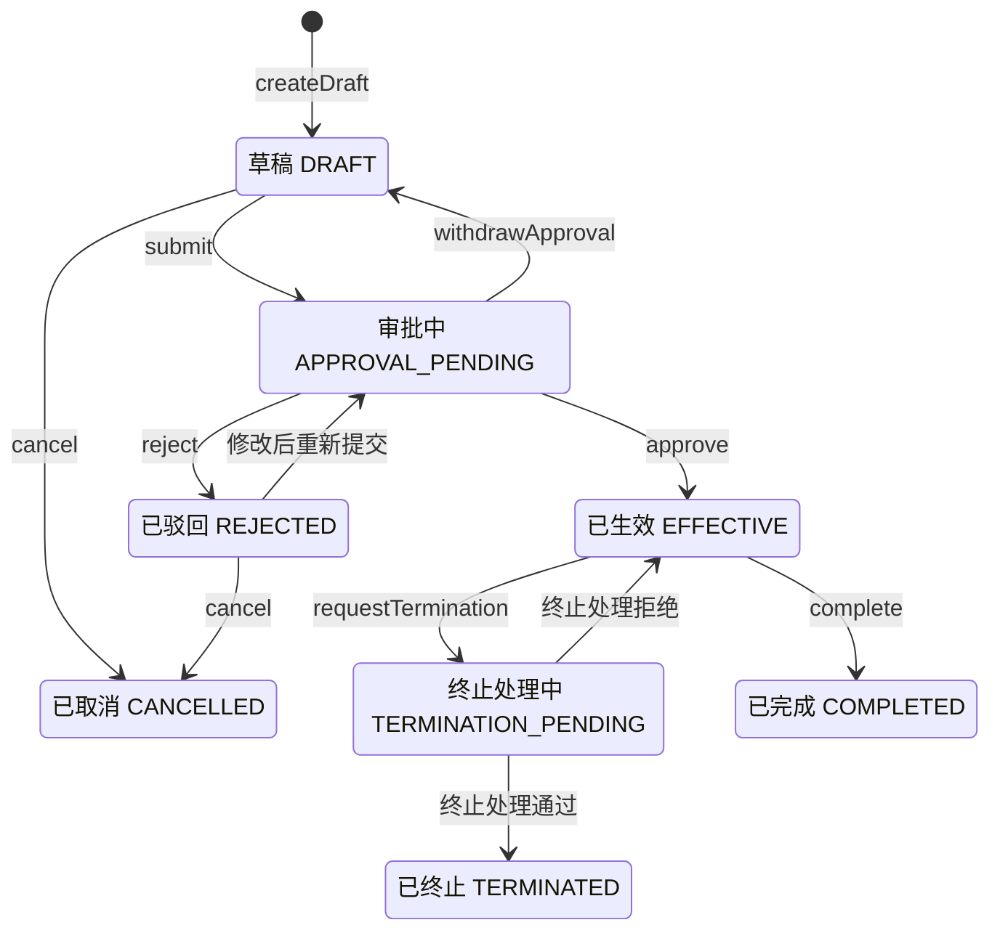
```mermaid
stateDiagram-v2
  state "草稿 DRAFT" as DRAFT
  state "审批中 APPROVAL_PENDING" as APPROVAL_PENDING
  state "已驳回 REJECTED" as REJECTED
  state "已生效 EFFECTIVE" as EFFECTIVE
  state "已取消 CANCELLED" as CANCELLED
  state "终止处理中 TERMINATION_PENDING" as TERMINATION_PENDING
  state "已终止 TERMINATED" as TERMINATED
  state "已完成 COMPLETED" as COMPLETED

  [*] --> DRAFT : createDraft
  DRAFT --> APPROVAL_PENDING : submit
  REJECTED --> APPROVAL_PENDING : 修改后重新提交
  APPROVAL_PENDING --> DRAFT : withdrawApproval
  APPROVAL_PENDING --> EFFECTIVE : approve
  APPROVAL_PENDING --> REJECTED : reject
  DRAFT --> CANCELLED : cancel
  REJECTED --> CANCELLED : cancel
  EFFECTIVE --> TERMINATION_PENDING : requestTermination
  TERMINATION_PENDING --> EFFECTIVE : 终止处理拒绝
  TERMINATION_PENDING --> TERMINATED : 终止处理通过
  EFFECTIVE --> COMPLETED : complete
```

`PurchaseOrder` 只表达商业承诺。发货、收货、质检、入库和结算状态分别属于其他上下文，不能回填成一个“大订单状态”。

### 4.2 订单变更单状态

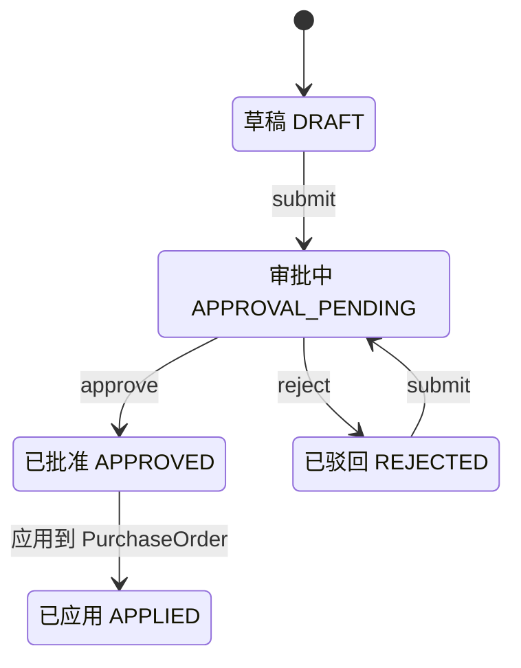
```mermaid
stateDiagram-v2
  state "草稿 DRAFT" as DRAFT
  state "审批中 APPROVAL_PENDING" as APPROVAL_PENDING
  state "已批准 APPROVED" as APPROVED
  state "已驳回 REJECTED" as REJECTED
  state "已应用 APPLIED" as APPLIED

  [*] --> DRAFT
  DRAFT --> APPROVAL_PENDING : submit
  REJECTED --> APPROVAL_PENDING : submit
  APPROVAL_PENDING --> APPROVED : approve
  APPROVAL_PENDING --> REJECTED : reject
  APPROVED --> APPLIED : 应用到 PurchaseOrder
```

当前变更类型包括：

- `DeliveryDateChange`：订单行预计到货日期变更。
- `PriceAdjustment`：订单行含税单价调整。
- `TerminationRequest`：生效订单终止申请。

变更单保留自己的审批状态和基准订单版本；审批结果不能绕过 `PurchaseOrder` 聚合直接修改订单表。

## 5. 供应商履约与发运

### 5.1 单据关系

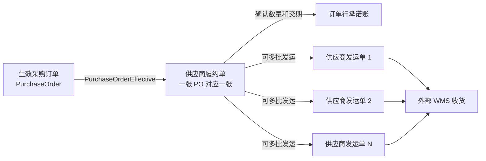
```mermaid
flowchart LR
  PO["生效采购订单<br/>PurchaseOrder"] -->|"PurchaseOrderEffective"| FULFILLMENT["供应商履约单<br/>一张 PO 对应一张"]
  FULFILLMENT -->|"确认数量和交期"| COMMITMENT["订单行承诺账"]
  FULFILLMENT -->|"可多批发运"| SHIPMENT_1["供应商发运单 1"]
  FULFILLMENT -->|"可多批发运"| SHIPMENT_2["供应商发运单 2"]
  FULFILLMENT -->|"可多批发运"| SHIPMENT_N["供应商发运单 N"]
  SHIPMENT_1 --> WMS["外部 WMS 收货"]
  SHIPMENT_2 --> WMS
  SHIPMENT_N --> WMS
```

供应商履约单拥有承诺数量、累计发运数量和取消数量；供应商发运单拥有单个实际批次的发运行与包装信息。

### 5.2 供应商履约单状态

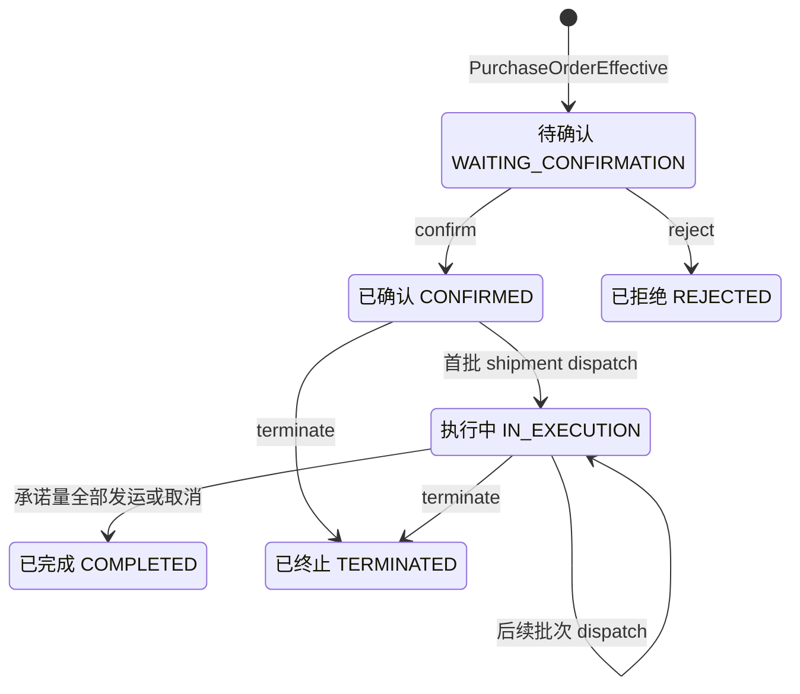
```mermaid
stateDiagram-v2
  state "待确认 WAITING_CONFIRMATION" as WAITING
  state "已确认 CONFIRMED" as CONFIRMED
  state "执行中 IN_EXECUTION" as IN_EXECUTION
  state "已完成 COMPLETED" as COMPLETED
  state "已拒绝 REJECTED" as REJECTED
  state "已终止 TERMINATED" as TERMINATED

  [*] --> WAITING : PurchaseOrderEffective
  WAITING --> CONFIRMED : confirm
  WAITING --> REJECTED : reject
  CONFIRMED --> IN_EXECUTION : 首批 shipment dispatch
  IN_EXECUTION --> IN_EXECUTION : 后续批次 dispatch
  IN_EXECUTION --> COMPLETED : 承诺量全部发运或取消
  CONFIRMED --> TERMINATED : terminate
  IN_EXECUTION --> TERMINATED : terminate
```

### 5.3 供应商发运单状态

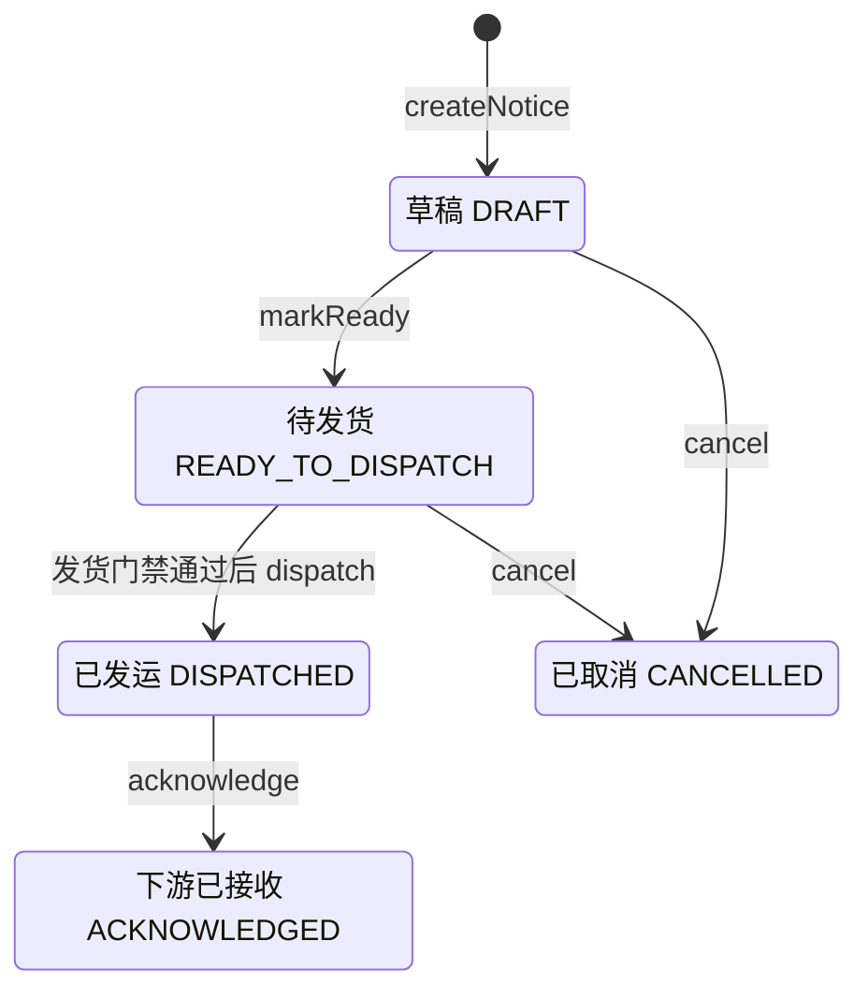
```mermaid
stateDiagram-v2
  state "草稿 DRAFT" as DRAFT
  state "待发货 READY_TO_DISPATCH" as READY
  state "已发运 DISPATCHED" as DISPATCHED
  state "下游已接收 ACKNOWLEDGED" as ACKNOWLEDGED
  state "已取消 CANCELLED" as CANCELLED

  [*] --> DRAFT : createNotice
  DRAFT --> READY : markReady
  READY --> DISPATCHED : 发货门禁通过后 dispatch
  DISPATCHED --> ACKNOWLEDGED : acknowledge
  DRAFT --> CANCELLED : cancel
  READY --> CANCELLED : cancel
```

`ACKNOWLEDGED` 只表示下游接受了发运信息，不等于仓库已经收货或完成入库。

## 6. 对样与质量检验

### 6.1 质量单据关系

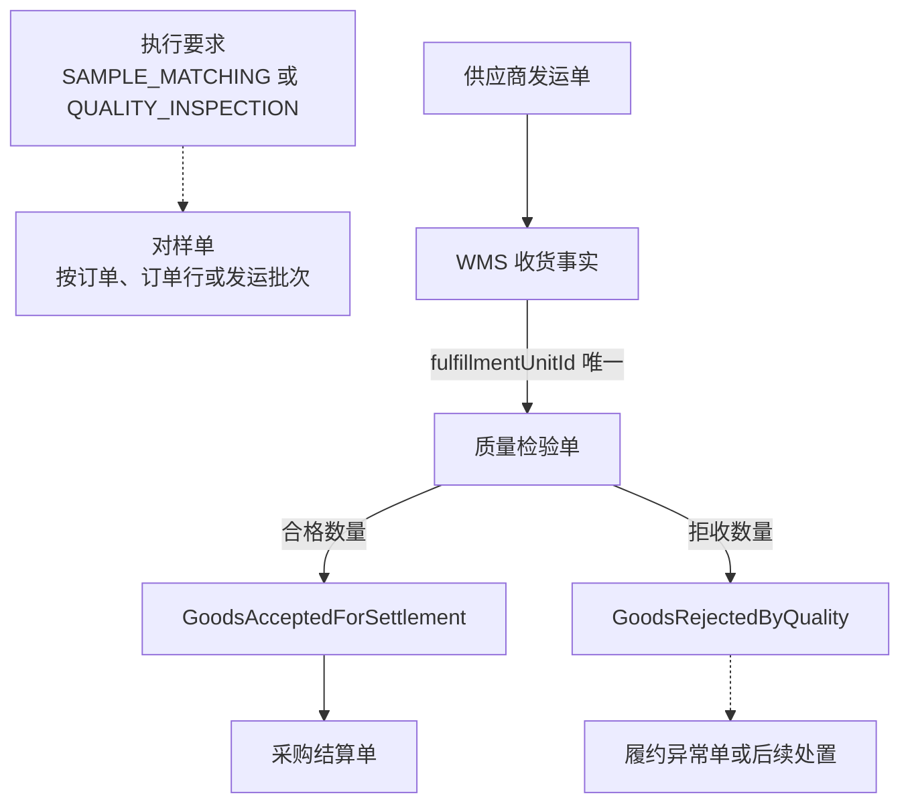
```mermaid
flowchart TD
  REQUIREMENT["执行要求<br/>SAMPLE_MATCHING 或 QUALITY_INSPECTION"] -.-> SAMPLE["对样单<br/>按订单、订单行或发运批次"]
  SHIPMENT["供应商发运单"] --> WMS["WMS 收货事实"]
  WMS -->|"fulfillmentUnitId 唯一"| INSPECTION["质量检验单"]
  INSPECTION -->|"合格数量"| ACCEPTED["GoodsAcceptedForSettlement"]
  INSPECTION -->|"拒收数量"| REJECTED["GoodsRejectedByQuality"]
  ACCEPTED --> SETTLEMENT["采购结算单"]
  REJECTED -.-> EXCEPTION["履约异常单或后续处置"]
```

对样和到货质检是两个独立聚合：

- 对样比较商品与样品基准，可以发生在下单、生产或发货前。
- 到货质检必须绑定实际收货批次 `fulfillmentUnitId`。

### 6.2 对样单状态

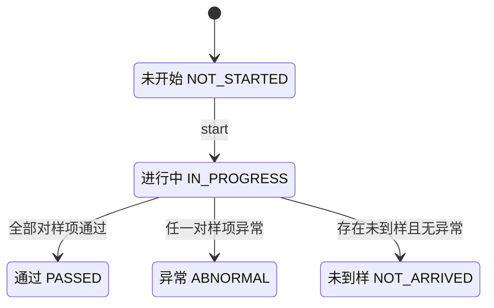
```mermaid
stateDiagram-v2
  state "未开始 NOT_STARTED" as NOT_STARTED
  state "进行中 IN_PROGRESS" as IN_PROGRESS
  state "通过 PASSED" as PASSED
  state "异常 ABNORMAL" as ABNORMAL
  state "未到样 NOT_ARRIVED" as NOT_ARRIVED

  [*] --> NOT_STARTED
  NOT_STARTED --> IN_PROGRESS : start
  IN_PROGRESS --> PASSED : 全部对样项通过
  IN_PROGRESS --> ABNORMAL : 任一对样项异常
  IN_PROGRESS --> NOT_ARRIVED : 存在未到样且无异常
```

### 6.3 质量检验单状态

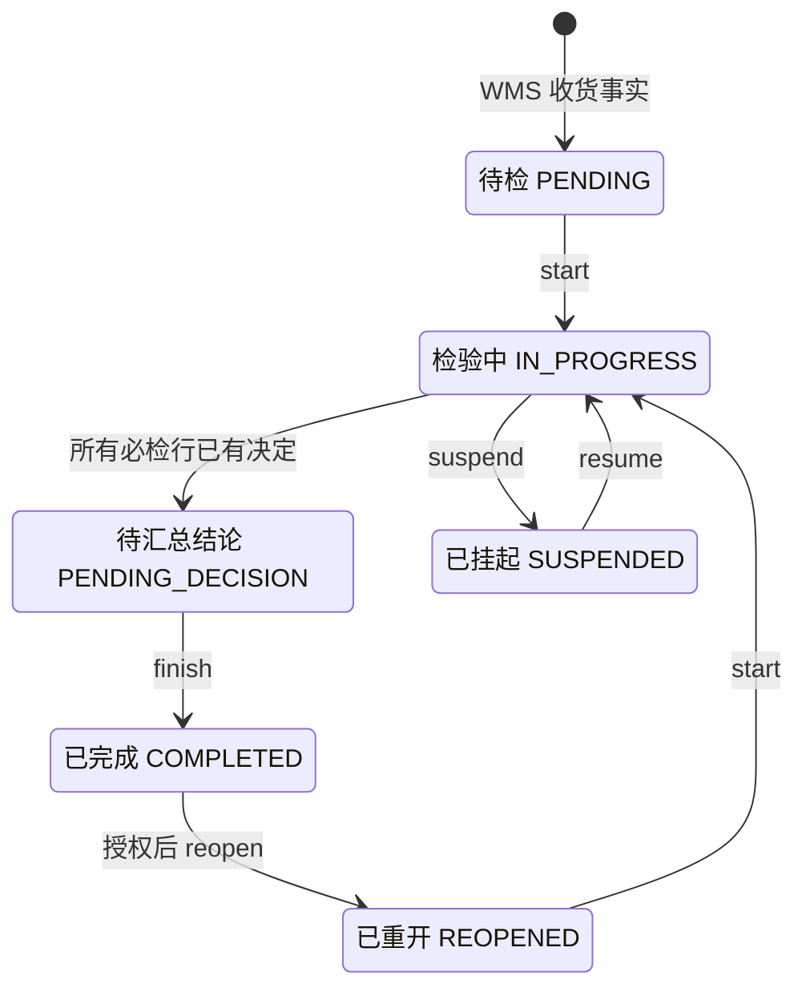
```mermaid
stateDiagram-v2
  state "待检 PENDING" as PENDING
  state "检验中 IN_PROGRESS" as IN_PROGRESS
  state "待汇总结论 PENDING_DECISION" as PENDING_DECISION
  state "已挂起 SUSPENDED" as SUSPENDED
  state "已完成 COMPLETED" as COMPLETED
  state "已重开 REOPENED" as REOPENED

  [*] --> PENDING : WMS 收货事实
  PENDING --> IN_PROGRESS : start
  IN_PROGRESS --> SUSPENDED : suspend
  SUSPENDED --> IN_PROGRESS : resume
  IN_PROGRESS --> PENDING_DECISION : 所有必检行已有决定
  PENDING_DECISION --> COMPLETED : finish
  COMPLETED --> REOPENED : 授权后 reopen
  REOPENED --> IN_PROGRESS : start
```

每次重开前，原行级决定进入 `LineDecisionVersion` 历史，不能原地覆盖并丢失审计依据。

## 7. 采购结算与 AP

### 7.1 结算依据和版本

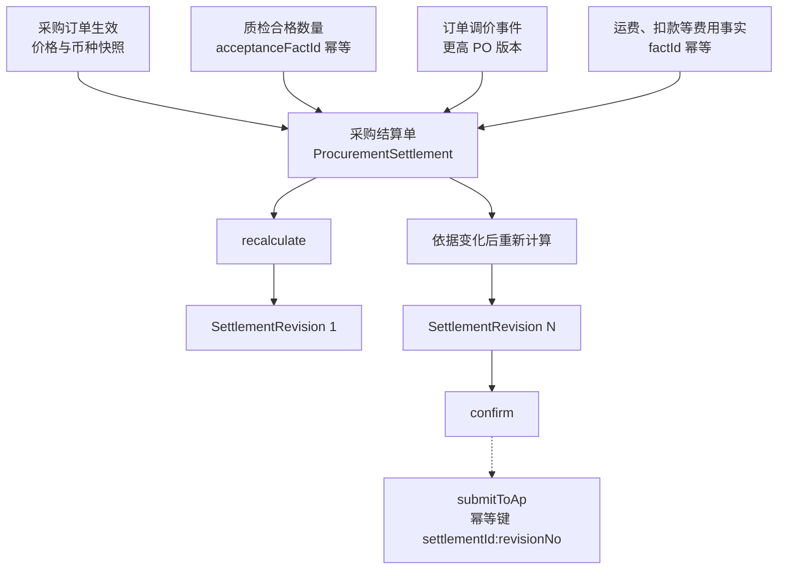
```mermaid
flowchart TD
  PO["采购订单生效<br/>价格与币种快照"] --> SETTLEMENT["采购结算单<br/>ProcurementSettlement"]
  QUALITY["质检合格数量<br/>acceptanceFactId 幂等"] --> SETTLEMENT
  PRICE["订单调价事件<br/>更高 PO 版本"] --> SETTLEMENT
  FEE["运费、扣款等费用事实<br/>factId 幂等"] --> SETTLEMENT

  SETTLEMENT --> CALCULATE["recalculate"]
  CALCULATE --> REVISION_1["SettlementRevision 1"]
  SETTLEMENT --> RECALCULATE["依据变化后重新计算"]
  RECALCULATE --> REVISION_N["SettlementRevision N"]

  REVISION_N --> CONFIRM["confirm"]
  CONFIRM -.-> AP["submitToAp<br/>幂等键 settlementId:revisionNo"]
```

`SettlementRevision` 是不可变计算结果。新验收、调价或费用事实到达时生成更高版本，历史版本由仓储保存。

### 7.2 采购结算单状态

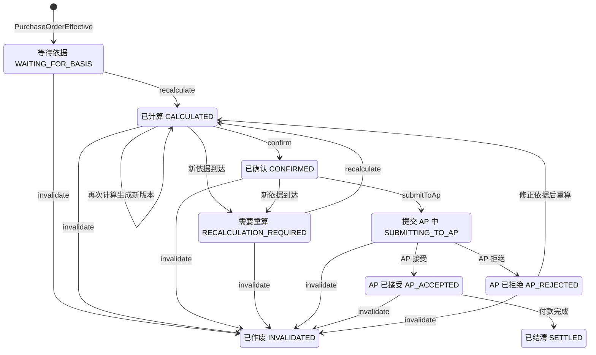
```mermaid
stateDiagram-v2
  state "等待依据 WAITING_FOR_BASIS" as WAITING
  state "已计算 CALCULATED" as CALCULATED
  state "已确认 CONFIRMED" as CONFIRMED
  state "提交 AP 中 SUBMITTING_TO_AP" as SUBMITTING
  state "AP 已接受 AP_ACCEPTED" as AP_ACCEPTED
  state "需要重算 RECALCULATION_REQUIRED" as RECALCULATION_REQUIRED
  state "AP 已拒绝 AP_REJECTED" as AP_REJECTED
  state "已结清 SETTLED" as SETTLED
  state "已作废 INVALIDATED" as INVALIDATED

  [*] --> WAITING : PurchaseOrderEffective
  WAITING --> CALCULATED : recalculate
  CALCULATED --> CALCULATED : 再次计算生成新版本
  CALCULATED --> CONFIRMED : confirm
  CONFIRMED --> SUBMITTING : submitToAp
  SUBMITTING --> AP_ACCEPTED : AP 接受
  SUBMITTING --> AP_REJECTED : AP 拒绝
  AP_REJECTED --> CALCULATED : 修正依据后重算
  AP_ACCEPTED --> SETTLED : 付款完成
  CALCULATED --> RECALCULATION_REQUIRED : 新依据到达
  CONFIRMED --> RECALCULATION_REQUIRED : 新依据到达
  RECALCULATION_REQUIRED --> CALCULATED : recalculate
  WAITING --> INVALIDATED : invalidate
  CALCULATED --> INVALIDATED : invalidate
  CONFIRMED --> INVALIDATED : invalidate
  RECALCULATION_REQUIRED --> INVALIDATED : invalidate
  SUBMITTING --> INVALIDATED : invalidate
  AP_ACCEPTED --> INVALIDATED : invalidate
  AP_REJECTED --> INVALIDATED : invalidate
```

当前代码需要补充终态保护：`applyAcceptedQuantity`、`applyPriceAdjustment` 和 `applyFeeFact`
应拒绝修改 `SETTLED`、`INVALIDATED`。`SUBMITTING_TO_AP`、`AP_ACCEPTED` 当前也可以直接作废，
生产规则需要明确撤回 AP、冲销或禁止作废的处理方式。

## 8. 履约要求、任务与异常

### 8.1 协同单据关系

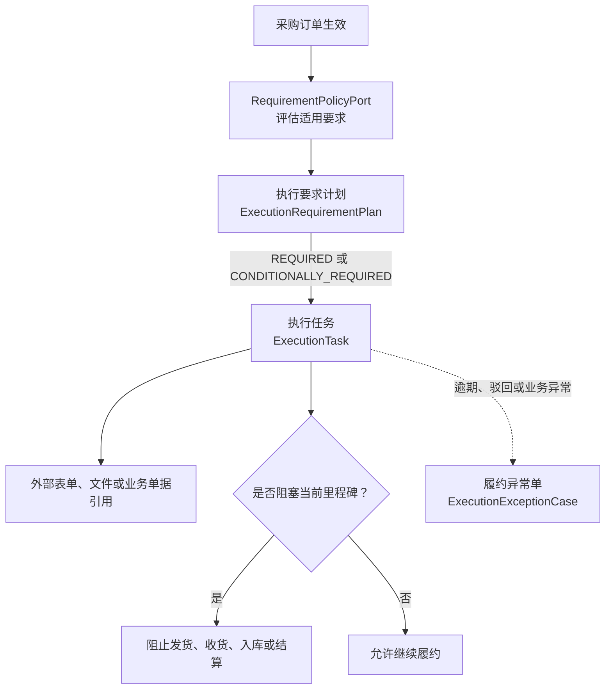
```mermaid
flowchart TD
  PO["采购订单生效"] --> POLICY["RequirementPolicyPort<br/>评估适用要求"]
  POLICY --> PLAN["执行要求计划<br/>ExecutionRequirementPlan"]
  PLAN -->|"REQUIRED 或 CONDITIONALLY_REQUIRED"| TASK["执行任务<br/>ExecutionTask"]
  TASK --> OUTPUT["外部表单、文件或业务单据引用"]
  TASK --> GATE{"是否阻塞当前里程碑？"}
  GATE -->|"是"| BLOCK["阻止发货、收货、入库或结算"]
  GATE -->|"否"| PASS["允许继续履约"]
  TASK -.->|"逾期、驳回或业务异常"| EXCEPTION["履约异常单<br/>ExecutionExceptionCase"]
```

执行任务只保存外部业务引用和证据引用，不复制约仓单、资质材料、质检单等其他上下文的完整模型。

### 8.2 执行要求计划状态

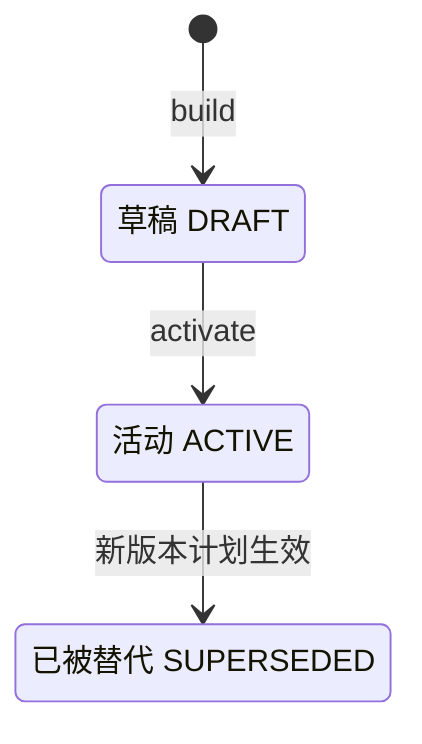
```mermaid
stateDiagram-v2
  state "草稿 DRAFT" as DRAFT
  state "活动 ACTIVE" as ACTIVE
  state "已被替代 SUPERSEDED" as SUPERSEDED

  [*] --> DRAFT : build
  DRAFT --> ACTIVE : activate
  ACTIVE --> SUPERSEDED : 新版本计划生效
```

### 8.3 执行任务状态

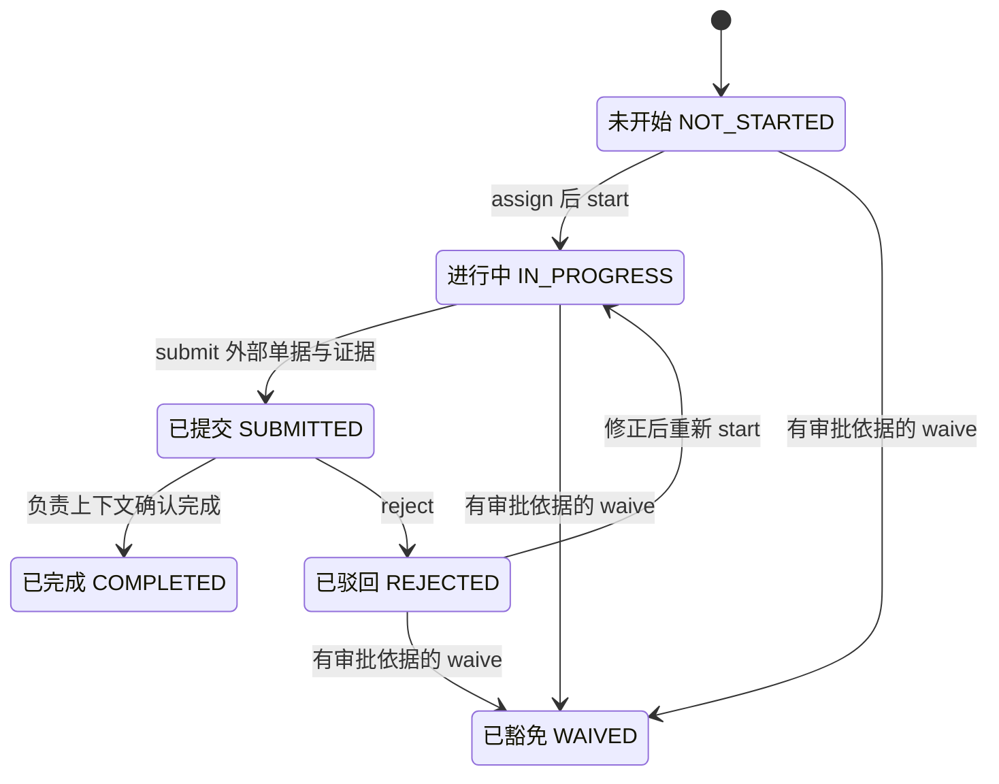
```mermaid
stateDiagram-v2
  state "未开始 NOT_STARTED" as NOT_STARTED
  state "进行中 IN_PROGRESS" as IN_PROGRESS
  state "已提交 SUBMITTED" as SUBMITTED
  state "已完成 COMPLETED" as COMPLETED
  state "已驳回 REJECTED" as REJECTED
  state "已豁免 WAIVED" as WAIVED

  [*] --> NOT_STARTED
  NOT_STARTED --> IN_PROGRESS : assign 后 start
  REJECTED --> IN_PROGRESS : 修正后重新 start
  IN_PROGRESS --> SUBMITTED : submit 外部单据与证据
  SUBMITTED --> COMPLETED : 负责上下文确认完成
  SUBMITTED --> REJECTED : reject
  NOT_STARTED --> WAIVED : 有审批依据的 waive
  IN_PROGRESS --> WAIVED : 有审批依据的 waive
  REJECTED --> WAIVED : 有审批依据的 waive
```

### 8.4 履约异常单状态

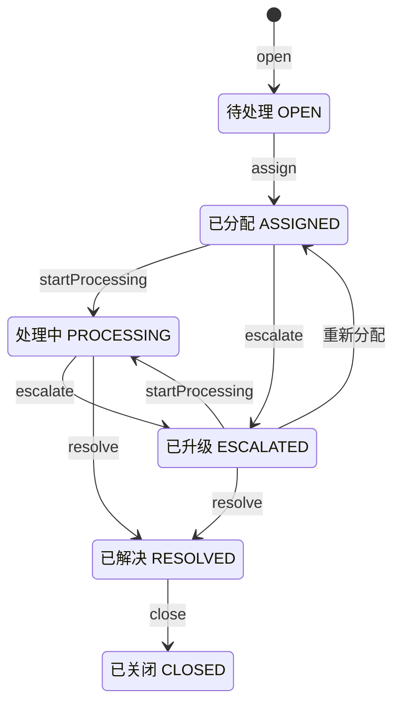
```mermaid
stateDiagram-v2
  state "待处理 OPEN" as OPEN
  state "已分配 ASSIGNED" as ASSIGNED
  state "处理中 PROCESSING" as PROCESSING
  state "已升级 ESCALATED" as ESCALATED
  state "已解决 RESOLVED" as RESOLVED
  state "已关闭 CLOSED" as CLOSED

  [*] --> OPEN : open
  OPEN --> ASSIGNED : assign
  ESCALATED --> ASSIGNED : 重新分配
  ASSIGNED --> PROCESSING : startProcessing
  ESCALATED --> PROCESSING : startProcessing
  ASSIGNED --> ESCALATED : escalate
  PROCESSING --> ESCALATED : escalate
  PROCESSING --> RESOLVED : resolve
  ESCALATED --> RESOLVED : resolve
  RESOLVED --> CLOSED : close
```

## 9. 查询投影流程

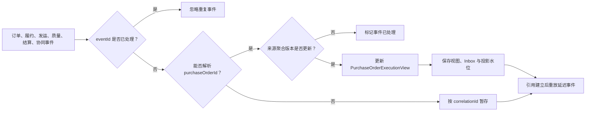
```mermaid
flowchart LR
  EVENTS["订单、履约、发运、质量、结算、协同事件"] --> INBOX{"eventId 是否已处理？"}
  INBOX -->|"是"| IGNORE["忽略重复事件"]
  INBOX -->|"否"| REFERENCE{"能否解析 purchaseOrderId？"}
  REFERENCE -->|"否"| DEFER["按 correlationId 暂存"]
  REFERENCE -->|"是"| VERSION{"来源聚合版本是否更新？"}
  VERSION -->|"否"| MARK["标记事件已处理"]
  VERSION -->|"是"| APPLY["更新 PurchaseOrderExecutionView"]
  APPLY --> SAVE["保存视图、Inbox 与投影水位"]
  SAVE --> REPLAY["引用建立后重放延迟事件"]
  DEFER --> REPLAY
```

查询投影不参与业务事务，也不作为其他聚合的业务判断依据。需要强一致判断时，应读取拥有该事实的领域聚合。

## 10. 关键基数

| 来源单据 | 目标单据 | 基数与约束 |
|---|---|---|
| 采购需求单 | 采购申请单 | 一个需求可被规划为多张申请；申请行保留来源需求行 |
| 采购申请单 | 转单预占 | 一张申请可产生多个预占，但同一数量不能被重复预占 |
| 转单预占 | 采购订单 | 一个预占最多确认到一张 PO |
| 采购申请单 | 采购订单 | 一张申请可分批形成多张 PO |
| 采购订单 | 订单变更单 | 一张 PO 可以有多张类型明确的变更单 |
| 采购订单 | 供应商履约单 | 一张生效 PO 对应一张供应商履约单 |
| 供应商履约单 | 供应商发运单 | 一张履约单可以有多个发运批次 |
| 履约单元 | 质量检验单 | 当前仓储按 `fulfillmentUnitId` 保证唯一 |
| 采购订单 | 采购结算单 | 一张 PO 对应一张结算聚合 |
| 采购结算单 | 结算版本 | 一张结算单包含多个不可变历史版本 |
| 采购订单版本 | 执行要求计划 | 每个订单版本应只有一个活动计划 |
| 执行要求计划 | 执行任务 | 每项适用要求生成一个活动任务 |
| 采购订单 | 采购订单执行视图 | 一张 PO 对应一个反规范化详情视图 |

## 11. 当前实现边界

| 项目 | 当前状态 | 生产落地动作 |
|---|---|---|
| PR 预占与 PO 建单 | 已有领域逻辑和应用编排 | 增加真实事务、PR 乐观锁和 `command_id` 唯一索引 |
| 预占过期 | 仅有 `expire()` 状态变化 | 同事务释放 PR `reserved`，保存预占并发布过期事件 |
| 采购需求生成采购申请 | 领域模型存在 | 补充应用服务、拆分策略和来源追踪 |
| 对样、资质和商检任务 | 要求与任务模型存在 | 补充对应上下文适配器及任务完成回调 |
| AP 提交与回调 | 结算领域方法存在 | 补充 AP 端口、Outbox 消费与 Inbox 幂等 |
| 履约异常自动开单 | 异常聚合存在 | 补充逾期扫描和事件策略 |
| 查询投影 | 已有内存演示实现 | 替换为查询库事务、检查点、重放和监控 |
