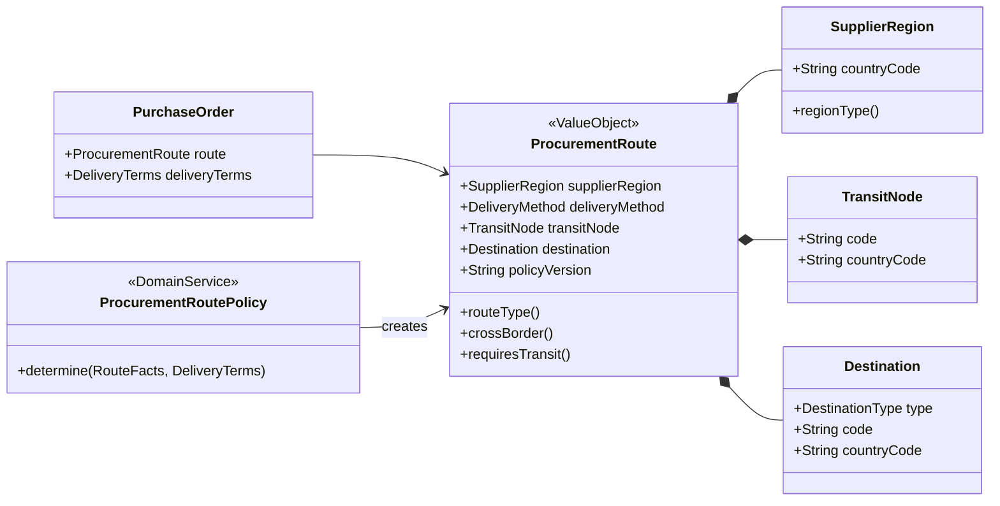
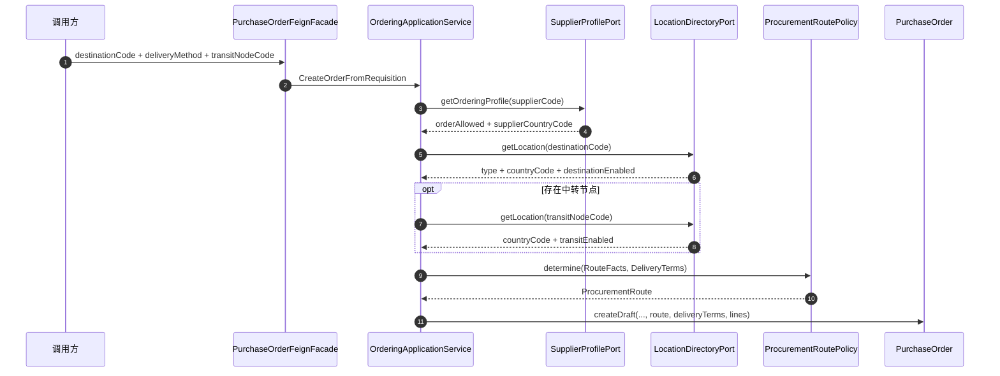

# 采购路线实现

本文说明采购路线（Procurement Route）在伪代码工程中的模型、计算规则和建单接入方式。

采购路线不是单据，也不是由接口选择的订单类型。它是创建采购订单时，根据可信地点事实计算并固化在订单中的不可变值对象。

## 1. 概念

| 中文概念 | 英文概念 | 代码 | 含义 |
|---|---|---|---|
| 供应商地区 | Supplier Region | `SupplierRegion` | 供应商税源地或实际发货主体所在国家/地区 |
| 交付方式 | Delivery Method | `DeliveryMethod` | 供应商直送或集货中转 |
| 中转节点 | Transit Node | `TransitNode` | 集货仓或中转仓；直送路线为空 |
| 最终目的地 | Destination | `Destination` | 仓库、门店或客户地址及其国家/地区 |
| 路线类型 | Route Type | `RouteType` | 国内/跨境与直送/中转的组合结论 |
| 路线策略版本 | Route Policy Version | `policyVersion` | 解释历史订单为何得到该路线 |
| 交付条款 | Delivery Terms | `DeliveryTerms` | Incoterm、运输责任和是否允许超交 |

本实现不保留旧 PO 类型，也不进行旧类型编号映射。

## 2. 领域模型



`PurchaseOrder` 不再单独保存一份可能与路线冲突的目的地。`purchaseOrder.destination()` 直接返回 `route.destination()`。

## 3. 路线计算矩阵

路线类型由两个独立判断组成：

1. `supplierCountryCode == destinationCountryCode`：国内，否则跨境。
2. `deliveryMethod == COLLECTION_AND_TRANSFER`：中转，否则直送。

| 供应商与目的地 | 交付方式 | 中转节点 | 计算结果 |
|---|---|---|---|
| 同一国家/地区 | `SUPPLIER_DIRECT` | 必须为空 | `DOMESTIC_DIRECT` |
| 同一国家/地区 | `COLLECTION_AND_TRANSFER` | 必须存在 | `DOMESTIC_TRANSIT` |
| 不同国家/地区 | `SUPPLIER_DIRECT` | 必须为空 | `CROSS_BORDER_DIRECT` |
| 不同国家/地区 | `COLLECTION_AND_TRANSFER` | 必须存在 | `CROSS_BORDER_TRANSIT` |

示例：

```text
中国供应商 CN -> 上海仓 CN，供应商直送
= DOMESTIC_DIRECT

中国供应商 CN -> 深圳中转仓 CN -> 雅加达仓 ID，集货中转
= CROSS_BORDER_TRANSIT
```

## 4. 建单时如何得到路线

接口不接收 `routeType`。调用方只能提交最终目的地编码、交付方式和可选中转节点编码。



这里有三层职责：

| 层次 | 职责 |
|---|---|
| 接口层 | 把外部字符串转换为 `DeliveryMethod`，不计算路线 |
| 应用层 | 查询供应商和地点目录，组装可信 `RouteFacts` |
| 领域层 | 校验不变量并计算 `RouteType` |

## 5. 拒绝规则

当前伪代码实现以下失败规则：

- 供应商档案不存在、与 PR 供应商不一致或不允许下单。
- 最终地点不存在或不能作为采购目的地。
- 中转地点不存在或不能作为中转节点。
- `SUPPLIER_DIRECT` 却携带中转节点。
- `COLLECTION_AND_TRANSFER` 却没有中转节点。
- 中转节点与最终目的地相同。
- 路线计算缺少供应商或目的地国家/地区。
- DDP 条款却声明供应商不安排运输。

这些规则分别位于应用服务和领域模型中：外部数据可用性由应用层判断，路线内部一致性由领域层保护。

## 6. 生效事件

订单审批通过后，`PurchaseOrderEffective` 发布 `ProcurementRouteSnapshot`，包含：

- 路线类型、交付方式和策略版本。
- 供应商国家/地区及业务分组。
- 最终目的地类型、编码和国家/地区。
- 可选中转节点编码和国家/地区。

下游履约要求策略可以使用该快照判断是否需要装柜、商检、资质或预约任务，但这些任务不属于 `PurchaseOrder` 聚合。

## 7. 代码导航

| 代码 | 作用 |
|---|---|
| `domain.ordering.model.ProcurementRoute` | 路线值对象及四类路线计算 |
| `domain.ordering.model.ProcurementRoutePolicy` | 路线事实和交付条款校验 |
| `domain.shared.model.Destination` | 仓、店、客户目的地值对象 |
| `application.purchaseorder.port.SupplierProfilePort` | 获取供应商所在地和准入状态 |
| `application.purchaseorder.port.LocationDirectoryPort` | 获取目的地和中转节点事实 |
| `application.ordering.OrderingApplicationService` | 建单时查询端口并调用路线策略 |
| `domain.ordering.event.OrderingEvents.ProcurementRouteSnapshot` | PO 生效后发布的路线快照 |
| `scenario.ProcurementRoutePolicyScenario` | 四种路线及非法组合的可执行测试 |

## 8. 当前边界

- 路线在订单创建时固化，草稿修改路线的独立用例尚未实现。
- 路线策略当前使用国家/地区是否相同判断跨境，关税区、自由贸易区等特殊规则应通过后续策略版本扩展。
- 地点和供应商端口当前是伪代码接口，生产实现需要接入主数据服务并保存调用快照。
- 路线变更若影响已生成的履约要求，应发布新订单版本并重新生成要求计划，不能直接覆盖历史计划。
