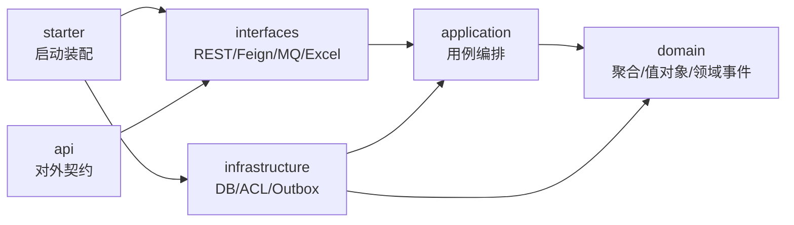

# 项目结构说明

## 1. 总体结构

```text
scm-purchaseorder-next-service
├── purchaseorder-next-api
├── purchaseorder-next-application
├── purchaseorder-next-domain
├── purchaseorder-next-infrastructure
├── purchaseorder-next-interfaces
├── purchaseorder-next-starter
└── purchaseorder-next-test
```

## 2. 依赖方向



约束：

- `domain` 不依赖 Spring、MyBatis、Feign、Excel、数据库 DO。
- `application` 只编排用例，不承载复杂业务规则。
- `infrastructure` 实现端口，负责外部系统和持久化细节。
- `interfaces` 负责协议转换，把外部 DTO 转成应用层 Command。
- Excel 导入对象只留在 `interfaces.file.excel` 或应用层导入命令中，不进入领域聚合。

## 3. 包结构

```text
com.bo.rt.biz.scm.purchaseorder.next
├── api
│   └── dto
├── application
│   └── purchaseorder
│       ├── command
│       ├── port
│       ├── result
│       └── service
├── domain
│   ├── purchaseorder
│   │   ├── event
│   │   ├── model
│   │   └── repository
│   ├── requisition
│   │   ├── model
│   │   └── repository
│   └── shared
│       ├── event
│       └── model
├── infrastructure
│   ├── acl
│   │   ├── goods
│   │   ├── supplier
│   │   └── warehouse
│   ├── event
│   └── persistence
│       └── purchaseorder
├── interfaces
│   ├── feign
│   ├── file.excel
│   ├── mq
│   └── rest
└── starter
```

## 4. 第一阶段建议只实现的主链路

```text
创建采购订单草稿
→ 提交采购订单
→ 审批回调
→ 供应商确认发货
→ 中转仓/目的仓收货
→ 入库完成
→ 作废/关闭
```

第一阶段不建议把报表、PDF、复杂导入导出、历史补偿全部塞进核心模型。它们可以先作为接口适配器或应用服务用例存在，稳定后再提炼独立上下文。
