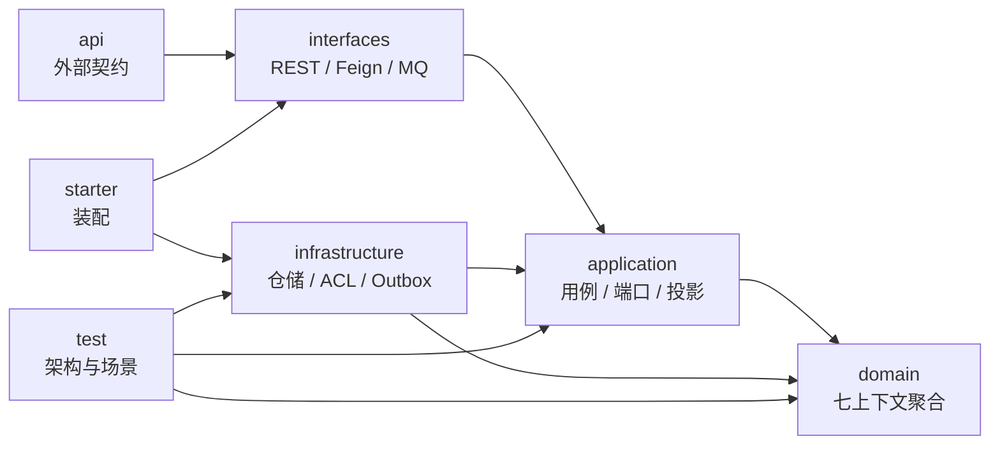
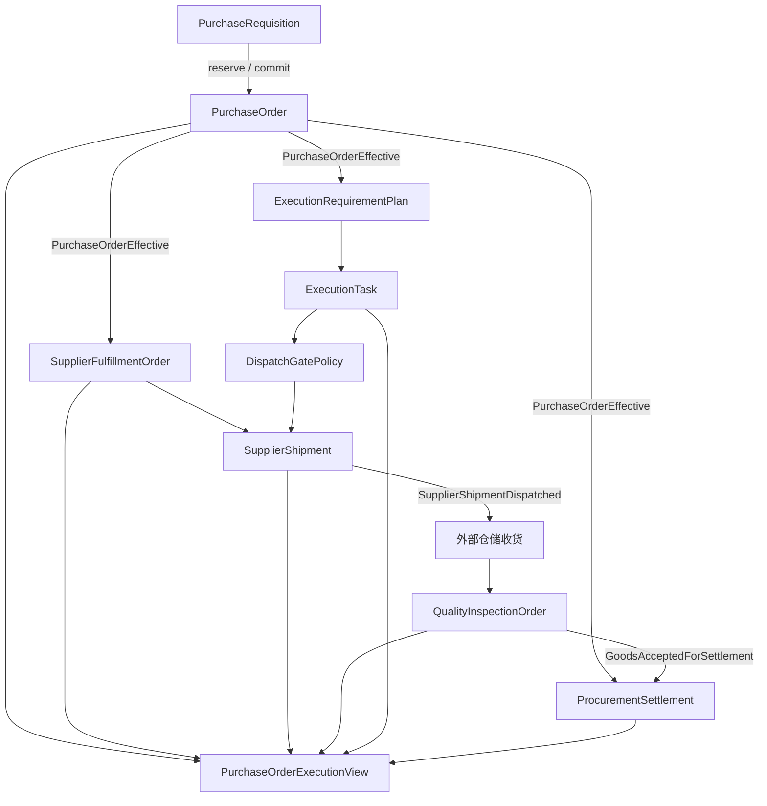

# 项目结构说明

## 1. 两种边界

本工程同时存在两种正交边界：

1. Maven 模块：约束六边形架构依赖方向。
2. Java 业务包：表达七个 DDD 限界上下文及其语言。

不能把“限界上下文”机械等同于“微服务”。当前物理部署是一个新采购订单服务、一个数据库实例中的分域表和可靠事件通道；未来只有在团队、容量或发布节奏确实需要时才拆服务。

## 2. 模块依赖



约束：

- `domain` 只依赖 JDK 与共享内核，不依赖 Spring、数据库对象或外部 DTO。
- `application` 编排事务、仓储、外部端口和事件，不复制聚合不变量。
- `interfaces` 只完成协议反序列化、幂等入口和命令转换。
- `infrastructure` 实现仓储、查询库、外部防腐层与可靠事件端口。
- 跨上下文只传 ID、快照或集成事件，不直接引用对方聚合。

## 3. 业务包

```text
domain
├── planning
│   ├── model
│   ├── event
│   └── repository
├── ordering
├── supplierfulfillment
├── qualityinspection
├── settlement
├── fulfillmentcollaboration
└── shared

application
├── planning
├── ordering
├── supplierfulfillment
├── qualityinspection
├── settlement
├── fulfillmentcollaboration
├── integration
├── query
└── shared.port
```

采购查询没有业务聚合，因此主要位于 `application.query` 与 `infrastructure.query`。

## 4. 事务边界

| 用例 | 同一事务内修改 |
|---|---|
| PR 数量预占 | `PurchaseRequisition` + `TransferReservation` + Outbox |
| 从预占创建 PO | `PurchaseOrder` + `PurchaseRequisition` + `TransferReservation` + Outbox |
| 发运 | `SupplierShipment` + `SupplierFulfillmentOrder` + Outbox |
| 质检完成 | `QualityInspectionOrder` + Outbox |
| 结算重算/确认 | `ProcurementSettlement` 当前版本 + 历史版本记录 + Outbox |
| 查询投影 | Query Inbox + View + Checkpoint |

跨上下文不做分布式事务。`PurchaseOrderEffective`、`GoodsAcceptedForSettlement` 等事件通过 Outbox/Inbox 最终一致地驱动下游。

## 5. 主事件流



单据之间的产生关系、PR 预占转 PO、各聚合状态机和失败补偿见
[采购项目单据流程图](DOCUMENT_FLOWS.md)。

供应商地区、交付方式、中转节点和目的地如何计算为订单路线，见
[采购路线实现](PROCUREMENT_ROUTE.md)。

## 6. 事实所有权

| 事实 | 唯一写入方 |
|---|---|
| PR 可下单数量 | 采购计划 |
| PO 商业状态、价格、交期 | 采购订单 |
| 供应商承诺与原始发运数量 | 供应商履约 |
| 对样、检验、接收与拒收结论 | 质量检验 |
| 当前结算版本与 AP 提交状态 | 采购结算 |
| 要求判断、任务、异常和发货门禁 | 采购履约协同 |
| 跨上下文页面视图 | 采购查询 |
| 仓库收货、入库原始事实 | 外部仓储上下文 |
| 物流节点原始事实 | 外部物流上下文 |
| 资质/商检原始审核事实 | 外部合规上下文 |

## 7. 查询投影规则

`PurchaseOrderProjector` 演示以下机制：

- `eventId` 幂等。
- 每个 `sourceAggregateId` 独立维护版本，避免假设全局顺序。
- 前置视图或引用映射缺失时暂存事件，待根事件到达后重放。
- `fulfillmentOrderId`、`inspectionOrderId` 等通过引用映射关联 PO。
- 命令响应返回 `writeVersion`，查询可以等待投影水位实现有限的读己之写。

生产实现应把 Inbox、视图更新和检查点提交放在同一查询库事务中。

## 8. 迁移约束

- `legacyPsoCode` 只保留为订单行迁移标识，不再恢复 `PurchaseSubOrder` 聚合。
- 旧 PO 的“已发货、已入库”状态迁移为履约、发运、仓储事件的投影，不进入新 PO 状态机。
- 旧对样和质检数据迁入 `qualityinspection`，不继续作为 `scm-order-service` 的外部质量上下文。
- 历史附件迁移为文件引用与证据记录，不把二进制写入聚合表。
