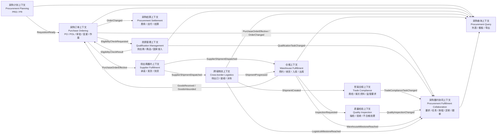

# 限界上下文与上下文映射（第二版）

## 1. 统一语言

| 中文名    | 英文名                         | 缩写  | 定义                                         |
| ------ | --------------------------- | --- | ------------------------------------------ |
| 采购需求草稿 | Purchase Requisition Draft  | PRD | 计划侧形成、尚未由供应商确认的采购需求                        |
| 采购需求   | Purchase Requisition        | PR  | 经供应商确认，可被转换为采购订单的需求                        |
| 采购订单   | Purchase Order              | PO  | 企业向一个供应商下达的一次采购承诺                          |
| 采购订单行  | Purchase Order Line         | POL | PO 内针对一个 SKU/BOM 的数量、价格和税务承诺；对应旧 PSO 的核心数据 |
| 采购路线   | Procurement Route           | -   | 供应商所在地、交付方式、中转点和目的地组合                      |
| 交付承诺   | Delivery Commitment         | -   | 供应商承诺的交付日期、地点与数量                           |
| 履约摘要   | Fulfillment Summary         | -   | 采购域保存的外部履约事实投影，不是履约真相源                     |
| 交期变更单  | Delivery Date Change        | DDC | 对已生效交付承诺提出的变更申请                            |
| 采购调价单  | Purchase Price Adjustment   | PPA | 对采购价格提出的变更申请                               |
| 采购订单作废 | Purchase Order Cancellation | -   | 终止尚未完成的采购承诺                                |

文档和代码中统一使用“中文名（英文名）”，代码类型使用英文名。`PurchaseSubOrder/PSO` 只作为旧系统兼容术语，不再作为新领域概念。

## 2. 限界上下文

## 3. 上下文职责

### 3.1 采购计划上下文

详细设计见 [[17-采购计划上下文详细设计-第二版]]。

拥有：

- PRD 计算、合并和异常处理。
- 供应商确认后的 PR。
- PR 明细是否已转单、关闭或剩余可转数量。

不拥有：

- PO 审批状态。
- 供应商发货与仓库入库。

### 3.2 采购订单上下文

详细设计见 [[18-采购订单上下文详细设计-第二版]]。

拥有：

- PO 草稿、订单行、供应商、采购主体、价格、币种、税率。
- 采购路线、交付条款、目的地和计划交期。
- 提交审批、审批结果、订单生效。
- 交期变更、调价和作废规则。

只投影：

- 供应商是否发货。
- 累计发货、收货、入库数量。
- 当前物流节点和最终完成情况。

### 3.3 供应商履约上下文

详细设计见 [[19-供应商履约上下文详细设计-第二版]]。

拥有供应商对订单行的交付承诺、拆批、实际发货和到货事实。如果短期内不新建独立服务，这个上下文可以先以采购服务内部模块存在，但必须使用独立聚合和表，不能继续复用 PO 状态。

### 3.4 跨境物流上下文

原 `PurchaseCabinet`、`PsoCabinetDetail`、`ShippingMarkInfo` 以及派车信息属于该上下文。它通过 `purchaseOrderCode` 和 `purchaseOrderLineId` 引用采购订单。

### 3.5 资质管理上下文

资质管理（Qualification Management）回答的是“有没有资格做这笔采购或进出口”，检查对象通常是供应商、商品、生产商、采购主体、进出口主体和目标国家。例如：

- 供应商资质是否有效。
- 商品是否具备目标国家准入资质。
- 采购主体或进出口主体是否具备许可证。
- 资质是否缺失、过期或处于审批中。

它通常发生在 PO 提交或生效之前。采购订单只保存校验结果快照或校验引用，不拥有资质文件及其有效期生命周期。

### 3.6 贸易合规上下文

贸易合规（Trade Compliance）回答的是“这批跨境货物能否按照监管要求申报和通关”。商检（Commodity Inspection）只是其中一种能力，检查对象通常是一批货、一次装柜或一次进出口申报。例如：

- 是否需要商检。
- 商检资料是否齐全。
- 报关品名、HS 编码、原产地和进出口主体是否匹配。
- 商检申请是否受理、通过或驳回。

它一般在 PO 生效并形成实际发运批次后发生，因此更靠近跨境物流，不应作为 PO 聚合内部状态。

### 3.7 质量检验上下文

详细设计见 [[20-质量检验上下文详细设计-第二版]]。

质量检验（Quality Inspection）回答的是“实际到达的商品质量是否符合标准”，检查对象通常是样品、到货批次或收货批次。例如：

- 抽检方案和质检标准。
- 合格、不合格及让步接收。
- 不合格数量、缺陷等级和质检报告。
- 返工、退货或差异处理。

它通常由到货或收货事实触发，结果影响仓库验收、供应商绩效和差异处理，但不改变原 PO 的审批状态。

因此，“质量与合规（Quality & Compliance）”可以作为能力域名称，但不建议直接实现成一个限界上下文或一个聚合。

资质、样图、对样、质检、约仓、装柜等要求如何统一展示和协作，详见 [[15-履约要求任务与订单旅程设计-第二版]]。

### 3.8 仓储上下文

仓储系统是预约、收货、入库和出库事实的真相源。采购域消费带业务幂等键的事件，更新履约投影。

### 3.9 采购履约协同上下文

详细设计见 [[22-采购履约协同上下文详细设计-第二版]]。

采购履约协同（Procurement Fulfillment Collaboration）是流程协调上下文，不取代仓储、物流、资质和质量上下文。它统一承载原设计中的“采购协同”和“采购履约协调”，拥有：

- PO 生效时生成的履约要求计划及规则版本。
- 根据必做要求生成的协同任务和阻塞节点。
- 外部业务任务的引用、负责人、截止时间和协同状态。
- 由物流、仓储、质量和资质事件形成的订单旅程投影。
- 因任务超时、规则阻塞、里程碑延迟或外部失败产生的异常事项。
- 异常分派、处理、关闭、超期计算、跟单提醒和通知记录。

它不拥有资质文件、质检报告、预约单和装柜单的业务内容。这些对象仍由来源上下文维护。协同上下文只回答：

- 是否需要做。
- 由谁在什么时间完成。
- 当前是否阻塞或超期。
- 需要怎样跟进和升级。
- 货物进展到哪里。

异常不是另一套孤立流程，而是要求、任务和旅程偏离计划后的派生对象。例如“资质逾期未上传”由资质任务超期产生，“预计到仓未到货”由旅程里程碑超期产生。

### 3.10 采购结算上下文

详细设计见 [[21-采购结算上下文详细设计-第二版]]。

拥有费用计算、应付和结算状态。订单生效、调价通过、作废等事件触发结算侧重算。

### 3.11 采购查询上下文

详细设计见 [[23-采购查询上下文详细设计-第二版]]。

列表、首页、导出和 BI 使用读模型，不通过加载聚合完成复杂联表查询。查询上下文可以展示协同任务、异常和旅程，但不能修改任务或关闭异常。

## 4. 上下文映射

| 上游 | 下游 | 关系 | 集成方式 |
|---|---|---|---|
| 商品中心 | 采购订单 | Customer/Supplier | `GoodsCatalogPort` 查询，保存必要快照 |
| 供应商中心 | 采购订单 | Customer/Supplier | `SupplierProfilePort` 查询，保存必要快照 |
| 采购计划 | 采购订单 | Published Language | `RequisitionReady` 事件或转单 API |
| 采购订单 | 审批平台 | Open Host Service + ACL | 发起流程、消费审批结果 |
| 资质管理 | 采购订单 | Open Host Service + ACL | 提交时校验准入条件，保存结果引用 |
| 采购订单 | 供应商履约 | Published Language | `PurchaseOrderEffective` |
| 跨境物流 | 贸易合规 | Published Language | 发运批次触发商检或报关任务 |
| 仓储 | 质量检验 | Published Language | 到货或收货触发质检任务 |
| 采购订单 | 采购履约协同 | Published Language | PO 生效或变更后生成要求计划和任务 |
| 资质/质量/仓储/物流 | 采购履约协同 | Published Language | 业务任务和旅程里程碑事件 |
| 供应商履约/仓储 | 采购订单 | Published Language | 发货、收货、入库事件 |
| 采购订单 | 结算 | Published Language | 生效、调价、作废事件 |
| 采购订单 | 旧采购服务 | Anti-Corruption Layer | 兼容旧 DTO、状态和接口 |

## 5. 归属判定规则

判断一个能力是否属于采购订单上下文，依次问：

1. 该规则是否改变企业对供应商的采购承诺？
2. 该规则是否必须与 PO 金额、数量或生效状态同事务完成？
3. 该事实的最终解释权是否属于采购人员，而不是仓库、物流、质量或财务？

前两个问题均为“否”时，通常不应放入采购订单聚合。第三个问题为“否”时，采购域最多保存投影。
