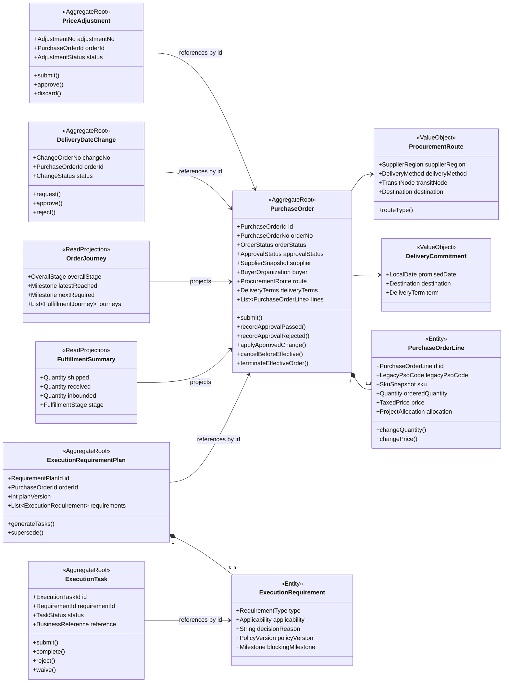
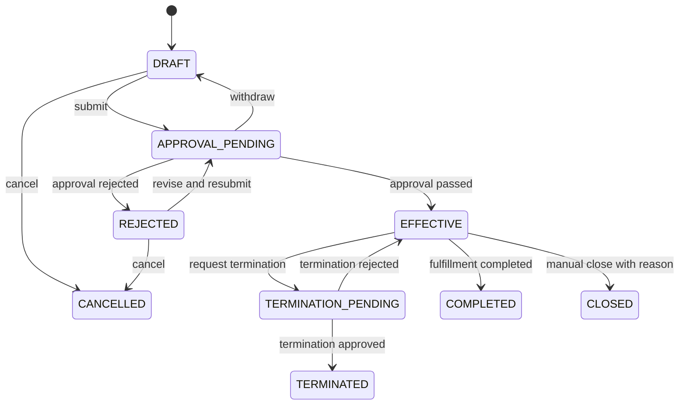

# 采购订单聚合与状态模型（第二版）

## 1. 聚合设计



## 2. 为什么旧 PSO 应改为订单行

旧 `rt_purchase_sub_order` 的主要字段是：

- `sku_id`、`bom_code`、商品版本。
- 采购数量、单价、税率和币种。
- PR/PRD 明细 ID。
- 项目分摊、逻辑仓比例和 SKU 扩展属性。

这些字段符合订单行，而不是独立“订单”的定义。虽然它有 `purchase_sub_order_code` 和 `pso_status`，但当前状态基本由 PO 批量同步，说明它没有稳定的独立生命周期。

保留兼容方式：

- 新表使用 `purchase_order_line_id` 作为内部 ID。
- 保存 `legacy_pso_code`，用于旧接口、MQ 和数据核对。
- 对外兼容层仍可返回 `purchaseSubOrderCode`。

只有当业务确认“单个 PSO 可以独立审批、独立取消或独立选择供应商”时，才将其升级为独立聚合。

## 3. 聚合不变量

`PurchaseOrder` 在一次事务中保证：

1. 至少有一条有效订单行。
2. 所有订单行供应商、采购主体、币种与订单头规则一致。
3. 数量必须大于零，金额按统一精度和舍入规则计算。
4. 订单行来源 PR 明细的转换数量不能超过可转数量。
5. 提交后不可直接编辑承诺字段，只能通过变更单。
6. 审批结果只能作用于对应的审批实例和订单版本。
7. 已终止或已完成的订单不能再次提交、调价或修改交期。
8. 聚合更新必须携带 `version`，并使用乐观锁。

不在聚合中保证：

- 仓库实际收货量与库存量相等。
- 装柜量与发货量同步完成。
- 结算系统已经生成应付。

这些规则属于跨上下文流程，由对账和补偿机制保证。

## 4. 采购订单状态机

### 4.1 订单状态



推荐枚举：

- `DRAFT`：草稿
- `APPROVAL_PENDING`：审批中
- `REJECTED`：审批驳回
- `EFFECTIVE`：已生效
- `TERMINATION_PENDING`：终止审批中
- `TERMINATED`：已终止
- `COMPLETED`：履约完成
- `CLOSED`：业务关闭
- `CANCELLED`：生效前取消

### 4.2 审批状态

`approvalStatus` 独立保存：

- `NOT_STARTED`
- `PROCESSING`
- `APPROVED`
- `REJECTED`
- `WITHDRAWN`

审批平台回调不能直接用“目标 PO 状态”更新数据库，而是执行 `RecordApprovalResult` 用例，由聚合校验当前审批实例和版本。

### 4.3 履约摘要

`fulfillment_stage` 是读模型字段：

- `NOT_STARTED`
- `DELIVERY_PENDING`
- `PARTIALLY_SHIPPED`
- `SHIPPED`
- `PARTIALLY_RECEIVED`
- `RECEIVED`
- `PARTIALLY_INBOUNDED`
- `INBOUNDED`

它由订单行维度的数量事实计算，不用于决定 PO 是否可以编辑。业务完成条件由策略判断，例如：

```text
所有有效订单行 inboundedQuantity >= acceptedQuantity
或者目的地为客户时 deliveredQuantity >= acceptedQuantity
```

## 5. 采购路线建模

旧代码为九种 PO 类型分别提供策略类。第二版不把九种类型复制成九套完整订单生命周期，而是将变化拆成几个正交维度：

- `supplierRegion`：中国 / 境外。
- `deliveryMethod`：供应商直送 / 集货中转。
- `destinationType`：仓 / 门店 / 客户。
- `transitRequired`：是否中转。
- `deliveryTerm`：DDP 等贸易条款。

`ProcurementRoutePolicy` 根据这些值计算兼容的旧 `poType`、所需校验和生效后的任务，但提交、审批、变更、作废仍使用同一套聚合行为。

## 6. 独立变更聚合

### 6.1 交期变更单

独立建模是因为它有申请、审批、驳回和生效时间。审批通过后调用订单聚合的 `applyApprovedDeliveryDateChange(changeId, newDate)`，并记录已应用版本，防止重复。

### 6.2 调价单

调价单拥有多条调价明细和自己的审批状态。通过后更新 PO 行价格并产生 `PurchaseOrderPriceAdjusted`。结算上下文订阅事件后重算，不由采购订单直接调用 AP。

### 6.3 作废与终止

- 生效前叫 `cancel`，可由聚合直接完成。
- 生效后叫 `terminate`，必须结合已发货、已入库和已结算数量判断可终止范围。
- 原来的 `CANCELED_14/15/16` 转换为统一终止状态加 `terminationStageSnapshot`，不要继续用三个状态编码表达历史阶段。

## 7. 履约要求、任务与旅程

`ExecutionRequirementPlan`、`ExecutionTask` 和由偏差产生的 `ExecutionExceptionCase` 属于采购履约协同上下文，不进入 `PurchaseOrder` 聚合：

- 要求计划保存“是否约仓、上传样图、上传资质、装柜、对样、质检”的规则结论、原因和版本。
- 执行任务保存负责人、截止时间、协同状态及外部业务对象引用。
- 异常事项由任务超期、规则阻塞、里程碑延误或外部失败产生，保存分派、处理、升级和关闭过程。
- 资质、质检、预约和装柜的实际业务对象仍由各自上下文拥有。
- `OrderJourney` 根据不可变里程碑事件形成，不由 PO Service 直接设置当前节点。
- 约仓、装柜和质检通常按发运批次或收货批次建模，不能只挂在 PO 头。

详细结构和阻塞规则见 [[15-履约要求任务与订单旅程设计-第二版]]。
