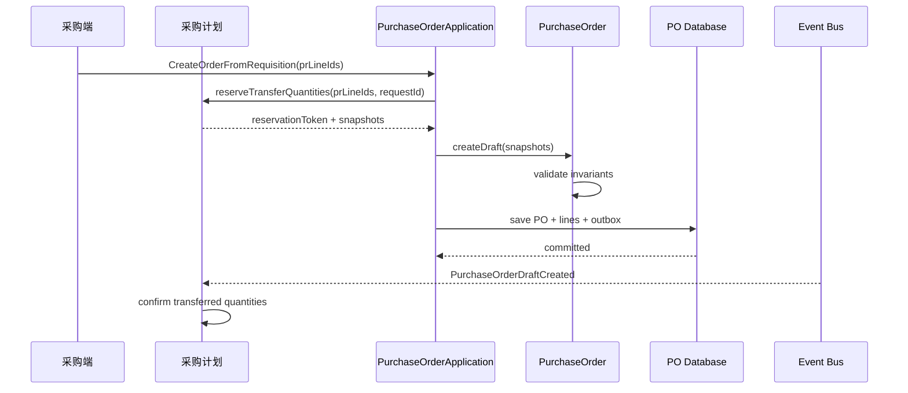
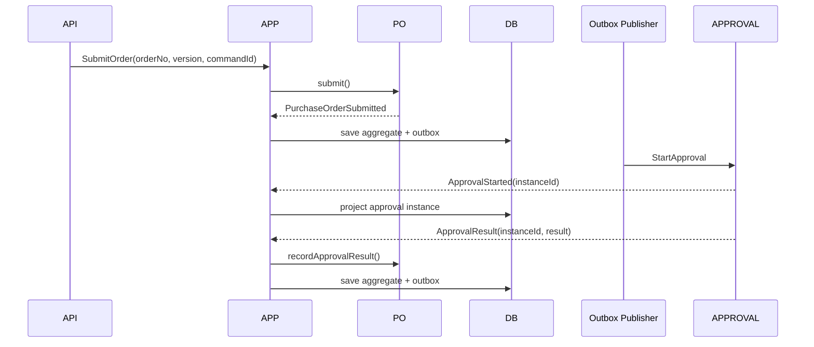

# 用例、事件与一致性设计（第二版）

## 1. 命令用例

| 用例 | 聚合 | 事务结果 |
|---|---|---|
| `CreateOrderDraft` | PurchaseOrder | 创建草稿和订单行 |
| `ReviseOrderDraft` | PurchaseOrder | 替换或修改草稿承诺 |
| `SubmitOrderForApproval` | PurchaseOrder | 订单进入审批中，写 outbox |
| `RecordOrderApprovalResult` | PurchaseOrder | 生效或驳回，写 outbox |
| `WithdrawOrderApproval` | PurchaseOrder | 审批撤回并回到草稿 |
| `CancelDraftOrder` | PurchaseOrder | 生效前取消 |
| `RequestOrderTermination` | PurchaseOrder + termination policy | 发起终止审批 |
| `ApplyDeliveryDateChange` | DeliveryDateChange + PurchaseOrder | 变更单生效并修改订单 |
| `ApplyPriceAdjustment` | PriceAdjustment + PurchaseOrder | 调价单生效并修改订单行 |
| `BuildExecutionRequirementPlan` | ExecutionRequirementPlan | 根据生效快照生成可解释的要求计划 |
| `CreateExecutionTasks` | ExecutionTask | 为必做要求创建协同任务 |
| `HandleExecutionTaskResult` | ExecutionTask | 幂等记录提交、通过、驳回、完成或豁免 |
| `OpenExecutionException` | ExecutionExceptionCase | 由任务或里程碑偏差创建异常事项 |
| `HandleExecutionException` | ExecutionExceptionCase | 分派、处理、升级或关闭异常 |
| `ProjectJourneyMilestone` | OrderJourneyProjection | 按批次投影物流和仓储里程碑 |
| `ProjectFulfillmentFact` | FulfillmentProjection | 幂等更新履约摘要 |

查询、导出、首页和看板不进入上述命令服务，统一走 Query Service。

## 2. PR 转 PO 流程



关键点：

- 转单必须以 PR 明细和数量为粒度，不以整个 PR 单号做粗粒度标记。
- `requestId` 保证用户重复点击不会生成两张 PO。
- 如果短期内 PR 与 PO 仍在一个数据库，可使用本地事务；拆库后使用“预占转单量 + 事件确认”的 Saga。
- PO 保存 PR/PRD 的来源引用和必要快照，不跨聚合持有对象。

## 3. 提交与审批



审批发起失败不回滚已提交的订单，而是保留 `APPROVAL_PENDING + START_FAILED` 的流程投影，由任务重试。这样避免远程调用与数据库事务绑定。

## 4. 领域事件与集成事件

### 4.1 领域事件

- `PurchaseOrderDraftCreated`
- `PurchaseOrderSubmitted`
- `PurchaseOrderApproved`
- `PurchaseOrderRejected`
- `PurchaseOrderEffective`
- `PurchaseOrderCancelled`
- `PurchaseOrderTerminationRequested`
- `PurchaseOrderTerminated`
- `PurchaseOrderDeliveryDateChanged`
- `PurchaseOrderPriceAdjusted`
- `ExecutionRequirementPlanCreated`
- `ExecutionTaskCreated`
- `ExecutionTaskCompleted`
- `ExecutionTaskWaived`
- `ExecutionExceptionOpened`
- `ExecutionExceptionEscalated`
- `ExecutionExceptionResolved`

领域事件在聚合行为中产生，不包含 MQ topic、旧 DTO 或外部系统字段。

### 4.2 集成事件

领域事件由 event mapper 转成版本化集成事件：

```json
{
  "eventId": "uuid",
  "eventType": "PurchaseOrderEffective",
  "eventVersion": 1,
  "aggregateId": "PO-ID",
  "aggregateVersion": 6,
  "occurredAt": "2026-07-27T10:30:00Z",
  "traceId": "trace-id",
  "payload": {
    "orderNo": "PO...",
    "supplierCode": "S...",
    "route": {},
    "lines": []
  }
}
```

事件兼容规则：

- 已发布字段不修改语义。
- 新增可选字段向后兼容。
- 破坏性调整发布新的 `eventVersion`。
- 消费者以 `eventId` 幂等，以 `aggregateVersion` 处理乱序。

## 5. 履约事实投影

外部上下文向采购域发布：

- `SupplierShipmentDispatched`
- `TransitWarehouseGoodsReceived`
- `WarehouseGoodsInbounded`
- `DestinationGoodsReceived`
- `DestinationGoodsInbounded`
- `CustomerGoodsDelivered`
- `WarehouseReservationCompleted`
- `ContainerLoaded`
- `QualificationTaskChanged`
- `QualityInspectionChanged`

事件必须携带订单行 ID 或旧 PSO 编码、业务数量、事实时间和来源单号。采购域更新：

- `purchase_order_line_fulfillment`
- `purchase_order_fulfillment_summary`

投影失败可以重放，不能反向覆盖仓储或物流源数据。

PO 生效后由采购履约协同流程生成要求计划和任务。要求任务的结果来自资质、质量、仓储或物流上下文；任务超时或旅程偏离计划时生成异常事项。订单旅程以 `fulfillmentUnitId` 区分不同发运批次，不能假设一张 PO 只有一个当前节点。详细流程见 [[15-履约要求任务与订单旅程设计-第二版]]。

## 6. 可靠性机制

### 6.1 Outbox

建议字段：

- `event_id`
- `aggregate_type`
- `aggregate_id`
- `aggregate_version`
- `event_type`
- `event_version`
- `payload`
- `occurred_at`
- `publish_status`
- `retry_count`
- `next_retry_at`

聚合数据与 outbox 在同一事务提交。发布器成功发送后更新状态，失败按退避策略重试。

### 6.2 Inbox

每个消费者记录：

- `consumer_name`
- `event_id`
- `business_key`
- `processed_at`
- `result`

唯一索引至少覆盖 `(consumer_name, event_id)`。像仓储回调这种可能更换 MQ messageId 的事件，还要使用来源单号 + 事件类型 + 版本作为业务幂等键。

### 6.3 补偿与对账

- 审批实例未创建：重试发起审批。
- PO 生效事件未被下游处理：重发 outbox。
- 履约事件乱序：按事实版本更新，旧版本忽略。
- PR 转单确认失败：Saga 重试；超时释放预占。
- 新旧系统双写差异：记录差异，不在请求线程自动相互覆盖。

## 7. 禁止事项

- 禁止应用服务直接 `setStatus(code)`。
- 禁止 Repository 编排审批、WMS、库存等业务。
- 禁止用一个 PO 状态值推断所有下游事实。
- 禁止把远程调用放进数据库事务后假定能够一起回滚。
- 禁止关键业务依赖普通 `afterCommit` 内存回调。
- 禁止 MQ Consumer 反序列化后直接更新表状态。
