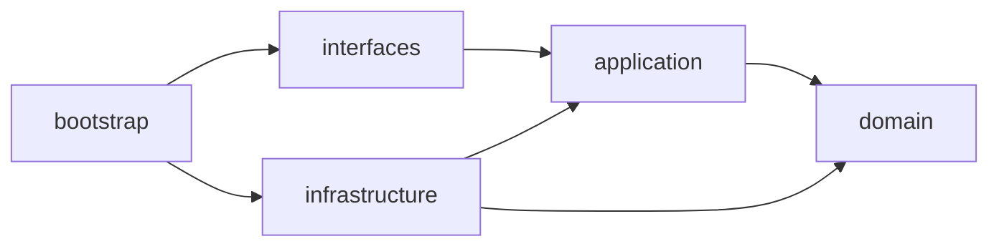

# 工程结构与端口适配器（第二版）

## 1. 推荐形态

第一阶段保持一个可部署单元，采用模块化单体结构。先获得清晰边界，再根据团队和发布独立性决定是否拆微服务。

```text
purchaseorder-next
├── bootstrap
├── interfaces
│   ├── rest
│   ├── feign
│   ├── mq
│   └── file
├── application
│   ├── planning
│   │   ├── command
│   │   ├── service
│   │   └── port
│   ├── ordering
│   ├── supplierfulfillment
│   ├── qualityinspection
│   ├── settlement
│   ├── fulfillmentcollaboration
│   └── query
├── domain
│   ├── planning
│   │   ├── model
│   │   ├── policy
│   │   ├── event
│   │   └── repository
│   ├── ordering
│   ├── supplierfulfillment
│   ├── qualityinspection
│   ├── settlement
│   ├── fulfillmentcollaboration
│   └── sharedkernel
├── infrastructure
│   ├── persistence
│   ├── messaging
│   ├── acl
│   │   └── legacyorderquality
│   └── query
└── architecture-test
```

模块依赖方向：



`domain` 不依赖 Spring、MyBatis、Feign、MQ、DTO 或 DO。

## 2. 现有骨架需要调整

第一版 `project` 可以继续使用，但应修改以下内容：

1. 将 `PurchaseSubOrder` 改为 `PurchaseOrderLine`，保留 legacy PSO 编码。
2. 从 `PurchaseOrder` 删除 `confirmSupplierDelivery` 和 `confirmDestinationInbound`。
3. 将履约回调 Consumer 改为调用 `FulfillmentCollaborationApplicationService` 或对应的旅程投影用例。
4. 将交期变更、调价和终止申请放在 `ordering` 上下文内部，不建立脱离业务语义的通用 change 模块。
5. 增加 `supplierfulfillment`、`qualityinspection` 和 `settlement` 上下文模块；通过 `legacyorderquality` ACL 支持对样/质检迁移期兼容。
6. 增加 `fulfillmentcollaboration` 模块，承载要求计划、协同任务、旅程投影、异常、超期和跟单。
7. 增加独立 `query` 模块和 query repository，避免用聚合仓储支持页面查询。
8. Outbox 发布器放在 infrastructure，领域仅产生事件。
9. 增加 legacy ACL，集中转换旧状态、DTO 和接口。

## 3. 端口设计

### 3.1 入站端口

按用例定义，而不是复刻 Controller：

- `CreatePurchaseOrderUseCase`
- `CreateOrderFromRequisitionUseCase`
- `SubmitPurchaseOrderUseCase`
- `HandlePurchaseOrderApprovalUseCase`
- `CancelPurchaseOrderUseCase`
- `RequestPurchaseOrderTerminationUseCase`
- `ChangeDeliveryDateUseCase`
- `AdjustPurchasePriceUseCase`
- `ProjectFulfillmentFactUseCase`
- `BuildExecutionRequirementPlanUseCase`
- `HandleExecutionTaskUseCase`
- `HandleExecutionExceptionUseCase`
- `ProjectOrderJourneyUseCase`

### 3.2 出站端口

| 端口 | 作用 | 调用原则 |
|---|---|---|
| `GoodsCatalogPort` | 商品/BOM/类目查询 | 创建时读取并保存快照 |
| `SupplierProfilePort` | 供应商与合同校验 | 提交前校验 |
| `OrganizationPort` | 采购与入库主体 | 创建/提交时校验 |
| `LocationDirectoryPort` | 仓、店、客户目的地 | 路线计算时查询 |
| `RequisitionPort` | PR 明细预占和确认 | 转单 Saga |
| `ApprovalWorkflowPort` | 审批发起、撤回、查询 | 异步可靠调用 |
| `OrderNumberPort` | 单号生成 | 创建时调用 |
| `ClockPort` | 业务时间 | 便于测试 |
| `EventOutboxPort` | 事件持久化 | 与聚合同事务 |
| `RequirementPolicyPort` | 获取资质、质量、仓储和物流要求结论 | PO 生效后生成要求计划 |
| `ExecutionTaskReferencePort` | 查询外部任务摘要 | 只保存外部业务对象引用 |

WMS、库存、物流、结算不应成为 `PurchaseOrder` 聚合行为直接调用的端口。它们是集成事件消费者，或由独立流程管理器调用。

## 4. Repository 设计

命令侧：

```java
public interface PurchaseOrderRepository {
    Optional<PurchaseOrder> find(PurchaseOrderId id);
    Optional<PurchaseOrder> findByOrderNo(PurchaseOrderNo orderNo);
    void save(PurchaseOrder order);
}
```

查询侧：

```java
public interface PurchaseOrderQueryRepository {
    Page<PurchaseOrderListView> page(PurchaseOrderQuery query);
    PurchaseOrderDetailView detail(String orderNo);
}
```

限制：

- Repository 不发起审批、不操作外部服务、不读取当前登录人。
- 聚合转 DO 和 DO 转聚合由 infrastructure mapper 完成。
- 列表、导出和看板不得复用聚合 Repository。

## 5. 数据模型建议

### 5.1 命令模型

- `po_order`
- `po_order_line`
- `po_delivery_date_change`
- `po_delivery_date_change_line`
- `po_price_adjustment`
- `po_price_adjustment_line`
- `po_approval_process`
- `domain_event_outbox`
- `integration_event_inbox`
- `po_execution_requirement_plan`
- `po_execution_requirement`
- `po_execution_task`
- `po_execution_task_evidence`
- `po_execution_exception`
- `po_execution_followup_record`

### 5.2 履约投影

- `po_line_fulfillment_projection`
- `po_fulfillment_summary_projection`
- `po_journey`
- `po_journey_milestone`

### 5.3 查询模型

- `po_order_list_view`
- `po_order_detail_view`
- `po_supplier_dashboard_view`
- `po_execution_view`

查询模型可以使用 MySQL 冗余表或 SelectDB，但第一阶段建议先用 MySQL 投影表，避免同时引入领域重构和新数据基础设施两类风险。

## 6. 防腐层

旧系统兼容统一放在：

```text
infrastructure/acl/legacyprocurement
├── LegacyPoTypeTranslator
├── LegacyPoStatusTranslator
├── LegacyPsoTranslator
├── LegacyRequestMapper
└── LegacyEventMapper
```

兼容层负责：

- 旧 1-9 PO 类型与 `ProcurementRoute` 互转。
- 旧 PO/PSO 状态与新订单状态、履约摘要的组合映射。
- 旧 DTO 字段和分页结构。
- 旧 MQ topic/tag 到版本化集成事件的转换。

这些映射不能进入领域模型，否则迁移完成后仍会永久携带旧系统语义。

## 7. 测试结构

- 聚合单元测试：状态转移和不变量。
- 应用用例测试：事务、端口调用和幂等。
- 契约测试：旧 Feign DTO、MQ 事件和审批回调。
- 架构测试：禁止 domain 依赖 Spring/MyBatis/Feign。
- 持久化集成测试：聚合重建、乐观锁、outbox 同事务。
- 场景测试：PR 转 PO、审批通过、调价、终止、履约事件乱序。
