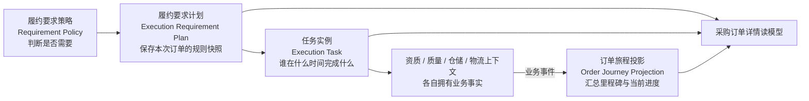
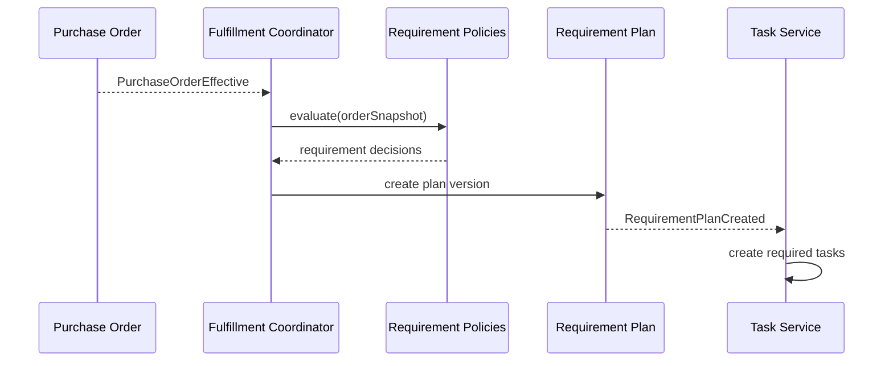

# 履约要求、任务与订单旅程设计（第二版）

> [!info] 第二版组成
> 本文是采购订单服务 DDD 第二版的一部分，细化 [[10-限界上下文与上下文映射-第二版]] 中的采购履约协同上下文，并与 [[11-采购订单聚合与状态模型-第二版]]、[[12-用例事件与一致性设计-第二版]]、[[13-工程结构与端口适配器-第二版]]、[[14-实施路线与验收标准-第二版]] 共同构成完整设计。
>
> 采购履约协同上下文的聚合、命令、事件和迁移映射见 [[22-采购履约协同上下文详细设计-第二版]]。

## 1. 要解决的问题

采购订单生效后，需要回答三类不同问题：

1. **是否需要做**：是否约仓、上传商品样图、上传资质、装柜、对样、质检。
2. **事情做得怎么样**：未开始、处理中、已提交、审核通过、驳回、已完成。
3. **货物走到哪里**：待发货、已发货、运输中、已到仓、已收货、已入库。

这三类问题不能继续压缩成 PO 状态，也不应该实现成 PO 上的一组 `isNeedXxx` 和 `xxxStatus` 字段。

## 2. 三层模型



### 2.1 履约要求计划

履约要求计划（Execution Requirement Plan）回答“这张订单为什么需要做哪些事”。它在 PO 生效时生成，也可以在路线、国家或监管规则变化后产生新版本。

每条要求至少包含：

```text
requirementId
orderId
scopeType              ORDER | ORDER_LINE | SHIPMENT | RECEIPT_BATCH
scopeId
requirementType
applicability          REQUIRED | NOT_REQUIRED | PENDING_DECISION
decisionReason
policyCode
policyVersion
blockingMilestone
ownerContext
createdAt
```

必须保存 `decisionReason` 和 `policyVersion`。否则业务人员只能看到“需要上传资质”，却无法解释是哪一个国家、SKU 或供应商规则触发的。

### 2.2 任务实例

执行任务（Execution Task）回答“谁需要在什么时候提交什么结果”。一条必做要求可以产生一个或多个任务：

```text
taskId
requirementId
taskType
assigneeType           SUPPLIER | BUYER | WAREHOUSE | QUALITY | LOGISTICS
assigneeId
status                 NOT_STARTED | IN_PROGRESS | SUBMITTED
                       APPROVED | REJECTED | COMPLETED | WAIVED
dueAt
businessReferenceType
businessReferenceId
evidenceReferences
version
```

`businessReferenceId` 指向真正业务对象，例如资质申请、质检单、预约单或装柜单。任务本身不复制这些对象的全部数据。

### 2.3 订单旅程投影

订单旅程（Order Journey）不是聚合根，而是由外部事件构建的读模型。它回答“最近完成了什么、下一步是什么、有没有阻塞”。

```text
OrderJourney
├── overallStage
├── latestReachedMilestone
├── nextRequiredMilestone
├── blockingTasks
├── exceptionSummary
└── fulfillmentJourneys[]
    ├── shipmentId
    ├── route
    ├── currentMilestone
    └── milestones[]
```

## 3. 六类要求如何归属

| 业务问题 | 是否需要由谁判断 | 任务由谁拥有 | 建议作用范围 |
|---|---|---|---|
| 是否约仓 | 仓储收货策略，根据目的地、交付方式、仓库能力判断 | 仓储上下文的预约单 | 发运批次或到货批次 |
| 是否上传商品样图 | 商品/质量策略，根据 SKU、类目、首单和国家判断 | 供应商履约任务 | 订单行或 SKU |
| 是否装柜 | 采购路线与跨境物流策略判断 | 跨境物流的装柜单 | 发运批次 |
| 是否对样 | 质量策略，根据首单、样品基线和风险等级判断 | 质量检验的对样任务 | 订单行或到货批次 |
| 是否质检 | 质量策略，根据类目、供应商等级、抽检规则判断 | 质量检验单 | 到货/收货批次 |
| 是否上传资质材料 | 资质策略，根据供应商、SKU、生产商、国家和主体判断 | 资质管理任务 | 订单、订单行或发运批次 |

这里最重要的区别是：

- **是否需要**是策略决策。
- **由谁完成**是任务分工。
- **结果是什么**由对应上下文负责。
- **采购页面怎么展示**由查询模型负责。

## 4. 要求计划如何生成



策略输入建议使用 PO 生效快照：

- 采购路线、目的国家和目的地。
- 供应商、生产商、采购主体和进出口主体。
- 交付条款和交付方式。
- SKU、类目、商品类型和是否首单。
- 供应商风险等级和历史质量等级。

策略不应散落在 Controller 和页面字段拼装中。可以按要求类型实现：

```text
WarehouseReservationRequirementPolicy
SampleImageRequirementPolicy
ContainerLoadingRequirementPolicy
SampleMatchingRequirementPolicy
QualityInspectionRequirementPolicy
QualificationDocumentRequirementPolicy
```

这些策略可以由履约协调应用服务编排，但规则的最终归属仍在仓储、物流、质量或资质上下文。

## 5. 阻塞规则

不同任务阻塞的节点不同，不能统一规定“所有任务完成后才能发货”。

| 要求 | 可能阻塞的节点 |
|---|---|
| 商品样图 | 供应商确认发货 |
| 资质材料 | PO 生效、创建发运批次或报关 |
| 对样 | 批量生产、发货或入库 |
| 商检资料 | 报关或跨境发运 |
| 约仓 | 到仓和卸货 |
| 质检 | 收货完成或库存转为可用 |
| 装柜 | 发运完成 |

用 `blockingMilestone` 表达阻塞点。流程管理器判断：

```text
canReach(milestone) =
  所有 applicability = REQUIRED
  且 blockingMilestone <= milestone 的任务
  均为 COMPLETED、APPROVED 或 WAIVED
```

`WAIVED`（豁免）必须记录原因、操作人和审批引用，不能简单改成“已完成”。

## 6. 当前物流节点如何计算

### 6.1 不保存一个可随意修改的 currentNode

原服务将资质、商检、装柜、发货、验货和约仓都作为物流节点直接更新，容易出现：

- 后到的旧消息把节点改回去。
- 不同路线没有的节点也被初始化。
- 资质未完成被误认为货物还在某个物流位置。
- 一张 PO 分两批发货时无法表达两个位置。

第二版使用里程碑事实计算旅程：

```text
ShipmentCreated
ContainerLoadingStarted
ContainerLoaded
SupplierShipmentDispatched
WarehouseReservationCompleted
GoodsArrived
GoodsReceived
GoodsInbounded
DestinationShipmentDispatched
CustomerDelivered
```

每个事件包含：

- `eventId`
- `orderId`、`orderLineId`
- `fulfillmentUnitId`，例如发运批次或收货批次
- `milestoneType`
- `occurredAt`
- `sourceSystem`
- `sourceBusinessNo`
- `sourceVersion`

### 6.2 路线模板

不同采购路线有不同里程碑模板。

本地采购到仓：

```text
待供应商发货 → 已发货 → 已约仓 → 已到仓 → 已收货 → 已入库
```

中国仓中转：

```text
待供应商发货 → 已发货 → 中国仓收货 → 中国仓入库
→ 装柜 → 发往海外 → 目的仓收货 → 目的仓入库
```

供应商直发客户：

```text
待供应商发货 → 已发货 → 运输中 → 客户签收
```

### 6.3 PO 级别如何展示

一张 PO 可能被拆成多个发运批次，不能总是展示唯一物理位置。查询模型应同时返回：

- `overallStage`：未开始、部分发货、全部发货、部分收货、全部收货、全部完成。
- `latestReachedMilestone`：最近发生的有效里程碑。
- `nextRequiredMilestone`：按路线计算的下一必要节点。
- `journeys`：每个发运批次当前所在节点。
- `blockingTasks`：虽然不是物流位置，但正在阻塞流程的任务。

例如：

```text
总体进度：部分发货
批次 A：已到中国仓，等待入库
批次 B：供应商待发货
阻塞事项：批次 B 缺少出口资质
```

这比显示一个“当前节点：已到仓”更准确。

## 7. 订单详情读模型

采购订单详情由查询上下文组合：

```text
PurchaseOrderExecutionView
├── orderBaseInfo
├── commercialStatus
├── requirementSummary
│   ├── required
│   ├── notRequired
│   └── decisionReasons
├── taskSummary
│   ├── sampleImageTask
│   ├── qualificationTask
│   ├── reservationTask
│   ├── loadingTask
│   ├── sampleMatchingTask
│   └── inspectionTask
├── journeySummary
└── exceptions
```

页面可以一次看到全部信息，但这不意味着这些信息必须属于同一个领域聚合。

## 8. 数据表建议

- `po_execution_requirement_plan`
- `po_execution_requirement`
- `po_execution_task`
- `po_execution_task_evidence`
- `po_execution_exception`
- `po_execution_followup_record`
- `po_journey`
- `po_journey_milestone`
- `po_execution_view`

其中：

- requirement 表保存规则结论和原因。
- task 表保存协同工作状态。
- exception 表保存由任务超期、规则阻塞和旅程延误产生的异常事项。
- followup record 保存催办、升级和通知记录。
- milestone 表保存已发生的事实。
- execution view 是面向页面的冗余读模型。

## 9. 与旧系统的迁移

旧 `PoNodeStatusService` 和订单状态服务先通过防腐层接入：

1. 将旧约仓、装柜、发货、验货状态转换为任务事件或里程碑事件。
2. 将旧“是否显示某节点”的条件转换为 requirement policy。
3. 保留旧状态表作为迁移期数据源，新模型不再反向依赖旧枚举。
4. 对同一订单同时计算新旧展示结果，记录节点、任务和要求差异。
5. 新模型稳定后，页面改读 `PurchaseOrderExecutionView`。

## 10. 关键设计结论

- PO 聚合保存采购承诺，不保存所有执行细节。
- “是否需要”必须可解释、可版本化。
- 供应商上传资料是一项任务，资料本身属于资质或质量上下文。
- 装柜、约仓和质检通常以批次为粒度，不应只挂在 PO 头。
- 当前物流节点由不可变里程碑事实计算，不由多个 Service 直接覆盖。
- 异常、超期和跟单是任务或旅程偏差后的协同行为，与要求和任务放在同一上下文。
- 页面可以统一展示，但写模型必须保持各自边界。
