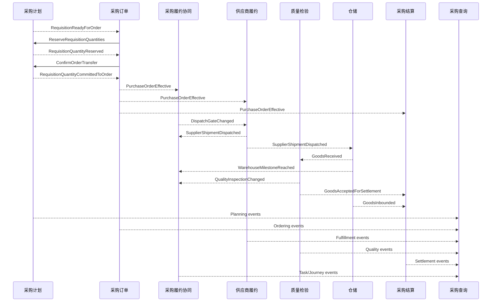
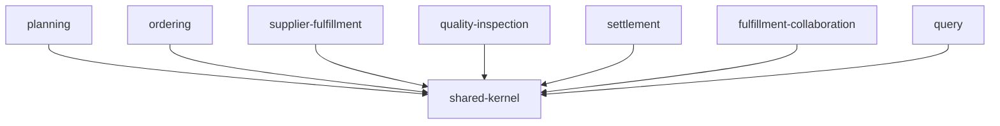

# 七个限界上下文详细设计总览（第二版）

## 1. 设计范围

本文统领以下七个限界上下文的详细设计：

1. [[17-采购计划上下文详细设计-第二版]]
2. [[18-采购订单上下文详细设计-第二版]]
3. [[19-供应商履约上下文详细设计-第二版]]
4. [[20-质量检验上下文详细设计-第二版]]
5. [[21-采购结算上下文详细设计-第二版]]
6. [[22-采购履约协同上下文详细设计-第二版]]
7. [[23-采购查询上下文详细设计-第二版]]

限界上下文是模型和语言边界，不等于七个微服务。结合本次重构目标，以下七个上下文统一部署在新采购服务中；仓储、跨境物流、商检和资质等外部上下文继续通过端口与事件协作。

第一阶段建议部署映射：

| 限界上下文 | 第一阶段物理落点 |
|---|---|
| 采购计划 | `scm-purchaseorder-next-service` 的 `planning` 模块 |
| 采购订单 | 新服务的 `ordering` 模块 |
| 供应商履约 | 新服务的 `supplierfulfillment` 模块 |
| 质量检验 | 新服务的 `qualityinspection` 模块，从 `scm-order-service` 迁入 |
| 采购结算 | 新服务的 `settlement` 模块，后续按团队边界决定是否拆服务 |
| 采购履约协同 | 新服务的 `fulfillmentcollaboration` 模块 |
| 采购查询 | 新服务的 `query` 模块 |

七个上下文可以处于同一个部署单元，但必须保持独立模型、表归属和应用入口。对样/质检迁入时复用现有业务知识和历史数据，不照搬原来的大 Service 结构。

## 2. 一句话职责

| 上下文 | 一句话职责 | 核心事实 |
|---|---|---|
| 采购计划 | 将采购需求转化为可下单数量 | 需要买什么、多少、何时到货 |
| 采购订单 | 管理企业对供应商的采购承诺 | 买卖双方、数量、价格、交付条款是否生效 |
| 供应商履约 | 管理供应商承诺与实际发运 | 承诺何时交、实际发了多少 |
| 质量检验 | 管理对样、抽检和质量处置 | 实际货物是否符合质量标准 |
| 采购结算 | 将订单与验收事实转换为应付依据 | 应向供应商结算什么、多少 |
| 采购履约协同 | 组织跨角色任务并处理偏差 | 需要做什么、谁处理、是否阻塞或超期 |
| 采购查询 | 将各上下文事实组织成可查询视图 | 用户现在需要看到什么 |

## 3. 事实所有权

| 业务问题 | 唯一真相源 |
|---|---|
| PR 明细剩余可转数量 | 采购计划 |
| PO 数量、价格、币种、税率 | 采购订单 |
| 供应商承诺日期和发货数量 | 供应商履约 |
| 到仓、收货、入库数量 | 仓储上下文（外部） |
| 对样、质检和拒收结果 | 质量检验 |
| 应付计算依据和结算版本 | 采购结算 |
| 样图/资质/约仓等协同任务 | 采购履约协同 |
| 当前页面综合状态 | 采购查询的投影视图 |

任何事实只能有一个所有者。其他上下文只能保存引用、必要快照或投影。

## 4. 端到端流程



## 5. 一致性边界

| 操作 | 一致性 |
|---|---|
| PO 头与订单行修改 | PurchaseOrder 聚合内强一致 |
| PR 行数量预占 | 采购计划内强一致 |
| PO 创建与 PR 预占 | Saga；同库过渡期可使用本地事务 |
| PO 生效与生成履约任务 | Outbox + 最终一致 |
| 发货与仓储收货 | 集成事件 + 最终一致 |
| 质检通过与结算重算 | 集成事件 + 最终一致 |
| 查询视图更新 | 可重放投影 + 最终一致 |

跨上下文不使用分布式事务。每个事件都必须具有 `eventId`、业务键、聚合版本和发生时间。

## 6. 模块依赖



业务模块之间不直接依赖实现类。跨上下文协作使用应用端口或事件契约，不能直接调用对方 Repository。

`shared-kernel` 只允许放稳定标识和值类型，例如：

- `PurchaseOrderId`
- `PurchaseOrderLineId`
- `SkuId`
- `SupplierId`
- `FulfillmentUnitId`
- `Money`
- `Quantity`
- `EventMetadata`

禁止把 PO、质检单或结算单等领域对象放入共享内核。

## 7. 统一集成标识

| 标识 | 用途 |
|---|---|
| `purchaseOrderId` | 新系统内部 PO ID |
| `orderNo` | 业务 PO 单号 |
| `purchaseOrderLineId` | 新订单行 ID |
| `legacyPsoCode` | 旧 PSO 兼容编码 |
| `requisitionLineId` | PR 明细来源 |
| `fulfillmentUnitId` | 发运、到货或收货批次统一关联键 |
| `sourceBusinessNo` | 外部预约单、装柜单、质检单等编号 |

所有跨上下文事件优先使用内部稳定 ID，同时携带业务编号用于排查和兼容。

## 8. 评审顺序

建议按以下顺序评审：

1. 业务负责人确认事实所有权。
2. 各上下文负责人确认聚合不变量。
3. 集成方确认事件载荷和幂等键。
4. 数据负责人确认迁移映射。
5. 开发团队确认模块依赖和第一实施切片。

## 9. 核心事件契约矩阵

| 事件 | 发布者 | 主要消费者 | 业务幂等键 | 最小载荷 |
|---|---|---|---|---|
| `RequisitionReadyForOrder` | 采购计划 | 采购订单、查询 | PR 行 ID + 版本 | 可转数量、供应商、目的地 |
| `RequisitionQuantityReserved` | 采购计划 | 采购订单 | reservation ID | PR 行、预占数量、过期时间 |
| `PurchaseOrderEffective` | 采购订单 | 供应商履约、协同、结算、查询 | PO ID + 订单版本 | 商业快照、订单行、路线 |
| `SupplierShipmentDispatched` | 供应商履约 | 仓储、物流、协同、查询 | fulfillmentUnitId + 版本 | 发运行、数量、时间 |
| `GoodsReceived` | 仓储 | 质量、协同、查询 | 收货批次 + 版本 | 收货行、数量、时间 |
| `GoodsInbounded` | 仓储 | 结算、协同、查询 | 入库批次 + 版本 | 入库行、数量、时间 |
| `QualityInspectionCompleted` | 质量检验 | 协同、查询 | 质检单 ID + 版本 | 行决定、接收/拒收数量 |
| `GoodsAcceptedForSettlement` | 质量检验 | 采购结算 | 质检单 ID + 结论版本 | 可结算订单行及数量 |
| `SettlementConfirmed` | 采购结算 | 查询 | settlement ID + revision | 金额、币种、版本 |
| `ExecutionTaskCompleted` | 采购履约协同 | 发货门禁、查询 | task ID + 版本 | 要求类型、范围、完成时间 |
| `JourneyMilestoneProjected` | 采购履约协同 | 查询 | fulfillmentUnitId + milestone + sourceVersion | 当前和下一里程碑 |

事件载荷使用消费者需要的稳定业务快照，不能直接序列化数据库 DO 或内部聚合对象。

## 10. 贯穿七个上下文的示例

业务输入：

```text
PR1001-L1：SKU-A，可转 1000 件
PR1001-L2：SKU-B，可转 500 件
供应商：SUP-01
目的地：印尼仓 ID-JKT
路线：中国供应商 → 中国中转仓 → 印尼仓
```

### 10.1 采购计划

用户选择：

```text
SKU-A 采购 1000
SKU-B 采购 500
```

采购计划创建 `RES-001`：

```text
L1 reserved = 1000
L2 reserved = 500
```

同一个 `commandId` 重试只能返回 `RES-001`，不能再次预占。

### 10.2 采购订单

采购订单使用 `RES-001` 创建 `PO1001`，审批通过后：

```text
orderStatus = EFFECTIVE
orderVersion = 3
```

采购计划随后将预占数量转为 `ordered`。PO 发布 `PurchaseOrderEffective(PO1001, version=3)`。

### 10.3 采购履约协同

根据路线、国家、SKU 和供应商生成要求计划：

```text
SKU-A：需要样图、出口资质、对样
SKU-B：需要出口资质
发运批次：需要装柜、目的仓约仓
收货批次：需要质检
```

出口资质任务阻塞发运，样图任务只阻塞对应 SKU。要求计划保存每项判断原因和策略版本。

### 10.4 供应商履约

供应商确认全部数量，随后拆成两批：

```text
SHIP-A：SKU-A 600，SKU-B 300
SHIP-B：SKU-A 400，SKU-B 200
```

只有 `SHIP-A` 对应的发货阻塞任务完成后，才能产生 `SupplierShipmentDispatched`。

### 10.5 质量检验

`SHIP-A` 到仓后形成收货批次 `RCV-A`，质检结果：

```text
SKU-A：收货 600，接收 580，拒收 20
SKU-B：收货 300，接收 300，拒收 0
```

质量上下文发布：

```text
GoodsAcceptedForSettlement:
  SKU-A = 580
  SKU-B = 300
```

拒收 20 件触发质量异常，由采购履约协同负责分派和跟进，但质量结论仍由质量上下文维护。

### 10.6 采购结算

结算上下文创建 `revision=1`：

```text
SKU-A settlementQuantity = 580
SKU-B settlementQuantity = 300
```

当 `SHIP-B` 完成验收后创建新结算版本，不覆盖 revision 1。调价或质检更正同样生成新版本。

### 10.7 采购查询

页面组合为：

```text
PO 状态：已生效
总体履约：部分到货
SHIP-A：已收货，质检完成，存在 20 件拒收
SHIP-B：供应商待发货
阻塞任务：SHIP-B 出口资质待审核
异常：1 条质量拒收异常
当前结算：revision 1，待确认
```

这个页面视图来自事件投影，不通过一次请求实时调用七个上下文。
