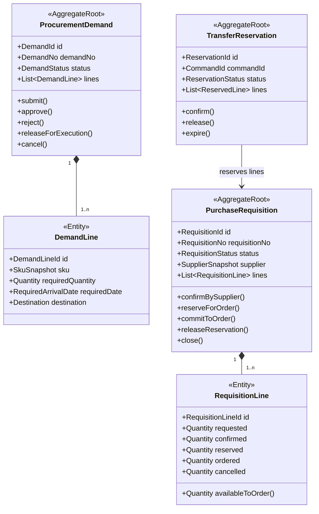

# 采购计划上下文详细设计（第二版）

## 1. 业务目标

采购计划上下文（Procurement Planning）负责把补货、首单、节日备货等业务需求整理成可由供应商确认、可转换为采购订单的需求。

它回答：

- 需要采购什么、多少、何时到达哪个目的地。
- 由哪个供应商满足多少数量。
- 哪些数量已经转成 PO，哪些仍可继续转单。

## 2. 边界

拥有：

- 采购需求草稿（PRD）及其审批生命周期。
- 采购需求（PR）及供应商确认结果。
- PR 行的可转、预占、已转和取消数量。
- 需求异常及其处理结果。

不拥有：

- PO 价格最终承诺和审批状态。
- 供应商实际发货数量。
- 仓库实际入库数量。

## 3. 聚合



旧 PRD 对应 `ProcurementDemand`，旧 PR 对应 `PurchaseRequisition`。不要继续用一个 `prStatus` 同时表达审批、采购执行和交付进度。

## 4. 核心不变量

1. `requiredQuantity > 0`。
2. `confirmedQuantity <= requestedQuantity`，超量确认必须走明确的需求变更。
3. `reserved + ordered + cancelled <= confirmed`。
4. `availableToOrder = confirmed - reserved - ordered - cancelled`。
5. 同一 `commandId` 只能创建一条有效转单预占。
6. PR 未经供应商确认不能预占转 PO。
7. 关闭 PR 前所有行必须已转完、已取消或明确放弃剩余量。

## 5. 状态

采购需求草稿：

```text
DRAFT → APPROVAL_PENDING → APPROVED → EXECUTING → COMPLETED
                    ↘ REJECTED → APPROVAL_PENDING
DRAFT / REJECTED / EXECUTING → CANCELLED
```

采购需求：

```text
PENDING_SUPPLIER_CONFIRMATION
→ READY_FOR_ORDER
→ PARTIALLY_ORDERED
→ COMPLETED
```

无可满足数量时进入 `CLOSED`，不能用 PO 状态反向覆盖 PR 状态。

## 6. 命令

- `CreateProcurementDemand`
- `SubmitDemandForApproval`
- `RecordDemandApprovalResult`
- `GenerateRequisitions`
- `ConfirmRequisitionBySupplier`
- `HandleRequisitionDifference`
- `ReserveRequisitionQuantities`
- `ConfirmOrderTransfer`
- `ReleaseOrderTransferReservation`
- `CloseRequisition`

转 PO 使用两步：

1. `reserve`：原子预占 PR 行数量。
2. `confirm`：PO 创建成功后转为已下单数量；失败或超时则释放。

## 7. 事件

- `ProcurementDemandApproved`
- `PurchaseRequisitionCreated`
- `RequisitionSupplierConfirmed`
- `RequisitionReadyForOrder`
- `RequisitionQuantityReserved`
- `RequisitionQuantityCommittedToOrder`
- `RequisitionReservationReleased`
- `PurchaseRequisitionCompleted`
- `PurchaseRequisitionClosed`

## 8. 端口

- `DemandSourcePort`：补货、首单等需求来源。
- `SupplierCandidatePort`：候选供应商及供货关系。
- `GoodsCatalogPort`：商品/BOM 快照。
- `ApprovalWorkflowPort`：PRD 审批。
- `PlanningEventOutboxPort`：可靠发布计划事件。

## 9. 数据表

- `planning_demand`
- `planning_demand_line`
- `purchase_requisition`
- `purchase_requisition_line`
- `requisition_transfer_reservation`
- `requisition_transfer_reservation_line`

数量字段使用整数最小单位，不使用页面计算值作为事实。预占更新使用版本号或条件更新：

```sql
available_quantity >= requested_reserve_quantity
```

## 10. 旧模型迁移

| 旧模型 | 新模型 |
|---|---|
| `rt_pr_draft` | `planning_demand` |
| `rt_pr_detail_draft` | `planning_demand_line` |
| `rt_purchase_requisition` | `purchase_requisition` |
| `rt_purchase_requisition_detail` | `purchase_requisition_line` |
| `pr_detail_status` | 由数量账和行状态共同表达 |
| `purchase_order_code` 单值 | 转单关联表，允许一行分批转多个 PO |

迁移时必须从 PO/PSO 反查实际已转数量，不能仅相信旧 `TRANSFERRED` 状态。

