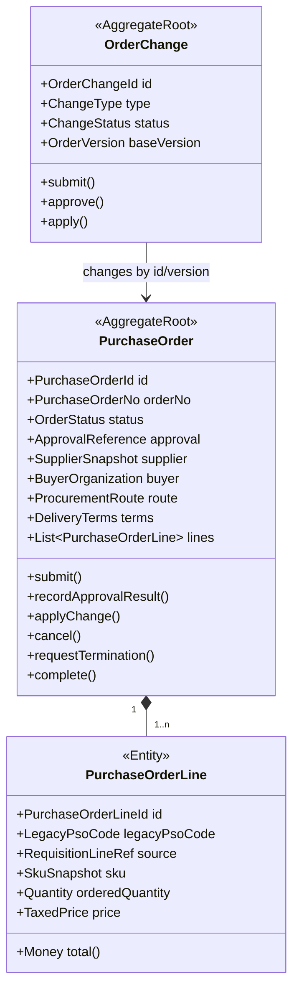
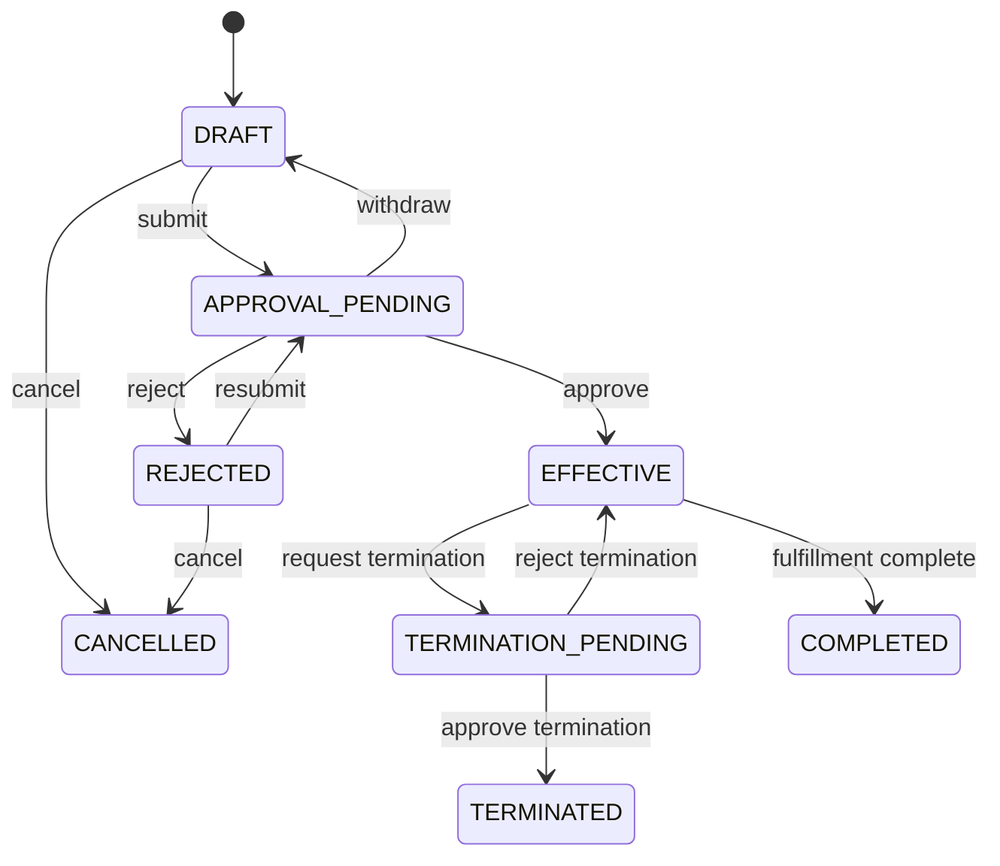

# 采购订单上下文详细设计（第二版）

## 1. 业务目标

采购订单上下文（Purchase Ordering）管理企业对供应商的采购承诺，包括数量、价格、税务、采购主体、交付条款、审批、变更和终止。

核心判断是：

> 这份采购承诺是否有效，以及当前允许怎样修改。

## 2. 边界

拥有：

- PO 头、订单行和来源引用。
- 供应商、采购主体、价格、币种和税率快照。
- 采购路线、目的地、贸易条款和承诺交期。
- 提交、审批、生效、变更、取消和终止。

不拥有：

- 供应商实际发货。
- 仓库收货和入库。
- 质检结果、资质文件和装柜信息。
- AP 支付状态。

## 3. 聚合

交期变更、调价和生效后终止可以使用统一 `OrderChange` 抽象，但建议保留各自明确类型和规则，避免形成万能变更 JSON。

## 4. 核心不变量

1. PO 至少有一条有效订单行。
2. 同一 PO 的供应商、采购主体和结算币种符合组合规则。
3. 订单行数量大于零，价格和税额按统一精度计算。
4. 来源 PR 行和预占令牌必须有效。
5. 只有草稿或驳回状态允许直接编辑。
6. 审批结果必须匹配 `approvalInstanceId + submittedOrderVersion`。
7. 生效后的商业字段只能通过已批准的变更单修改。
8. 订单终止不能抹除已发货、已验收或已结算事实。
9. 所有更新使用聚合版本乐观锁。

## 5. 状态

审批状态单独投影为 `NOT_STARTED/PROCESSING/APPROVED/REJECTED/WITHDRAWN`，不和订单状态混用。

## 6. 命令

- `CreateOrderFromRequisition`
- `CreateOrderDraft`
- `ReviseOrderDraft`
- `SubmitOrderForApproval`
- `WithdrawOrderApproval`
- `RecordOrderApprovalResult`
- `CancelDraftOrder`
- `RequestOrderTermination`
- `ApplyApprovedDeliveryDateChange`
- `ApplyApprovedPriceAdjustment`
- `MarkOrderCompleted`

命令必须携带 `commandId` 和预期 `orderVersion`，处理重复提交与并发修改。

## 7. 事件

- `PurchaseOrderDraftCreated`
- `PurchaseOrderSubmitted`
- `PurchaseOrderApprovalWithdrawn`
- `PurchaseOrderRejected`
- `PurchaseOrderEffective`
- `PurchaseOrderCancelled`
- `PurchaseOrderDeliveryDateChanged`
- `PurchaseOrderPriceAdjusted`
- `PurchaseOrderTerminationRequested`
- `PurchaseOrderTerminated`
- `PurchaseOrderCompleted`

`PurchaseOrderEffective` 是履约协同、供应商履约和结算开始工作的主要触发事件。

## 8. 领域服务与端口

领域服务：

- `ProcurementRoutePolicy`：根据供应商地区、目的地、交付方式和贸易条款计算路线。
- `OrderSubmissionPolicy`：提交前商业规则。
- `OrderTerminationPolicy`：结合外部履约摘要判断可终止范围。
- `OrderAmountCalculator`：金额、税额和舍入规则。

端口：

- `RequisitionReservationPort`
- `GoodsCatalogPort`
- `SupplierProfilePort`
- `OrganizationPort`
- `LocationDirectoryPort`
- `ApprovalWorkflowPort`
- `OrderNumberPort`
- `OrderEventOutboxPort`

## 9. 数据表

- `po_order`
- `po_order_line`
- `po_order_source`
- `po_approval_process`
- `po_order_change`
- `po_order_change_line`
- `domain_event_outbox`

订单表不再保存商检附件、装柜附件、仓库入库时间等外部事实。

## 10. 旧模型迁移

| 旧字段/模型 | 新模型 |
|---|---|
| `rt_purchase_order` | `po_order` |
| `rt_purchase_sub_order` | `po_order_line` |
| `purchase_sub_order_code` | `legacy_pso_code` |
| 旧 1-9 PO 类型 | `ProcurementRoute` + legacy 映射 |
| 综合 `purchase_order_status` | `order_status` + 履约投影 |
| 三种取消状态 | `CANCELLED/TERMINATED` + 终止时履约快照 |
| 商检、装柜、入库字段 | 迁入来源上下文或查询投影 |

详细聚合和状态解释见 [[11-采购订单聚合与状态模型-第二版]]。

