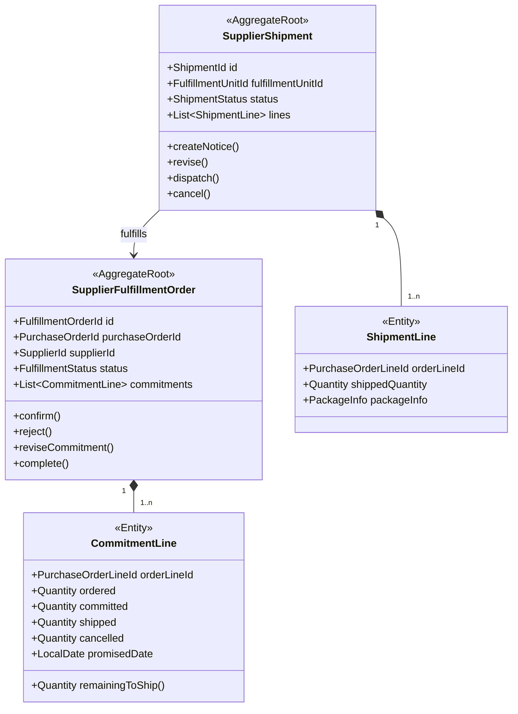

# 供应商履约上下文详细设计（第二版）

## 1. 业务目标

供应商履约上下文（Supplier Fulfillment）负责订单生效后供应商对交付数量和日期的承诺，以及供应商实际发运批次。

它回答：

- 供应商是否接受订单。
- 承诺什么时间交付多少数量。
- 实际分几批发货、每批发了什么。

## 2. 边界

拥有：

- 供应商对 PO 行的确认、拒绝和交期承诺。
- 交付承诺变更。
- 供应商发运通知及发运明细。
- 已承诺、待发、已发和取消数量账。

不拥有：

- PO 商业价格和审批。
- 仓库是否实际收货或入库。
- 装柜、运输轨迹和客户签收。
- 样图、资质和质检报告。

供应商可以通过同一门户操作这些任务，但请求应路由到对应上下文。

## 3. 聚合



`SupplierFulfillmentOrder` 与 `SupplierShipment` 分开，因为一张 PO 可以多批发货，每个发运批次具有独立生命周期。

## 4. 核心不变量

1. 履约单只能由 `PurchaseOrderEffective` 创建一次。
2. 发运供应商必须与 PO 供应商一致。
3. 发运行只能引用该履约单中的订单行。
4. `shipped + cancelled <= committed + allowedOverDelivery`。
5. 发运数量必须大于零。
6. 未通过发货阻塞检查的批次不能 `dispatch`。
7. 已发运批次不能直接删除，只能更正或撤销并留痕。
8. 仓储收货不能反向修改供应商原始发运数量。

## 5. 状态

供应商履约单：

```text
WAITING_CONFIRMATION
→ CONFIRMED
→ IN_EXECUTION
→ COMPLETED

WAITING_CONFIRMATION → REJECTED
CONFIRMED / IN_EXECUTION → TERMINATED
```

发运批次：

```text
DRAFT → READY_TO_DISPATCH → DISPATCHED → ACKNOWLEDGED
 DRAFT / READY_TO_DISPATCH → CANCELLED
```

`ACKNOWLEDGED` 表示下游已接受发运信息，不等于仓库已经收货。

## 6. 命令

- `CreateSupplierFulfillmentOrder`
- `ConfirmDeliveryCommitment`
- `RejectDeliveryCommitment`
- `ReviseDeliveryCommitment`
- `CreateShipmentNotice`
- `ReviseShipmentNotice`
- `DispatchSupplierShipment`
- `CancelShipmentNotice`
- `RecordWarehouseReceiptReference`
- `CompleteSupplierFulfillment`

## 7. 事件

- `SupplierFulfillmentOrderCreated`
- `SupplierCommitmentConfirmed`
- `SupplierCommitmentRejected`
- `SupplierCommitmentChanged`
- `SupplierShipmentNoticeCreated`
- `SupplierShipmentReady`
- `SupplierShipmentDispatched`
- `SupplierShipmentCancelled`
- `SupplierFulfillmentCompleted`

`SupplierShipmentDispatched` 必须携带 `fulfillmentUnitId`、订单行 ID、数量和来源发运单号。

## 8. 端口

- `PurchaseOrderSnapshotPort`
- `DispatchGatePort`：查询协同上下文是否允许发货。
- `LogisticsHandoverPort`：向物流或跨境上下文交接。
- `WarehouseInboundNoticePort`：向仓储发布预到货信息。
- `SupplierDirectoryPort`
- `SupplierFulfillmentEventOutboxPort`

发运完成通过事件通知下游，不在履约事务中同步调用所有系统。

## 9. 数据表

- `supplier_fulfillment_order`
- `supplier_fulfillment_commitment_line`
- `supplier_shipment`
- `supplier_shipment_line`
- `supplier_fulfillment_quantity_ledger`

数量账记录每次承诺、发运、取消和更正，便于审计与重算。

## 10. 旧模型迁移

| 旧模型 | 新模型 |
|---|---|
| PO/PSO 的供应商待发货状态 | `SupplierFulfillmentOrder.CONFIRMED` |
| PO/PSO 的供应商已发货状态 | 由 `SupplierShipment.DISPATCHED` 投影 |
| `supplier_shipping_time` | 发运批次发生时间 |
| `confirmDelivery` 相关 Service | `DispatchSupplierShipment` 用例 |
| PO 类型策略中的发货分支 | 路线交接策略 |

不能只用旧“已发货”状态迁移发运批次，还需结合装柜、发货消息和仓储预到货数据补齐数量。

